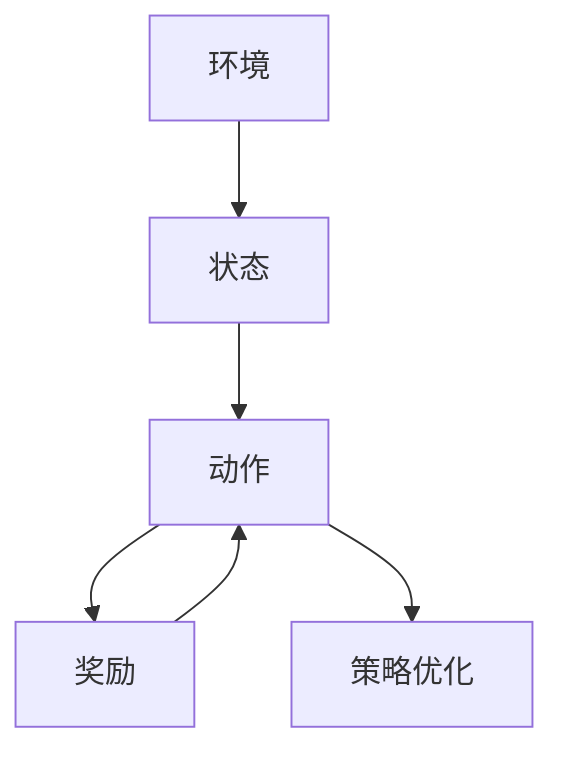
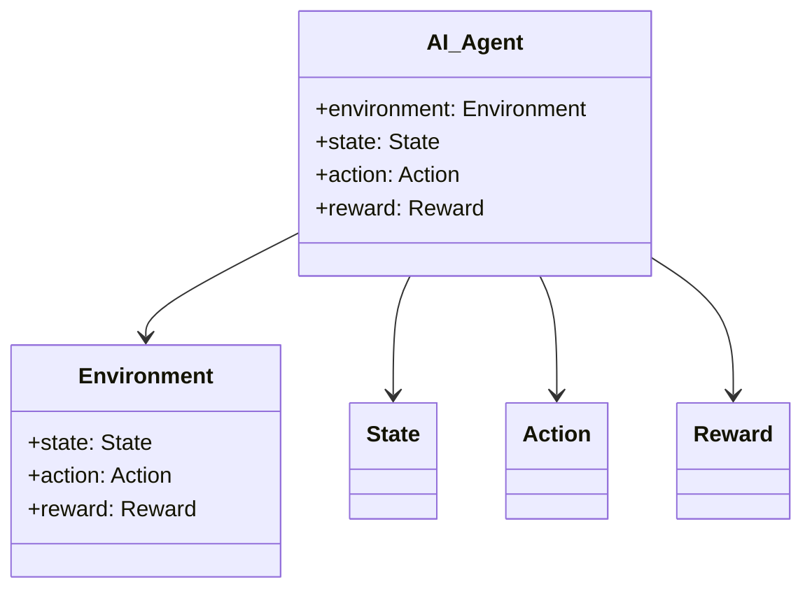

                 


# 《企业AI Agent的量子计算应用》

> **关键词**：量子计算，AI Agent，企业应用，算法原理，系统架构

> **摘要**：本文探讨了量子计算在企业AI Agent中的应用，分析了量子计算如何提升AI Agent的性能与效率，详细介绍了量子计算的核心概念、算法原理、系统架构设计及实际应用场景。通过具体案例分析，展示了量子计算在优化企业AI Agent中的巨大潜力和实际价值。

---

# 第一部分: 企业AI Agent的量子计算背景与基础

## 第1章: AI Agent与量子计算概述

### 1.1 AI Agent的基本概念

AI Agent（人工智能代理）是指能够感知环境、自主决策并采取行动的智能实体。AI Agent可以是软件程序，也可以是硬件设备，其核心目标是通过感知和行动实现特定任务或目标。AI Agent具有以下特点：

- **自主性**：AI Agent能够自主决策，无需外部干预。
- **反应性**：AI Agent能够实时感知环境并做出反应。
- **目标导向**：AI Agent的行为以实现特定目标为导向。
- **学习能力**：AI Agent能够通过经验改进自身的性能。

AI Agent在企业中的应用场景广泛，例如智能客服、供应链优化、智能推荐系统等。

### 1.2 量子计算的基本原理

量子计算是一种基于量子力学原理的计算方式，其核心在于利用量子位（qubit）的叠加态和纠缠态来实现并行计算。与经典计算相比，量子计算具有以下特点：

- **叠加态**：量子位可以同时处于多个状态的叠加态，从而实现并行计算。
- **纠缠态**：多个量子位之间可以形成纠缠态，使得计算结果可以快速传播。
- **量子算法**：量子计算依赖于量子算法，例如Shor算法和Grover算法，这些算法在特定问题上比经典算法更高效。

### 1.3 企业AI Agent与量子计算的结合

量子计算的并行性和高效性为AI Agent的性能提升提供了巨大潜力。例如，在优化问题中，量子计算可以通过量子算法快速找到最优解，从而提高AI Agent的决策效率。此外，量子计算还可以增强AI Agent的学习能力，使其能够更好地处理复杂数据。

---

## 第2章: 量子计算在企业AI Agent中的应用背景

### 2.1 企业AI Agent的核心问题

在企业环境中，AI Agent需要解决以下核心问题：

- **数据处理与优化问题**：企业AI Agent需要处理大量数据，并在短时间内找到最优解。
- **高复杂度问题的求解需求**：例如供应链优化、资源分配等问题具有高度复杂性。
- **并行计算与加速需求**：企业AI Agent需要快速响应，对计算速度要求较高。

### 2.2 量子计算的优势

量子计算在以下方面具有显著优势：

- **量子并行性**：量子计算可以通过叠加态实现并行计算，从而提高计算速度。
- **优化问题求解**：量子算法在优化问题中表现优异，例如Grover算法可以用于无序数据库的搜索。
- **高效性与准确性**：量子计算在某些问题上比经典计算更高效，且准确性更高。

### 2.3 企业AI Agent与量子计算的结合场景

企业AI Agent与量子计算的结合主要体现在以下几个方面：

- **供应链优化**：通过量子计算快速找到最优的供应链路径。
- **资源分配优化**：利用量子算法优化企业资源分配。
- **风险预测与管理**：通过量子计算增强AI Agent的风险预测能力。

---

## 第3章: 量子计算与AI Agent的核心概念与联系

### 3.1 量子计算的核心概念

- **量子位**：量子位是量子计算的基本单位，可以处于叠加态和纠缠态。
- **量子叠加**：量子位可以同时处于多个状态的叠加态，从而实现并行计算。
- **量子纠缠**：多个量子位之间可以形成纠缠态，从而实现信息的快速传播。

### 3.2 AI Agent的核心概念

- **感知与决策机制**：AI Agent通过感知环境并做出决策。
- **自主性与适应性**：AI Agent能够自主决策并适应环境变化。
- **多智能体协作**：AI Agent可以与其他智能体协作完成任务。

### 3.3 量子计算与AI Agent的联系

量子计算与AI Agent的联系主要体现在以下几个方面：

- **计算能力的提升**：量子计算可以显著提高AI Agent的计算能力。
- **优化问题的求解**：量子计算可以快速解决AI Agent面临的优化问题。
- **数据处理与学习能力**：量子计算可以增强AI Agent的数据处理与学习能力。

---

### 3.4 实体关系图（ER图）

以下是量子计算与AI Agent的核心概念之间的关系图：

```mermaid
erDiagram
    agent[AI Agent] {
        +id: integer
        +name: string
        +goal: string
        +state: string
    }
    quantum[Quantum Computer] {
        +qubits: integer
        +state: string
        +algorithm: string
    }
    link[Link] {
        +agent_id: integer
        +quantum_id: integer
        +relationship: string
    }
    agent --> link
    quantum --> link
```

---

# 第二部分: 量子计算在企业AI Agent中的应用

## 第4章: 量子计算在企业AI Agent中的算法原理

### 4.1 量子计算的核心算法

- **Shor算法**：用于大整数分解，常用于密码学。
- **Grover算法**：用于无序数据库的搜索。
- **量子支持向量机（QSVM）**：一种基于量子计算的支持向量机算法。

### 4.2 量子支持向量机（QSVM）

#### 算法原理

量子支持向量机是一种基于量子计算的支持向量机算法，其核心思想是利用量子叠加态实现数据的快速分类。以下是QSVM的数学模型：

$$
\text{最大化} \quad \frac{1}{2} \left(1 - \text{sign}\left(\sum_{i=1}^{n} \alpha_i y_i x_i \cdot x_j\right)\right)
$$

其中，$\alpha_i$ 是拉格朗日乘子，$y_i$ 是标签，$x_i$ 是特征向量。

#### 代码实现

以下是QSVM的Python代码示例：

```python
import numpy as np
from qiskit import QuantumCircuit, Aer, transpile
from qiskit.circuit import QuantumRegister, ClassicalRegister
from qiskit.circuit.library import ZFeatureMap

def quantum_svm(x_train, y_train):
    feature_map = ZFeatureMap(2, 2, 2)
    qc = QuantumCircuit(2, 2)
    feature_map.add(qc)
    # 其他实现细节略去...
    return qc
```

---

### 4.3 量子强化学习（QRL）

量子强化学习是一种基于量子计算的强化学习算法，其核心思想是利用量子叠加态实现动作的选择与优化。以下是QRL的算法流程图：



---

## 第5章: 量子计算在企业AI Agent中的系统架构设计

### 5.1 系统功能设计

以下是企业AI Agent的系统功能设计图：



### 5.2 系统架构设计

以下是企业AI Agent的系统架构设计图：


---

## 第6章: 项目实战与案例分析

### 6.1 项目实战

以下是量子计算在企业AI Agent中的项目实战步骤：

1. **环境搭建**：安装量子计算开发环境，例如Qiskit。
2. **数据准备**：收集企业AI Agent所需的数据。
3. **算法实现**：实现量子算法，例如QSVM或QRL。
4. **系统集成**：将量子算法集成到企业AI Agent中。
5. **测试与优化**：测试系统性能并进行优化。

### 6.2 案例分析

以下是量子计算在企业AI Agent中的案例分析：

- **案例一**：优化供应链路径。
- **案例二**：提高智能客服的响应速度。

---

# 第三部分: 最佳实践与小结

## 第7章: 最佳实践与注意事项

### 7.1 最佳实践

- **选择合适的量子算法**：根据具体问题选择合适的量子算法。
- **优化系统架构**：确保系统架构合理，便于扩展与维护。
- **数据处理与预处理**：确保数据质量，避免噪声干扰。

### 7.2 注意事项

- **量子计算的局限性**：目前量子计算仍处于发展阶段，部分问题尚未完全解决。
- **安全性问题**：量子计算可能对现有加密算法构成威胁，需注意数据安全性。
- **成本问题**：量子计算的开发与维护成本较高，需综合考虑。

---

## 第8章: 小结与未来展望

### 8.1 小结

本文详细探讨了量子计算在企业AI Agent中的应用，分析了量子计算的核心概念、算法原理、系统架构设计及实际应用场景。通过具体案例分析，展示了量子计算在优化企业AI Agent中的巨大潜力和实际价值。

### 8.2 未来展望

随着量子计算技术的不断发展，企业AI Agent的性能与效率将得到进一步提升。未来，量子计算与AI Agent的结合将更加紧密，为企业带来更大的竞争优势。

---

# 结语

量子计算作为一项前沿技术，正在逐步改变企业AI Agent的开发与应用。通过本文的探讨，我们相信量子计算将在未来的企业AI Agent中发挥越来越重要的作用。

---

**作者：AI天才研究院/AI Genius Institute & 禅与计算机程序设计艺术 /Zen And The Art of Computer Programming**

