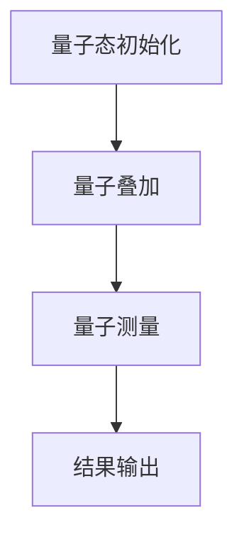
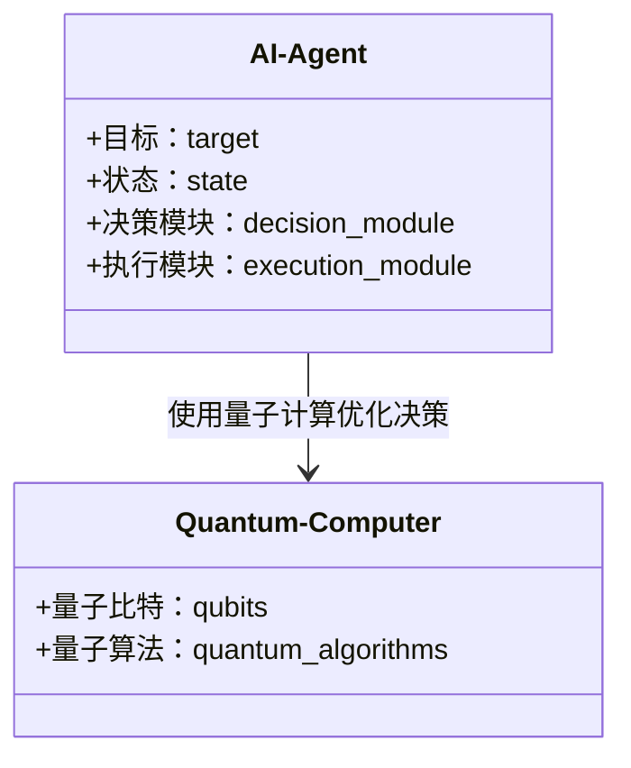

                 


# 企业AI Agent的量子计算潜在应用探索

> 关键词：企业AI Agent，量子计算，潜在应用，量子叠加，量子纠缠，AI算法优化

> 摘要：随着人工智能和量子计算技术的快速发展，企业AI Agent的智能化需求日益增长。本文深入探讨了量子计算在企业AI Agent中的潜在应用，分析了其核心概念、算法原理、系统架构以及实际案例，揭示了量子计算如何助力企业AI Agent实现更高效的决策和优化能力。

---

# 第一部分: 企业AI Agent与量子计算的背景与基础

## 第1章: 企业AI Agent的概述

### 1.1 AI Agent的基本概念

#### 1.1.1 AI Agent的定义与特点
AI Agent（人工智能代理）是一种能够感知环境、自主决策并执行任务的智能实体。它具有以下特点：
- **自主性**：能够在没有外部干预的情况下运行。
- **反应性**：能够实时感知环境并做出反应。
- **目标导向性**：基于目标进行决策和行动。
- **学习能力**：通过数据和经验不断优化自身行为。

#### 1.1.2 AI Agent的核心功能与分类
AI Agent的核心功能包括感知、推理、规划、学习和执行。根据应用场景，AI Agent可以分为：
- **简单反射型代理**：基于规则执行任务。
- **基于模型的反射型代理**：利用内部模型进行推理。
- **目标驱动型代理**：根据目标优化行为。
- **效用驱动型代理**：通过效用函数实现最优决策。

#### 1.1.3 企业级AI Agent的应用场景
企业级AI Agent广泛应用于以下领域：
- **智能客服**：提供个性化服务和问题解决。
- **供应链优化**：优化物流和库存管理。
- **智能决策支持**：辅助企业高管做出决策。
- **风险管理**：实时监控和预测风险。

---

## 第2章: 量子计算的基本原理

### 2.1 量子计算的核心概念

#### 2.1.1 量子叠加与量子纠缠
- **量子叠加**：量子系统可以同时处于多个状态的叠加态。例如，量子比特（qubit）可以同时表示0和1。
- **量子纠缠**：两个或多个量子系统之间形成强关联，一个系统的状态会直接影响另一个系统。

#### 2.1.2 量子计算的优越性与局限性
- **优越性**：量子计算在处理复杂问题（如大数分解、组合优化）时，速度远超经典计算。
- **局限性**：量子计算对环境干扰非常敏感，实现和维护成本较高。

#### 2.1.3 量子计算与经典计算的对比
| 特性             | 经典计算      | 量子计算      |
|------------------|---------------|---------------|
| 基础单位         | 二进制位（bit）| 量子比特（qubit）|
| 并行计算能力     | 串行处理      | 并行处理       |
| 处理复杂度       | 高            | 低             |

---

## 第3章: 企业AI Agent与量子计算的结合

### 3.1 AI Agent的量子化潜力

#### 3.1.1 量子计算在AI Agent中的应用领域
- **优化问题**：如供应链优化、资源分配。
- **复杂决策支持**：如金融投资组合优化。
- **数据处理与分析**：如实时数据分析。

#### 3.1.2 量子计算如何提升AI Agent的性能
- **加速计算**：量子计算可以显著减少优化问题的计算时间。
- **提高精度**：量子算法能够处理更大规模的数据，提升决策的准确性。

#### 3.1.3 量子计算与AI Agent的协同效应
通过结合量子计算的并行处理能力和AI Agent的目标导向性，可以实现更高效的决策和优化。

---

## 第4章: 企业AI Agent的量子计算应用背景

### 4.1 当前企业AI Agent的发展现状

#### 4.1.1 传统AI Agent的技术瓶颈
- **计算效率**：在处理大规模数据时，传统AI Agent效率较低。
- **决策复杂性**：面对复杂决策问题时，传统方法难以找到最优解。

#### 4.1.2 量子计算技术的最新进展
- **量子比特的稳定性**：通过改进量子比特的控制技术，提高量子计算的稳定性。
- **量子算法的开发**：如Shor算法、Grover算法等。

#### 4.1.3 量子计算在企业AI Agent中的潜在价值
- **提升效率**：通过量子计算加速AI Agent的优化过程。
- **降低成本**：减少计算资源的消耗，降低企业的运营成本。

---

# 第二部分: 企业AI Agent的量子计算核心概念与联系

## 第5章: 核心概念与原理分析

### 5.1 AI Agent与量子计算的核心原理

#### 5.1.1 AI Agent的决策机制
AI Agent通过感知环境、分析数据、制定策略并执行行动来实现目标。

#### 5.1.2 量子计算的算法特点
量子算法利用量子叠加和量子纠缠的特性，能够在某些问题上实现指数级加速。

#### 5.1.3 两者的结合方式与实现路径
通过将量子计算的优化能力集成到AI Agent的决策模型中，实现更高效的决策和优化。

---

## 第6章: 核心概念对比与实体关系图

### 6.1 AI Agent与量子计算的核心属性对比

| 特性             | AI Agent                  | 量子计算                  |
|------------------|---------------------------|---------------------------|
| 核心目标         | 实现目标导向的决策        | 解决复杂数学问题          |
| 处理方式         | 基于规则和学习的推理      | 基于量子叠加和纠缠的并行计算 |
| 应用场景         | 智能决策、优化、数据分析  | 优化、密码学、组合数学    |

---

# 第三部分: 量子计算算法与AI Agent的结合原理

## 第7章: 量子计算算法的数学模型与实现

### 7.1 量子叠加算法的数学模型

#### 7.1.1 量子叠加的数学表达式
量子叠加可以用以下公式表示：
$$ |\psi\rangle = \alpha|0\rangle + \beta|1\rangle $$
其中，$\alpha$ 和 $\beta$ 是复数，且满足 $|\alpha|^2 + |\beta|^2 = 1$。

#### 7.1.2 量子纠缠的数学描述
量子纠缠可以用Bell态表示：
$$ |\psi\rangle = \frac{1}{\sqrt{2}}(|00\rangle + |11\rangle) $$

#### 7.1.3 量子计算的算法流程图（Mermaid）



---

## 第8章: 企业AI Agent的量子计算系统架构设计

### 8.1 系统功能设计

#### 8.1.1 领域模型（Mermaid类图）



### 8.2 系统架构设计（Mermaid架构图）


### 8.3 系统接口设计

- **输入接口**：接收用户请求和环境数据。
- **输出接口**：返回优化后的决策结果。
- **量子计算接口**：与量子计算机通信，获取优化结果。

---

## 第9章: 项目实战与案例分析

### 9.1 环境安装

```bash
# 安装量子计算库
pip install qiskit
```

### 9.2 核心代码实现（量子计算优化AI Agent）

```python
from qiskit import QuantumCircuit, execute, Aer
from qiskit.circuit import gates

# 初始化量子电路
qc = QuantumCircuit(2, 2)

# 应用哈达玛门
gates.H(qc, 0)
gates.CNOT(qc, 0, 1)

# 测量
qc.measure(0, 0)
qc.measure(1, 1)

# 执行电路
simulator = Aer.get_backend('qasm_simulator')
result = execute(qc, simulator).result()

# 获取结果
print(result.get_counts())
```

### 9.3 实际案例分析

假设一家企业需要优化其供应链，通过量子计算优化的AI Agent可以在更短时间内找到最优的物流路径，降低运输成本。

---

## 第10章: 未来趋势与挑战

### 10.1 量子计算与AI Agent的未来发展

- **技术融合**：量子计算与AI Agent的深度融合将推动企业智能化升级。
- **行业应用**：在金融、物流、制造等领域实现更广泛的应用。

### 10.2 挑战与解决方案

- **技术挑战**：量子计算的不稳定性需要进一步优化。
- **成本问题**：降低量子计算的成本是大规模应用的关键。

---

# 结语

企业AI Agent的量子计算应用是一个充满潜力的领域，通过量子计算的加速能力，AI Agent可以在更多复杂场景中实现高效的决策和优化。然而，这一领域的研究和应用仍需克服诸多挑战，未来的发展需要技术、产业和政策的多方协同。

---

**作者：AI天才研究院/AI Genius Institute & 禅与计算机程序设计艺术 /Zen And The Art of Computer Programming**

