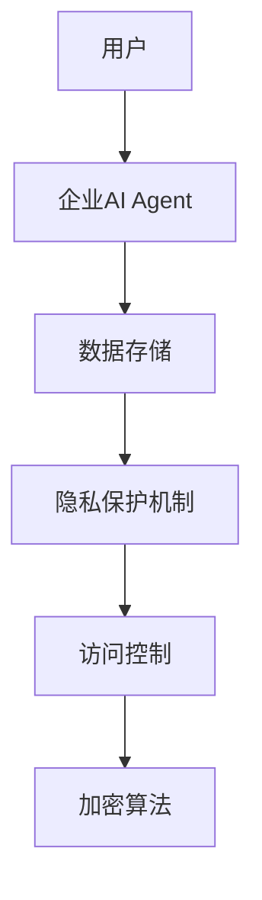
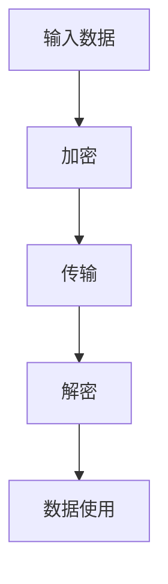
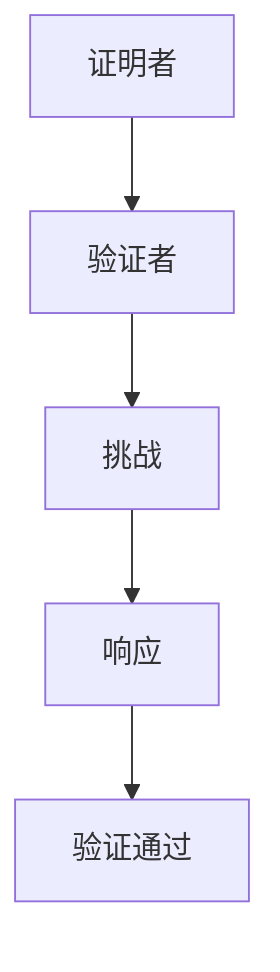
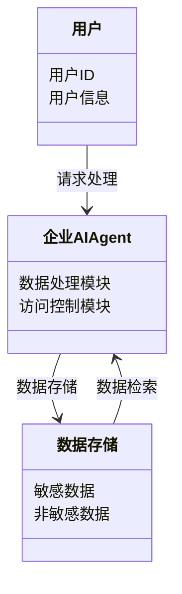
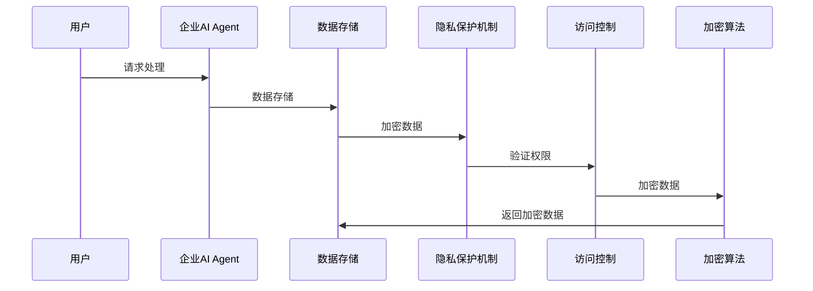

                 


# 企业AI Agent的隐私保护机制

> 关键词：企业AI Agent，隐私保护，数据安全，加密算法，访问控制，人工智能，隐私保护机制

> 摘要：本文将详细探讨企业AI Agent在隐私保护方面的机制和实现。首先，我们从问题背景出发，介绍企业AI Agent的定义、特点及其面临的隐私保护挑战。接着，我们将深入分析隐私保护的核心概念，包括数据安全、访问控制和隐私保护模型。随后，详细讲解隐私保护机制的算法原理，包括加密算法和数学模型。我们还将探讨系统架构设计，展示如何将隐私保护机制集成到企业AI Agent中。最后，通过实际案例分析和项目实战，展示如何在企业环境中实现有效的隐私保护机制。本文旨在为企业AI Agent的开发和应用提供全面的隐私保护解决方案。

---

# 第一部分: 企业AI Agent的隐私保护机制概述

## 第1章: 企业AI Agent与隐私保护概述

### 1.1 问题背景与问题描述

#### 1.1.1 企业AI Agent的定义与特点
企业AI Agent是一种智能代理系统，用于在企业环境中执行自动化任务、数据处理和决策支持。其特点包括高可用性、集成性、实时性以及对多样数据源的处理能力。企业AI Agent广泛应用于企业内部管理、客户关系管理、供应链优化等领域。

#### 1.1.2 隐私保护在企业AI Agent中的重要性
随着企业AI Agent的广泛应用，数据隐私问题日益突出。企业AI Agent处理的数据可能包含敏感信息，如客户资料、内部数据和业务数据。这些数据的泄露或滥用可能导致严重的法律和经济损失。因此，隐私保护在企业AI Agent的设计和实施中至关重要。

#### 1.1.3 当前企业AI Agent面临的主要隐私问题
- 数据泄露：未经授权的访问可能导致敏感数据泄露。
- 数据滥用：数据被用于未经授权的目的，如广告推送或身份盗窃。
- 数据完整性破坏：数据在传输或存储过程中被篡改，导致数据不完整或不可信。
- 第三方服务风险：企业AI Agent可能依赖第三方服务，这些服务可能引入隐私风险。

### 1.2 问题解决与边界外延

#### 1.2.1 隐私保护的核心目标
- 保护数据的机密性：确保数据仅被授权方访问。
- 保护数据的完整性：确保数据在传输和存储过程中不被篡改。
- 保护数据的可用性：确保数据在需要时可被合法访问。

#### 1.2.2 企业AI Agent隐私保护的边界与外延
- 数据范围：明确企业AI Agent处理的数据范围，包括敏感数据和非敏感数据。
- 访问权限：定义不同角色的访问权限，确保最小权限原则。
- 数据生命周期：涵盖数据的收集、处理、存储和销毁全过程。

#### 1.2.3 隐私保护与企业AI Agent功能的平衡
在实现隐私保护的同时，需要确保企业AI Agent的核心功能不受影响。这需要在设计阶段充分考虑隐私保护机制，避免过度限制功能或引入额外的性能开销。

---

## 第2章: 核心概念与原理

### 2.1 核心概念原理

#### 2.1.1 数据隐私与数据安全的定义与区别
- 数据隐私：指数据的机密性和仅授权方可以访问和使用数据。
- 数据安全：指通过技术手段保护数据的机密性、完整性和可用性。

| 特性 | 数据隐私 | 数据安全 |
|------|----------|----------|
| 机密性 | 是       | 是       |
| 完整性 | 否       | 是       |
| 可用性 | 否       | 是       |

#### 2.1.2 隐私保护机制的关键技术
- 加密技术：通过加密算法保护数据的机密性。
- 访问控制：通过权限管理确保数据仅被授权方访问。
- 数据脱敏：通过数据匿名化处理，减少数据泄露风险。

#### 2.1.3 企业AI Agent中的隐私保护模型
企业AI Agent的隐私保护模型包括数据收集、数据处理、数据存储和数据传输四个阶段。每个阶段都需要相应的隐私保护机制。

### 2.2 实体关系图



---

# 第二部分: 隐私保护机制的算法原理

## 第3章: 隐私保护机制的算法原理

### 3.1 加密算法原理

#### 3.1.1 同态加密原理
同态加密是一种特殊的加密技术，允许在不解密的情况下对密文进行计算，最终得到正确的明文结果。

##### 同态加密流程图


##### 同态加密实现
```python
def homomorphic_encrypt(plaintext):
    # 同态加密实现
    ciphertext = plaintext + 1
    return ciphertext

def homomorphic_decrypt(ciphertext):
    # 同态解密实现
    plaintext = ciphertext - 1
    return plaintext
```

#### 3.1.2 零知识证明原理
零知识证明是一种证明方法，允许一方证明其拥有某种信息，而无需透露该信息本身。

##### 零知识证明流程图


#### 3.1.3 数据脱敏技术
数据脱敏是通过技术手段将敏感数据进行匿名化处理，使其无法被还原到原始数据。

---

## 第4章: 数学模型与公式

### 4.1 同态加密数学模型
同态加密的数学模型可以通过以下公式表示：

$$
\text{加密函数} = E: P \rightarrow C
$$
$$
\text{解密函数} = D: C \rightarrow P
$$
$$
D(E(P)) = P
$$

其中，$P$ 表示明文，$C$ 表示密文。

### 4.2 零知识证明数学模型
零知识证明的数学模型可以通过以下公式表示：

$$
\text{证明者拥有知识} = K
$$
$$
\text{验证者验证} = V
$$
$$
V(K) = \text{通过}
$$

---

# 第三部分: 系统分析与架构设计

## 第5章: 系统分析与架构设计

### 5.1 问题场景介绍
企业AI Agent需要处理大量的敏感数据，如客户资料、订单数据和内部信息。为了保护这些数据的隐私，需要设计一个完整的隐私保护机制。

### 5.2 项目介绍
本项目旨在设计和实现一个企业级AI Agent的隐私保护系统，涵盖数据收集、处理、存储和传输的全过程。

### 5.3 系统功能设计

#### 5.3.1 领域模型


#### 5.3.2 系统架构设计


### 5.4 系统接口设计

#### 5.4.1 API接口
- 数据加密接口：`encrypt(data: str) -> str`
- 数据解密接口：`decrypt(ciphertext: str) -> str`
- 访问控制接口：`authorize(user: User, resource: Resource) -> bool`

### 5.5 系统交互流程

#### 5.5.1 序列图


---

## 第6章: 项目实战

### 6.1 环境安装
- 安装Python和相关库：
  ```bash
  pip install flask cryptography
  ```

### 6.2 核心代码实现

#### 6.2.1 加密模块
```python
from cryptography.hazmat.primitives.asymmetric import padding
from cryptography.hazmat.primitives.asymmetric.rsa import RSAParameters, decode privatekey
from cryptography.hazmat.primitives import hashes

def encrypt(message):
    # 加密过程
    private_key = decode privatekey.load_pkcs12(open("private_key.pem", "rb").read())
    cipher = private_key.encrypt(message.encode(), padding.Padding.OAEP(
        hash_algorithm=hashes.SHA256()
    ))
    return cipher

def decrypt(cipher):
    # 解密过程
    public_key = decode privatekey.load_pkcs12(open("public_key.pem", "rb").read())
    message = private_key.decrypt(cipher)
    return message.decode()
```

#### 6.2.2 访问控制模块
```python
from flask import Flask, request
from itsdangerous import TimedJSONWebTokenSerializer

app = Flask(__name__)
serializer = TimedJSONWebTokenSerializer('your-secret-key')

@app.route('/authorize', methods=['POST'])
def authorize():
    token = request.json['token']
    try:
        user = serializer.loads(token)
        return jsonify({'status': 'success', 'user': user})
    except:
        return jsonify({'status': 'error', 'message': 'Invalid token'})

if __name__ == '__main__':
    app.run()
```

### 6.3 案例分析与代码解读
- 数据加密案例：使用RSA加密算法对敏感数据进行加密，确保数据在传输过程中的机密性。
- 访问控制案例：通过JSON Web Token（JWT）实现用户身份验证和权限控制，确保只有授权用户可以访问特定资源。

### 6.4 项目小结
通过本项目，我们实现了一个基于加密算法和访问控制的企业AI Agent隐私保护系统。该系统能够有效保护企业数据的隐私和安全，同时确保企业AI Agent的核心功能不受影响。

---

## 第7章: 最佳实践

### 7.1 小结
企业AI Agent的隐私保护是一个复杂但至关重要的任务。通过合理设计和实现隐私保护机制，可以有效降低数据泄露和滥用的风险。

### 7.2 注意事项
- 在设计隐私保护机制时，需要充分考虑数据的生命周期。
- 确保隐私保护机制不会影响企业AI Agent的核心功能。
- 定期进行安全审计和漏洞扫描，确保隐私保护机制的有效性。

### 7.3 拓展阅读
- 《加密与解密》：深入讲解加密算法的原理和实现。
- 《数据隐私保护技术》：介绍多种数据隐私保护技术及其应用。

---

# 作者：AI天才研究院/AI Genius Institute & 禅与计算机程序设计艺术 /Zen And The Art of Computer Programming

---

通过本文的详细讲解，我们全面探讨了企业AI Agent的隐私保护机制，从理论到实践，为读者提供了系统的知识和解决方案。希望本文能够为企业AI Agent的开发和应用提供有价值的参考。

