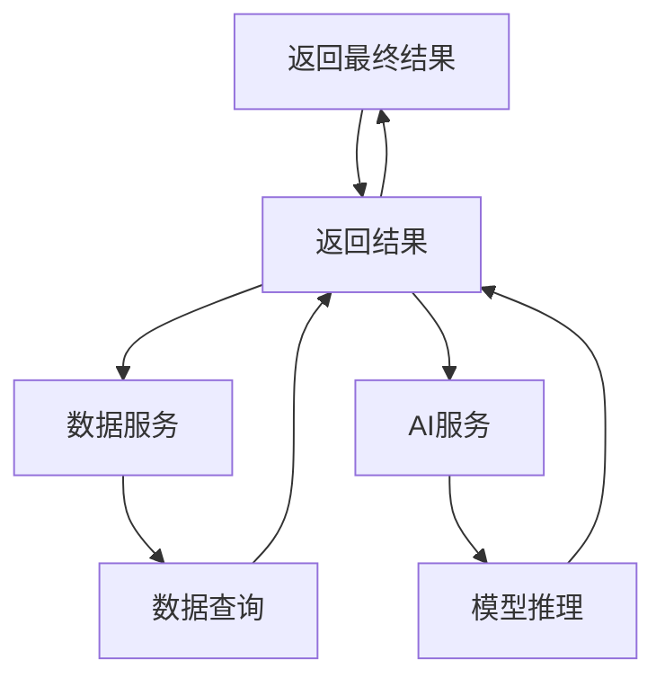

                 


# 企业AI Agent的领域自适应技术在跨部门应用中的实践

## 关键词：
企业AI Agent，领域自适应技术，跨部门应用，系统架构设计，算法实现，项目实战

## 摘要：
随着人工智能技术的快速发展，企业AI Agent在各个领域的应用越来越广泛。然而，不同部门之间的业务流程和数据特征存在显著差异，传统的AI Agent往往难以适应跨部门的应用需求。为了提高AI Agent的通用性和适应性，领域自适应技术应运而生。本文详细探讨了领域自适应技术的核心原理、算法实现、系统架构设计以及在跨部门应用中的实践案例。通过理论分析和实际案例相结合，展示了如何利用领域自适应技术提升企业AI Agent的性能和跨部门协作能力。

---

# 第1章: 企业AI Agent与领域自适应技术概述

## 1.1 AI Agent的基本概念

### 1.1.1 AI Agent的定义与特点

AI Agent（人工智能代理）是指能够感知环境、自主决策并执行任务的智能实体。它具备以下特点：
- **自主性**：能够在没有外部干预的情况下独立运行。
- **反应性**：能够根据环境变化实时调整行为。
- **目标导向**：具有明确的目标，并通过行动实现目标。
- **学习能力**：能够通过数据和经验不断优化自身性能。

### 1.1.2 领域自适应技术的定义

领域自适应技术是指通过调整模型参数或结构，使AI Agent能够适应不同领域或场景的能力。它能够解决跨部门应用中数据分布差异带来的性能下降问题。

### 1.1.3 企业AI Agent的应用背景

在企业中，不同部门（如销售、财务、人力资源等）的业务流程和数据特征存在显著差异。传统的AI Agent通常针对特定领域设计，难以适应跨部门的应用需求。因此，企业需要一种能够快速适应不同领域需求的技术，即领域自适应技术。

---

## 1.2 领域自适应技术的核心概念

### 1.2.1 领域自适应技术的原理

领域自适应技术通过以下步骤实现：
1. **数据预处理**：对源领域和目标领域的数据进行预处理，提取特征。
2. **模型训练**：利用源领域的数据训练基础模型，并通过领域适配器调整模型参数。
3. **模型评估与优化**：在目标领域上评估模型性能，并进行优化。

### 1.2.2 领域自适应与传统AI的区别

| 特性            | 领域自适应技术               | 传统AI技术                 |
|-----------------|----------------------------|---------------------------|
| 适应性          | 能够适应不同领域             | 仅适用于特定领域           |
| 模型调整方式     | 通过领域适配器调整模型参数    | 需要重新训练整个模型       |
| 适用场景         | 跨部门应用                   | 单一领域应用               |

### 1.2.3 领域自适应技术的实现方法

领域自适应技术的实现方法包括：
1. **基于特征的方法**：通过提取特征并调整特征权重，使模型适应目标领域。
2. **基于模型的方法**：通过调整模型参数或架构，使模型适应目标领域。
3. **基于分布匹配的方法**：通过匹配源领域和目标领域的数据分布，使模型适应目标领域。

---

## 1.3 本章小结

本章介绍了AI Agent的基本概念和领域自适应技术的核心概念。通过对比分析，明确了领域自适应技术在企业跨部门应用中的重要性。下一章将详细探讨领域自适应技术的原理与实现方法。

---

# 第2章: 领域自适应技术的原理与实现

## 2.1 领域自适应技术的原理

### 2.1.1 领域知识表示方法

领域知识表示方法包括：
1. **符号表示法**：通过符号逻辑表示知识。
2. **向量表示法**：通过向量空间模型表示知识。
3. **图表示法**：通过图结构表示知识。

### 2.1.2 领域特征提取方法

领域特征提取方法包括：
1. **基于统计的方法**：通过统计特征提取方法提取特征。
2. **基于深度学习的方法**：通过神经网络提取特征。

### 2.1.3 领域适应算法

领域适应算法包括：
1. **领域适配器网络（Adapter Networks）**：通过适配器层调整模型参数。
2. **领域对抗网络（Adversarial Networks）**：通过对抗训练匹配数据分布。
3. **领域蒸馏（Domain Distillation）**：通过蒸馏技术传递知识。

---

## 2.2 领域自适应技术的实现步骤

### 2.2.1 数据预处理

数据预处理步骤包括：
1. **数据清洗**：去除噪声数据。
2. **数据标注**：对数据进行标注。
3. **数据增强**：对数据进行增强处理。

### 2.2.2 模型训练

模型训练步骤包括：
1. **选择基础模型**：选择适合的深度学习模型。
2. **训练模型**：在源领域数据上训练模型。
3. **领域适配**：通过领域适配器调整模型参数。

### 2.2.3 模型评估与优化

模型评估与优化步骤包括：
1. **评估性能**：在目标领域数据上评估模型性能。
2. **优化参数**：通过调整参数优化模型性能。

---

## 2.3 本章小结

本章详细探讨了领域自适应技术的原理与实现方法，包括领域知识表示方法、特征提取方法和适应算法。通过这些方法，企业可以实现AI Agent在跨部门应用中的适应性。下一章将深入探讨领域自适应技术的算法原理。

---

# 第3章: 领域自适应技术的算法原理

## 3.1 领域自适应算法的数学模型与公式

### 3.1.1 数据分布差异的数学表示

数据分布差异可以用KL散度表示：
$$ D_{KL}(P \parallel Q) = \sum_{x} P(x) \log \frac{P(x)}{Q(x)} $$

### 3.1.2 领域适应目标函数

领域适应目标函数可以表示为：
$$ \mathcal{L}_{\text{adv}} = \mathcal{L}_{\text{cls}} + \lambda \mathcal{L}_{\text{adv}} $$

其中，$\mathcal{L}_{\text{cls}}$ 是分类损失，$\mathcal{L}_{\text{adv}}$ 是对抗损失，$\lambda$ 是平衡系数。

### 3.1.3 预测模型的损失函数

预测模型的损失函数可以表示为：
$$ \mathcal{L}_{\text{pre}} = \mathcal{L}_{\text{cls}} + \lambda \mathcal{L}_{\text{adv}} $$

---

## 3.2 领域自适应算法的公式推导

### 3.2.1 数据分布差异的公式推导

数据分布差异的推导过程如下：
1. 计算源领域和目标领域的概率分布。
2. 计算KL散度。

### 3.2.2 领域适应目标函数的优化

领域适应目标函数的优化过程如下：
1. 训练分类器。
2. 训练对抗网络。
3. 联合优化分类器和对抗网络。

### 3.2.3 模型权重更新公式

模型权重更新公式为：
$$ \theta_{\text{new}} = \theta_{\text{old}} - \eta \frac{\partial \mathcal{L}}{\partial \theta} $$

其中，$\eta$ 是学习率。

---

## 3.3 本章小结

本章详细探讨了领域自适应技术的数学模型与公式，包括数据分布差异的表示方法、目标函数的优化过程和模型权重的更新公式。通过这些公式，企业可以实现AI Agent的领域适应能力。下一章将探讨领域自适应技术的系统架构设计。

---

# 第4章: 跨部门应用的系统架构设计

## 4.1 系统功能设计

### 4.1.1 数据采集与预处理模块

数据采集与预处理模块负责从各个部门采集数据，并进行清洗和标注。

### 4.1.2 领域自适应模型训练模块

领域自适应模型训练模块负责训练基础模型，并通过领域适配器调整模型参数。

### 4.1.3 应用接口模块

应用接口模块负责提供API接口，供其他系统调用。

---

## 4.2 系统架构设计

### 4.2.1 分层架构设计

分层架构设计包括：
1. 数据层：负责数据的存储和管理。
2. 业务逻辑层：负责业务逻辑的处理。
3. 用户界面层：负责用户交互。

### 4.2.2 微服务架构设计

微服务架构设计包括：
1. 数据服务：负责数据的存储和查询。
2. AI服务：负责AI模型的训练和推理。
3. 网关服务：负责API接口的暴露和路由。

### 4.2.3 系统交互流程图

系统交互流程图如下：



---

## 4.3 本章小结

本章详细探讨了领域自适应技术的系统架构设计，包括功能设计、架构设计和交互流程。通过这些设计，企业可以实现AI Agent在跨部门应用中的高效运行。下一章将探讨领域自适应技术的项目实战。

---

# 第5章: 项目实战与案例分析

## 5.1 环境搭建与配置

### 5.1.1 开发环境安装

安装Python和必要的开发工具。

### 5.1.2 依赖库安装

安装TensorFlow、Keras等深度学习库。

### 5.1.3 数据集准备

准备源领域和目标领域的数据集。

---

## 5.2 核心代码实现

### 5.2.1 数据预处理代码

```python
import pandas as pd
import numpy as np

# 读取数据
data = pd.read_csv('data.csv')

# 数据清洗
data.dropna(inplace=True)

# 数据增强
data = data.append(data.sample(100, replace=True))
```

### 5.2.2 模型训练代码

```python
import tensorflow as tf
from tensorflow.keras import layers

# 定义模型
model = tf.keras.Sequential([
    layers.Dense(64, activation='relu'),
    layers.Dense(1, activation='sigmoid')
])

# 编译模型
model.compile(optimizer='adam', loss='binary_crossentropy', metrics=['accuracy'])

# 训练模型
model.fit(X_train, y_train, epochs=10, batch_size=32)
```

### 5.2.3 领域适配器代码

```python
# 定义领域适配器
adapter = tf.keras.Sequential([
    layers.Dense(64, activation='relu'),
    layers.Dense(1, activation='sigmoid')
])

# 训练适配器
adapter.fit(X_test, y_test, epochs=5, batch_size=16)
```

---

## 5.3 项目实战小结

本章通过具体的项目实战，展示了领域自适应技术在跨部门应用中的实现过程。通过数据预处理、模型训练和领域适配器的训练，企业可以实现AI Agent在不同部门之间的高效应用。

---

# 第6章: 最佳实践与总结

## 6.1 最佳实践

1. **数据预处理**：确保数据的高质量和一致性。
2. **模型选择**：根据具体需求选择合适的模型。
3. **领域适配器设计**：合理设计领域适配器的结构和参数。

## 6.2 小结

通过本文的探讨，我们了解了领域自适应技术的核心原理、算法实现和系统架构设计。同时，通过项目实战，我们掌握了领域自适应技术在跨部门应用中的具体实现方法。

## 6.3 注意事项

1. 数据隐私和安全问题需要高度重视。
2. 模型的泛化能力需要通过充分的测试进行验证。
3. 系统的可扩展性和可维护性需要在设计阶段充分考虑。

## 6.4 拓展阅读

1. 领域自适应技术的最新研究进展。
2. 基于深度学习的领域自适应方法。
3. 跨部门应用中的其他AI技术。

---

# 作者

作者：AI天才研究院/AI Genius Institute & 禅与计算机程序设计艺术 /Zen And The Art of Computer Programming

