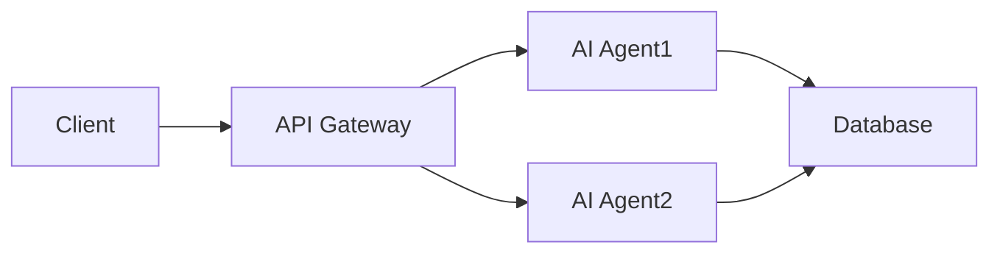
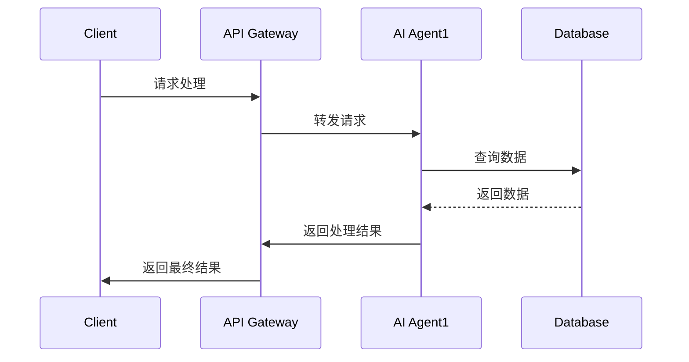

                 


# 企业AI Agent的高可用性架构设计

## 关键词：企业AI Agent, 高可用性, 分布式系统, 容错机制, 负载均衡, 故障恢复

## 摘要：  
在企业AI Agent的高可用性架构设计中，我们需要理解AI Agent的基本概念，探讨其实现高可用性的关键技术。通过分析分布式系统中的容错机制、负载均衡和故障恢复机制，结合具体算法和数学模型，设计一个可靠的系统架构，并通过实际案例展示其应用。本文详细讲解了实现企业AI Agent高可用性的过程，提供丰富的技术细节和实用的代码示例。

---

# 第一部分: 企业AI Agent的背景与概念

## 第1章: AI Agent的基本概念

### 1.1 AI Agent的定义与核心特征

AI Agent（人工智能代理）是一种能够感知环境、自主决策并执行任务的智能实体。其核心特征包括：

1. **自主性**：无需外部干预，自主决策。
2. **反应性**：能实时感知环境变化并做出响应。
3. **社会性**：能与其他系统或用户进行交互。
4. **持续性**：能长时间稳定运行，处理多种任务。

### 1.2 高可用性架构的定义与重要性

高可用性（High Availability, HA）是指系统在长时间内保持可用状态，即使在部分组件故障时，仍能继续提供服务。在企业AI Agent中，高可用性确保了系统的稳定性和可靠性，避免因故障导致服务中断。

### 1.3 企业AI Agent的应用场景

企业AI Agent广泛应用于内部流程自动化、客户服务与支持、数据分析与决策支持等领域。例如，在客户服务中，AI Agent可以实时响应客户需求，处理订单、解决问题，提升客户满意度。

---

# 第二部分: 企业AI Agent的高可用性技术原理

## 第2章: 高可用性系统的关键技术

### 2.1 容错机制

容错机制通过检测和恢复故障，确保系统在故障发生时仍能正常运行。常见的容错技术包括冗余设计和故障切换。

#### 2.1.1 冗余设计

冗余设计通过部署多个组件，确保在某个组件故障时，其他组件能够接替其功能。例如，使用主从架构，主节点故障时，从节点自动接管。

#### 2.1.2 故障切换

故障切换机制通过检测故障并自动将任务转移到备用组件，减少服务中断时间。常用的心跳检测机制可以实时监控组件状态，及时发现故障。

### 2.2 负载均衡

负载均衡技术将请求均匀分配到多个节点，避免单点过载，提升系统的处理能力。常用算法包括轮询、随机和加权轮询。

### 2.3 故障恢复机制

故障恢复机制通过自动检测和修复故障，确保系统快速恢复正常。例如，故障恢复机制可以自动重启故障节点或重新分配任务。

---

# 第三部分: 企业AI Agent高可用性架构的算法与数学模型

## 第3章: 实现高可用性的算法原理

### 3.1 一致性哈希算法

一致性哈希是一种分布式哈希技术，用于将数据均匀分布在多个节点上。通过虚拟节点环和负载均衡算法，确保数据分布均匀。

#### 3.1.1 一致性哈希算法流程

1. 将数据节点映射到虚拟节点环上。
2. 使用哈希函数计算数据的虚拟节点位置。
3. 数据放置在最近的虚拟节点上。
4. 节点故障时，重新分配其数据到其他节点。

#### 3.1.2 一致性哈希的Python实现示例

```python
import hashlib

def consistent_hash(key, nodes):
    ring = {}
    for node in nodes:
        for i in range(16):
            ring_id = node + str(i)
            ring[ring_id] = 0
    for node in nodes:
        m = hashlib.md5(node.encode()).hexdigest()
        hash_val = int(m, 16)
        for ring_id in ring:
            if hash_val < ring[ring_id]:
                ring[ring_id] = hash_val
                break
    return ring

nodes = ['node1', 'node2', 'node3']
print(consistent_hash('data1', nodes))
```

### 3.2 心跳检测机制

心跳检测机制通过定期发送心跳包，检测节点的健康状态。心跳包包含时间戳和序列号，用于验证节点是否存活。

#### 3.2.1 心跳检测的数学模型

心跳检测的时间间隔 \( t \) 应满足以下条件：

$$ t \leq \frac{T}{2} $$

其中，\( T \) 是心跳包的有效时间。

---

# 第四部分: 企业AI Agent高可用性架构的设计与实现

## 第4章: 系统架构设计

### 4.1 系统架构图

使用Mermaid绘制系统架构图：



### 4.2 接口设计

设计系统接口时，需定义清晰的请求和响应格式。例如，API Gateway接收客户端请求，转发给AI Agent，并返回处理结果。

### 4.3 交互流程图

使用Mermaid绘制交互流程图：



---

# 第五部分: 项目实战

## 第5章: 企业AI Agent高可用性系统实战

### 5.1 环境搭建

1. 安装必要的依赖：
   ```bash
   pip install flask redis
   ```

2. 配置服务器集群，确保每个节点运行相同的代码。

### 5.2 核心代码实现

#### 5.2.1 AI Agent的高可用性实现

```python
import redis
from flask import Flask

app = Flask(__name__)
redis_instance = redis.Redis(host='localhost', port=6379, db=0)

@app.route('/')
def home():
    try:
        # 检测心跳
        redis_instance.ping()
        return "AI Agent服务正常运行"
    except redis.exceptions.ConnectionError:
        return "AI Agent服务出现故障，请稍后再试"
```

### 5.3 案例分析

通过分析实际案例，如电商系统的订单处理，展示高可用性架构的实际应用效果。例如，当主节点故障时，系统自动切换到备用节点，确保订单处理不中断。

---

# 第六部分: 总结与展望

## 第6章: 总结与展望

### 6.1 本章小结

本文详细讲解了企业AI Agent高可用性架构的设计与实现，从概念到算法，从系统设计到项目实战，全面覆盖了高可用性架构的关键点。通过实际案例的分析，展示了理论知识的实际应用。

### 6.2 未来展望

随着AI技术的不断发展，企业AI Agent的高可用性架构将更加复杂和智能。未来的研究方向包括更高效的容错机制、更智能的负载均衡算法，以及更强大的故障恢复技术。

---

# 作者：AI天才研究院/AI Genius Institute & 禅与计算机程序设计艺术 /Zen And The Art of Computer Programming

---

这篇文章详细探讨了企业AI Agent的高可用性架构设计，结合理论和实践，为读者提供了全面的技术指导。通过系统的分析和丰富的案例，帮助读者理解并掌握如何设计和实现高可用性的企业AI Agent系统。

