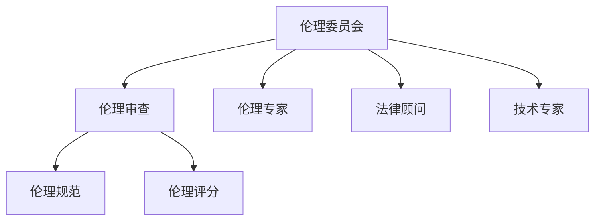
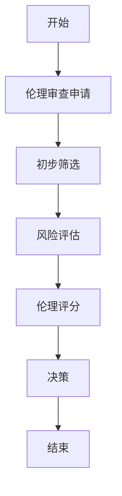
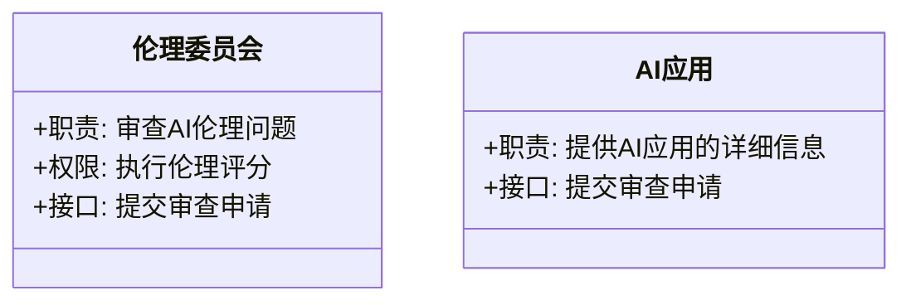
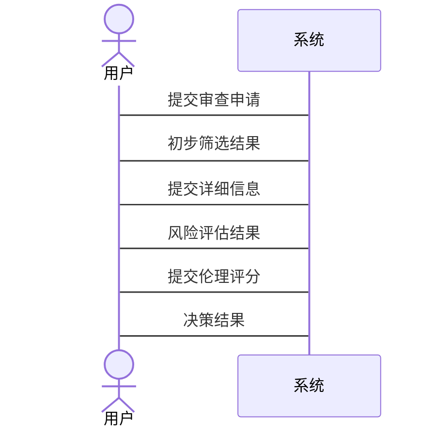

                 


# 企业AI伦理委员会：建立和运作指南

> **关键词**：企业AI伦理委员会、AI伦理审查、伦理评分模型、系统架构设计、治理结构、风险管理  
> **摘要**：本文系统地探讨了企业AI伦理委员会的建立和运作方法，从背景介绍、核心概念、算法原理、系统架构设计到项目实战，全面分析了如何在企业中有效实施AI伦理治理。通过详细的技术分析和实际案例，本文为企业的AI伦理委员会建设提供了可操作的指导和建议。

---

# 第一部分: 企业AI伦理委员会的背景与概念

## 第1章: 企业AI伦理委员会的背景介绍

### 1.1 问题背景
#### 1.1.1 AI技术的快速发展与伦理挑战
随着AI技术的快速发展，企业越来越多地将AI应用于业务决策、数据分析、客户服务等领域。然而，AI技术的广泛应用也带来了诸多伦理问题，例如算法偏见、隐私泄露、伦理决策的不确定性等。这些问题不仅可能损害企业声誉，还可能引发法律风险。

#### 1.1.2 企业AI应用中的伦理问题
企业在AI应用中可能面临以下伦理问题：
- 数据隐私问题：AI系统可能处理大量用户数据，存在数据滥用或泄露的风险。
- 算法偏见问题：AI算法可能因为训练数据的偏差而产生不公平的结果。
- 伦理决策问题：AI系统在某些情况下需要做出复杂的伦理决策，例如自动驾驶汽车在紧急情况下的决策。

#### 1.1.3 伦理委员会在企业中的角色与意义
企业AI伦理委员会的建立旨在为企业提供一个独立、专业的伦理审查机构，确保AI应用符合伦理标准，规避法律风险，提升企业声誉。

### 1.2 问题描述
#### 1.2.1 AI伦理问题的多维度分析
AI伦理问题涉及多个维度，包括数据隐私、算法公平性、伦理决策、透明性等。这些问题需要从技术、法律、伦理等多个角度进行综合分析。

#### 1.2.2 企业AI应用中的具体伦理风险
企业在AI应用中可能面临以下具体伦理风险：
- 数据收集和使用中的隐私问题。
- 算法决策的公平性和透明性问题。
- AI系统的伦理决策能力不足导致的意外后果。

#### 1.2.3 伦理委员会的建立需求
为了应对上述伦理风险，企业需要建立一个专门的伦理委员会，负责对AI应用进行伦理审查，制定伦理规范，监督伦理合规性。

### 1.3 问题解决
#### 1.3.1 伦理委员会的建立目标
- 建立一个独立的伦理审查机构，确保AI应用符合伦理标准。
- 制定AI伦理规范，指导企业的AI应用开发和部署。
- 监督AI系统的伦理合规性，及时发现和解决伦理问题。

#### 1.3.2 伦理委员会的核心功能与作用
- 审查AI应用的伦理合规性。
- 制定AI伦理规范和指导原则。
- 提供伦理决策的建议和支持。
- 监督AI系统的伦理风险。

#### 1.3.3 伦理委员会与其他治理机构的关系
伦理委员会需要与企业的法律、合规、风险管理等部门密切合作，共同确保AI应用的伦理合规性。

### 1.4 边界与外延
#### 1.4.1 伦理委员会的职责边界
- 伦理委员会主要负责AI应用的伦理审查，不直接参与技术开发和业务决策。
- 伦理委员会的职责范围需要明确界定，避免与其他治理机构的职责重叠。

#### 1.4.2 与法律、合规部门的区分
- 法律部门主要负责合规性审查，确保企业行为符合法律法规。
- 伦理委员会则关注AI应用的伦理合规性，确保企业行为符合社会伦理标准。

#### 1.4.3 与其他企业治理结构的协同
- 伦理委员会需要与企业董事会、风险管理委员会等治理机构协同合作，共同确保企业治理的全面性。

### 1.5 概念结构与核心要素
#### 1.5.1 伦理委员会的组织架构
- 伦理委员会通常由企业内部的伦理专家、法律顾问、技术专家等组成。
- 委员会设一名主席，负责组织和协调伦理审查工作。

#### 1.5.2 核心要素的定义与关系
| 核心要素 | 定义 | 关系 |
|----------|------|------|
| 伦理审查 | 对AI应用的伦理合规性进行审查 | 伦理审查是伦理委员会的核心功能 |
| 伦理规范 | 企业AI应用的伦理行为准则 | 伦理规范是伦理委员会的输出成果 |
| 伦理评分 | 对AI应用的伦理风险进行评分 | 伦理评分是伦理审查的重要依据 |

#### 1.5.3 概念结构的可视化


---

# 第二部分: 企业AI伦理委员会的核心概念与联系

## 第2章: 核心概念与原理

### 2.1 核心概念原理
#### 2.1.1 伦理委员会的基本原理
伦理委员会通过审查AI应用的伦理合规性，制定伦理规范，指导企业的AI应用开发和部署。

#### 2.1.2 AI伦理审查的流程与机制
AI伦理审查的流程通常包括以下几个步骤：
1. 提交审查申请：AI应用开发部门向伦理委员会提交审查申请。
2. 初步筛选：伦理委员会对审查申请进行初步筛选，确定是否需要进一步审查。
3. 风险评估：伦理委员会对AI应用的伦理风险进行评估。
4. 伦理评分：伦理委员会对AI应用的伦理风险进行评分。
5. 决策：伦理委员会根据评分结果做出审查决策。

#### 2.1.3 伦理委员会的决策逻辑
伦理委员会的决策逻辑基于以下几个因素：
- AI应用的伦理风险。
- 企业的伦理规范和价值观。
- 相关法律法规和行业标准。

### 2.2 概念属性特征对比
| 概念 | 属性 | 特征 |
|------|------|------|
| 伦理委员会 | 独立性 | 独立于企业其他部门，确保审查的客观性 |
| 伦理审查 | 系统性 | 涵盖AI应用的全生命周期 |
| 伦理评分 | 可量化 | 通过评分模型对伦理风险进行量化评估 |

### 2.3 ER实体关系图
```mermaid
er
actor: 企业AI伦理委员会
role: 负责AI伦理审查
```

---

## 第3章: 算法原理与流程

### 3.1 算法原理
#### 3.1.1 AI伦理审查的流程
AI伦理审查的流程如下：
1. 提交审查申请。
2. 初步筛选。
3. 风险评估。
4. 伦理评分。
5. 决策。

#### 3.1.2 伦理评分的计算方法
伦理评分的计算方法如下：
$$ \text{伦理评分} = \sum_{i=1}^{n} w_i \cdot r_i $$
其中，$w_i$ 是第 $i$ 个伦理维度的权重，$r_i$ 是第 $i$ 个维度的评分。

#### 3.1.3 伦理风险的量化模型
伦理风险的量化模型如下：
$$ \text{伦理风险} = \sum_{i=1}^{m} w_i \cdot r_i $$
其中，$w_i$ 是第 $i$ 个风险维度的权重，$r_i$ 是第 $i$ 个维度的评分。

### 3.2 算法流程图


### 3.3 数学模型与公式
#### 伦理评分公式：
$$ \text{伦理评分} = \sum_{i=1}^{n} w_i \cdot r_i $$
其中，$w_i$ 是第 $i$ 个伦理维度的权重，$r_i$ 是第 $i$ 个维度的评分。

#### 伦理风险量化公式：
$$ \text{伦理风险} = \sum_{i=1}^{m} w_i \cdot r_i $$
其中，$w_i$ 是第 $i$ 个风险维度的权重，$r_i$ 是第 $i$ 个维度的评分。

---

## 第4章: 系统分析与架构设计

### 4.1 问题场景介绍
#### 企业AI应用中的伦理审查需求
企业AI应用中的伦理审查需求包括：
- 对AI应用的伦理风险进行评估。
- 对AI应用的伦理合规性进行审查。
- 对AI应用的伦理评分进行计算。

#### 伦理委员会的系统目标
伦理委员会的系统目标包括：
- 提供AI伦理审查的平台。
- 支持伦理评分的计算。
- 提供伦理规范的制定和管理。

#### 系统的预期功能
系统的预期功能包括：
- 提交审查申请。
- 初步筛选。
- 风险评估。
- 伦理评分。
- 决策输出。

### 4.2 系统功能设计
#### 领域模型


### 4.3 系统架构设计


### 4.4 系统接口设计
- 提交审查申请接口：AI应用开发部门通过系统提交审查申请。
- 初步筛选接口：系统对审查申请进行初步筛选。
- 风险评估接口：系统对AI应用的伦理风险进行评估。
- 伦理评分接口：系统对AI应用的伦理风险进行评分。
- 决策接口：系统根据评分结果做出审查决策。

### 4.5 系统交互设计


---

## 第5章: 项目实战

### 5.1 环境安装
- 安装Mermaid工具：用于绘制系统架构图和流程图。
- 安装Python环境：用于实现伦理评分计算和风险评估。

### 5.2 核心实现
#### 伦理评分计算代码
```python
def calculate_ethics_score(dimensions, weights):
    return sum(w * r for w, r in zip(weights, dimensions))
```

#### 风险评估代码
```python
def assess_risk(dimensions, thresholds):
    return all(r >= t for r, t in zip(dimensions, thresholds))
```

### 5.3 代码应用解读与分析
- 伦理评分计算代码用于根据不同的伦理维度和权重计算伦理评分。
- 风险评估代码用于根据设定的阈值评估AI应用的伦理风险。

### 5.4 实际案例分析
假设某企业开发了一个基于AI的客户服务系统，伦理委员会需要对系统的伦理风险进行评估。具体步骤如下：
1. 提交审查申请。
2. 初步筛选。
3. 风险评估。
4. 伦理评分。
5. 决策。

### 5.5 项目小结
通过实际案例分析，可以验证伦理委员会的审查流程和系统的有效性。伦理评分计算和风险评估代码可以帮助企业快速评估AI应用的伦理风险，提高审查效率。

---

## 第6章: 最佳实践与小结

### 6.1 最佳实践
- 定期更新伦理规范和审查流程。
- 建立跨部门的协作机制。
- 培训伦理委员会成员，提升伦理审查能力。

### 6.2 小结
企业AI伦理委员会的建立和运作需要从背景介绍、核心概念、算法原理、系统架构设计、项目实战等多个方面进行全面考虑。通过系统的伦理审查和风险管理，企业可以有效规避AI应用的伦理风险，提升企业的社会形象和竞争力。

### 6.3 注意事项
- 伦理委员会的职责需要明确界定，避免与其他治理机构的职责重叠。
- 伦理评分模型需要根据企业的实际情况进行调整和优化。
- 系统的伦理审查流程需要简洁高效，避免对企业的业务发展造成阻碍。

### 6.4 拓展阅读
- 阅读相关学术论文，了解最新的AI伦理研究进展。
- 关注行业动态，了解其他企业在AI伦理治理方面的最佳实践。

---

# 作者：AI天才研究院/AI Genius Institute & 禅与计算机程序设计艺术 /Zen And The Art of Computer Programming

