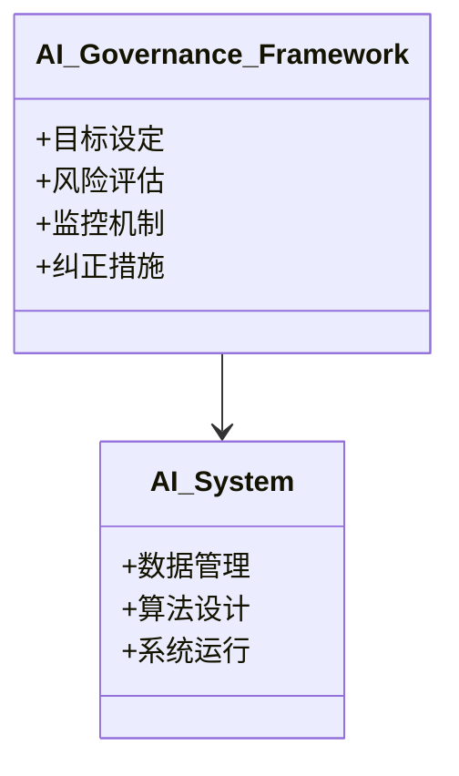
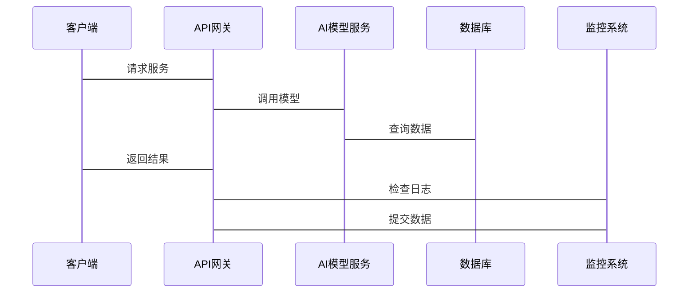

                 


# 企业AI治理框架：确保AI Agent的可控与合规

## 关键词：企业AI治理框架、AI Agent、AI可控、AI合规、治理原则、风险评估、系统架构

## 摘要：企业AI治理框架是为了确保AI Agent在企业中的可控和合规，通过合理的治理原则和架构设计，结合算法原理和系统实现，为企业提供有效的AI治理方案。本文将从背景、核心概念、算法、系统架构、项目实战和最佳实践等方面详细阐述企业AI治理框架的构建与应用。

---

# 第1章 企业AI治理框架的背景与意义

## 1.1 AI治理的基本概念

### 1.1.1 什么是AI治理
AI治理是指在企业中对人工智能技术的开发、部署和应用进行规范和监督的过程。其目标是确保AI系统的行为符合企业的战略目标、伦理规范和法律法规。

### 1.1.2 AI治理的目标与原则
AI治理的目标包括确保AI系统的透明性、可解释性、可控制性和合规性。其核心原则包括：透明性、公平性、可解释性、隐私保护和可追溯性。

### 1.1.3 企业AI治理的重要性
随着AI技术的广泛应用，企业面临的风险也日益增加。通过有效的AI治理，企业可以降低技术风险，确保AI系统的稳定运行，并提升用户信任度。

## 1.2 AI Agent的定义与特点

### 1.2.1 AI Agent的基本概念
AI Agent是一种能够感知环境并采取行动以实现目标的智能实体。它可以自主决策，无需人工干预。

### 1.2.2 AI Agent的核心特点
AI Agent具有智能性、自主性、反应性和社会性。智能性体现在其能够处理复杂问题；自主性意味着它可以独立运行；反应性使其能够根据环境变化调整行为；社会性则使其能够与其他系统或用户交互协作。

### 1.2.3 AI Agent与传统系统的区别
AI Agent的核心区别在于其具备学习和自适应能力，能够根据反馈不断优化自身行为。而传统系统则遵循固定的规则，缺乏灵活性。

## 1.3 企业AI治理的必要性

### 1.3.1 AI技术在企业中的应用现状
AI技术已在企业中广泛应用，如智能客服、推荐系统和自动化决策等。然而，这些系统的运行可能带来数据隐私风险、算法偏见和不可控性问题。

### 1.3.2 AI治理的必要性与挑战
企业需要确保AI系统的可控性，避免潜在风险。然而，AI系统的复杂性和动态性增加了治理的难度。因此，制定有效的治理框架至关重要。

### 1.3.3 企业AI治理的边界与外延
企业AI治理的边界包括数据管理、算法设计和系统运行等环节。其外延则涉及企业内外部的协调与合作，确保治理框架的全面性。

---

# 第2章 企业AI治理框架的核心概念

## 2.1 治理框架的原理与机制

### 2.1.1 治理框架的组成要素
治理框架通常包括目标设定、风险评估、监控和反馈机制等核心要素。这些要素共同确保AI系统的合规性和可控性。

### 2.1.2 治理机制的运作流程
治理机制通过持续监控和评估AI系统的运行状态，识别潜在风险，并采取相应的纠正措施，确保系统行为符合预期。

### 2.1.3 治理框架的核心原理
治理框架的核心原理在于通过系统化的方法，确保AI系统的透明性、可解释性和合规性，降低潜在风险。

## 2.2 核心概念与联系

### 2.2.1 治理原则与目标
治理原则包括透明性、公平性、可解释性、隐私保护和可追溯性。目标是确保AI系统的可控性和合规性。

### 2.2.2 核心要素对比表格
以下是核心治理要素的对比表格：

| 治理要素 | 描述 |
|----------|------|
| 透明性    | 系统行为可被理解 |
| 可解释性  | 系统决策可追溯 |
| 隐私保护  | 数据安全合规 |
| 可控性    | 系统行为可监控和纠正 |

### 2.2.3 ER实体关系图架构
以下是AI治理框架的ER实体关系图：

```mermaid
erd
    组件 -> 治理原则
    治理原则 <-[ ]-> 监控机制
    监控机制 <-[ ]-> 纠正措施
```

---

# 第3章 企业AI治理框架的算法原理

## 3.1 风险评估

### 3.1.1 风险评估的基本原理
风险评估是AI治理框架中的关键步骤，通过识别和量化潜在风险，制定相应的应对策略。

### 3.1.2 风险评估的步骤
1. **识别风险源**：分析AI系统可能面临的数据、算法和系统性风险。
2. **评估风险影响**：量化风险可能对企业造成的影响。
3. **制定应对策略**：根据风险级别制定相应的防控措施。

### 3.1.3 风险评估的数学模型
以下是风险评估的数学模型示例：

$$
R = \sum_{i=1}^{n} (P_i \times I_i)
$$

其中，\( R \) 表示总风险，\( P_i \) 表示第 \( i \) 个风险的概率，\( I_i \) 表示第 \( i \) 个风险的影响。

---

## 3.2 合规性监控

### 3.2.1 合规性监控的基本原理
合规性监控是通过持续监督AI系统的运行，确保其符合相关法律法规和企业内部政策。

### 3.2.2 合规性监控的实现步骤
1. **数据收集**：实时采集AI系统的运行数据和用户反馈。
2. **异常检测**：利用机器学习算法识别系统中的异常行为。
3. **告警与反馈**：当检测到异常时，及时告警并采取纠正措施。

### 3.2.3 合规性监控的Python实现
以下是合规性监控的Python代码示例：

```python
import logging
from watchdog.observers import Observer
from watchdog.events import FileSystemEventHandler

class ComplianceMonitor(FileSystemEventHandler):
    def on_modified(self, event):
        logging.info(f"File {event.src_path} has been modified.")
        # 调用API进行合规性检查
        check_compliance(event.src_path)

def main():
    observer = Observer()
    observer.schedule(ComplianceMonitor(), path='.', recursive=True)
    observer.start()
    try:
        while True:
            pass
    except KeyboardInterrupt:
        observer.stop()
    observer.join()

if __name__ == "__main__":
    main()
```

---

# 第4章 企业AI治理框架的系统架构

## 4.1 问题场景介绍

### 4.1.1 问题背景
企业AI系统在运行过程中可能面临数据泄露、算法偏见和系统失控等风险。

### 4.1.2 问题描述
企业需要构建一个能够实时监控AI系统运行状态，识别潜在风险，并采取纠正措施的治理框架。

## 4.2 系统功能设计

### 4.2.1 领域模型
以下是领域模型的Mermaid类图：



## 4.3 系统架构设计

### 4.3.1 系统架构的Mermaid图
以下是系统架构的Mermaid图：


## 4.4 接口设计

### 4.4.1 接口描述
以下是系统的主要接口及其描述：

1. **风险评估接口**：用于调用风险评估算法，返回风险等级。
2. **合规性检查接口**：用于验证AI系统的运行是否符合规定。
3. **告警接口**：在检测到异常时，触发告警通知。

## 4.5 交互设计

### 4.5.1 交互流程
以下是交互流程的Mermaid序列图：



---

# 第5章 企业AI治理框架的项目实战

## 5.1 环境安装

### 5.1.1 安装Python
确保安装Python 3.8或更高版本，并安装必要的库，如`numpy`、`pandas`和`scikit-learn`。

### 5.1.2 安装依赖
使用以下命令安装依赖：

```bash
pip install numpy pandas scikit-learn watchdog
```

## 5.2 核心代码实现

### 5.2.1 风险评估代码
以下是风险评估的Python代码：

```python
import numpy as np
from sklearn.metrics import accuracy_score

def evaluate_model(true_labels, predicted_labels):
    accuracy = accuracy_score(true_labels, predicted_labels)
    return accuracy
```

### 5.2.2 合规性监控代码
以下是合规性监控的代码：

```python
import logging
from watchdog.observers import Observer
from watchdog.events import FileSystemEventHandler

class ComplianceMonitor(FileSystemEventHandler):
    def on_modified(self, event):
        logging.info(f"File {event.src_path} has been modified.")
        # 调用API进行合规性检查
        check_compliance(event.src_path)

def main():
    observer = Observer()
    observer.schedule(ComplianceMonitor(), path='.', recursive=True)
    observer.start()
    try:
        while True:
            pass
    except KeyboardInterrupt:
        observer.stop()
    observer.join()

if __name__ == "__main__":
    main()
```

## 5.3 案例分析与代码解读

### 5.3.1 案例分析
以一个推荐系统为例，分析如何通过治理框架确保其可控性和合规性。系统在运行过程中，监控模块实时检测推荐结果的公平性和透明性。

### 5.3.2 代码解读
在上述代码中，`ComplianceMonitor`类继承自`FileSystemEventHandler`，并在文件修改时触发`on_modified`方法，进行合规性检查。主程序启动一个观察者，持续监控文件系统的变动。

## 5.4 项目总结

### 5.4.1 项目小结
通过实际项目的实现，我们验证了企业AI治理框架的有效性。该框架能够实时监控AI系统的运行状态，识别潜在风险，并采取相应的纠正措施，确保系统的可控和合规。

---

# 第6章 企业AI治理框架的最佳实践

## 6.1 关键点总结

### 6.1.1 治理原则的重要性
遵循透明性、公平性和可解释性原则，确保AI系统的可信度。

### 6.1.2 监控机制的有效性
实时监控和持续评估是确保AI系统合规性的关键。

## 6.2 小结

企业AI治理框架是确保AI Agent可控与合规的重要工具。通过合理的治理原则和有效的监控机制，企业可以降低技术风险，提升系统性能。

## 6.3 注意事项

1. **数据隐私**：确保数据处理符合相关法律法规。
2. **算法偏见**：定期检查和优化算法，避免偏见。
3. **系统透明性**：保持系统的透明性，便于用户理解和监督。

## 6.4 拓展阅读

1. 《AI治理：原则与实践》
2. 《企业级AI系统的设计与实现》
3. 《数据隐私与合规性指南》

---

# 作者：AI天才研究院/AI Genius Institute & 禅与计算机程序设计艺术 /Zen And The Art of Computer Programming

---

通过本文的详细讲解，我们全面探讨了企业AI治理框架的构建与应用，从理论到实践，为企业提供了有效的治理方案。希望本文能为企业的AI治理工作提供有价值的参考和指导。

