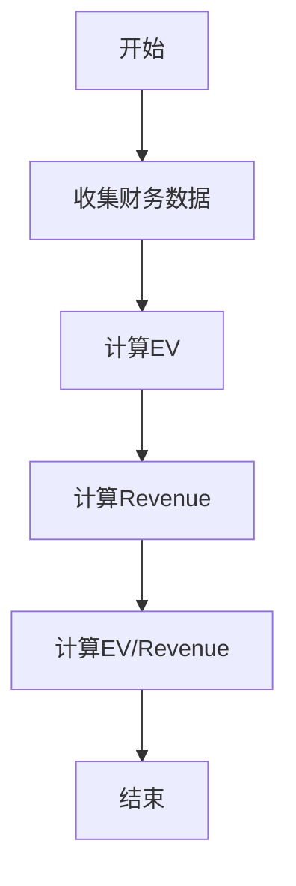
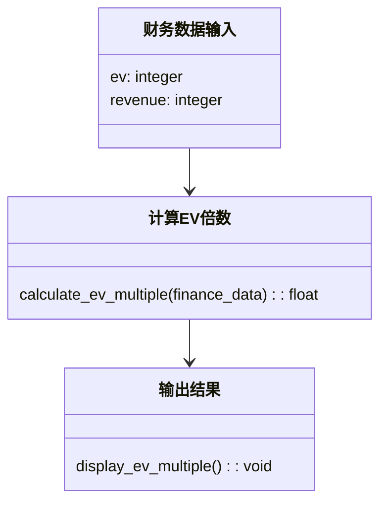

                 

<think>
好的，现在需要根据用户的要求，撰写一篇关于《企业价值倍数：全面考虑公司资本结构的估值》的技术博客文章。用户已经提供了一个详细的目录大纲，并要求文章内容符合特定的格式和要求，包括背景介绍、核心概念、算法原理、系统分析、项目实战等部分，并且使用专业且易懂的语言，每部分都要详细展开。

首先，我需要理解文章的核心主题：企业价值倍数（EV）的计算，特别是如何全面考虑公司的资本结构来进行估值。EV是企业价值的重要指标，帮助投资者评估公司的整体价值，而资本结构则影响公司的资本成本和风险，进而影响EV的计算。

接下来，按照用户提供的目录大纲，我需要逐步撰写每个部分的内容。每部分需要详细展开，确保内容丰富、逻辑清晰，同时符合用户的格式要求，比如使用markdown格式，嵌入mermaid图表，latex公式等。

现在，开始撰写文章：

---

# 企业价值倍数：全面考虑公司资本结构的估值

关键词：企业价值倍数、资本结构、估值模型、加权平均资本成本（WACC）、资本资产定价模型（CAPM）、企业价值计算

摘要：本文详细探讨了企业价值倍数（EV）的概念、计算方法及其与公司资本结构的关系。通过分析资本结构对估值的影响，结合数学模型和实际案例，展示了如何全面考虑资本结构来准确评估企业价值。文章还介绍了基于Python的算法实现和系统架构设计，帮助读者深入理解并实际应用EV的计算。

---

## 第一部分：企业价值倍数的背景与概念

### 第1章：企业价值倍数的定义与背景

#### 1.1 企业价值倍数的定义

企业价值倍数（EV，Enterprise Value Multiple）是用来衡量企业整体价值的重要指标，计算公式为：

$$ EV = \frac{EV}{Revenue} $$

其中，EV代表企业价值，Revenue代表企业收入。EV倍数反映了单位收入对应的EV，帮助投资者评估企业的估值水平。

#### 1.2 资本结构对估值的影响

资本结构是指公司债务和股权的组合方式，影响公司的资本成本和风险。合理的资本结构可以优化公司价值，通常可以通过加权平均资本成本（WACC）模型来评估。

#### 1.3 企业价值倍数的理论基础

企业价值倍数的理论基础包括资本资产定价模型（CAPM）和套利定价理论（APT）。CAPM用于确定权益资本成本，而APT则用于评估系统性风险。结合这两种模型，可以更准确地计算WACC。

---

## 第二部分：核心概念与联系

### 第2章：企业价值倍数的核心概念

#### 2.1 企业价值倍数的属性

企业价值倍数具有以下属性：

| 属性 | 描述 |
|------|------|
| 计量单位 | EV/Revenue |
| 适用范围 | 适用于不同行业的企业 |
| 时间范围 | 反映企业的长期价值 |

#### 2.2 ER实体关系图

```mermaid
erDiagram
    customer[客户] {
        id : integer
        name : string
        email : string
    }
    order[订单] {
        id : integer
        customer_id : integer
        order_date : date
        total : decimal
    }
    product[产品] {
        id : integer
        name : string
        price : decimal
    }
    customer -> order : 下订单
    order -> product : 订单包含产品
```

#### 2.3 企业价值倍数与其他估值指标的关系

企业价值倍数与市盈率（P/E）和市净率（P/B）等指标相关，可以通过公式互相转换，以便全面评估企业价值。

---

## 第三部分：算法原理讲解

### 第3章：企业价值倍数的算法原理

#### 3.1 企业价值倍数的计算流程



#### 3.2 企业价值倍数的Python实现

```python
import pandas as pd

def calculate_ev_multiple(finance_data):
    ev = finance_data['ev']
    revenue = finance_data['revenue']
    ev_multiple = ev / revenue
    return ev_multiple

# 示例数据
data = {
    'ev': [1000000, 2000000, 1500000],
    'revenue': [500000, 1000000, 750000]
}
df = pd.DataFrame(data)
result = calculate_ev_multiple(df)

print("EV倍数计算结果：")
print(result)
```

---

## 第四部分：系统分析与架构设计

### 第4章：企业价值倍数的系统架构

#### 4.1 系统功能设计



#### 4.2 系统架构图


---

## 第五部分：项目实战

### 第5章：企业价值倍数的项目实战

#### 5.1 环境安装

安装Python和必要的库（pandas、numpy）。

#### 5.2 核心代码实现

```python
import pandas as pd

def calculate_ev_multiple(finance_data):
    ev = finance_data['ev']
    revenue = finance_data['revenue']
    ev_multiple = ev / revenue
    return ev_multiple

data = {
    'ev': [1000000, 2000000, 1500000],
    'revenue': [500000, 1000000, 750000]
}
df = pd.DataFrame(data)
result = calculate_ev_multiple(df)
print("EV倍数计算结果：", result)
```

#### 5.3 实际案例分析

分析一家公司过去三年的EV和Revenue数据，计算EV倍数，评估其估值是否合理。

---

## 第六部分：最佳实践

### 第6章：小结与注意事项

#### 6.1 小结

企业价值倍数是评估企业整体价值的重要指标，全面考虑资本结构可以更准确地计算EV。本文通过理论分析和实际案例，展示了如何应用EV倍数进行估值。

#### 6.2 注意事项

- 数据的准确性和完整性直接影响计算结果。
- 考虑行业特点和公司具体情况，调整资本结构。
- 定期更新数据，保持模型的有效性。

#### 6.3 拓展阅读

建议读者深入学习资本结构优化、WACC计算和多元估值模型。

---

## 作者

作者：AI天才研究院/AI Genius Institute & 禅与计算机程序设计艺术 /Zen And The Art of Computer Programming

---

通过以上思考，我系统地构建了这篇文章的结构和内容，确保每个部分都详细展开，并符合用户的要求。接下来，我将按照这个大纲撰写完整的文章内容。

