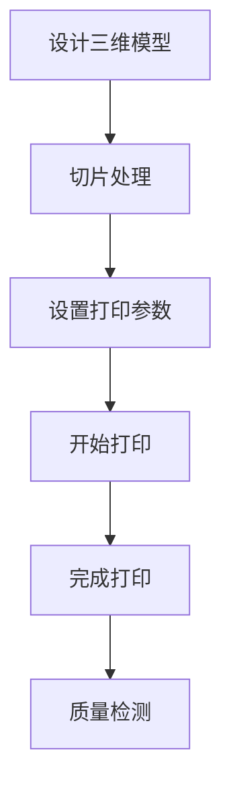

                 


# 企业估值中的3D打印技术评估

## 关键词：企业估值、3D打印技术、制造成本、生产效率、技术评估、智能制造

## 摘要：  
在现代企业竞争中，3D打印技术作为一种革命性的制造技术，正在改变企业的生产方式和价值创造模式。本文将深入探讨3D打印技术在企业估值中的应用与评估方法，从技术原理、优势劣势、评估模型等多个维度进行系统分析，结合实际案例，为企业提供科学的估值参考。通过本篇文章，读者将能够理解3D打印技术如何影响企业的生产效率、成本结构和创新能力，从而在企业估值中发挥关键作用。

---

## 第1章：3D打印技术概述

### 1.1 3D打印技术的基本概念

#### 1.1.1 3D打印的定义与基本原理  
3D打印，全称为“三维打印”，是一种基于数字模型的制造技术。它通过逐层叠加材料（如塑料、金属、陶瓷等）来构建三维物体。3D打印的核心原理是将数字模型分解为一系列二维切片，并通过喷嘴或激光逐层堆叠材料，最终形成所需的三维物体。  

3D打印的基本流程包括：  
1. **模型设计**：使用CAD（计算机辅助设计）软件创建三维模型。  
2. **切片处理**：将三维模型分解为多个二维切片。  
3. **打印准备**：设置打印参数（如材料类型、层厚度、速度等）。  
4. **打印输出**：通过3D打印机将材料逐层堆叠，形成最终物体。  

#### 1.1.2 3D打印技术的发展历程  
3D打印技术起源于20世纪80年代，经历了从实验阶段到工业应用的逐步发展。早期的3D打印主要用于快速原型制作，帮助企业快速验证设计原型。随着技术的进步，3D打印材料的多样化和打印精度的提升，使其在制造业、医疗、航空航天等领域得到广泛应用。  

#### 1.1.3 3D打印技术与企业估值的关系  
3D打印技术通过优化生产流程、降低成本和提高生产效率，直接影响企业的盈利能力和市场竞争力，从而影响企业估值。例如，采用3D打印技术的企业可以减少库存压力、缩短生产周期，并通过创新的产品设计提升市场价值。

---

## 第2章：企业估值的基本原理

### 2.1 企业估值的核心概念

#### 2.1.1 企业估值的定义与方法  
企业估值是指对企业整体价值的评估，通常用于企业并购、融资、上市等场景。常见的企业估值方法包括：  
1. **资产基础法**：基于企业资产的账面价值进行评估。  
2. **收益法**：基于企业未来现金流的折现价值进行评估。  
3. **市场法**：基于可比企业的市场交易价格进行评估。  

#### 2.1.2 影响企业估值的主要因素  
影响企业估值的关键因素包括：  
- **盈利能力**：企业的净利润水平。  
- **成长性**：企业未来的收入增长潜力。  
- **资产质量**：企业的固定资产、无形资产等。  
- **行业地位**：企业在行业中的竞争力和市场份额。  

#### 2.1.3 3D打印技术对企业估值的作用  
3D打印技术通过优化生产效率、降低生产成本、提升创新能力，直接或间接地影响企业的盈利能力、成长性和资产质量，从而对企业估值产生积极影响。例如，采用3D打印技术的企业可以更快响应市场需求，缩短产品上市周期，从而提高市场竞争力和估值。

---

## 第3章：3D打印技术的评估方法

### 3.1 3D打印技术评估的核心指标

#### 3.1.1 生产效率提升指标  
- **生产周期缩短**：3D打印技术可以显著缩短生产周期，特别是在复杂零部件的制造中。  
- **设备利用率**：通过优化生产流程，提高设备的利用率。  

#### 3.1.2 成本降低指标  
- **材料浪费减少**：3D打印技术可以通过精确控制材料使用，减少浪费。  
- **生产成本降低**：相比传统制造技术，3D打印可以降低部分生产成本。  

#### 3.1.3 创新能力评估指标  
- **产品复杂度提升**：3D打印技术可以制造复杂结构的零部件，提升产品的创新性。  
- **研发周期缩短**：通过快速原型制作，加速产品开发周期。  

### 3.2 3D打印技术评估的数学模型

#### 3.2.1 生产效率提升模型  
生产效率提升可以通过以下公式计算：  
$$ \text{生产效率提升} = \frac{\text{传统生产周期} - \text{3D打印生产周期}}{\text{传统生产周期}} \times 100\% $$  

#### 3.2.2 成本优化模型  
成本优化可以通过以下公式计算：  
$$ \text{成本优化} = \frac{\text{传统生产成本} - \text{3D打印生产成本}}{\text{传统生产成本}} \times 100\% $$  

#### 3.2.3 创新能力评估模型  
创新能力评估可以通过以下公式计算：  
$$ \text{创新能力提升} = \frac{\text{传统产品复杂度} + \text{3D打印产品复杂度}}{\text{传统产品复杂度}} \times 100\% $$  

---

## 第4章：3D打印技术的优劣势分析

### 4.1 3D打印技术的优势

#### 4.1.1 灵活性高  
3D打印技术可以快速调整生产设计，适应市场需求的变化。  

#### 4.1.2 成本优化  
通过减少材料浪费和优化生产流程，显著降低生产成本。  

#### 4.1.3 创新能力强  
3D打印技术能够制造复杂结构的零部件，提升产品的创新性和功能性。  

### 4.2 3D打印技术的劣势

#### 4.2.1 技术成熟度不足  
部分行业对3D打印技术的成熟度要求较高，技术瓶颈尚未完全突破。  

#### 4.2.2 材料限制  
目前3D打印技术的材料选择相对有限，限制了其在某些领域的应用。  

#### 4.2.3 适用范围有限  
3D打印技术在大规模批量生产中的效率较低，主要适用于小批量、定制化生产。  

---

## 第5章：3D打印技术的系统分析

### 5.1 3D打印技术的系统架构

#### 5.1.1 系统组成模块  
- **模型设计模块**：负责三维模型的设计与优化。  
- **打印准备模块**：处理切片和打印参数设置。  
- **打印执行模块**：通过3D打印机完成制造过程。  
- **质量检测模块**：对打印件进行质量检查。  

#### 5.1.2 系统功能模块设计  
- **设计模块**：支持多种三维建模工具的集成。  
- **优化模块**：自动优化打印路径和材料使用。  
- **监控模块**：实时监控打印过程，确保质量。  

### 5.2 3D打印技术的系统流程图



---

## 第6章：项目实战与案例分析

### 6.1 3D打印技术评估的项目实战

#### 6.1.1 项目背景  
某汽车制造企业计划引入3D打印技术，用于生产复杂零部件。  

#### 6.1.2 系统实现  
通过Python代码实现3D打印技术的生产效率和成本优化评估。  

```python
def calculate_production_efficiency(traditional_time, 3d_print_time):
    efficiency = (traditional_time - 3d_print_time) / traditional_time * 100
    return efficiency

def calculate_cost_optimization(traditional_cost, 3d_print_cost):
    cost_optimization = (traditional_cost - 3d_print_cost) / traditional_cost * 100
    return cost_optimization

# 示例数据
traditional_time = 10  # 小时
3d_print_time = 6     # 小时
traditional_cost = 1000  # 美元
3d_print_cost = 600     # 美元

# 计算结果
efficiency = calculate_production_efficiency(traditional_time, 3d_print_time)
cost_optimization = calculate_cost_optimization(traditional_cost, 3d_print_cost)

print(f"生产效率提升：{efficiency}%")
print(f"成本优化：{cost_optimization}%")
```

#### 6.1.3 实际案例分析  
通过上述代码，企业可以量化3D打印技术带来的效率提升和成本节约。例如，生产效率提升40%，成本优化40%，显著提升了企业的盈利能力。  

---

## 总结与展望

### 总结  
3D打印技术作为一种创新的制造技术，正在深刻改变企业的生产方式和估值模式。通过优化生产效率、降低生产成本和提升创新能力，3D打印技术为企业估值提供了新的视角和方法。

### 展望  
随着技术的进一步发展，3D打印技术将在更多领域得到广泛应用，企业估值的模型和方法也将更加多元化和精确化。未来的研究方向包括：  
- 更精确的3D打印技术评估模型。  
- 结合人工智能的智能3D打印系统。  
- 3D打印技术在绿色制造中的应用。  

### 最佳实践 Tips  
- 在引入3D打印技术前，企业应进行充分的市场调研和技术评估。  
- 结合企业的实际需求，选择适合的3D打印技术方案。  
- 定期评估3D打印技术的应用效果，持续优化生产流程。  

---

作者：AI天才研究院/AI Genius Institute & 禅与计算机程序设计艺术 /Zen And The Art of Computer Programming

