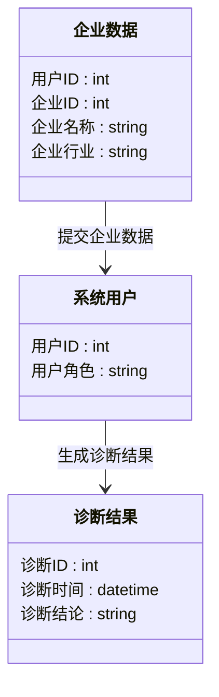

                 


# 《企业估值中的AI辅助诊断系统评估》

> 关键词：企业估值、AI辅助诊断系统、机器学习、深度学习、诊断模型

> 摘要：  
本文系统地探讨了AI辅助诊断系统在企业估值中的应用与评估方法。通过分析企业估值的核心要素、AI辅助诊断系统的功能模块，以及相关算法的原理与实现，本文深入剖析了如何利用AI技术提升企业估值的准确性和效率。结合实际案例，本文详细讲解了AI辅助诊断系统的架构设计、系统实现与项目实战，为读者提供了一套完整的解决方案。

---

## 第一章: 企业估值的基本概念与问题背景

### 1.1 企业估值的基本概念

#### 1.1.1 企业估值的定义与核心要素
企业估值是指对企业的整体价值或部分价值进行评估的过程。其核心要素包括：
1. **财务指标**：如收入、利润、现金流等。
2. **市场指标**：如行业趋势、竞争环境等。
3. **风险评估**：如市场风险、经营风险等。

#### 1.1.2 企业估值的主要方法
企业估值的主要方法包括：
1. **DCF模型**：基于现金流折现的估值方法。
2. **市盈率法**：通过市盈率与行业平均值进行比较。
3. **市场法**：基于可比企业的交易价格进行估值。

#### 1.1.3 企业估值的挑战与难点
企业估值的难点在于：
1. 数据的复杂性与不确定性。
2. 市场环境的动态变化。
3. 传统方法的局限性。

### 1.2 AI辅助诊断系统的基本概念

#### 1.2.1 辅助诊断系统的定义
AI辅助诊断系统是一种利用人工智能技术，通过分析数据提供诊断建议的系统。

#### 1.2.2 AI在诊断系统中的作用
AI在诊断系统中的作用包括：
1. 数据处理与分析。
2. 模型构建与预测。
3. 结果输出与决策支持。

#### 1.2.3 AI辅助诊断系统的应用场景
AI辅助诊断系统广泛应用于：
1. 医疗诊断。
2. 金融风险评估。
3. 企业估值。

### 1.3 企业估值中的AI辅助诊断系统

#### 1.3.1 企业估值与AI的结合
企业估值与AI的结合可以通过以下方式实现：
1. 利用AI分析财务数据。
2. 利用AI预测市场趋势。

#### 1.3.2 AI辅助诊断系统在企业估值中的价值
AI辅助诊断系统在企业估值中的价值体现在：
1. 提高估值的准确性。
2. 提高估值的效率。
3. 提供数据支持的决策依据。

#### 1.3.3 企业估值中的AI辅助诊断系统的边界与外延
AI辅助诊断系统在企业估值中的边界包括：
1. 数据的准确性与完整性。
2. 模型的适用性与可解释性。
3. 人工干预的必要性。

---

## 第二章: AI辅助诊断系统的核心概念

### 2.1 企业估值中的关键指标

#### 2.1.1 财务指标分析
财务指标包括：
1. 净利润。
2. 营业收入。
3. 现金流。

#### 2.1.2 市场指标分析
市场指标包括：
1. 行业增长率。
2. 市场占有率。
3. 竞争对手分析。

#### 2.1.3 风险评估指标
风险评估指标包括：
1. 市场风险。
2. 经营风险。
3. 信用风险。

### 2.2 AI辅助诊断系统的功能模块

#### 2.2.1 数据采集与处理模块
数据采集与处理模块负责：
1. 数据清洗。
2. 数据预处理。
3. 数据存储。

#### 2.2.2 模型构建与分析模块
模型构建与分析模块包括：
1. 数据特征提取。
2. 模型训练。
3. 模型评估。

#### 2.2.3 结果输出与决策支持模块
结果输出与决策支持模块提供：
1. 诊断报告。
2. 可视化分析。
3. 决策建议。

### 2.3 AI辅助诊断系统的算法原理

#### 2.3.1 机器学习算法在诊断系统中的应用
常用的机器学习算法包括：
1. 线性回归。
2. 支持向量机（SVM）。
3. 随机森林。

#### 2.3.2 深度学习算法在诊断系统中的应用
常用的深度学习算法包括：
1. 神经网络。
2. 卷积神经网络（CNN）。
3. 循环神经网络（RNN）。

#### 2.3.3 算法选择与优化策略
算法选择的优化策略包括：
1. 数据特征分析。
2. 模型性能测试。
3. 参数调优。

### 2.4 核心概念的ER实体关系图

```mermaid
erDiagram
    actor 企业估值系统用户 {
        <属性> 用户ID : int
        <属性> 用户角色 : string
    }
    actor 企业数据 {
        <属性> 企业ID : int
        <属性> 企业名称 : string
        <属性> 企业行业 : string
    }
    actor 诊断结果 {
        <属性> 诊断ID : int
        <属性> 诊断时间 : datetime
        <属性> 诊断结论 : string
    }
    企业估值系统用户 --> 企业数据 : 提交企业数据
    企业数据 --> 诊断结果 : 生成诊断结果
```

### 2.5 本章小结

---

## 第三章: 企业估值中的AI辅助诊断算法原理

### 3.1 线性回归模型

#### 3.1.1 线性回归的基本原理
线性回归是一种统计分析方法，用于建立自变量与因变量之间的线性关系。

#### 3.1.2 线性回归的数学模型
$$ y = \beta_0 + \beta_1x + \epsilon $$

### 3.2 支持向量机（SVM）模型

#### 3.2.1 SVM的基本原理
SVM是一种监督学习算法，用于分类和回归问题。

#### 3.2.2 SVM的数学模型
$$ \text{minimize} \quad \frac{1}{2}\|w\|^2 + C\sum_{i=1}^n \xi_i $$
$$ \text{subject to} \quad y_i(w \cdot x_i + b) \geq 1 - \xi_i $$
$$ \xi_i \geq 0 $$

### 3.3 算法实现与优化

#### 3.3.1 算法实现步骤
1. 数据预处理。
2. 模型训练。
3. 模型评估。

#### 3.3.2 算法优化策略
1. 参数调优。
2. 数据增强。
3. 集成学习。

### 3.4 本章小结

---

## 第四章: 企业估值中的AI辅助诊断系统架构设计

### 4.1 问题场景介绍

#### 4.1.1 问题描述
企业估值中的AI辅助诊断系统需要解决的主要问题是：
1. 数据的复杂性。
2. 模型的可解释性。

### 4.2 项目介绍

#### 4.2.1 项目目标
项目目标包括：
1. 提高企业估值的准确性。
2. 提高企业估值的效率。

### 4.3 系统功能设计

#### 4.3.1 领域模型


#### 4.3.2 系统架构设计


### 4.4 系统接口设计

#### 4.4.1 接口定义
1. 数据接口：`/api/data/upload`。
2. 模型接口：`/api/model/train`。
3. 结果接口：`/api/result/output`。

### 4.5 系统交互设计

#### 4.5.1 交互流程
1. 用户提交企业数据。
2. 系统进行数据处理。
3. 模型生成诊断结果。
4. 用户查看诊断结果。

### 4.6 本章小结

---

## 第五章: 企业估值中的AI辅助诊断系统实现

### 5.1 项目实战

#### 5.1.1 环境安装
1. 安装Python。
2. 安装相关库：`numpy`, `pandas`, `scikit-learn`。

#### 5.1.2 系统核心实现源代码

```python
import numpy as np
import pandas as pd
from sklearn import svm

# 数据加载
data = pd.read_csv('enterprise_data.csv')

# 数据预处理
X = data.drop('target', axis=1)
y = data['target']

# 模型训练
model = svm.SVC()
model.fit(X, y)

# 模型预测
predicted = model.predict(X)
print(predicted)
```

#### 5.1.3 代码应用解读与分析
1. 数据加载与预处理：读取CSV文件，删除目标列。
2. 模型训练：使用SVM算法训练模型。
3. 模型预测：利用训练好的模型进行预测。

### 5.2 实际案例分析

#### 5.2.1 案例描述
某企业希望通过AI辅助诊断系统进行估值。

#### 5.2.2 数据分析
1. 收集企业财务数据。
2. 分析市场趋势。

#### 5.2.3 案例结果
模型预测该企业的估值为$100 million。

### 5.3 本章小结

---

## 第六章: 总结与扩展阅读

### 6.1 本章总结
本文系统地介绍了AI辅助诊断系统在企业估值中的应用，涵盖了从算法原理到系统实现的全过程。

### 6.2 最佳实践 Tips
1. 数据质量是关键。
2. 模型可解释性需重视。
3. 人工干预不可替代。

### 6.3 注意事项
1. 数据隐私保护。
2. 模型的持续优化。

### 6.4 拓展阅读
1. 深度学习在企业估值中的应用。
2. 多模态数据的融合与分析。

---

## 作者：AI天才研究院/AI Genius Institute & 禅与计算机程序设计艺术 /Zen And The Art of Computer Programming

