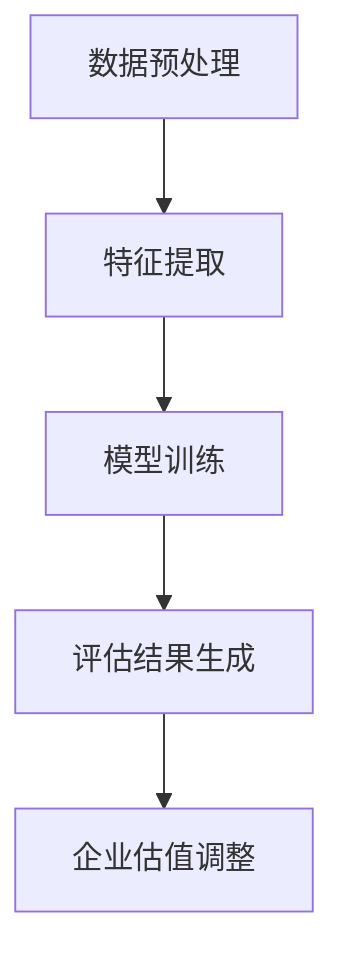
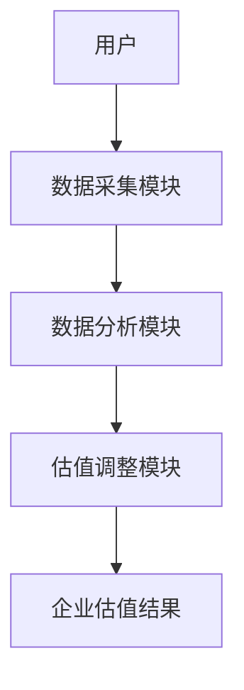

                 


# 《企业估值中的AI驱动的个性化健康管理平台评估》

> 关键词：企业估值，AI驱动，个性化健康管理，平台评估，健康数据分析，风险管理，企业价值

> 摘要：本文探讨了在企业估值中如何利用AI驱动的个性化健康管理平台进行评估。通过分析健康数据与企业价值的关系，提出了基于AI的健康评估模型，为企业提供个性化健康管理建议，并展示了如何通过AI技术提升企业估值的准确性与效率。文章从背景、核心概念、算法原理、系统架构到实际应用，全面阐述了AI在企业健康管理与估值中的重要作用。

---

# 第一部分: 企业估值与个性化健康管理平台背景与概述

## 第1章: 企业估值的基本概念与AI驱动的健康管理平台

### 1.1 企业估值的定义与重要性
企业估值是通过对企业资产、负债、收益等多方面进行分析，评估企业市场价值的过程。传统估值方法依赖财务指标和市场数据，但在数据复杂性增加和个性化需求提升的背景下，传统方法逐渐显露出局限性。

### 1.2 AI驱动的个性化健康管理平台的定义与特点
AI驱动的个性化健康管理平台是一种基于人工智能技术，通过收集、分析用户的健康数据，为企业提供个性化健康评估、风险预警和管理建议的平台。其特点包括：
- 数据驱动：利用用户健康数据进行个性化分析。
- AI支持：通过机器学习算法优化健康评估和建议。
- 个性化服务：针对不同用户需求提供定制化健康管理方案。

### 1.3 本章小结
本章介绍了企业估值的基本概念以及AI驱动的个性化健康管理平台的定义和特点，为后续分析奠定了基础。

---

# 第二部分: 核心概念与联系

## 第2章: AI驱动个性化健康管理平台的核心要素

### 2.1 健康管理平台的核心要素
- **用户健康数据**：包括生理指标（如心率、血压）、生活习惯（如运动量、饮食）等。
- **健康评估模型**：基于机器学习算法，对用户健康状况进行评估。
- **个性化建议**：根据评估结果，提供健康改善建议。

### 2.2 企业估值的关键指标与关联性
- **企业估值指标**：如市盈率、市净率、EBITDA等。
- **健康数据与企业估值的关联**：员工健康状况直接影响企业生产力和运营成本，进而影响企业价值。

### 2.3 核心概念的对比分析
通过对比分析，可以看出AI驱动的健康管理平台在企业估值中的优势：数据处理能力强、个性化建议精准、实时监控能力突出。

---

## 第3章: 核心概念的ER实体关系图

### 3.1 实体关系图的构建
- **用户实体**：包含用户ID、基本信息、健康数据等。
- **健康数据实体**：包含测量时间、数据类型、数值等。
- **健康评估模型**：基于健康数据，生成评估结果。
- **企业估值指标**：根据评估结果，调整企业估值。

### 3.2 实体关系图的详细说明
- 用户与健康数据的关系：用户拥有健康数据。
- 健康数据与健康评估模型的关系：健康数据输入模型，生成评估结果。
- 评估结果与企业估值的关系：评估结果影响企业估值指标。

---

# 第三部分: 算法原理讲解

## 第4章: AI驱动个性化健康管理平台的算法原理

### 4.1 健康评估模型的构建
- **数据预处理**：清洗和标准化健康数据。
- **特征提取**：提取关键健康特征。
- **模型训练**：使用深度学习模型（如LSTM）进行训练。

### 4.2 算法流程图


### 4.3 数学模型与公式
- 损失函数：$$L = \frac{1}{n}\sum_{i=1}^{n}(y_i - \hat{y}_i)^2$$
- 优化算法：使用Adam优化器，$$\theta_{t+1} = \theta_t - \eta \frac{\partial L}{\partial \theta_t}$$

---

## 第5章: 算法实现与代码示例

### 5.1 环境安装
```bash
pip install numpy pandas scikit-learn
```

### 5.2 核心代码实现
```python
import numpy as np
from sklearn.metrics import mean_squared_error

# 示例数据
X_train = np.array([...])
y_train = np.array([...])

# 模型训练
model = ...
model.fit(X_train, y_train)

# 模型预测
y_pred = model.predict(X_test)
print(mean_squared_error(y_test, y_pred))
```

### 5.3 代码解读与分析
- 数据预处理：清洗和标准化输入数据。
- 模型训练：使用机器学习算法训练健康评估模型。
- 模型评估：通过均方误差评估模型性能。

---

# 第四部分: 系统分析与架构设计

## 第6章: 问题场景与系统功能设计

### 6.1 问题场景介绍
- 用户输入健康数据，平台生成健康评估报告。
- 根据评估结果，调整企业估值指标。

### 6.2 系统功能设计
- 数据采集：收集用户健康数据。
- 数据分析：处理和分析健康数据。
- 估值调整：根据评估结果调整企业估值。

---

## 第7章: 系统架构设计

### 7.1 系统架构图


### 7.2 系统接口设计
- 用户接口：接收健康数据输入。
- 数据接口：与第三方健康设备连接。
- 估值接口：输出调整后的企业估值。

---

# 第五部分: 项目实战

## 第8章: 个性化健康管理平台的项目实战

### 8.1 环境安装与数据准备
```bash
pip install numpy pandas scikit-learn
```

### 8.2 核心代码实现
```python
import pandas as pd
from sklearn.model_selection import train_test_split
from sklearn.linear_model import LinearRegression

# 数据加载
data = pd.read_csv('health_data.csv')

# 数据分割
X_train, X_test, y_train, y_test = train_test_split(data[['age', 'weight', 'activity']], data['health_score'])

# 模型训练
model = LinearRegression()
model.fit(X_train, y_train)

# 模型预测
y_pred = model.predict(X_test)
print('R²:', model.score(X_test, y_test))
```

### 8.3 项目小结
通过实际案例，展示了如何利用AI技术进行健康数据分析和企业估值调整。

---

# 第六部分: 最佳实践与总结

## 第9章: 最佳实践与总结

### 9.1 关键点总结
- 数据质量：健康数据的准确性和完整性直接影响评估结果。
- 模型选择：根据数据特点选择合适的算法。
- 个性化建议：提供精准的健康管理方案。

### 9.2 注意事项
- 数据隐私保护：确保用户数据的安全性。
- 模型可解释性：便于用户理解评估结果。

### 9.3 拓展阅读
- 《机器学习实战》
- 《企业估值分析》

---

# 作者：AI天才研究院 & 禅与计算机程序设计艺术

