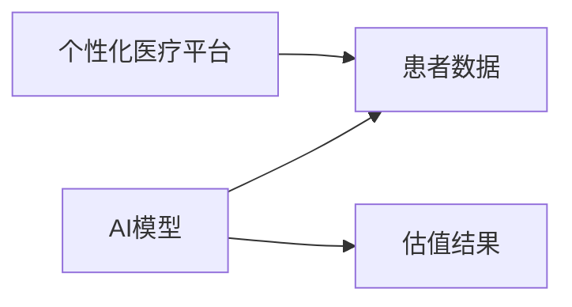
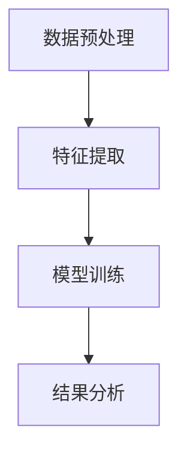
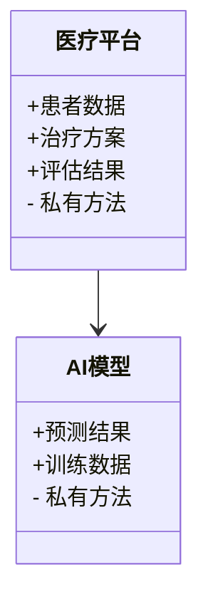
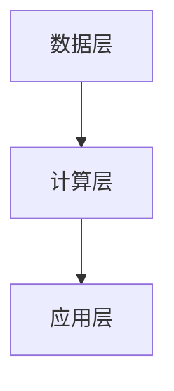

                 


# 企业估值中的AI驱动的个性化医疗平台评估

> **关键词**: 企业估值, AI驱动, 个性化医疗, 平台评估, 技术分析, 算法原理

> **摘要**: 在医疗领域，个性化医疗平台的估值需要结合AI技术进行精准评估。传统方法存在局限性，而AI驱动的方法通过机器学习模型和大数据分析，能够更准确地预测医疗平台的价值。本文将详细探讨AI在个性化医疗平台评估中的应用，从核心概念、算法原理、系统架构到项目实战，提供全面的技术分析和实践指导。

---

## 第一部分: 企业估值中的AI驱动个性化医疗平台评估背景

### 第1章: 问题背景与描述

#### 1.1 问题背景
个性化医疗平台的出现，使得医疗估值变得更加复杂。传统的企业估值方法依赖于财务指标和市场分析，但在个性化医疗领域，数据的多样性和动态性使得传统方法难以捕捉平台的真实价值。AI技术的引入，为个性化医疗平台的评估提供了新的可能性。

##### 1.1.1 传统企业估值方法的局限性
传统估值方法依赖于财务指标和市场分析，但在个性化医疗领域，数据的多样性和动态性使得传统方法难以捕捉平台的真实价值。

##### 1.1.2 个性化医疗平台的特殊性
个性化医疗平台涉及患者数据、治疗方案和医疗效果，这些数据具有高度个性化和动态变化的特点，传统估值方法难以准确评估。

##### 1.1.3 AI技术在医疗估值中的潜力
AI技术可以通过机器学习模型分析大量患者数据，提取关键特征，从而更准确地评估个性化医疗平台的价值。

#### 1.2 问题描述
个性化医疗平台的估值需要考虑患者数据的多样性和动态性，传统估值方法难以满足需求。AI驱动的估值方法通过机器学习模型和大数据分析，能够更准确地预测平台的价值。

##### 1.2.1 个性化医疗平台的核心特征
个性化医疗平台的核心特征包括数据的多样性、动态性和个性化治疗方案。

##### 1.2.2 传统估值方法的不足
传统估值方法在处理个性化数据时缺乏灵活性，难以捕捉平台的真实价值。

##### 1.2.3 AI驱动的个性化估值需求
AI技术能够通过机器学习模型分析大量数据，提取关键特征，从而更准确地评估个性化医疗平台的价值。

---

## 第二部分: 核心概念与联系

### 第2章: 核心概念与联系

#### 2.1 核心概念原理
AI驱动的个性化医疗平台评估涉及机器学习模型、数据特征和评估指标。

##### 2.1.1 AI驱动的医疗估值模型
AI驱动的医疗估值模型通过机器学习算法分析患者数据，预测平台的估值。

##### 2.1.2 个性化医疗平台的评估指标
评估指标包括患者满意度、治疗效果和平台收益。

##### 2.1.3 数据特征与模型选择
数据特征包括患者的基因信息、病史和治疗方案，模型选择取决于数据特征和评估目标。

#### 2.2 模型对比分析
不同AI模型的性能对比，包括随机森林和神经网络的优缺点。

##### 2.2.1 传统模型与AI模型的特征对比
传统模型依赖于财务指标，AI模型依赖于患者数据。

##### 2.2.2 不同AI模型的性能对比
随机森林适用于小数据集，神经网络适用于大数据集。

##### 2.2.3 模型选择的决策树
根据数据特征和评估目标选择合适的模型。

#### 2.3 实体关系图
个性化医疗平台、患者数据和AI模型的关系。



---

## 第三部分: 算法原理与数学模型

### 第3章: 算法原理

#### 3.1 算法流程
AI驱动的个性化医疗平台评估算法流程，包括数据预处理、特征提取、模型训练和结果分析。



##### 3.1.1 数据预处理
数据预处理包括数据清洗和特征工程，确保数据质量和一致性。

##### 3.1.2 特征提取
特征提取从患者数据中提取关键特征，如基因信息和病史。

##### 3.1.3 模型训练
模型训练使用机器学习算法，如随机森林和神经网络，训练模型。

##### 3.1.4 结果分析
结果分析包括模型评估和结果解释，确保模型的准确性和可解释性。

#### 3.2 算法实现
使用Python代码实现AI驱动的个性化医疗平台评估算法。

```python
import pandas as pd
from sklearn.ensemble import RandomForestRegressor

# 数据加载
data = pd.read_csv('medical_platform.csv')

# 特征工程
X = data.drop(columns=['value'])
y = data['value']

# 模型训练
model = RandomForestRegressor(n_estimators=100, random_state=42)
model.fit(X, y)

# 模型预测
predicted_values = model.predict(X)
```

---

### 第4章: 数学模型和公式

#### 4.1 多元回归分析
多元回归分析用于评估多个变量对平台价值的影响。

$$ y = \beta_0 + \beta_1x_1 + \beta_2x_2 + \ldots + \beta_nx_n + \epsilon $$

##### 4.1.1 公式解释
$\beta_i$表示各变量对平台价值的影响系数，$\epsilon$是误差项。

#### 4.2 神经网络模型
神经网络模型用于处理复杂的数据关系。

$$ y = f(Wx + b) $$

##### 4.2.1 公式解释
$W$是权重矩阵，$x$是输入向量，$b$是偏置项，$f$是激活函数。

---

## 第四部分: 系统分析与架构设计

### 第5章: 系统分析与架构设计

#### 5.1 问题场景介绍
个性化医疗平台的估值系统需要处理大量患者数据，提供准确的估值结果。

#### 5.2 系统功能设计
系统功能包括数据采集、模型训练和结果分析。

##### 5.2.1 领域模型
领域模型展示系统各模块之间的关系。



#### 5.3 系统架构设计
系统架构设计包括数据层、计算层和应用层。

##### 5.3.1 系统架构图
系统架构图展示各层之间的关系。



#### 5.4 系统接口设计
系统接口包括数据输入接口和结果输出接口。

#### 5.5 系统交互流程
系统交互流程包括数据输入、模型训练和结果输出。

```mermaid
sequenceDiagram
患者数据 --> 数据层
数据层 --> 计算层
计算层 --> AI模型
AI模型 --> 应用层
应用层 --> 患者数据
```

---

## 第五部分: 项目实战

### 第6章: 项目实战

#### 6.1 环境安装
安装Python和相关库，如scikit-learn和pandas。

#### 6.2 核心代码实现
实现AI驱动的个性化医疗平台评估算法。

```python
import pandas as pd
from sklearn.ensemble import RandomForestRegressor

# 数据加载
data = pd.read_csv('medical_platform.csv')

# 特征工程
X = data.drop(columns=['value'])
y = data['value']

# 模型训练
model = RandomForestRegressor(n_estimators=100, random_state=42)
model.fit(X, y)

# 模型预测
predicted_values = model.predict(X)
```

#### 6.3 案例分析
通过实际案例分析，展示算法的应用和效果。

#### 6.4 项目总结
总结项目的实现过程，指出成功的关键点和可能的改进方向。

---

## 第六部分: 最佳实践、小结与注意事项

### 第7章: 最佳实践、小结与注意事项

#### 7.1 最佳实践
数据质量的重要性，模型选择的策略。

#### 7.2 小结
总结文章的主要内容，强调AI驱动在个性化医疗平台评估中的重要性。

#### 7.3 注意事项
数据隐私的保护，模型的解释性。

#### 7.4 拓展阅读
推荐相关书籍和论文，帮助读者深入学习。

---

## 作者

作者：AI天才研究院/AI Genius Institute & 禅与计算机程序设计艺术 /Zen And The Art of Computer Programming

