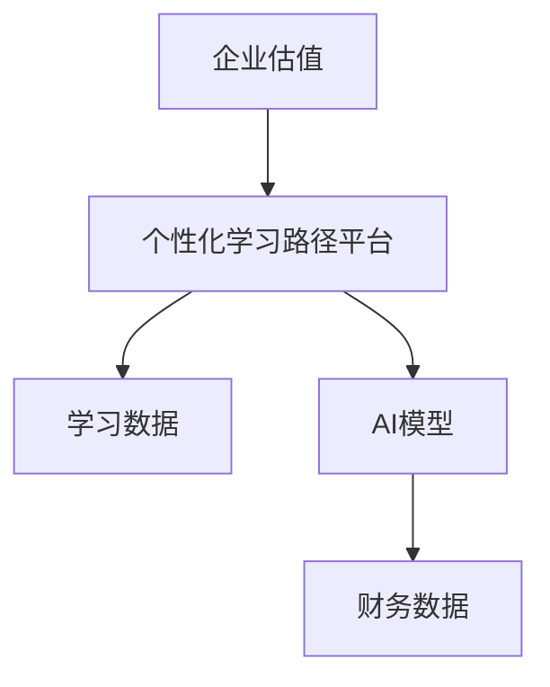

                 

# 企业估值中的AI驱动的个性化学习路径平台评估

## 关键词：企业估值，AI驱动，个性化学习路径，平台评估，技术博客

## 摘要：  
本文探讨了如何利用AI技术驱动个性化学习路径平台的企业估值评估。通过分析传统企业估值方法的局限性，提出了一种基于AI的个性化学习路径平台评估模型，详细阐述了其核心原理、算法实现、系统架构设计以及实际应用案例。本文旨在为企业估值提供一种更高效、更精准的方法，同时为个性化学习路径平台的优化和推广提供理论支持和技术指导。

---

# 第1章: 企业估值与个性化学习路径平台评估的背景介绍

## 1.1 问题背景

### 1.1.1 企业估值的传统方法与局限性
传统的企业估值方法主要包括DCF（Discounted Cash Flow）模型、市盈率法、市净率法等。这些方法依赖于财务数据和市场假设，但在实际应用中存在以下问题：
- 数据依赖性强，难以处理非结构化数据。
- 忽略了企业内部运营效率和员工能力的差异。
- 难以量化员工的学习能力和成长潜力对企业价值的影响。

### 1.1.2 个性化学习路径平台的兴起
个性化学习路径平台通过AI技术为用户提供定制化的学习方案，帮助员工提升技能，优化企业的人才培养和团队协作能力。这类平台的特点包括：
- 数据驱动：利用学习数据和用户行为分析，动态调整学习路径。
- 个性化：根据用户的学习能力和兴趣，提供差异化的内容推荐。
- 实时反馈：通过实时数据分析，优化学习效果。

### 1.1.3 AI驱动在企业估值中的潜力
AI技术可以通过分析学习路径平台的数据，量化员工的学习成果和能力提升，从而为企业的长期价值评估提供更全面的依据。例如：
- 通过学习数据预测员工的未来表现。
- 评估学习路径平台对员工生产力和创新能力的提升作用。
- 结合企业财务数据和学习数据，构建多维度的企业估值模型。

---

## 1.2 问题描述

### 1.2.1 传统企业估值模型的不足
传统模型主要依赖财务指标和市场假设，忽略了企业的软实力，例如员工的学习能力和创新能力。此外，传统模型难以处理非结构化数据，如文本、图像和行为数据。

### 1.2.2 个性化学习路径平台的复杂性
个性化学习路径平台涉及多维度的数据，包括用户行为数据、学习内容数据、绩效数据等。如何将这些数据整合到企业估值模型中，是一个复杂的系统性问题。

### 1.2.3 AI驱动评估的核心问题
AI驱动的评估需要解决以下问题：
- 如何收集和处理多源异构数据。
- 如何构建高效的AI模型，实现对个性化学习路径平台的实时评估。
- 如何将学习数据与企业财务数据相结合，构建跨维度的价值评估模型。

---

## 1.3 问题解决

### 1.3.1 AI驱动评估的基本思路
AI驱动的个性化学习路径平台评估的基本思路如下：
1. 收集学习数据：包括用户的学习行为、学习成果、学习偏好等。
2. 数据预处理：清洗、融合和特征提取。
3. 构建AI模型：利用机器学习或深度学习算法，构建评估模型。
4. 结果分析：结合企业财务数据，评估企业的整体价值。

### 1.3.2 个性化学习路径平台的评估维度
个性化学习路径平台的评估维度包括：
- 用户参与度：用户的学习频率、完成率等。
- 学习效果：用户技能提升的量化指标。
- 平台性能：系统的响应速度、稳定性等。
- 企业收益：学习平台对企业生产力和创新能力的提升作用。

### 1.3.3 企业估值与个性化学习路径的结合点
企业估值与个性化学习路径的结合点在于：
- 学习数据可以作为企业软实力的重要指标。
- 个性化学习路径平台可以帮助企业优化员工能力，从而提升企业价值。
- AI技术可以将学习数据与财务数据相结合，构建更全面的企业估值模型。

---

## 1.4 边界与外延

### 1.4.1 企业估值的边界条件
- 数据来源：仅依赖于学习数据和部分财务数据。
- 适用范围：适用于具有个性化学习路径平台的企业。
- 时间范围：仅考虑短期内的学习效果对企业价值的影响。

### 1.4.2 个性化学习路径平台的适用范围
- 适用于需要员工技能提升的企业。
- 适用于个性化学习需求较高的行业，如教育、科技、金融等。
- 适用于具备一定数字化基础的企业。

### 1.4.3 AI驱动评估的局限性与扩展方向
- 局限性：AI模型的准确性依赖于数据质量和数量。
- 扩展方向：结合更多维度的数据，如市场趋势、政策变化等，构建更全面的估值模型。

---

## 1.5 概念结构与核心要素

### 1.5.1 核心概念的层次结构
- 顶层概念：企业估值。
- 中层概念：个性化学习路径平台、AI驱动评估。
- 底层概念：学习数据、AI模型、财务数据。

### 1.5.2 核心要素的特征分析
- 学习数据：多源、异构、动态变化。
- AI模型：数据驱动、可解释性要求高。
- 财务数据：结构化、稳定性强。

### 1.5.3 概念结构图

---

## 1.6 本章小结

本章介绍了企业估值与个性化学习路径平台评估的背景，分析了传统估值方法的局限性，提出了AI驱动评估的核心思路，并界定了相关概念的层次结构和核心要素。这些内容为后续章节的算法实现和系统设计奠定了基础。

---

接下来，我们将进入第二章，详细探讨AI驱动的个性化学习路径平台评估的核心概念与联系。

