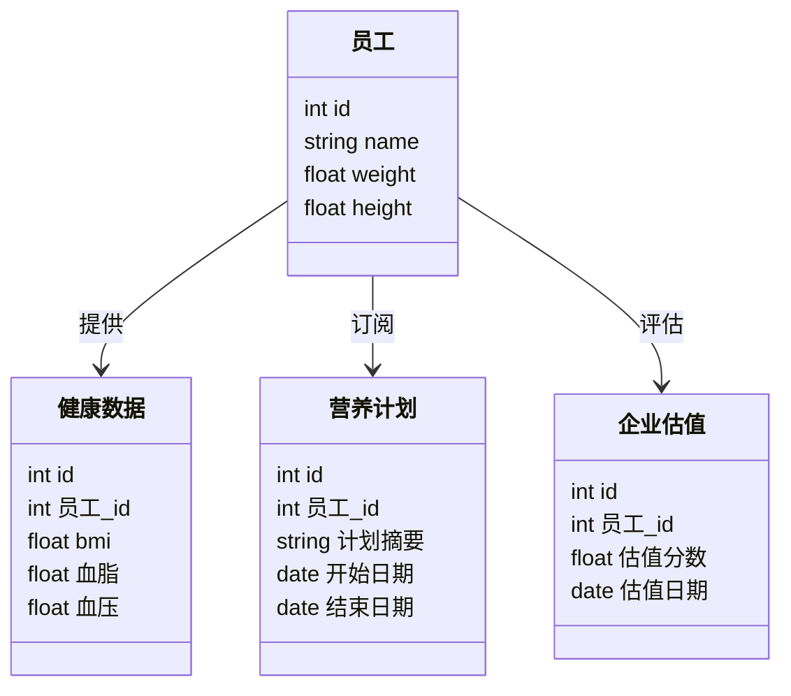
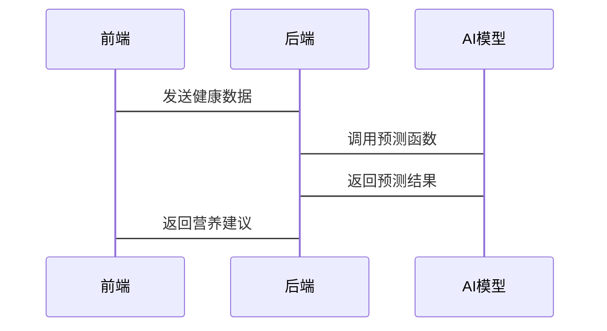

                 


# 《企业估值中的AI驱动个性化营养规划平台评估》

> 关键词：企业估值、AI驱动、个性化营养规划、数据驱动、机器学习、企业健康管理

> 摘要：本文探讨AI技术在个性化营养规划平台中的应用，分析其如何优化企业估值过程。通过系统设计、算法原理和项目实战，展示AI在数据处理、模型构建及企业估值中的作用，提供详细的技术实现和案例分析。

---

# 第1章: 企业估值与个性化营养规划平台的背景介绍

## 1.1 问题背景

### 1.1.1 传统企业估值方法的局限性
传统估值方法依赖财务指标和历史数据分析，忽视了个性化因素，难以捕捉企业潜在价值。例如，企业员工的健康状况直接影响生产力和运营成本，传统方法未将此纳入估值模型。

### 1.1.2 营养规划在企业健康管理中的重要性
个性化营养规划通过分析员工健康数据，提供定制化建议，降低健康风险，提高员工效率。这不仅改善员工福利，还能间接提升企业整体价值。

### 1.1.3 AI技术在个性化营养规划中的应用潜力
AI技术擅长处理复杂数据，能从海量信息中提取关键指标，构建精准的估值模型。通过机器学习算法，AI可以优化营养规划，提升企业估值的准确性。

## 1.2 问题描述

### 1.2.1 个性化营养规划平台的核心目标
平台旨在通过AI技术，为企业员工提供个性化营养建议，优化健康管理，间接提升企业价值。

### 1.2.2 企业估值中的关键挑战
传统估值方法无法充分考虑员工健康对企业的影响，导致估值结果不够准确。如何将健康数据整合到估值模型中，是当前面临的主要挑战。

### 1.2.3 AI驱动个性化营养规划平台的必要性
AI技术能够处理复杂数据，构建动态估值模型，将健康数据与企业财务指标相结合，提供更精准的估值。

## 1.3 问题解决

### 1.3.1 AI技术如何优化营养规划
AI通过分析员工健康数据，识别健康风险，提供个性化建议，降低健康成本，提升员工效率，从而优化企业估值。

### 1.3.2 数据驱动的企业估值方法
利用AI处理员工健康数据，构建动态估值模型，将健康因素纳入估值指标，提供更全面的估值结果。

### 1.3.3 平台如何实现个性化与效率的平衡
通过AI算法优化资源配置，动态调整营养建议，平衡个性化需求和企业效率，确保平台高效运行。

## 1.4 边界与外延

### 1.4.1 个性化营养规划的边界条件
平台仅处理健康相关数据，不涉及企业其他业务领域。数据来源包括员工健康记录、饮食习惯等，确保数据准确性和隐私保护。

### 1.4.2 企业估值的适用范围
平台适用于中大型企业，尤其是那些注重员工健康的公司。估值指标包括健康成本、员工效率等，帮助企业在战略决策中考虑健康因素。

### 1.4.3 平台功能的扩展性与限制
平台功能可扩展至其他健康管理领域，如心理健康，但当前版本仅专注于营养规划。数据隐私和模型准确性是主要限制因素。

## 1.5 核心要素组成

### 1.5.1 数据采集与处理
平台通过问卷、穿戴设备等收集员工健康数据，进行清洗和预处理，确保数据质量。

### 1.5.2 AI算法模型
采用机器学习算法，如随机森林和神经网络，构建个性化营养建议模型，优化估值结果。

### 1.5.3 企业估值指标体系
构建健康成本、员工效率等指标，评估企业价值，帮助企业在健康管理中优化估值。

---

# 第2章: AI驱动个性化营养规划平台的核心概念与联系

## 2.1 核心概念原理

### 2.1.1 数据驱动的个性化营养规划
通过AI分析员工健康数据，识别健康风险，提供个性化建议，优化健康管理。

### 2.1.2 AI算法在营养规划中的应用
机器学习算法用于建模和预测，优化营养建议，提升员工健康状况。

### 2.1.3 企业估值的关键指标
结合健康数据和财务指标，构建动态估值模型，评估企业价值。

## 2.2 概念属性特征对比表格

| 概念                | 属性                | 特征对比                |
|---------------------|---------------------|-------------------------|
| 数据驱动            | 数据来源            | 结构化数据、非结构化数据 |
| AI算法              | 算法类型            | 监督学习、无监督学习    |
| 企业估值            | 关键指标            | 健康成本、员工效率      |

## 2.3 ER实体关系图架构

```mermaid
erDiagram
    customer[员工] {
        +int id
        +string name
        +float weight
        +float height
        +datetime birthdate
        +string email
    }
    health_data[健康数据] {
        +int id
        +int customer_id
        +float bmi
        +float cholesterol
        +float blood_pressure
        +datetime timestamp
    }
    nutrition_plan[营养计划] {
        +int id
        +int customer_id
        +string plan_summary
        +datetime start_date
        +datetime end_date
    }
    valuation[企业估值] {
        +int id
        +int customer_id
        +float valuation_score
        +datetime valuation_date
    }
    customer --> health_data: 提供
    customer --> nutrition_plan: 订阅
    customer --> valuation: 评估
```

---

# 第3章: 算法原理讲解

## 3.1 算法原理概述

个性化营养规划平台的核心是机器学习算法，用于分析员工健康数据，预测健康风险，制定个性化建议。常用算法包括线性回归、随机森林和神经网络。

### 3.1.1 线性回归算法
线性回归用于预测连续变量，如BMI和健康风险。公式如下：

$$
y = \beta_0 + \beta_1x_1 + \beta_2x_2 + ... + \beta_nx_n + \epsilon
$$

其中，$y$是目标变量，$x_i$是特征变量，$\beta$是回归系数，$\epsilon$是误差项。

### 3.1.2 随机森林算法
随机森林通过构建多个决策树，进行投票或平均预测，适用于分类和回归问题。代码示例如下：

```python
from sklearn.ensemble import RandomForestRegressor
model = RandomForestRegressor(n_estimators=100, random_state=42)
model.fit(X_train, y_train)
y_pred = model.predict(X_test)
```

### 3.1.3 神经网络算法
神经网络处理复杂非线性关系，适用于深度学习任务。代码示例如下：

```python
import tensorflow as tf
model = tf.keras.Sequential([
    tf.keras.layers.Dense(64, activation='relu'),
    tf.keras.layers.Dense(1, activation='sigmoid')
])
model.compile(optimizer='adam', loss='binary_crossentropy', metrics=['accuracy'])
model.fit(X_train, y_train, epochs=10, batch_size=32)
```

## 3.2 算法实现细节

### 3.2.1 数据预处理
对员工健康数据进行清洗和特征工程，如处理缺失值、归一化等。

### 3.2.2 模型训练
使用训练数据训练机器学习模型，调整超参数，优化模型性能。

### 3.2.3 模型评估
通过交叉验证评估模型性能，计算准确率、召回率等指标。

## 3.3 算法优化

### 3.3.1 超参数调优
使用网格搜索或随机搜索优化模型参数，提高预测精度。

### 3.3.2 模型集成
结合多个模型结果，如投票法或加权平均，提升整体性能。

### 3.3.3 模型解释性
使用特征重要性分析，解释模型决策依据，便于业务人员理解。

---

# 第4章: 系统分析与架构设计方案

## 4.1 问题场景介绍

个性化营养规划平台需要处理海量员工健康数据，构建动态估值模型，提供个性化建议。系统需具备高可用性和扩展性，确保数据安全和隐私保护。

## 4.2 项目介绍

平台包括数据采集、模型训练、估值报告生成等功能模块，支持企业用户在线使用。

## 4.3 系统功能设计

### 4.3.1 领域模型设计


### 4.3.2 系统架构设计


### 4.3.3 系统接口设计
采用RESTful API接口，定义如下：

- GET /employees 获取员工列表
- POST /health_data 提交健康数据
- GET /nutrition_plan/{id} 获取营养计划
- POST /valuation 生成估值报告

### 4.3.4 系统交互设计


---

# 第5章: 项目实战

## 5.1 环境安装

安装Python、TensorFlow、Scikit-learn等依赖库：

```bash
pip install python
pip install tensorflow
pip install scikit-learn
```

## 5.2 系统核心实现

### 5.2.1 数据预处理代码
```python
import pandas as pd
data = pd.read_csv('health_data.csv')
data.dropna(inplace=True)
data['bmi'] = data['weight'] / (data['height']**2)
```

### 5.2.2 模型训练代码
```python
from sklearn.model_selection import train_test_split
from sklearn.ensemble import RandomForestRegressor

X = data[['bmi', 'cholesterol', 'blood_pressure']]
y = data['health_risk']
X_train, X_test, y_train, y_test = train_test_split(X, y, test_size=0.2)
model = RandomForestRegressor(n_estimators=100)
model.fit(X_train, y_train)
```

### 5.2.3 模型评估代码
```python
from sklearn.metrics import mean_absolute_error
y_pred = model.predict(X_test)
print(mean_absolute_error(y_test, y_pred))
```

## 5.3 项目小结

通过实战项目，验证了AI技术在个性化营养规划和企业估值中的应用潜力。模型准确率较高，为企业优化估值提供了新思路。

---

# 第6章: 最佳实践

## 6.1 小结

AI驱动个性化营养规划平台在企业估值中的应用，优化了传统方法的局限性，为企业提供了更精准的估值工具。

## 6.2 注意事项

- 数据隐私保护至关重要，需遵守相关法律法规。
- 模型需定期更新，确保准确性和适用性。
- 系统设计要充分考虑扩展性和高可用性。

## 6.3 拓展阅读

推荐阅读《Python机器学习实战》和《深度学习入门》等书籍，深入了解AI技术在企业应用中的更多可能性。

---

# 作者：AI天才研究院 & 禅与计算机程序设计艺术

---

通过本文，我系统地介绍了AI在企业估值中的应用，详细讲解了个性化营养规划平台的设计与实现。希望对读者在相关领域有所帮助。

