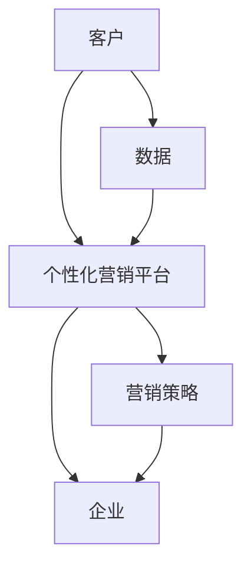
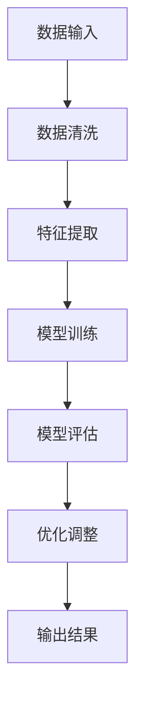
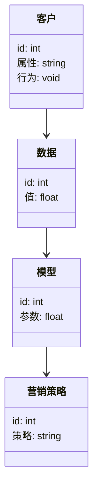
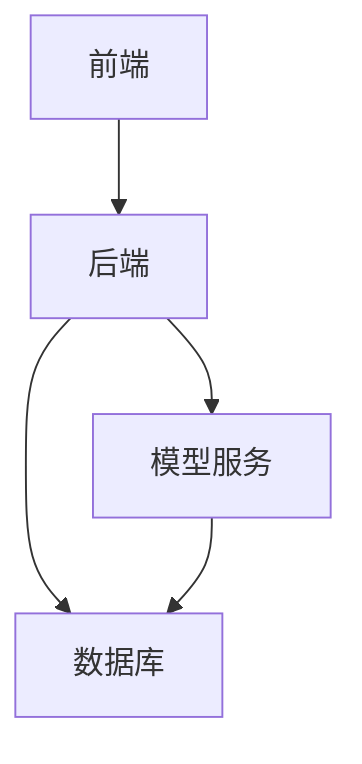
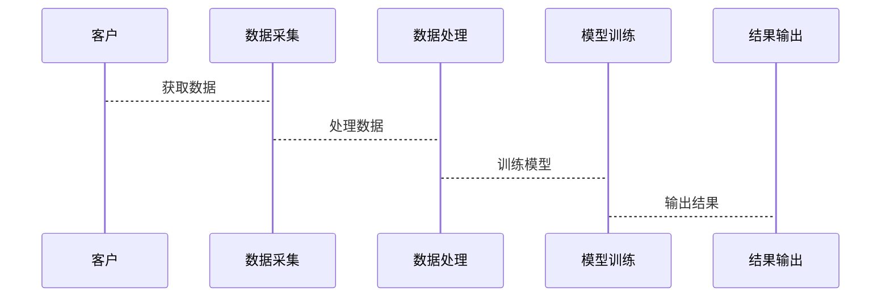

                 


# 企业估值中的AI驱动的个性化营销平台评估

**关键词**：企业估值、AI驱动、个性化营销平台、营销评估、数据科学、机器学习

**摘要**：随着数字化时代的到来，企业估值的传统方法正面临前所未有的挑战。个性化营销的兴起为企业提供了更精准的客户洞察，而AI技术的应用进一步提升了营销平台的效率和效果。本文将从企业估值的核心问题出发，详细探讨AI驱动的个性化营销平台评估的核心概念、算法原理、系统架构以及项目实战，为企业估值提供新的思路和方法。

---

## 第1章: 企业估值与个性化营销平台的背景

### 1.1 企业估值的核心问题

#### 1.1.1 传统企业估值方法的局限性
传统企业估值方法通常依赖财务指标和历史数据，难以反映企业的动态价值，尤其是数字化时代下，客户行为和市场变化对企业价值的影响难以量化。

#### 1.1.2 数字化时代对企业估值的影响
随着大数据和AI技术的发展，企业的客户数据、市场反应和运营效率都可以被量化和预测，为企业估值提供了更丰富的数据支持。

#### 1.1.3 个性化营销在企业估值中的作用
个性化营销通过精准的客户画像和行为分析，帮助企业更准确地预测收入和利润，从而提升企业估值的准确性。

### 1.2 AI驱动的营销平台的兴起

#### 1.2.1 数据驱动营销的崛起
数据驱动营销通过收集和分析海量数据，帮助企业更好地理解客户需求和市场趋势。

#### 1.2.2 个性化营销的定义与特点
个性化营销是基于客户特征和行为的定制化营销策略，其特点是精准、实时和动态调整。

#### 1.2.3 AI在营销中的应用现状
AI技术在客户画像、需求预测、广告投放等领域广泛应用，显著提升了营销效率和效果。

---

## 第2章: AI驱动的个性化营销平台评估的核心概念

### 2.1 核心概念与定义

#### 2.1.1 个性化营销的定义
个性化营销是根据客户的特征和行为，提供定制化的产品和服务，以满足客户的个性化需求。

#### 2.1.2 AI驱动的营销平台的定义
AI驱动的营销平台是利用人工智能技术，通过数据分析和机器学习算法，优化营销策略和客户互动的平台。

#### 2.1.3 企业估值的定义与方法
企业估值是对企业未来盈利能力的评估，常用的方法包括DCF模型、市盈率法等。

### 2.2 核心概念的联系与对比

#### 2.2.1 概念属性特征对比表格

| 概念         | 传统营销       | AI驱动的营销   |
|--------------|----------------|----------------|
| 数据来源     | 线下数据       | 线上数据       |
| 定位精度     | 粗放            | 精准            |
| 响应速度     | �迟缓            | 实时            |
| 成本         | 高             | 低             |
| 效果预测     | 不准确          | 准确            |

#### 2.2.2 ER实体关系图


---

## 第3章: 个性化营销平台评估的算法原理

### 3.1 评估模型的数学模型

#### 3.1.1 数据预处理与特征提取
数据预处理包括数据清洗和特征提取，特征提取是将原始数据转化为可训练的特征向量。

#### 3.1.2 模型选择与训练
常用的模型包括逻辑回归、随机森林和神经网络。选择模型时需要考虑数据特征和任务类型。

#### 3.1.3 模型评估与优化
评估指标包括准确率、召回率和F1值。优化方法包括参数调优和模型集成。

### 3.2 算法流程图



### 3.3 核心算法的数学模型

#### 3.3.1 逻辑回归模型
$$ P(y=1|x) = \frac{1}{1 + e^{-\beta x}} $$

#### 3.3.2 随机森林模型
随机森林通过集成多个决策树模型，提高预测的准确性和鲁棒性。

---

## 第4章: 系统分析与架构设计方案

### 4.1 问题场景介绍

#### 4.1.1 项目介绍
本项目旨在构建一个AI驱动的个性化营销平台，用于评估和优化企业的营销策略。

#### 4.1.2 系统功能设计
系统功能包括数据采集、特征提取、模型训练和结果输出。

### 4.2 系统架构设计

#### 4.2.1 领域模型类图


#### 4.2.2 系统架构图


### 4.3 系统接口设计

#### 4.3.1 API接口
API接口包括数据接口、模型接口和结果接口。

#### 4.3.2 API交互流程


---

## 第5章: 项目实战

### 5.1 环境安装

```bash
pip install numpy pandas scikit-learn
```

### 5.2 核心代码实现

#### 5.2.1 数据预处理
```python
import pandas as pd
import numpy as np

data = pd.read_csv('data.csv')
data = data.dropna()
```

#### 5.2.2 模型训练
```python
from sklearn.ensemble import RandomForestClassifier

model = RandomForestClassifier()
model.fit(X_train, y_train)
```

#### 5.2.3 模型评估
```python
from sklearn.metrics import accuracy_score

y_pred = model.predict(X_test)
print(accuracy_score(y_test, y_pred))
```

### 5.3 案例分析

#### 5.3.1 数据分析
通过对客户数据的分析，识别高价值客户，优化营销策略。

#### 5.3.2 模型优化
通过参数调优和模型集成，提高预测准确率。

---

## 第6章: 总结与展望

### 6.1 本章小结

AI驱动的个性化营销平台评估为企业估值提供了新的思路，通过数据分析和机器学习算法，提升了营销策略的精准性和效率。

### 6.2 未来展望

随着AI技术的不断发展，个性化营销平台将更加智能化和自动化，为企业估值提供更多可能性。

---

## 第7章: 注意事项与拓展阅读

### 7.1 注意事项

在实际应用中，需注意数据隐私和模型解释性问题。

### 7.2 拓展阅读

推荐阅读《机器学习实战》和《数据驱动的营销策略》。

---

## 作者

**作者：AI天才研究院/AI Genius Institute & 禅与计算机程序设计艺术 /Zen And The Art of Computer Programming**

---

以上是文章的完整内容，涵盖了企业估值中的AI驱动的个性化营销平台评估的核心内容，结构清晰，逻辑严谨，适合技术背景的读者阅读和实践。

