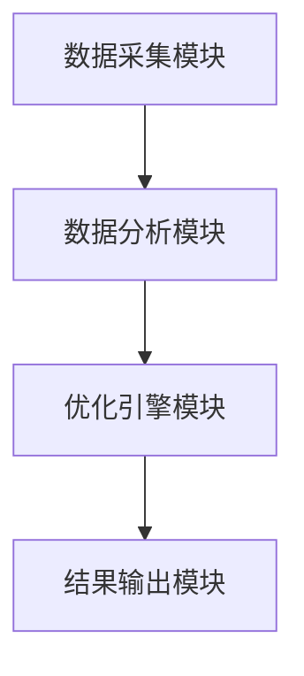

                 


# 企业估值中的AI驱动的供应链优化平台评估

> 关键词：企业估值, AI驱动, 供应链优化, 平台评估, 算法优化, 效益指标, 可扩展性

> 摘要：本文探讨了在企业估值过程中，如何利用AI驱动的供应链优化平台进行评估。通过分析供应链优化的核心概念、AI算法的应用、系统架构设计以及实际案例，本文详细阐述了如何通过技术手段提升企业供应链效率和价值。文章从理论到实践，为企业提供了一套系统化的评估方法和实现方案。

---

## 第一部分: 企业估值中的供应链优化平台背景介绍

### 第1章: 供应链优化的现状与挑战

#### 1.1 供应链优化的背景
- **1.1.1 供应链优化的核心概念**  
  供应链优化是指通过技术手段优化企业从供应商到消费者的整个链条，包括采购、生产、库存管理和物流等环节。其目标是提高效率、降低成本、增强灵活性和响应速度。

- **1.1.2 传统供应链优化的局限性**  
  传统供应链优化依赖人工分析和经验判断，存在效率低、决策滞后、覆盖范围有限等问题。随着企业规模的扩大和市场竞争的加剧，传统方法难以应对复杂多变的供应链挑战。

- **1.1.3 AI驱动供应链优化的必要性**  
  AI技术的应用使得供应链优化更加智能化和自动化。通过大数据分析和机器学习算法，企业能够实时响应市场需求，优化资源配置，提升整体竞争力。

#### 1.2 AI驱动的供应链优化平台定义
- **1.2.1 平台的核心功能**  
  AI驱动的供应链优化平台通过整合企业内外部数据，利用AI算法进行预测、优化和决策支持，帮助企业在供应链各环节实现高效管理。

- **1.2.2 平台的边界与外延**  
  供应链优化平台的边界包括企业的供应链上下游合作伙伴，外延则涵盖数据分析、算法优化和系统集成等多个方面。

- **1.2.3 平台的核心要素组成**  
  核心要素包括数据采集模块、算法引擎、优化模型和可视化界面。这些要素共同构成了一个完整的供应链优化平台。

#### 1.3 供应链优化平台的应用场景
- **1.3.1 需求预测**  
  利用历史销售数据和市场趋势，预测未来的需求，优化库存管理和生产计划。

- **1.3.2 库存管理**  
  通过实时监控库存水平，预测潜在的缺货或过剩情况，优化库存周转率。

- **1.3.3 供应商选择与优化**  
  利用AI算法评估供应商的交付能力、成本和可靠性，优化供应商组合。

- **1.3.4 运输路径优化**  
  基于实时交通数据和物流成本，优化货物运输路径，降低物流成本。

#### 1.4 供应链优化平台的评估指标
- **1.4.1 效益指标**  
  包括成本节约、效率提升和利润增加等。

- **1.4.2 效率指标**  
  包括处理速度、响应时间和系统稳定性等。

- **1.4.3 可扩展性指标**  
  包括平台的可扩展性和适应性。

- **1.4.4 可靠性指标**  
  包括系统故障率、数据准确性和服务可用性等。

#### 1.5 供应链优化平台的实施步骤
- **1.5.1 实施前的准备工作**  
  包括数据收集、业务流程梳理和人员培训。

- **1.5.2 实施过程**  
  包括数据分析与建模、算法选择与优化以及平台开发与部署。

- **1.5.3 实施后的评估与优化**  
  包括评估结果分析、持续优化策略和平台维护与升级。

---

## 第二部分: AI驱动的供应链优化平台核心概念与联系

### 第2章: 数据建模与特征工程

#### 2.1 数据建模的核心原理
- **2.1.1 数据预处理**  
  包括数据清洗、标准化和特征提取等步骤。

- **2.1.2 特征工程**  
  通过选择和构造特征，提高模型的预测能力和准确性。

#### 2.2 算法优化与数学模型
- **2.2.1 算法选择**  
  包括遗传算法、模拟退火和随机森林等。

- **2.2.2 数学模型**  
  通过线性规划和非线性规划模型优化供应链各环节。

### 第3章: 算法原理与实现

#### 3.1 算法原理
- **3.1.1 遗传算法**  
  通过模拟自然选择过程，优化供应链中的路径和资源分配。

- **3.1.2 模拟退火算法**  
  通过逐步降温的方式，找到最优解。

#### 3.2 数学模型与公式
- **3.2.1 线性规划模型**  
  $$ \text{目标函数：} \min \sum c_i x_i $$
  $$ \text{约束条件：} \sum a_i x_i \leq b $$

- **3.2.2 非线性规划模型**  
  $$ \text{目标函数：} \min \sum f_i(x_i) $$

### 第4章: 系统架构设计

#### 4.1 问题场景介绍
- **4.1.1 供应链优化问题**  
  包括需求预测、库存管理和物流优化。

#### 4.2 系统功能设计
- **4.2.1 数据采集模块**  
  负责收集供应链各环节的数据。

- **4.2.2 数据分析模块**  
  进行数据清洗、特征提取和建模。

- **4.2.3 优化引擎模块**  
  实现算法优化和结果输出。

#### 4.3 系统架构图


---

## 第三部分: 项目实战与案例分析

### 第5章: 项目实战

#### 5.1 环境安装
- **5.1.1 安装Python和相关库**  
  使用Anaconda安装Python和pandas、numpy、scikit-learn等库。

#### 5.2 核心代码实现
- **5.2.1 数据预处理代码**  
  ```python
  import pandas as pd
  data = pd.read_csv('supply_chain_data.csv')
  data.dropna(inplace=True)
  ```

- **5.2.2 算法实现代码**  
  ```python
  def genetic_algorithm(data):
      # 初始化种群
      population = initialize_population(data)
      # 迭代优化
      for _ in range(iterations):
          population = evolve_population(population, data)
      return best_solution(population)
  ```

#### 5.3 案例分析
- **5.3.1 案例背景**  
  某制造企业希望通过AI优化其供应链，减少库存成本和物流时间。

- **5.3.2 案例实施过程**  
  包括数据采集、建模、算法优化和结果分析。

#### 5.4 项目总结
- **5.4.1 实施效果**  
  包括成本节约、效率提升和客户满意度的提高。

- **5.4.2 经验与教训**  
  包括实施过程中遇到的挑战和解决方案。

---

## 第四部分: 总结与展望

### 第6章: 总结与展望

#### 6.1 总结
- **6.1.1 核心内容回顾**  
  包括供应链优化的核心概念、AI算法的应用和系统架构设计。

- **6.1.2 实践价值**  
  AI驱动的供应链优化平台能够显著提升企业的竞争力和估值。

#### 6.2 展望
- **6.2.1 未来趋势**  
  包括更智能的算法、更广泛的应用场景和更高效的系统架构。

- **6.2.2 挑战与机遇**  
  包括数据隐私、算法复杂性和技术标准化等挑战，以及技术创新带来的机遇。

---

## 作者：AI天才研究院 & 禅与计算机程序设计艺术

---

通过以上结构，文章详细介绍了企业估值中的AI驱动供应链优化平台的背景、核心概念、算法原理和项目实战，为企业提供了系统化的评估方法和实现方案。

