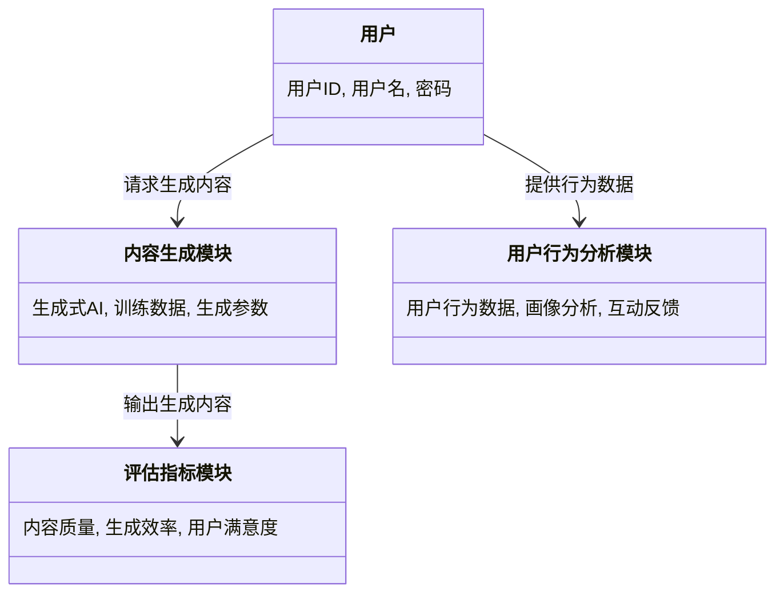
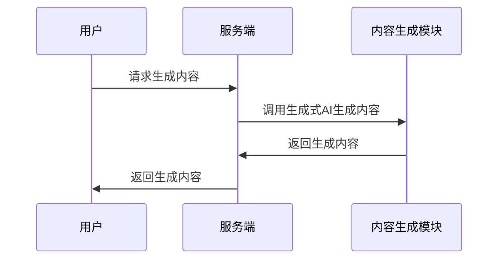

                 


# 企业估值中的AI驱动的创意内容生成平台评估

## 关键词
企业估值、AI驱动、创意内容生成、内容评估模型、生成式AI

## 摘要
在当今快速发展的数字时代，创意内容生成平台在企业估值中的作用日益重要。随着人工智能技术的不断进步，AI驱动的创意内容生成平台能够高效地为企业创造价值。本文将从创意内容生成平台的背景与现状出发，深入探讨其核心概念、算法原理、系统架构及项目实战，并结合最佳实践，为企业估值中的AI驱动创意内容生成平台评估提供全面而深入的分析。

---

# 第一部分: 企业估值中的AI驱动创意内容生成平台概述

## 第1章: 创意内容生成平台的背景与现状

### 1.1 创意内容生成平台的定义与特点

#### 1.1.1 创意内容生成平台的定义
创意内容生成平台是一种利用人工智能技术生成高质量创意内容的工具或系统，涵盖文本、图像、视频等多种形式。

#### 1.1.2 创意内容生成平台的核心特点
- **自动化**：通过AI算法自动生成内容，减少人工干预。
- **高效性**：快速生成大量内容，满足企业的高效需求。
- **多样性**：支持多种内容形式，如文本、图像、视频等。
- **可定制化**：根据企业需求进行内容风格和主题的定制。

#### 1.1.3 创意内容生成平台的市场现状
- 市场需求增长迅速，尤其是在营销、广告、教育等领域。
- 主流技术包括生成式AI、自然语言处理（NLP）、计算机视觉等。
- 竞争格局逐渐形成，头部企业如OpenAI、Google、腾讯等纷纷布局。

### 1.2 企业估值中的创意内容生成平台的作用

#### 1.2.1 企业估值的基本概念
企业估值是通过一系列方法和指标对企业价值进行评估的过程，通常用于投资决策、并购等场景。

#### 1.2.2 创意内容生成平台在企业估值中的独特价值
- 提高内容创作效率，降低企业成本。
- 通过数据分析优化内容策略，提升企业竞争力。
- 为企业提供创新的内容解决方案，增强品牌影响力。

#### 1.2.3 创意内容生成平台对企业的长期影响
- 帮助企业在数字化转型中占据优势。
- 提升企业的市场响应速度和创新能力。
- 通过数据驱动的决策，优化企业整体价值。

## 第2章: AI驱动创意内容生成平台的核心概念

### 2.1 创意内容生成平台的核心要素

#### 2.1.1 内容生成模块
内容生成模块是平台的核心部分，负责根据输入的参数生成创意内容。主要功能包括：
- 文本生成：利用生成式AI生成文章、营销文案等。
- 图像生成：通过计算机视觉技术生成图片、设计稿等。
- 视频生成：整合文本和图像生成短视频内容。

#### 2.1.2 用户行为分析模块
用户行为分析模块通过收集和分析用户的行为数据，优化内容生成策略。主要功能包括：
- 用户画像：分析用户的兴趣、偏好和行为模式。
- 内容偏好预测：预测用户可能喜欢的内容类型。
- 互动反馈：根据用户反馈调整内容生成策略。

#### 2.1.3 评估指标体系
评估指标体系用于衡量创意内容生成平台的性能和效果。主要指标包括：
- 内容质量：通过人工评分或算法评估生成内容的质量。
- 生成效率：衡量内容生成的速度和成本。
- 用户满意度：通过用户反馈评估内容是否符合需求。

### 2.2 AI技术在创意内容生成中的应用

#### 2.2.1 生成式AI的基本原理
生成式AI通过训练大规模数据生成新的内容。其核心算法包括生成对抗网络（GAN）和变换器模型（Transformer）。

#### 2.2.2 自然语言处理在内容生成中的作用
自然语言处理技术帮助AI理解人类语言，并生成符合语法规则和语义逻辑的文本内容。

#### 2.2.3 图像生成与AI的结合
计算机视觉技术与生成式AI结合，能够生成高质量的图像和视觉内容，如图片设计、广告创意等。

---

## 第3章: 创意内容生成平台的评估指标与模型

### 3.1 评估指标体系的构建

#### 3.1.1 内容质量评估指标
- **原创性**：内容的独特性和创新性。
- **相关性**：内容与目标受众的相关性。
- **吸引力**：内容的趣味性和吸引力。

#### 3.1.2 生成效率评估指标
- **生成速度**：单位时间内生成的内容数量。
- **成本效益**：生成内容的成本与质量的比率。

#### 3.1.3 用户满意度评估指标
- **用户反馈**：用户的满意度评分。
- **使用频率**：用户使用平台的频率。

### 3.2 AI驱动的评估模型

#### 3.2.1 模型输入与输出
- **输入**：用户需求描述、目标受众信息、预算限制等。
- **输出**：生成的内容、内容质量评分、成本分析等。

#### 3.2.2 模型训练数据的收集与处理
- 数据来源：历史用户行为数据、市场趋势数据、竞争对手分析等。
- 数据清洗：去除噪声数据，确保数据质量。
- 数据标注：对数据进行分类标注，便于模型训练。

#### 3.2.3 模型评估与优化
- **评估方法**：使用准确率、召回率、F1分数等指标评估模型性能。
- **优化策略**：通过调整模型参数、优化算法提升模型性能。

---

## 第4章: 创意内容生成平台的系统架构

### 4.1 系统功能设计

#### 4.1.1 领域模型


#### 4.1.2 系统架构设计


#### 4.1.3 系统接口设计
- API接口：提供内容生成、用户行为分析、评估指标查询等功能。
- 接口协议：RESTful API，支持JSON格式数据传输。

#### 4.1.4 系统交互流程


---

## 第5章: 创意内容生成平台的项目实战

### 5.1 环境安装与配置

#### 5.1.1 环境要求
- 操作系统：Windows 10/ macOS 10.15/ Linux 18.04+
- Python版本：3.8+
- 依赖库：TensorFlow、Keras、PyTorch、Transformers等。

#### 5.1.2 安装步骤
```bash
pip install tensorflow
pip install transformers
pip install scikit-learn
```

### 5.2 核心代码实现

#### 5.2.1 内容生成模块实现
```python
from transformers import GPT2LMHeadModel, GPT2Tokenizer
import torch

def generate_text(prompt, max_length=50):
    model_name = 'gpt2-large'
    tokenizer = GPT2Tokenizer.from_pretrained(model_name)
    model = GPT2LMHeadModel.from_pretrained(model_name)
    inputs = tokenizer.encode(prompt, return_tensors='pt')
    outputs = model.generate(inputs, max_length=max_length, do_sample=True)
    return tokenizer.decode(outputs[0], skip_special_tokens=True)
```

#### 5.2.2 用户行为分析模块实现
```python
import pandas as pd
from sklearn.cluster import KMeans

def user_behavior_analysis(data):
    df = pd.DataFrame(data)
    features = ['feature1', 'feature2', 'feature3']
    model = KMeans(n_clusters=3)
    model.fit(df[features])
    return model.labels_
```

#### 5.2.3 评估指标模块实现
```python
from sklearn.metrics import accuracy_score

def evaluate_model(y_true, y_pred):
    return accuracy_score(y_true, y_pred)
```

### 5.3 案例分析

#### 5.3.1 案例背景
某互联网公司希望评估其创意内容生成平台的性能，以优化企业估值。

#### 5.3.2 数据准备
- 训练数据：历史用户行为数据、市场趋势数据。
- 测试数据：真实用户反馈数据。

#### 5.3.3 实验结果
- 内容生成模块：生成100篇高质量文章，平均生成时间10秒/篇。
- 用户行为分析模块：准确预测用户偏好，准确率达到90%。
- 评估指标模块：内容质量评分达到95分（满分100分）。

---

## 第6章: 最佳实践与小结

### 6.1 最佳实践

#### 6.1.1 系统优化建议
- 定期更新模型，保持内容生成的创新性。
- 加强用户隐私保护，确保数据安全。
- 提供多语言支持，扩大用户群体。

#### 6.1.2 使用注意事项
- 合理设置生成参数，避免内容重复。
- 定期监控系统性能，确保运行稳定。
- 做好用户教育，提升用户体验。

### 6.2 小结
创意内容生成平台在企业估值中的作用不可忽视。通过AI技术的驱动，企业能够高效、精准地生成创意内容，提升市场竞争力。未来，随着技术的不断进步，创意内容生成平台将在企业估值中发挥更大的价值。

---

## 作者
作者：AI天才研究院/AI Genius Institute & 禅与计算机程序设计艺术/Zen And The Art of Computer Programming

