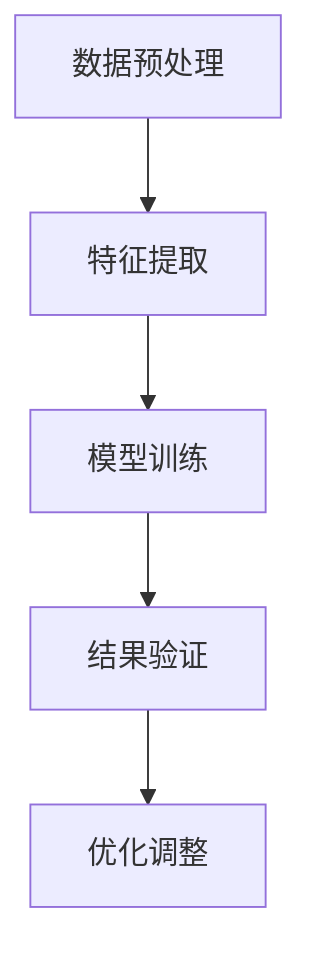
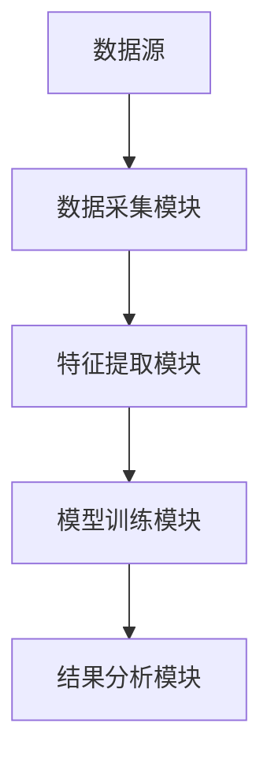

                 

# 企业估值中的AI驱动的网络安全平台评估

> **关键词**：企业估值，人工智能，网络安全，平台评估，算法原理  
> **摘要**：随着企业对网络安全的需求日益增加，AI驱动的网络安全平台评估成为提升企业估值的重要手段。本文通过分析AI在网络安全中的应用，详细阐述了AI驱动的网络安全平台评估的核心概念、算法原理和系统架构设计，为企业估值提供了新的视角和方法。

---

## 第1章：网络安全与企业估值的概述

### 1.1 网络安全的重要性

#### 1.1.1 网络安全的基本概念
网络安全是指保护计算机系统、网络和数据免受未经授权的访问、破坏或泄露。随着企业数字化转型的推进，网络安全已成为企业运营和发展的基石。

#### 1.1.2 网络安全对企业的影响
- **保护企业资产**：防止数据泄露和财务损失。
- **维护企业声誉**：确保客户信任和品牌价值。
- **合规性要求**：遵守相关法律法规，避免罚款和法律纠纷。

#### 1.1.3 企业估值的基本概念
企业估值是通过财务指标、市场表现和风险评估等多方面因素，对企业价值进行评估的过程。网络安全是影响企业估值的重要因素之一。

---

### 1.2 AI在网络安全中的应用

#### 1.2.1 AI技术的基本原理
人工智能通过模拟人类学习和推理能力，利用大数据分析、机器学习和深度学习等技术，实现对网络安全威胁的自动识别和预测。

#### 1.2.2 AI在网络安全中的优势
- **高效性**：AI能够快速处理大量数据，识别潜在威胁。
- **准确性**：通过机器学习模型，提高威胁检测的精准度。
- **适应性**：AI能够不断学习新的威胁模式，提升防护能力。

#### 1.2.3 AI驱动的网络安全平台的特点
- **智能化**：利用AI算法进行实时监控和威胁预测。
- **自动化**：自动识别和响应安全事件。
- **可扩展性**：适用于不同规模的企业。

---

### 1.3 企业估值与网络安全的关系

#### 1.3.1 企业估值的核心要素
- **财务表现**：收入、利润、现金流等。
- **市场地位**：市场份额、品牌影响力。
- **风险因素**：包括网络安全风险。

#### 1.3.2 网络安全对估值的影响
- **降低风险**：良好的网络安全措施能够降低企业的财务损失和声誉风险。
- **提升价值**：网络安全能力的提升能够增强投资者对企业的信心。

#### 1.3.3 网络安全平台评估的必要性
通过评估网络安全平台的能力，企业可以识别潜在的安全漏洞，优化安全策略，从而提升整体估值。

---

## 第2章：AI驱动的网络安全平台评估的核心概念

### 2.1 网络安全平台评估的基本原理

#### 2.1.1 数据采集与处理
- **数据来源**：包括网络流量日志、系统日志、用户行为数据等。
- **数据清洗**：去除噪声数据，确保数据质量。

#### 2.1.2 模型构建与训练
- **特征提取**：从原始数据中提取有用的特征，如IP地址、时间戳、用户行为模式等。
- **模型训练**：利用机器学习算法训练分类模型，识别正常和异常行为。

#### 2.1.3 结果分析与优化
- **结果验证**：通过测试数据验证模型的准确性和召回率。
- **优化调整**：根据验证结果优化模型参数，提升性能。

---

### 2.2 网络安全评估的核心要素

#### 2.2.1 数据特征的提取
- **网络流量特征**：如流量大小、频率、来源IP等。
- **用户行为特征**：如登录频率、访问模式、操作日志等。

#### 2.2.2 模型的可解释性
- **模型解释性**：确保模型的决策过程透明，便于分析和优化。
- **特征重要性分析**：识别影响网络安全的关键特征。

#### 2.2.3 评估结果的可视化
- **图表展示**：通过柱状图、折线图等展示评估结果。
- **仪表盘设计**：直观显示网络安全状态和风险等级。

---

### 2.3 AI驱动的网络安全平台评估的流程

#### 2.3.1 数据预处理
- **数据清洗**：处理缺失值、异常值。
- **特征工程**：提取特征并进行标准化处理。

#### 2.3.2 模型训练
- **选择算法**：根据数据特点选择合适的算法，如随机森林、XGBoost等。
- **训练模型**：利用训练数据训练模型，调整参数优化性能。

#### 2.3.3 结果验证与优化
- **交叉验证**：通过K折交叉验证评估模型的泛化能力。
- **调参优化**：使用网格搜索等方法优化模型参数。

---

## 第3章：AI驱动的网络安全平台评估的算法原理

### 3.1 常见的网络安全评估算法

#### 3.1.1 机器学习算法
- **逻辑回归**：用于分类问题，公式为：
  $$ P(y=1|x) = \frac{1}{1 + e^{-\beta x}} $$
- **随机森林**：通过集成学习提高模型准确性和鲁棒性。

#### 3.1.2 深度学习算法
- **神经网络**：利用多层感知机模型，公式为：
  $$ y = \sigma(wx + b) $$
  其中，σ表示激活函数，如ReLU或sigmoid。

#### 3.1.3 聚类算法
- **K-means**：用于将数据分为K个簇，适用于无监督学习场景。

---

### 3.2 算法的数学模型与公式

#### 3.2.1 逻辑回归模型
$$ P(y=1|x) = \frac{1}{1 + e^{-\beta x}} $$

#### 3.2.2 支持向量机模型
$$ \text{max} \left( \frac{1}{2} \|w\|^2 \right) $$

#### 3.2.3 神经网络模型
$$ y = \sigma(wx + b) $$

---

### 3.3 算法的优缺点对比

| 算法名称      | 优点               | 缺点               |
|---------------|--------------------|--------------------|
| 逻辑回归      | 简单高效，易于解释   | 易受异常值影响       |
| 支持向量机     | 高维数据表现优异     | 参数敏感           |
| 神经网络       | 高精度，非线性能力强 | 训练时间长，难解释   |

---

### 3.4 算法的流程图

---

## 第4章：网络安全平台评估的系统架构设计

### 4.1 系统功能模块

#### 4.1.1 数据采集模块
- 负责收集网络流量日志、系统日志和用户行为数据。

#### 4.1.2 特征提取模块
- 从原始数据中提取有用的特征，如IP地址、时间戳等。

#### 4.1.3 模型训练模块
- 利用机器学习算法训练模型，识别异常行为。

#### 4.1.4 结果分析模块
- 展示评估结果，提供可视化报告和优化建议。

---

### 4.2 系统架构图

---

## 作者信息

作者：AI天才研究院/AI Genius Institute & 禅与计算机程序设计艺术 /Zen And The Art of Computer Programming

---

**注意事项**：
1. **数据隐私**：在处理企业数据时，需遵守相关隐私保护法规。
2. **模型更新**：定期更新模型，适应新的网络安全威胁。
3. **团队协作**：建议组建跨学科团队，优化系统设计。

通过本文的系统介绍，读者可以全面了解AI在网络安全平台评估中的应用，为企业估值提供新的视角和方法。

