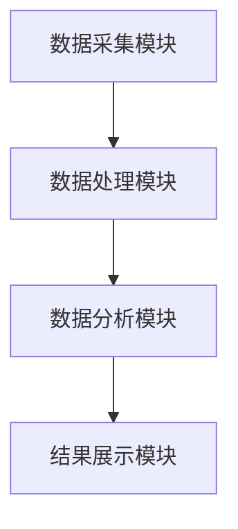

                 


# 企业估值中的AI驱动的自动化专利分析平台评估

> **关键词**: 企业估值, AI驱动, 专利分析, 自动化平台, 知识产权评估

> **摘要**: 本文深入探讨了AI驱动的自动化专利分析平台在企业估值中的应用，分析了专利分析的核心概念、AI技术的驱动作用、平台的系统架构设计以及实际案例的评估方法。通过详细的算法原理和系统设计，本文为读者提供了全面的技术解读，展示了如何利用AI技术提升专利分析的效率和准确性，从而帮助企业更好地进行知识产权评估和价值估算。

---

# 第1章: 企业估值与专利分析的背景介绍

## 1.1 企业估值的基本概念

### 1.1.1 企业估值的定义与方法

企业估值是指对企业的整体价值或部分价值进行评估的过程。常见的估值方法包括市场法、收益法和资产法。其中，收益法是基于企业未来现金流的折现值进行估值，而市场法则是基于可比企业的交易数据进行估值。专利作为企业的一项重要资产，其价值在收益法中占据重要地位。

### 1.1.2 专利在企业估值中的作用

专利是企业知识产权的重要组成部分，能够为企业带来竞争优势和经济价值。专利的价值体现在其市场应用潜力、技术领先性和法律保护力度等方面。在企业估值中，专利的价值评估直接影响企业的整体估值。

### 1.1.3 AI驱动的专利分析优势

传统的专利分析依赖人工检索和手动分析，效率低下且容易出错。AI驱动的专利分析利用自然语言处理（NLP）和机器学习技术，能够快速处理海量专利数据，提取关键信息，提高分析效率和准确性。

---

## 1.2 AI驱动的自动化专利分析平台的背景

### 1.2.1 传统专利分析的局限性

传统专利分析方法依赖人工操作，存在效率低、成本高、覆盖面窄等问题。此外，传统方法难以处理复杂的技术交叉领域，导致分析结果的片面性。

### 1.2.2 AI技术在专利分析中的应用

AI技术通过自然语言处理、文本挖掘和机器学习等方法，能够自动提取专利中的技术关键词、发明人信息和法律状态等数据，帮助分析师快速掌握专利的核心信息。

### 1.2.3 自动化专利分析平台的必要性

随着专利数据的快速增长，手动分析已难以应对。自动化专利分析平台能够高效处理海量数据，为企业提供实时、精准的专利分析结果，支持企业的战略决策。

---

# 第2章: 专利分析的核心概念与方法

## 2.1 专利的基本概念

### 2.1.1 专利的定义与分类

专利是保护发明创造的法律工具，分为发明专利、实用新型专利和外观设计专利。发明专利是最重要的一种，覆盖范围最广，技术含量最高。

### 2.1.2 专利权的保护范围

专利权的保护范围包括发明的技术方案、外观设计和实用新型。保护范围的确定需要结合专利的说明书和权利要求书。

### 2.1.3 专利分析的基本指标

专利分析的基本指标包括专利数量、专利申请时间、专利权人分布、技术领域分布和法律状态等。这些指标能够帮助企业评估专利的市场价值和技术影响力。

---

## 2.2 AI驱动的专利分析方法

### 2.2.1 文本挖掘在专利分析中的应用

文本挖掘技术能够从专利文档中提取关键词、主题和情感倾向。例如，通过TF-IDF算法提取专利文档中的重要关键词，帮助企业快速定位技术热点。

### 2.2.2 自然语言处理（NLP）在专利分析中的应用

NLP技术能够对专利文档进行分词、句法分析和语义理解。例如，使用BERT模型对专利摘要进行语义分析，提取技术领域的核心概念。

### 2.2.3 机器学习在专利分析中的应用

机器学习算法能够对专利数据进行分类、聚类和预测。例如，使用随机森林算法对专利的技术领域进行分类，帮助识别技术趋势。

---

# 第3章: AI驱动的自动化专利分析平台的评估指标

## 3.1 数据准确性评估

### 3.1.1 数据来源的可靠性

数据来源的可靠性直接影响分析结果的准确性。平台需要确保专利数据的完整性和准确性，避免数据缺失或错误。

### 3.1.2 数据处理的准确性

数据处理的准确性包括关键词提取、实体识别和信息抽取的正确性。例如，使用准确的分词算法能够提高关键词提取的准确率。

---

## 3.2 分析效率评估

### 3.2.1 处理速度的快慢

平台的处理速度直接影响用户体验。高效的平台能够在短时间内处理大量专利数据，满足企业的实时需求。

### 3.2.2 并行处理能力

平台的并行处理能力决定了其扩展性。能够同时处理多个专利申请的企业平台更具竞争力。

---

## 3.3 用户友好度评估

### 3.3.1 界面设计的直观性

直观的界面设计能够提高用户体验。友好的界面设计能够让用户快速上手，无需复杂的培训。

### 3.3.2 功能的易用性

平台的功能设计需要考虑用户的实际需求，避免功能过于复杂或冗余。

---

# 第4章: 专利分析平台的实体关系与流程架构

## 4.1 实体关系图

### 4.1.1 专利申请者与专利的关系

专利申请者是专利的持有者，可以通过专利号与专利建立关联。例如，申请者A持有专利12345，专利12345涉及技术领域A。

### 4.1.2 专利与技术领域的关系

专利与技术领域之间存在多对多的关系。例如，专利12345属于技术领域A，同时也可以属于技术领域B。

### 4.1.3 专利与法律状态的关系

专利与法律状态之间也存在多对多的关系。例如，专利12345的法律状态包括“有效”和“失效”。

---

## 4.2 流程架构

### 4.2.1 数据采集与预处理

数据采集包括从专利数据库中获取专利数据，预处理包括清洗、去重和标准化。

### 4.2.2 数据分析与挖掘

数据分析包括关键词提取、主题建模和情感分析。例如，使用LDA模型进行主题建模，提取专利文档的主题分布。

### 4.2.3 结果展示与报告生成

结果展示包括可视化图表和报告生成。例如，生成技术领域的分布图，帮助企业识别技术热点。

---

# 第5章: 专利分析的算法原理与实现

## 5.1 文本挖掘算法

### 5.1.1 TF-IDF算法

TF-IDF算法用于提取专利文档中的关键词。其公式为：

$$TF-IDF(t, d) = \frac{TF(t, d) \times \log(N + 1 - DF(t) + 1)}{N}$$

其中，$TF(t, d)$表示词$t$在文档$d$中的词频，$DF(t)$表示词$t$在所有文档中的文档频数，$N$表示文档总数。

### 5.1.2 LDA主题建模

LDA主题建模用于提取专利文档的主题分布。其公式为：

$$P(\text{主题}|\text{文档}) = \frac{P(\text{文档}|\text{主题}) \times P(\text{主题})}{P(\text{文档})}$$

---

## 5.2 机器学习算法

### 5.2.1 随机森林分类

随机森林分类用于对专利进行分类。其算法流程如下：

1. 从训练数据中随机选取样本，构建决策树。
2. 对每个决策树进行投票，得到最终分类结果。

---

# 第6章: 自动化专利分析平台的系统架构设计

## 6.1 功能模块设计

### 6.1.1 数据采集模块

数据采集模块负责从专利数据库中获取专利数据，包括专利号、申请日期和发明人等信息。

### 6.1.2 数据处理模块

数据处理模块负责对采集到的数据进行清洗、去重和标准化处理。

### 6.1.3 数据分析模块

数据分析模块包括文本挖掘、主题建模和情感分析功能。

### 6.1.4 结果展示模块

结果展示模块包括可视化图表和报告生成功能。

---

## 6.2 系统架构图



---

# 第7章: 项目实战与案例分析

## 7.1 环境安装

### 7.1.1 Python环境配置

安装Python和必要的库，如pandas、numpy和scikit-learn。

### 7.1.2 数据集获取

从专利数据库中获取专利数据，保存为CSV格式。

---

## 7.2 核心代码实现

### 7.2.1 数据预处理

```python
import pandas as pd
import numpy as np

# 读取数据
df = pd.read_csv('patents.csv')

# 清洗数据
df.dropna(inplace=True)
df.drop_duplicates(inplace=True)
```

### 7.2.2 主题建模

```python
from sklearn.decomposition import LatentDirichletAllocation

# 初始化模型
lda = LatentDirichletAllocation(n_components=5, random_state=42)

# 拟合模型
lda.fit(df.text)
```

---

## 7.3 案例分析

以一家科技企业为例，分析其专利分布和技术趋势。通过平台生成的可视化图表，帮助企业识别技术热点和竞争对手。

---

# 第8章: 最佳实践与总结

## 8.1 最佳实践

### 8.1.1 数据质量的重要性

数据质量直接影响分析结果的准确性。建议选择可靠的数据源，并进行充分的数据清洗。

### 8.1.2 模型调优的必要性

模型调优能够提高分析结果的准确性。建议使用交叉验证等方法进行参数优化。

### 8.1.3 持续学习的重要性

技术发展迅速，建议定期更新模型和数据，保持平台的竞争力。

---

## 8.2 小结

本文详细介绍了AI驱动的自动化专利分析平台在企业估值中的应用，从核心概念到系统架构，再到实际案例，全面解读了平台的评估方法和实现细节。通过本文的分析，读者能够深入了解如何利用AI技术提升专利分析的效率和准确性，为企业估值提供有力支持。

---

## 8.3 注意事项

在实际应用中，需要注意数据隐私和法律合规问题。平台应遵守相关法律法规，确保数据的安全性和合法性。

---

## 8.4 拓展阅读

建议读者进一步阅读以下内容：

- 《专利分析的数学模型与算法优化》
- 《AI驱动的知识图谱构建与应用》

---

**作者：AI天才研究院/AI Genius Institute & 禅与计算机程序设计艺术 /Zen And The Art of Computer Programming**

