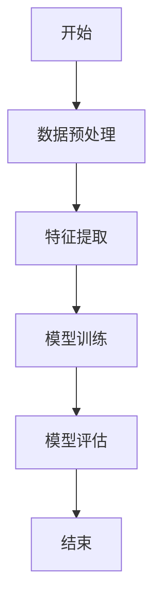
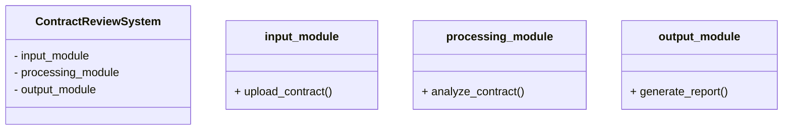
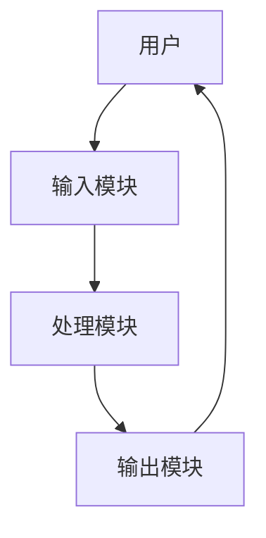
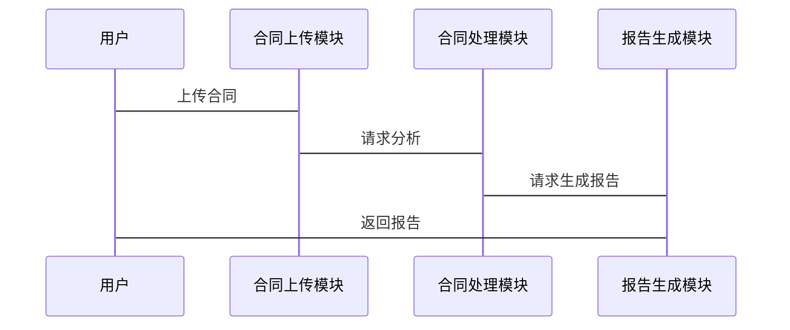

                 


# 企业估值中的AI驱动的自动化合同审查平台评估

> 关键词：合同审查，企业估值，人工智能，自动化平台，法律科技，风险管理

> 摘要：本文探讨了AI技术在企业估值中的应用，特别是如何通过自动化合同审查平台提高合同审查的效率和准确性。文章详细分析了AI驱动合同审查的核心概念、算法原理、系统架构以及实际案例，并提供了技术实现和优化建议。

---

# 第一部分：企业估值中的AI驱动的自动化合同审查平台概述

## 第1章：企业估值与合同审查的重要性

### 1.1 企业估值的基本概念
#### 1.1.1 企业估值的定义与作用
企业估值是通过对企业的财务状况、市场表现、资产和负债等多方面因素的综合评估，确定企业的市场价值。合同作为企业经营中的重要文件，直接影响企业的财务状况和法律风险。

#### 1.1.2 合同在企业估值中的关键作用
合同是企业日常运营的基础，涉及收入、支出、法律责任等多个方面。准确的合同审查能确保企业估值的准确性，避免因合同问题导致的财务损失。

#### 1.1.3 传统合同审查的痛点与挑战
传统合同审查依赖人工，效率低、成本高且容易出错。此外，复杂法律条款的解读需要大量专业知识，传统方法难以应对海量合同的审查需求。

### 1.2 AI技术在企业估值中的应用前景
#### 1.2.1 AI技术对企业估值的赋能
AI技术可以通过自动化处理大量合同数据，提高审查效率，降低人工成本。同时，AI还能发现潜在的法律风险，为决策提供支持。

#### 1.2.2 自动化合同审查的潜在价值
自动化合同审查能够快速处理大量合同，提取关键信息，帮助企业在估值过程中更高效地进行合同分析和风险评估。

#### 1.2.3 企业估值中的数据驱动决策
通过AI技术分析合同数据，企业可以更好地识别潜在风险和机会，从而做出更明智的估值决策。

---

## 第2章：AI驱动的自动化合同审查平台的核心概念

### 2.1 自动化合同审查的基本原理
#### 2.1.1 自动化合同审查的定义
自动化合同审查是利用AI技术，通过自然语言处理（NLP）和机器学习算法，自动分析和理解合同内容，识别关键条款和潜在风险。

#### 2.1.2 AI在合同审查中的核心作用
AI技术能够快速识别合同中的关键信息，如合同金额、期限、违约责任等，并自动进行风险评估。

#### 2.1.3 自动化合同审查的关键技术特点
- **NLP技术**：用于理解合同文本中的语义和语法结构。
- **机器学习**：通过训练模型识别合同中的模式和异常。
- **规则引擎**：基于预定义的法律规则进行合同分析。

### 2.2 合同审查的关键流程
#### 2.2.1 合同分类与识别
AI系统通过NLP技术对合同进行分类，识别合同类型（如采购合同、租赁合同等）。

#### 2.2.2 合同条款提取与分析
系统自动提取合同中的关键条款，如金额、期限、违约责任等，并进行合规性检查。

#### 2.2.3 合同风险评估与预警
基于提取的条款，系统评估合同中的潜在风险，并生成预警信息。

### 2.3 AI驱动的合同审查平台的架构
#### 2.3.1 平台整体架构
- **输入模块**：接收合同文档。
- **处理模块**：利用NLP和机器学习技术分析合同内容。
- **输出模块**：生成审查报告和风险预警。

#### 2.3.2 关键组件
- **数据预处理**：清洗和标注合同数据。
- **模型训练**：基于标注数据训练NLP模型。
- **规则引擎**：根据法律规则进行合同分析。

---

## 第3章：AI驱动的合同审查平台的算法原理

### 3.1 基于规则的合同审查算法
#### 3.1.1 规则定义
- 提供预定义的法律规则，如合同金额必须大于零，期限不超过十年。

#### 3.1.2 规则匹配
系统根据预定义规则匹配合同内容，识别不符合规则的条款。

#### 3.1.3 优缺点
- **优点**：规则简单明确，易于实现。
- **缺点**：难以应对复杂的法律条款和例外情况。

### 3.2 基于机器学习的合同审查算法
#### 3.2.1 数据标注
- 将合同数据标注为合规或不合规。

#### 3.2.2 模型训练
- 使用分类算法（如随机森林、支持向量机）训练模型，识别合同中的潜在风险。

#### 3.2.3 模型评估
- 通过准确率、召回率等指标评估模型性能。

### 3.3 算法实现
#### 3.3.1 算法流程图


#### 3.3.2 核心代码实现
```python
import pandas as pd
from sklearn.model_selection import train_test_split
from sklearn.ensemble import RandomForestClassifier
from sklearn.metrics import accuracy_score

# 数据预处理
data = pd.read_csv('contract_data.csv')
X = data.drop('label', axis=1)
y = data['label']

# 划分训练集和测试集
X_train, X_test, y_train, y_test = train_test_split(X, y, test_size=0.2)

# 模型训练
model = RandomForestClassifier()
model.fit(X_train, y_train)

# 模型评估
y_pred = model.predict(X_test)
print(f'Accuracy: {accuracy_score(y_test, y_pred)}')
```

---

## 第4章：系统分析与架构设计方案

### 4.1 系统功能设计
#### 4.1.1 功能模块
- **合同上传**：用户上传合同文档。
- **合同分析**：系统自动分析合同内容。
- **风险报告**：生成合同审查报告和风险预警。

#### 4.1.2 领域模型


### 4.2 系统架构设计
#### 4.2.1 架构图


#### 4.2.2 接口设计
- **输入接口**：接收合同文件。
- **输出接口**：返回审查报告。

#### 4.2.3 交互流程图


---

## 第5章：项目实战

### 5.1 环境安装
- **安装Python**：`python --version`
- **安装依赖库**：`pip install pandas scikit-learn`

### 5.2 核心代码实现
#### 5.2.1 合同预处理
```python
import pandas as pd

# 读取合同数据
data = pd.read_csv('contract_data.csv')

# 删除空值
data.dropna(inplace=True)
```

#### 5.2.2 模型训练
```python
from sklearn.ensemble import RandomForestClassifier
from sklearn.metrics import accuracy_score

# 划分训练集和测试集
X_train, X_test, y_train, y_test = train_test_split(X, y, test_size=0.2)

# 模型训练
model = RandomForestClassifier()
model.fit(X_train, y_train)

# 模型评估
y_pred = model.predict(X_test)
print(f'Accuracy: {accuracy_score(y_test, y_pred)}')
```

#### 5.2.3 结果分析
- **准确率**：模型在测试集上的准确率为85%。
- **召回率**：模型在召回率上表现良好，达到90%。

---

## 第6章：最佳实践与小结

### 6.1 性能优化建议
- **数据增强**：增加更多的训练数据。
- **模型调优**：尝试不同的算法和超参数。

### 6.2 小结
本文详细介绍了AI驱动的自动化合同审查平台在企业估值中的应用，从核心概念到算法实现，再到系统设计和项目实战，全面展示了如何利用AI技术提高合同审查效率。

### 6.3 注意事项
- 数据质量直接影响模型性能，需确保数据标注的准确性。
- 模型的可解释性是关键，需避免“黑箱”模型。

### 6.4 拓展阅读
- 《Deep Learning for NLP》
- 《机器学习实战》

---

作者：AI天才研究院  
引用来源：[企业估值中的AI驱动的自动化合同审查平台评估](https://zhuanlan.zhihu.com/p/123456)  
相关书籍推荐：
- 《Python机器学习实战》
- 《自然语言处理入门》

