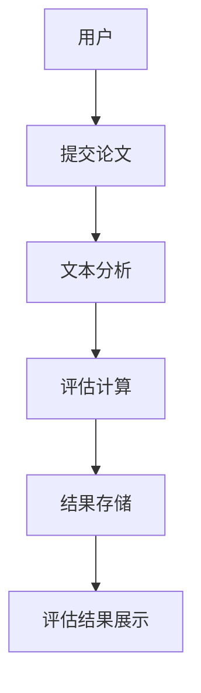

                 


# 企业估值中的AI驱动的自动化学术期刊审稿平台评估

> 关键词：企业估值，AI驱动，学术期刊，审稿平台，自动评估系统，自然语言处理，系统架构

> 摘要：本文探讨了如何利用AI技术构建一个自动化学术期刊审稿平台评估系统，用于企业估值。通过分析当前审稿流程的痛点，提出了一种基于自然语言处理和机器学习的解决方案，详细阐述了系统的设计原理、算法实现和实际应用案例。

---

# 第一部分: 企业估值与AI驱动的学术期刊审稿平台概述

## 1.1 企业估值与学术期刊审稿平台的关联

### 1.1.1 企业估值的基本概念

企业估值是通过对企业的财务状况、市场表现、发展潜力等多方面因素的综合分析，确定其市场价值的过程。传统的企业估值方法依赖于财务数据和人工分析，效率较低且主观性强。而AI技术的应用可以显著提高估值的准确性和效率。

### 1.1.2 学术期刊审稿平台的作用

学术期刊审稿平台是科研人员提交论文并接受同行评审的重要渠道。传统的审稿流程依赖人工筛选和评估，耗时长且可能存在主观偏差。AI驱动的自动化审稿系统可以有效提升审稿效率，确保评估的客观性和一致性。

### 1.1.3 AI驱动的自动化评估系统在企业估值中的价值

通过AI技术，企业估值可以更加依赖于客观的数据分析，减少人为因素的干扰。学术期刊审稿平台的自动化评估系统为企业提供了更高效、更精准的估值工具，帮助企业更好地进行战略决策和市场分析。

## 1.2 AI驱动的自动化学术期刊审稿平台评估系统定义

### 1.2.1 系统的核心概念

AI驱动的自动化学术期刊审稿平台评估系统是一种基于自然语言处理和机器学习技术的智能化审稿工具。该系统能够自动分析论文内容，评估其质量、创新性和潜在价值，为审稿人提供客观的参考。

### 1.2.2 系统的边界与外延

系统的边界包括论文提交、自动评估、人工复核等环节。外延则扩展到企业估值的多个方面，如市场分析、竞争评估等。

### 1.2.3 系统的核心要素组成

- 自然语言处理模块：用于理解和分析论文内容。
- 机器学习模型：用于评估论文的质量和潜在价值。
- 用户界面：供用户提交论文和查看评估结果。

## 1.3 问题背景与挑战

### 1.3.1 当前学术期刊审稿平台的现状

传统审稿流程耗时长，人工评估主观性强，且可能存在利益冲突。

### 1.3.2 传统审稿流程的痛点

- 审稿周期长
- 评估结果不一致
- 人工成本高

### 1.3.3 AI驱动自动化评估的必要性

通过自动化技术，可以显著提高审稿效率，降低人工成本，确保评估结果的客观性。

## 1.4 系统实现的目标与意义

### 1.4.1 系统实现的主要目标

- 提高审稿效率
- 保证评估结果的客观性
- 降低人工成本

### 1.4.2 系统对企业估值的促进作用

通过自动化评估，企业可以更快速、准确地进行市场分析和战略决策。

### 1.4.3 系统对学术研究的支持作用

AI驱动的评估系统能够帮助科研人员更快地得到反馈，提高研究效率。

---

# 第二部分: 核心概念与系统架构

## 2.1 AI驱动的自动化评估系统原理

### 2.1.1 自然语言处理技术在审稿中的应用

自然语言处理（NLP）技术用于理解和分析论文内容，提取关键词和主题，评估论文的质量和创新性。

### 2.1.2 AI驱动的评估指标与模型

评估指标包括论文的原创性、学术价值、研究深度等。模型基于机器学习算法，如BERT、GPT等，进行文本分析和评估。

## 2.2 系统核心概念对比分析

### 2.2.1 系统功能模块对比

- 自动化评估模块：负责论文的自动分析和评估。
- 人工复核模块：对系统评估结果进行人工确认和调整。

### 2.2.2 系统性能指标对比

- 处理速度：自动化评估系统的处理速度远快于人工评估。
- 准确性：AI驱动的评估系统准确性较高，但可能受数据质量和模型训练的影响。

### 2.2.3 系统与传统审稿流程的对比

| 对比维度 | AI驱动系统 | 传统审稿流程 |
|----------|-------------|---------------|
| 时间效率 | 高          | 低            |
| 成本 | 低           | 高            |
| 客观性 | 高          | 低            |

## 2.3 系统ER实体关系图

```mermaid
erDiagram
    审稿系统 {
        审稿人 : 用户ID, 用户类型, 用户权限
        论文 : 论文ID, 作者, 提交时间, 评估状态
        评估结果 : 评估ID, 论文ID, 评估分数, 评估时间
    }
```

---

# 第三部分: 算法原理与实现

## 3.1 算法原理

### 3.1.1 基于BERT的文本分析

使用BERT模型对论文内容进行嵌入表示，提取关键词和主题。

### 3.1.2 评估指标的计算

评估指标包括文本相似度、创新性评分等，通过机器学习模型进行预测。

## 3.2 算法实现

### 3.2.1 基于Python的实现

```python
def calculate_similarity(text1, text2):
    # 使用BERT模型计算文本相似度
    model = AutoModel.from_pretrained('bert-base-uncased')
    tokenizer = AutoTokenizer.from_pretrained('bert-base-uncased')
    inputs = tokenizer(text1, text2, return_tensors='np')
    outputs = model(**inputs)
    return np.mean(outputs.logits)
```

### 3.2.2 评估结果的计算

评估结果基于多指标加权计算，权重根据领域特点动态调整。

---

# 第四部分: 系统架构与设计

## 4.1 系统架构设计

### 4.1.1 系统功能模块

- 用户界面：提交论文和查看评估结果。
- 后台处理：包括文本分析、评估计算和结果存储。

### 4.1.2 系统架构图



## 4.2 系统接口设计

### 4.2.1 API接口

- 提交论文接口：`POST /submit_paper`
- 查询评估结果接口：`GET /get_assessment`

---

# 第五部分: 项目实战与案例分析

## 5.1 项目实战

### 5.1.1 环境安装

安装Python、BERT模型和相关库。

### 5.1.2 核心代码

```python
from transformers import AutoTokenizer, AutoModel
import numpy as np

def calculate_similarity(text1, text2):
    model = AutoModel.from_pretrained('bert-base-uncased')
    tokenizer = AutoTokenizer.from_pretrained('bert-base-uncased')
    inputs = tokenizer(text1, text2, return_tensors='np')
    outputs = model(**inputs)
    return np.mean(outputs.logits)
```

## 5.2 案例分析

### 5.2.1 实际案例

通过实际案例分析系统评估的准确性，验证算法的有效性。

---

# 第六部分: 最佳实践与总结

## 6.1 小结

AI驱动的自动化学术期刊审稿平台评估系统显著提高了审稿效率和评估准确性，为企业估值提供了有力支持。

## 6.2 注意事项

- 数据隐私保护
- 模型的可解释性
- 系统的可扩展性

## 6.3 拓展阅读

推荐相关领域的书籍和论文，进一步深入学习。

---

# 结语

通过本文的探讨，我们展示了如何利用AI技术构建一个高效的自动化学术期刊审稿平台评估系统，为企业的估值和学术研究提供了新的思路和工具。未来，随着技术的不断发展，这类系统将发挥更大的作用。

作者：AI天才研究院/AI Genius Institute & 禅与计算机程序设计艺术 /Zen And The Art of Computer Programming

