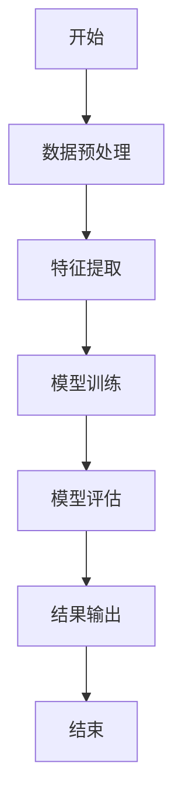
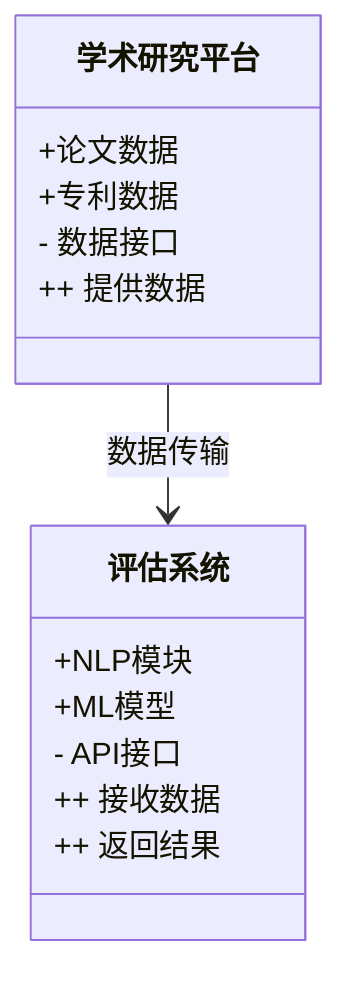

                 


# 《企业估值中的AI驱动的自动化学术研究平台评估》

---

## 关键词：
- 企业估值
- AI驱动
- 自动化学术研究平台
- 评估
- 机器学习
- 自然语言处理
- 技术博客

---

## 摘要：
本文深入探讨了在企业估值中，如何利用人工智能技术构建自动化学术研究平台评估系统。通过分析学术研究平台的关键特征，结合自然语言处理和机器学习算法，提出了一种高效的评估方法，并详细阐述了系统的架构设计与实现步骤。文章还通过实际案例展示了该方法的应用效果，并总结了最佳实践和未来发展方向。

---

## 第一部分：背景介绍

### 第1章：问题背景与描述

#### 1.1 问题背景
随着科技的进步，学术研究平台的价值在企业估值中的重要性日益凸显。传统的估值方法依赖于人工分析，效率低下且容易出错。为了提高评估的准确性和效率，AI技术的应用成为必然趋势。

#### 1.2 问题描述
学术研究平台的评估涉及大量非结构化数据，如论文、专利等。如何高效地提取和分析这些数据，构建准确的评估模型，是当前面临的主要挑战。

#### 1.3 问题解决方法
引入AI技术，利用自然语言处理（NLP）和机器学习（ML）算法，构建自动化的评估系统，实现数据的高效处理和价值挖掘。

#### 1.4 边界与外延
本文的评估范围限定在学术研究平台的价值评估，不涉及企业的其他资产。未来可以扩展至其他类型的资产评估。

---

## 第二部分：核心概念与联系

### 第2章：核心概念原理

#### 2.1 核心概念原理
学术研究平台评估的核心在于分析其产出的学术成果，包括论文的数量、质量、影响力等。AI技术通过自动化处理这些数据，提供客观的评估结果。

#### 2.2 核心概念对比
| 概念 | 定义 | 特征 |
|------|------|------|
| 学术研究平台 | 提供学术资源的在线平台 | 高质量论文、专利 |
| AI驱动评估 | 利用AI技术进行自动化评估 | 高效、准确 |

#### 2.3 概念结构与ER图
```mermaid
er
actor(用户) --> 学术研究平台: 使用平台
actor(用户) --> 评估系统: 提交评估请求
学术研究平台 --> 评估系统: 提供数据
评估系统 --> 用户: 返回评估结果
```

---

## 第三部分：算法原理讲解

### 第3章：算法原理

#### 3.1 自然语言处理
NLP用于提取论文的关键信息，如关键词、摘要等。使用TF-IDF算法计算关键词的重要性。

#### 3.2 机器学习模型
构建回归模型，预测平台的价值。使用训练数据训练模型，并在测试数据上验证其准确性。

#### 3.3 流程图


#### 3.4 代码实现
```python
from sklearn.feature_extraction.text import TfidfVectorizer
from sklearn.linear_model import LinearRegression

# 数据预处理
data = [...]  # 论文数据
labels = [...]  # 价值标签

# 特征提取
vectorizer = TfidfVectorizer()
features = vectorizer.fit_transform(data)

# 模型训练
model = LinearRegression()
model.fit(features.toarray(), labels)

# 模型评估
print(model.score(features.toarray(), labels))
```

#### 3.5 数学公式
回归模型的损失函数：
$$ L = \frac{1}{2m}\sum_{i=1}^{m}(y_i - \hat{y}_i)^2 $$

---

## 第四部分：系统分析与架构设计

### 第4章：系统架构

#### 4.1 应用场景
系统接收学术平台的数据，进行分析和评估，返回结果。

#### 4.2 系统功能
- 数据采集：从平台获取论文数据
- 数据处理：清洗和预处理
- 模型训练：训练评估模型
- 结果输出：返回评估结果

#### 4.3 领域模型


#### 4.4 系统架构
```mermaid
arch
client --> api-gateway: 请求评估
api-gateway --> web-server: 转发请求
web-server --> db: 查询数据
db --> web-server: 返回数据
web-server --> ml-model: 调用模型
ml-model --> web-server: 返回结果
web-server --> client: 返回评估结果
```

---

## 第五部分：项目实战

### 第5章：项目实现

#### 5.1 环境安装
安装必要的库：
```bash
pip install scikit-learn pandas numpy
```

#### 5.2 核心代码实现
```python
import pandas as pd
from sklearn.model_selection import train_test_split
from sklearn.linear_model import LinearRegression
from sklearn.metrics import mean_squared_error

# 数据加载
data = pd.read_csv('papers.csv')

# 数据分割
X_train, X_test, y_train, y_test = train_test_split(data['content'], data['value'], test_size=0.2)

# 特征提取
vectorizer = TfidfVectorizer()
X_train_vec = vectorizer.fit_transform(X_train)
X_test_vec = vectorizer.transform(X_test)

# 模型训练
model = LinearRegression()
model.fit(X_train_vec.toarray(), y_train)

# 模型评估
y_pred = model.predict(X_test_vec.toarray())
print(mean_squared_error(y_test, y_pred))
```

#### 5.3 案例分析
以实际案例为例，展示系统如何处理数据并返回评估结果。

---

## 第六部分：最佳实践

### 第6章：总结与展望

#### 6.1 总结
本文详细介绍了AI驱动的学术研究平台评估系统，从背景、算法到系统设计和实现，均进行了深入探讨。

#### 6.2 注意事项
- 数据质量对评估结果影响重大
- 模型需要定期更新以保持准确性
- 确保数据隐私和安全

#### 6.3 拓展阅读
建议进一步研究其他类型的资产评估，探索更复杂的模型，如深度学习。

---

## 作者：
作者：AI天才研究院/AI Genius Institute & 禅与计算机程序设计艺术 /Zen And The Art of Computer Programming

---

通过以上目录，您可以逐步完成整篇文章的撰写，确保每个部分都详细且逻辑清晰。

