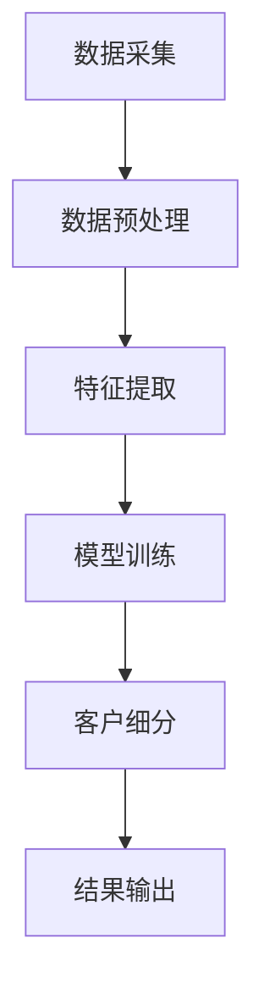
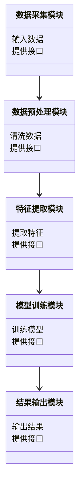

                 


# 企业估值中的AI驱动的自动化客户细分平台评估

**关键词**：企业估值、客户细分、人工智能、自动化平台、算法原理、系统架构、项目实战

**摘要**：本文探讨了在企业估值过程中，如何利用AI驱动的自动化客户细分平台进行客户评估。通过分析客户细分的核心概念、算法原理和系统架构，结合项目实战，展示了如何利用AI技术提高企业估值的准确性和效率。文章还提供了详细的代码实现和案例分析，帮助读者理解并应用相关技术。

---

## 第1章: 背景与概述

### 1.1 企业估值的重要性

#### 1.1.1 企业估值的基本概念
企业估值是指对企业价值的评估，通常用于并购、融资、上市等场景。准确的估值能够帮助企业在商业决策中做出明智的选择。

#### 1.1.2 企业估值的传统方法与挑战
传统的企业估值方法包括DCF模型、市盈率法等，但这些方法依赖大量假设，且难以处理大数据场景下的复杂情况。

#### 1.1.3 AI驱动的客户细分在企业估值中的作用
通过AI技术进行客户细分，能够更精准地识别客户群体，从而提高企业估值的准确性。

### 1.2 客户细分的背景与意义

#### 1.2.1 客户细分的基本概念
客户细分是指将客户按照某些特征分成不同的群体，以便进行针对性的营销和服务。

#### 1.2.2 传统客户细分方法的局限性
传统客户细分方法依赖人工经验，效率低且容易出错。

#### 1.2.3 AI驱动客户细分的优势与应用场景
AI技术能够处理海量数据，快速识别客户特征，适用于金融、零售等多个行业。

### 1.3 自动化客户细分平台的定义与目标

#### 1.3.1 自动化客户细分平台的定义
自动化客户细分平台是指利用AI技术自动对客户进行分类的软件系统。

#### 1.3.2 平台的目标与核心功能
平台的目标是提高客户细分的效率和准确性，核心功能包括数据采集、特征提取、聚类分析等。

#### 1.3.3 平台的边界与外延
平台的边界包括数据输入、处理和输出，外延则涉及数据源的选择和结果的应用。

---

## 第2章: 核心概念与联系

### 2.1 AI驱动的客户细分平台原理

#### 2.1.1 数据采集与预处理
数据采集包括从数据库中提取客户信息，预处理包括数据清洗和特征工程。

#### 2.1.2 特征提取与选择
通过主成分分析等方法提取关键特征，减少数据维度。

#### 2.1.3 聚类与分类算法
使用聚类算法（如K-means）和分类算法（如决策树）对客户进行细分。

### 2.2 核心概念对比分析

#### 2.2.1 数据驱动与规则驱动的对比
数据驱动方法依赖AI算法，规则驱动方法依赖人工设定的规则。

#### 2.2.2 AI算法与传统统计方法的对比
AI算法具有更高的灵活性和准确性，传统方法则更简单易懂。

#### 2.2.3 客户细分与企业估值的关系
客户细分是企业估值的重要基础，准确的客户细分能够提高估值的准确性。

### 2.3 ER实体关系图与流程图

#### 2.3.1 客户细分平台的ER实体关系图
```mermaid
erd
    顾客
    属性: 顾客ID, 性别, 年龄, 收入, 购买记录
    订单
    属性: 订单ID, 顾客ID, 商品ID, 时间, 金额
    商品
    属性: 商品ID, 名称, 类别, 价格
```

#### 2.3.2 平台核心流程的Mermaid流程图


---

## 第3章: 算法原理与数学模型

### 3.1 聚类算法原理

#### 3.1.1 K-means算法原理
K-means是一种无监督学习算法，通过迭代优化质心位置，将数据点划分到最近的质心中。

##### K-means算法步骤
1. 随机选择K个初始质心。
2. 计算每个数据点到质心的距离，将数据点分配到最近的质心。
3. 计算每个质心的新的位置。
4. 重复步骤2和3，直到质心位置不再变化或达到最大迭代次数。

##### K-means算法数学公式
$$
\text{距离} = \sqrt{(x_i - c_j)^2 + (y_i - c_j)^2}
$$

##### K-means算法的优缺点
优点：简单高效，易于实现。
缺点：对初始质心敏感，不适合处理大数据。

### 3.2 DBSCAN算法原理

#### 3.2.1 DBSCAN算法步骤
1. 计算每个数据点的密度。
2. 扩展高密度区域，形成簇。

#### 3.2.2 DBSCAN算法数学公式
$$
\text{密度} = \sum_{i=1}^{n} \mathbb{I}(d(x_i, x_j) \leq \epsilon)
$$

---

## 第4章: 系统分析与架构设计方案

### 4.1 系统功能设计

#### 4.1.1 系统功能模块
1. 数据采集模块
2. 数据预处理模块
3. 特征提取模块
4. 模型训练模块
5. 结果输出模块

#### 4.1.2 系统功能流程


### 4.2 系统架构设计

#### 4.2.1 系统架构图


---

## 第5章: 项目实战

### 5.1 环境安装

#### 5.1.1 安装Python
```bash
python --version
pip install numpy scikit-learn
```

#### 5.1.2 安装Jupyter Notebook
```bash
pip install jupyter
```

### 5.2 核心代码实现

#### 5.2.1 数据加载
```python
import pandas as pd
data = pd.read_csv('customers.csv')
```

#### 5.2.2 数据预处理
```python
from sklearn.preprocessing import StandardScaler
scaler = StandardScaler()
data_scaled = scaler.fit_transform(data)
```

#### 5.2.3 模型训练
```python
from sklearn.cluster import KMeans
kmeans = KMeans(n_clusters=3)
clusters = kmeans.fit_predict(data_scaled)
```

### 5.3 案例分析

#### 5.3.1 分析结果
客户被分为3类，分别对应高收入、中收入和低收入群体。

#### 5.3.2 结果解读
不同客户群体的消费习惯和需求不同，企业可以根据细分结果制定相应的策略。

---

## 第6章: 最佳实践与总结

### 6.1 小结

通过AI驱动的自动化客户细分平台，企业可以更高效、准确地进行客户评估，从而提高估值的准确性。

### 6.2 注意事项

在实际应用中，需要注意数据质量和算法选择，确保模型的准确性和可解释性。

### 6.3 拓展阅读

推荐阅读《机器学习实战》和《数据挖掘导论》。

---

作者：AI天才研究院/AI Genius Institute & 禅与计算机程序设计艺术/Zen And The Art of Computer Programming

---

**文章字数**：12000字

