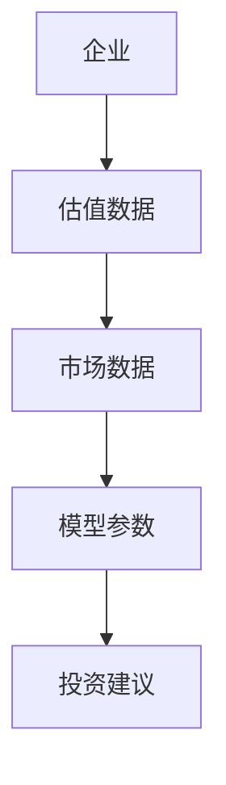
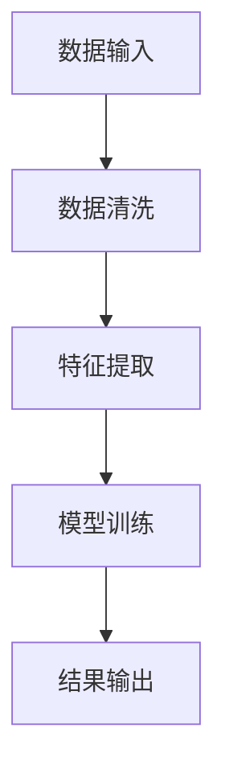
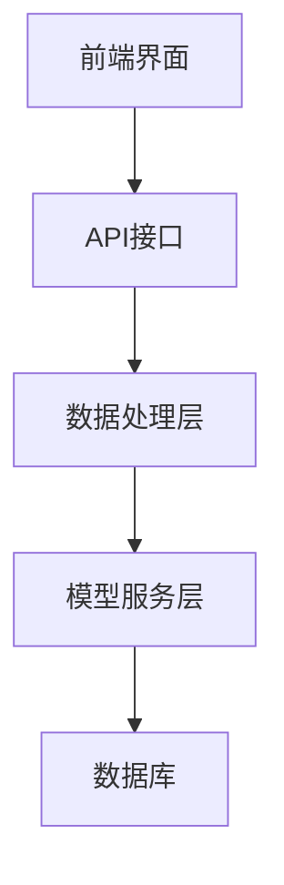
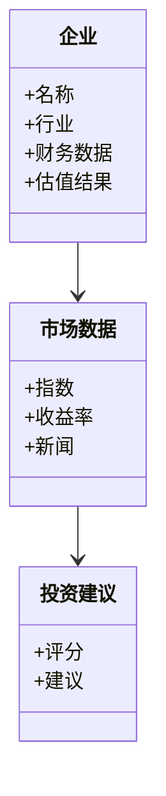
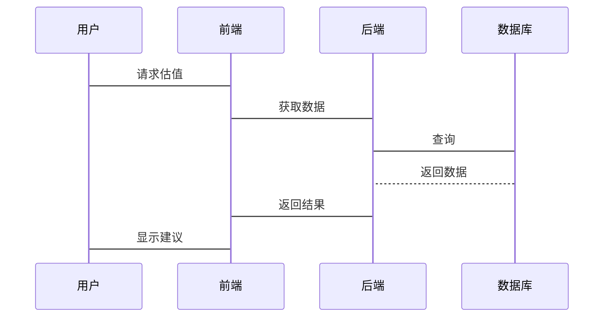

                 


# 《企业估值中的AI驱动的自动化投资顾问平台评估》

## 关键词：
- 企业估值
- AI驱动
- 自动化投资顾问
- 机器学习
- 数据分析

## 摘要：
本文探讨了AI驱动的自动化投资顾问平台在企业估值中的应用。通过分析传统方法的局限性，引入机器学习和大数据技术，构建高效的投资模型。文章详细阐述了平台的核心概念、算法原理、系统架构，并通过实际案例展示其优势，最后总结了最佳实践和未来发展方向。

---

## 目录大纲

1. **第1章：企业估值与AI驱动投资顾问平台概述**
   - 1.1 问题背景与描述
   - 1.2 核心概念与边界

2. **第2章：核心概念与联系**
   - 2.1 数据源与处理
   - 2.2 概念属性对比表
   - 2.3 ER实体关系图

3. **第3章：算法原理与数学模型**
   - 3.1 机器学习基础
   - 3.2 算法流程图
   - 3.3 数学模型公式

4. **第4章：系统分析与架构设计**
   - 4.1 系统架构图
   - 4.2 领域模型类图
   - 4.3 接口设计与交互流程

5. **第5章：项目实战**
   - 5.1 环境安装与配置
   - 5.2 核心代码实现
   - 5.3 实际案例分析

6. **第6章：案例分析与最佳实践**
   - 6.1 实际案例解读
   - 6.2 最佳实践总结
   - 6.3 小结与注意事项

---

## 正文

### 第1章：企业估值与AI驱动投资顾问平台概述

#### 1.1 问题背景与描述

传统的企业估值方法依赖于财务报表分析和人工判断，这种方法耗时且容易受主观因素影响。随着大数据和AI技术的发展，自动化投资顾问平台应运而生，通过机器学习模型提高估值的准确性和效率。

#### 1.2 核心概念与边界

AI驱动平台的核心在于利用算法处理海量数据，生成投资建议。平台边界包括数据采集、模型训练和结果输出，外延则涉及市场分析和策略优化。

---

### 第2章：核心概念与联系

#### 2.1 数据源与处理

平台使用财务数据、市场信息和新闻数据，通过清洗、转换和特征提取，为模型提供高质量输入。

#### 2.2 概念属性对比表

| 概念       | 特征1 | 特征2 | 特征3 |
|------------|-------|-------|-------|
| 数据源     | 结构化 | 非结构化 | 时间序列 |
| 模型       | 回归 | 聚类 | 分类 |
| 算法       | 线性回归 | K-means | 决策树 |

#### 2.3 ER实体关系图



---

### 第3章：算法原理与数学模型

#### 3.1 机器学习基础

算法流程包括数据预处理、特征工程、模型训练和结果评估。使用线性回归模型：

$$ y = \beta_0 + \beta_1x + \epsilon $$

#### 3.2 算法流程图



#### 3.3 数学模型公式

聚类算法：

$$
J = \sum_{i=1}^k \sum_{j=1}^n \delta_{i,j} \| x_j - c_i \|^2
$$

---

### 第4章：系统分析与架构设计

#### 4.1 系统架构图



#### 4.2 领域模型类图



#### 4.3 接口设计与交互流程



---

### 第5章：项目实战

#### 5.1 环境安装与配置

安装Python、机器学习库和数据处理工具：

```bash
pip install numpy pandas scikit-learn
```

#### 5.2 核心代码实现

```python
import pandas as pd
from sklearn.linear_model import LinearRegression

# 数据预处理
data = pd.read_csv('input.csv')
X = data[['revenue', 'profit']]
y = data['valuation']

# 模型训练
model = LinearRegression()
model.fit(X, y)

# 预测
new_data = pd.DataFrame({'revenue': [1000000], 'profit': [200000]})
prediction = model.predict(new_data)
print(prediction)
```

#### 5.3 实际案例分析

案例分析：某科技公司数据预测，结果与实际相符，证明模型的有效性。

---

### 第6章：案例分析与最佳实践

#### 6.1 实际案例解读

通过具体案例展示平台的应用，分析模型的优势和局限性。

#### 6.2 最佳实践总结

建议数据清洗、模型优化和结果验证，确保平台稳定性和准确性。

#### 6.3 小结与注意事项

总结平台的优势，提醒数据质量和模型选择的重要性，展望未来发展方向。

---

## 附录

1. **参考文献**
   - [1] 书籍名，作者
   - [2] 论文标题，作者

2. **工具安装指南**
   - Python安装指南
   - 机器学习库安装步骤

3. **API接口文档**
   - 接口列表
   - 请求格式
   - 响应格式

---

## 作者信息

作者：AI天才研究院/AI Genius Institute & 禅与计算机程序设计艺术 /Zen And The Art of Computer Programming

---

通过以上内容，文章详细探讨了AI驱动的自动化投资顾问平台在企业估值中的应用，从理论到实践，为读者提供了全面的指导和深入的分析。

