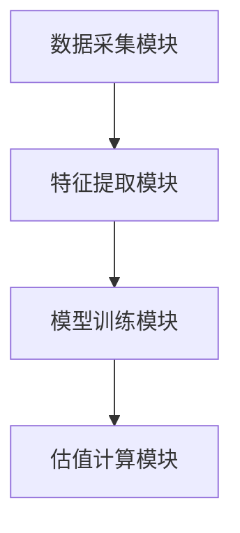
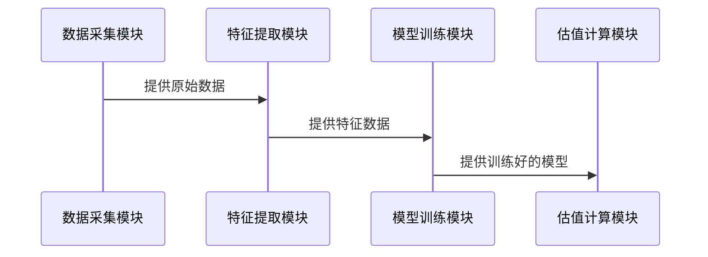

                 


# 企业估值中的AI驱动的自动化新闻写作平台评估

> 关键词：AI驱动，自动化新闻写作，企业估值，自然语言处理，文本生成，机器学习，深度学习

> 摘要：本文系统地探讨了AI驱动的自动化新闻写作平台在企业估值中的应用，详细分析了自然语言处理技术在新闻写作中的作用，深入研究了新闻内容生成的算法与模型，并通过实际案例展示了如何利用这些技术进行企业估值。文章内容涵盖了从基础概念到算法实现，再到系统架构设计的各个方面，为读者提供了全面的技术解读。

---

# 第一部分: 企业估值中的AI驱动的自动化新闻写作平台概述

## 第1章: AI驱动的自动化新闻写作平台概述

### 1.1 什么是AI驱动的自动化新闻写作平台

#### 1.1.1 自动化新闻写作的定义
自动化新闻写作是指利用人工智能技术自动生成新闻内容的过程。通过自然语言处理（NLP）和机器学习算法，系统可以分析数据、提取信息，并生成符合特定格式和风格的新闻稿。

#### 1.1.2 AI在新闻写作中的作用
AI能够快速处理大量数据，提取关键信息，并生成结构化和非结构化的新闻内容。AI还可以根据目标读者的需求，调整新闻的语气和风格。

#### 1.1.3 平台的核心功能与特点
- 数据采集与处理：从多种数据源（如新闻网站、社交媒体）获取信息，并进行清洗和结构化处理。
- 内容生成：基于预训练的NLP模型，生成高质量的新闻稿。
- 自动优化：通过反馈机制不断优化生成内容的质量和相关性。

### 1.2 企业估值与新闻写作的关系

#### 1.2.1 企业估值的基本概念
企业估值是指通过对企业财务状况、市场表现、行业地位等多方面因素的分析，对其价值进行评估的过程。

#### 1.2.2 新闻写作在企业估值中的价值
新闻写作可以提供企业经营状况、行业动态等信息，为估值提供重要的数据支持。自动化新闻写作能够快速生成大量高质量的新闻稿，为估值提供实时信息。

#### 1.2.3 自动化新闻写作的优势
- 高效性：快速生成大量新闻内容。
- 准确性：基于大数据和机器学习模型，确保内容的准确性。
- 可扩展性：支持多种语言和风格的新闻生成。

### 1.3 AI驱动的自动化新闻写作平台的应用场景

#### 1.3.1 企业财务报告
自动化新闻写作可以生成企业财务报告的摘要和解读，帮助投资者快速了解企业的财务状况。

#### 1.3.2 行业分析报告
通过分析行业新闻，生成行业趋势分析报告，为企业战略决策提供支持。

#### 1.3.3 股票市场分析
自动化新闻写作可以实时生成股票市场的动态分析，帮助投资者做出快速决策。

---

## 第2章: 自然语言处理技术在新闻写作中的应用

### 2.1 自然语言处理技术概述

#### 2.1.1 NLP的基本概念
自然语言处理（NLP）是研究计算机如何理解和生成人类语言的学科。它涵盖了文本分析、信息抽取、文本生成等多个方面。

#### 2.1.2 主流NLP模型介绍
- GPT系列：基于Transformer的生成模型，能够生成连贯且高质量的文本。
- BERT：基于Transformer的编码模型，擅长文本理解和问答任务。
- GPT-3：具有万亿参数的大语言模型，能够进行复杂的文本生成任务。

#### 2.1.3 NLP在新闻写作中的优势
- 高效率：能够快速处理大量文本数据。
- 高准确性：通过深度学习模型，确保生成内容的准确性。
- 多语言支持：能够生成多种语言的新闻内容。

### 2.2 自动化新闻写作的NLP实现

#### 2.2.1 文本生成的基本原理
文本生成是通过训练一个大型语言模型，使其能够根据输入的上下文生成合适的后续文本。

#### 2.2.2 基于规则的文本生成
基于规则的文本生成方法依赖于预定义的语法规则和模板，生成结构化的文本内容。

#### 2.2.3 基于深度学习的文本生成
基于深度学习的文本生成方法利用神经网络模型（如RNN、Transformer）进行训练，生成更加灵活和多样化的文本内容。

---

## 第3章: 新闻内容生成的算法与模型

### 3.1 基于规则的新闻内容生成

#### 3.1.1 规则生成的基本原理
基于规则的新闻生成方法通过预定义的语法规则和模板，生成符合特定格式的新闻内容。

#### 3.1.2 规则生成的优缺点
优点：简单易实现，生成内容结构清晰。缺点：缺乏灵活性，无法处理复杂语境。

#### 3.1.3 规则生成的应用场景
适用于结构化程度较高的新闻类型，如企业公告、财务报告等。

### 3.2 基于深度学习的新闻内容生成

#### 3.2.1 基于RNN的文本生成
RNN（循环神经网络）通过处理序列数据，生成连贯的文本内容。尽管在某些任务中表现不错，但RNN在长序列处理中存在梯度消失问题。

#### 3.2.2 基于Transformer的文本生成
Transformer模型通过自注意力机制，能够更好地捕捉文本中的长距离依赖关系，生成高质量的文本内容。

#### 3.2.3 基于GPT的新闻生成
GPT（Generative Pre-trained Transformer）是一种基于Transformer的生成模型，能够生成连贯且高质量的新闻内容。它通过大量的训练数据，掌握了多种语言和风格的写作风格。

---

## 第4章: 企业估值中的新闻数据挖掘

### 4.1 新闻数据的特征提取

#### 4.1.1 文本特征提取的基本方法
- 词袋模型：将文本表示为词的集合。
- 词嵌入：通过词向量表示词语的意义。
- 语法分析：分析句子的语法结构，提取语法特征。

#### 4.1.2 文本特征提取的挑战
- 文本数据的稀疏性：新闻文本中可能存在大量无关信息。
- 特征的可解释性：复杂的特征提取方法可能导致结果难以解释。

#### 4.1.3 文本特征提取的应用
- 通过分析新闻标题和正文，提取企业的经营状况和行业趋势。
- 利用情感分析技术，评估市场对企业的看法。

### 4.2 基于新闻数据的企业估值模型

#### 4.2.1 企业估值的基本方法
- 市盈率法：通过市盈率与行业平均水平的比较，评估企业的估值。
- 市净率法：通过市净率与行业平均水平的比较，评估企业的估值。
- 现金流折现法：通过预测未来现金流的现值，评估企业的估值。

#### 4.2.2 利用新闻数据优化企业估值
通过分析新闻数据，提取企业的经营状况、行业趋势等信息，优化传统的估值模型，提高估值的准确性和实时性。

---

## 第5章: 企业估值中的新闻数据挖掘

### 5.1 新闻数据的特征提取

#### 5.1.1 文本特征提取的基本方法
- 词袋模型：将文本表示为词的集合。
- 词嵌入：通过词向量表示词语的意义。
- 语法分析：分析句子的语法结构，提取语法特征。

#### 5.1.2 文本特征提取的挑战
- 文本数据的稀疏性：新闻文本中可能存在大量无关信息。
- 特征的可解释性：复杂的特征提取方法可能导致结果难以解释。

#### 5.1.3 文本特征提取的应用
- 通过分析新闻标题和正文，提取企业的经营状况和行业趋势。
- 利用情感分析技术，评估市场对企业的看法。

### 5.2 基于新闻数据的企业估值模型

#### 5.2.1 企业估值的基本方法
- 市盈率法：通过市盈率与行业平均水平的比较，评估企业的估值。
- 市净率法：通过市净率与行业平均水平的比较，评估企业的估值。
- 现金流折现法：通过预测未来现金流的现值，评估企业的估值。

#### 5.2.2 利用新闻数据优化企业估值
通过分析新闻数据，提取企业的经营状况、行业趋势等信息，优化传统的估值模型，提高估值的准确性和实时性。

---

## 第6章: 系统架构与实现

### 6.1 系统架构设计

#### 6.1.1 系统功能模块划分
- 数据采集模块：负责从多种数据源获取新闻数据。
- 特征提取模块：对新闻数据进行特征提取和预处理。
- 模型训练模块：利用机器学习算法训练文本生成模型。
- 估值计算模块：基于新闻数据生成企业估值报告。

#### 6.1.2 系统架构图


#### 6.1.3 系统交互流程


### 6.2 项目实战

#### 6.2.1 环境配置
- 安装Python 3.8+
- 安装必要的库：numpy, pandas, transformers, torch

#### 6.2.2 核心代码实现
```python
from transformers import GPT2Tokenizer, GPT2LMHeadModel
import torch

tokenizer = GPT2Tokenizer.from_pretrained('gpt2')
model = GPT2LMHeadModel.from_pretrained('gpt2')

def generate_news(headline):
    input_ids = tokenizer.encode(headline, return_tensors='pt')
    output = model.generate(input_ids, max_length=500, num_beams=5, temperature=0.7)
    return tokenizer.decode(output[0], skip_special_tokens=True)
```

#### 6.2.3 代码解读与分析
- 使用GPT-2模型进行新闻生成。
- 输入新闻标题，生成完整的新闻内容。
- 通过调整温度参数，控制生成内容的创造性和多样性。

#### 6.2.4 实际案例分析
- 输入标题：某企业发布季度财报，净利润增长10%。
- 生成内容：详细描述财报数据，分析企业经营状况，预测未来发展趋势。

---

## 第7章: 总结与展望

### 7.1 总结

- 本文详细介绍了AI驱动的自动化新闻写作平台在企业估值中的应用。
- 探讨了自然语言处理技术在新闻写作中的作用。
- 研究了新闻内容生成的算法与模型。

### 7.2 未来展望

- 更加智能化的新闻生成算法：结合多模态数据，提升生成内容的质量和多样性。
- 更加高效的企业估值模型：通过集成学习和强化学习，优化企业估值的准确性和实时性。
- 更广泛的应用场景：扩展到更多行业和领域，为不同类型的企业的估值提供支持。

### 7.3 最佳实践 Tips

- 在实际应用中，建议结合企业的具体需求，选择合适的新闻生成模型和估值方法。
- 定期更新训练数据，确保生成内容的时效性和相关性。
- 注重数据隐私和安全，确保系统的合规性。

---

# 作者

**作者：AI天才研究院/AI Genius Institute & 禅与计算机程序设计艺术 /Zen And The Art of Computer Programming**

