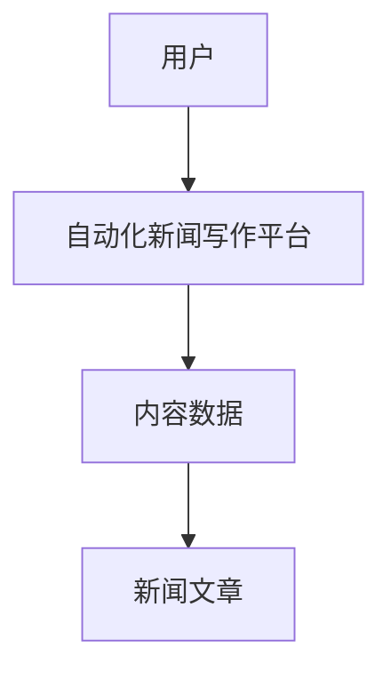
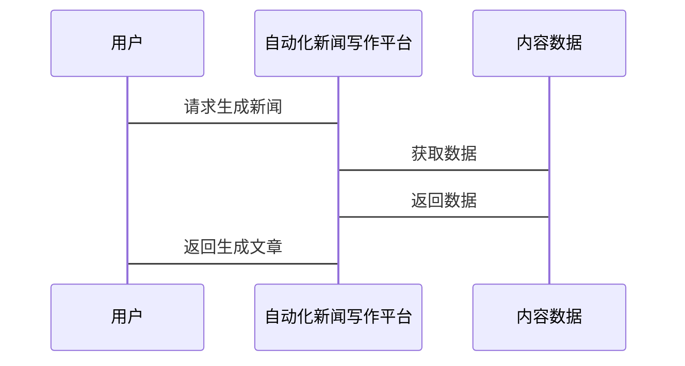

                 


# 企业估值中的AI驱动的自动化新闻写作平台评估

> 关键词：企业估值，AI驱动，自动化新闻写作，自然语言处理，文本生成

> 摘要：本文探讨了AI驱动的自动化新闻写作平台在企业估值中的作用。通过分析其技术原理、系统架构及实际案例，展示了如何利用这些平台提高企业估值效率和准确性。

---

## # 第1章：背景介绍与核心概念

### ## 1.1 企业估值的背景与挑战

#### ### 1.1.1 传统企业估值方法的局限性
传统的企业估值方法依赖于人工分析和经验判断，存在效率低、成本高、主观性强等问题。随着数据量的激增，传统方法难以处理海量信息，且难以提供实时反馈。

#### ### 1.1.2 数字化与自动化对企业估值的影响
数字化转型推动了企业估值的自动化。AI技术的应用，如自然语言处理和机器学习，使得从大量非结构化数据中提取价值成为可能，显著提高了估值效率。

#### ### 1.1.3 自动化新闻写作平台的兴起
自动化新闻写作平台利用AI生成新闻内容，改变了传统新闻生产的模式。这些平台能够快速处理大量数据，生成高质量的内容，为企业估值提供了新的数据来源和分析工具。

### ## 1.2 自动化新闻写作平台的定义与特点

#### ### 1.2.1 自动化新闻写作的定义
自动化新闻写作是指通过AI技术自动生成新闻内容的过程。这些平台通常利用自然语言处理模型，根据输入的数据生成结构化或非结构化的新闻文本。

#### ### 1.2.2 自动化新闻写作的核心特点
- **实时性**：能够快速响应数据变化，生成实时新闻。
- **一致性**：确保生成内容的格式和风格一致。
- **可扩展性**：能够处理大量数据，生成大量内容。

#### ### 1.2.3 平台与传统新闻写作的对比
自动化新闻写作平台的优势在于速度快、成本低，但目前仍无法完全取代人类记者在深度分析和创意写作方面的优势。

### ## 1.3 AI驱动的新闻写作平台对企业估值的影响

#### ### 1.3.1 提高效率与降低成本
自动化新闻写作平台能够快速生成大量数据，减少了人工成本，提高了估值效率。

#### ### 1.3.2 数据分析与决策支持
通过自动化新闻写作平台，企业可以实时获取市场动态，提供更准确的估值数据。

#### ### 1.3.3 企业竞争力的提升
自动化平台生成的高质量新闻内容有助于提升企业形象，增强市场竞争力。

---

## # 第2章：核心概念与原理

### ## 2.1 自动化新闻写作平台的运作机制

#### ### 2.1.1 自然语言处理技术
自然语言处理（NLP）技术用于理解和生成人类语言。在自动化新闻写作中，NLP模型分析数据并提取关键信息，生成新闻内容。

#### ### 2.1.2 生成式AI模型
生成式AI模型如GPT能够生成类似人类写作的文本。这些模型通过大量训练数据学习语言结构，生成高质量的新闻内容。

#### ### 2.1.3 数据驱动的新闻生成流程
流程包括数据输入、内容生成、编辑优化和发布。AI模型根据输入数据生成草稿，人工或AI系统进行优化，最终发布。

### ## 2.2 AI驱动的新闻写作平台与企业估值的关系

#### ### 2.2.1 平台如何影响企业市场表现
通过实时生成市场动态新闻，平台帮助企业及时调整策略，影响市场表现。

#### ### 2.2.2 数据质量对企业估值的影响
高质量的数据生成准确的市场分析，直接影响企业估值的准确性。

#### ### 2.2.3 企业竞争力的提升
高质量的自动化新闻内容提升企业形象，增强市场竞争力，间接影响企业估值。

### ## 2.3 核心概念的ER实体关系图

```mermaid
er
actor: 用户
automation_platform: 自动化新闻写作平台
article: 新闻文章
content: 内容数据
model: AI模型
```

---

## # 第3章：算法原理与数学模型

### ## 3.1 自然语言处理模型

#### ### 3.1.1 常见的NLP模型及其特点
- **GPT系列**：主要用于生成任务，具有强大的上下文理解能力。
- **BERT**：擅长文本理解任务，常用于问答系统和文本摘要。

#### ### 3.1.2 GPT系列模型的文本生成机制
GPT模型基于Transformer架构，通过自注意力机制捕捉文本中的长距离依赖，生成连贯的文本。

#### ### 3.1.3 BERT模型在新闻写作中的应用
BERT模型常用于文本摘要和问答系统，辅助生成新闻标题和副标题。

### ## 3.2 文本生成算法

#### ### 3.2.1 Transformer架构解析
Transformer由编码器和解码器组成，编码器处理输入，解码器生成输出。其核心在于自注意力机制，允许模型关注输入中的不同位置。

#### ### 3.2.2 解码器的生成过程
解码器通过逐步生成字符或词，预测下一个字符的概率分布，选择概率最高的字符生成文本。

#### ### 3.2.3 模型训练的数学公式
$$ \text{损失函数} = -\sum_{i=1}^{n} \log P(w_i | w_{<i}) $$

### ## 3.3 生成式AI的评估指标

#### ### 3.3.1 BLEU指数
BLEU（双语评估替换、插入、删除和翻译）用于评估机器翻译质量，也可用于文本生成任务。

#### ### 3.3.2 ROUGE分数
ROUGE评估文本摘要的质量，衡量生成摘要与参考摘要的相似度。

#### ### 3.3.3 人类评估标准
包括内容相关性、连贯性和创造性等指标，评估生成内容的质量。

---

## # 第4章：系统分析与架构设计

### ## 4.1 系统功能设计

#### ### 4.1.1 用户需求分析
用户包括企业、投资者和数据分析师，需求包括实时新闻生成、数据可视化和报告输出。

#### ### 4.1.2 功能模块划分
- 数据输入模块：接收和处理数据。
- 内容生成模块：利用AI模型生成新闻内容。
- 编辑优化模块：优化生成内容。
- 报告输出模块：生成估值报告。

#### ### 4.1.3 领域模型类图

```mermaid
classDiag
class 用户 {
    - 用户ID: string
    - 用户角色: string
    + 登录(): void
}
class 自动化新闻写作平台 {
    - 平台ID: string
    - 模型版本: string
    + 生成新闻(): 文章
}
class 新闻文章 {
    - 文章ID: string
    - 内容: string
    - 时间戳: datetime
}
class 内容数据 {
    - 数据ID: string
    - 数据源: string
    - 数据类型: string
}
```

### ## 4.2 系统架构设计

#### ### 4.2.1 系统架构图



### ## 4.3 系统接口设计

#### ### 4.3.1 接口定义
- API用于数据输入和内容生成，遵循RESTful标准，支持JSON格式。

#### ### 4.3.2 接口交互流程



### ## 4.4 系统交互设计

#### ### 4.4.1 交互流程
用户输入数据，平台生成新闻，用户收到结果并进行反馈。

---

## # 第5章：项目实战

### ## 5.1 环境安装与配置

#### ### 5.1.1 安装Python与相关库
安装Python 3.8及以上版本，安装TensorFlow、Keras和NLTK库。

#### ### 5.1.2 安装其他依赖
安装Jupyter Notebook用于开发环境。

### ## 5.2 核心实现源代码

#### ### 5.2.1 数据预处理代码

```python
import pandas as pd
from sklearn.model_selection import train_test_split

data = pd.read_csv('news.csv')
train_data, test_data = train_test_split(data, test_size=0.2)
```

#### ### 5.2.2 模型训练代码

```python
import tensorflow as tf
from tensorflow.keras.layers import Dense, LSTM, Embedding
from tensorflow.keras.models import Sequential

model = Sequential()
model.add(Embedding(10000, 64, input_length=50))
model.add(LSTM(32))
model.add(Dense(20, activation='softmax'))
model.compile(loss='categorical_crossentropy', optimizer='adam', metrics=['accuracy'])
model.fit(train_data, train_labels, epochs=10, batch_size=32)
```

#### ### 5.2.3 文本生成代码

```python
def generate_article(length=50):
    for _ in range(length):
        prediction = model.predict(current_state)
        sampled_index = np.argmax(prediction)
        sampled_char = char_to_idx[sampled_index]
        current_state = next_state(sampled_index)
        article += idx_to_char[sampled_index]
    return article
```

### ## 5.3 实际案例分析

#### ### 5.3.1 案例分析
分析一家科技公司使用自动化新闻写作平台后的估值变化，展示平台对企业估值的实际影响。

#### ### 5.3.2 代码实现与分析
详细解读上述代码，说明数据预处理、模型训练和文本生成的实现过程。

### ## 5.4 项目小结

#### ### 5.4.1 项目总结
总结项目成果，强调AI驱动的自动化新闻写作平台在企业估值中的价值。

#### ### 5.4.2 实施注意事项
提醒在实施过程中需要注意的事项，如数据质量和模型选择。

---

## # 第6章：案例分析与总结

### ## 6.1 案例分析

#### ### 6.1.1 案例背景
介绍一家企业的背景和使用自动化新闻写作平台的动机。

#### ### 6.1.2 数据分析
展示平台生成的新闻数据，分析数据对企业估值的影响。

#### ### 6.1.3 项目成果
总结项目成果，展示平台如何提升企业估值。

### ## 6.2 最佳实践 tips

#### ### 6.2.1 选择合适的平台
根据企业需求选择适合的自动化新闻写作平台。

#### ### 6.2.2 数据质量的重要性
确保输入数据的质量，直接影响生成内容和估值的准确性。

#### ### 6.2.3 模型持续优化
定期更新和优化AI模型，保持生成内容的高质量。

### ## 6.3 小结

总结全文，强调AI驱动的自动化新闻写作平台在企业估值中的重要性，以及未来的发展方向。

---

## # 作者

**作者：AI天才研究院/AI Genius Institute & 禅与计算机程序设计艺术 /Zen And The Art of Computer Programming**

---

通过以上目录和内容，文章系统地介绍了AI驱动的自动化新闻写作平台在企业估值中的应用，从背景、技术原理到实际案例，为读者提供了全面的视角和深入的分析。

