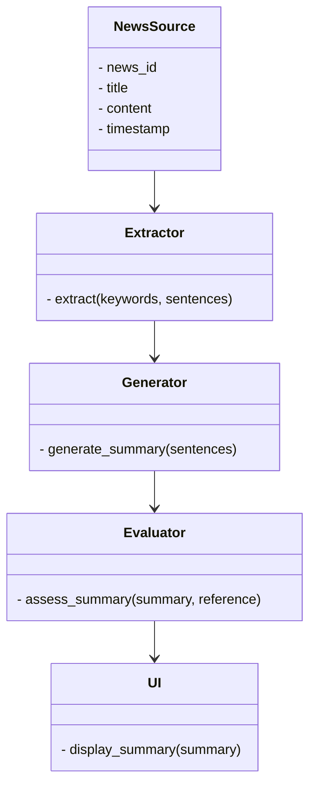
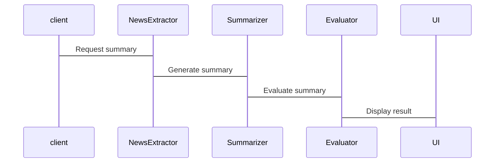

                 


# 企业估值中的AI驱动的自动化新闻摘要平台评估

> 关键词：企业估值、AI驱动、自动化新闻摘要、平台评估、自然语言处理

> 摘要：本文探讨了AI驱动的自动化新闻摘要平台在企业估值中的应用，详细分析了其核心概念、算法原理、系统架构以及实际应用案例，为企业利用AI技术提升估值效率提供了深入的指导和见解。

---

## 第一部分：企业估值与AI驱动的自动化新闻摘要平台概述

### 第1章：企业估值中的新闻摘要需求

#### 1.1 企业估值的基本概念

##### 1.1.1 企业估值的定义与作用

企业估值是指对企业整体价值的评估，通常用于投资决策、并购交易、融资活动等场景。准确的估值需要依赖大量高质量的信息，包括财务数据、市场表现、行业趋势等。新闻作为重要的外部信息来源，为企业估值提供了关键的数据支持。

##### 1.1.2 新闻摘要在企业估值中的重要性

新闻摘要能够快速提取关键信息，帮助分析师在短时间内获取企业相关的最新动态。高质量的新闻摘要能够显著提高估值的准确性和效率，尤其是在处理海量信息时，自动化新闻摘要技术显得尤为重要。

##### 1.1.3 自动化新闻摘要的优势与挑战

自动化新闻摘要的优势在于快速处理大量数据，降低人工成本；挑战在于如何保证摘要的准确性和完整性，避免信息遗漏或误解。

#### 1.2 AI驱动的新闻摘要技术

##### 1.2.1 自动化新闻摘要的定义

自动化新闻摘要是指利用AI技术自动从新闻文本中提取关键信息并生成简洁摘要的过程。其核心在于自然语言处理（NLP）技术的应用，包括信息抽取、文本生成等环节。

##### 1.2.2 AI技术在新闻摘要中的应用

AI技术通过深度学习模型（如Transformer）训练，能够理解上下文并生成连贯的摘要。自然语言生成（NLG）技术的进步使得自动化摘要更加智能化和个性化。

##### 1.2.3 企业估值中的自动化新闻摘要需求

企业估值需要实时跟踪市场动态和企业新闻，自动化新闻摘要能够高效满足这一需求，特别是在处理多语言、多渠道信息时表现突出。

### 第2章：AI驱动的自动化新闻摘要平台背景

#### 2.1 企业估值中的信息处理挑战

##### 2.1.1 传统新闻摘要的局限性

传统新闻摘要依赖人工编辑，存在效率低、成本高等问题，难以满足海量信息处理的需求。

##### 2.1.2 企业估值中信息过载的问题

企业在并购、融资等活动中需要处理大量新闻信息，信息过载导致效率低下，增加了人工处理的成本。

##### 2.1.3 自动化新闻摘要的需求场景

自动化新闻摘要能够快速筛选关键信息，帮助分析师专注于核心数据，提高估值效率。

#### 2.2 AI技术在新闻摘要中的应用现状

##### 2.2.1 自然语言处理技术的发展

NLP技术的进步，如BERT、GPT等预训练模型的应用，显著提升了自动摘要的质量和准确性。

##### 2.2.2 大模型在新闻摘要中的应用

大型语言模型通过自监督学习掌握了大量文本数据，能够生成高质量的新闻摘要，尤其是在处理复杂语义时表现出色。

##### 2.2.3 企业级应用中的AI新闻摘要平台

企业级平台整合了多个AI模型，提供定制化摘要服务，满足特定行业的需求。

#### 2.3 本章小结

企业估值中的新闻摘要需求推动了AI驱动的自动化新闻摘要平台的发展。AI技术的应用显著提升了摘要的效率和质量，为企业提供了强有力的支持。

---

## 第二部分：AI驱动的自动化新闻摘要平台核心概念与联系

### 第3章：核心概念与原理

#### 3.1 自动化新闻摘要的实现原理

##### 3.1.1 信息抽取与关键句识别

信息抽取是从新闻文本中提取实体、关系和事件的过程，关键句识别则筛选出最具代表性的句子。

##### 3.1.2 文本生成与摘要算法

文本生成算法（如Seq2Seq模型）通过编码器-解码器结构生成摘要，确保内容连贯且简洁。

##### 3.1.3 多语言与跨文化适应性

自动化平台需要支持多语言处理，确保在不同文化背景下的准确性和适用性。

#### 3.2 AI驱动的新闻摘要平台架构

##### 3.2.1 平台功能模块划分

平台通常包括数据采集、信息抽取、摘要生成、结果评估和用户界面等模块。

##### 3.2.2 数据流与信息处理流程

数据采集模块从多渠道获取新闻，信息抽取模块提取关键信息，生成模块输出摘要，评估模块优化结果，最后通过用户界面展示。

##### 3.2.3 用户交互界面设计

用户界面需要直观、简洁，提供搜索、筛选和结果展示功能，便于用户快速获取所需信息。

### 3.3 核心概念与原理的联系

#### 信息抽取与文本生成的协同作用

信息抽取确保摘要内容的准确性，文本生成保证内容的连贯性和可读性。

#### 多语言处理与文化适应性

支持多语言处理能够满足全球企业的需求，文化适应性则确保摘要在不同语境下的适用性。

---

## 第三部分：算法原理讲解

### 第4章：算法原理

#### 4.1 信息抽取算法

##### 4.1.1 基于规则的关键句识别

通过预定义的规则筛选出关键句，适用于结构化的新闻文本。

##### 4.1.2 基于统计的信息抽取

利用统计学习方法（如TF-IDF）提取重要实体和关键词。

##### 4.1.3 深度学习模型的信息抽取

使用预训练模型（如BERT）进行上下文理解，提取更准确的信息。

#### 4.2 文本生成算法

##### 4.2.1 基于规则的生成方法

通过预定义模板生成摘要，适用于结构简单的新闻。

##### 4.2.2 基于统计的生成方法

利用机器学习模型（如LSTM）生成连贯的摘要。

##### 4.2.3 基于深度学习的生成方法

采用先进的模型（如GPT）生成高质量的摘要，考虑上下文和语义关系。

#### 4.3 摘要评估算法

##### 4.3.1 基于规则的评估方法

通过预定义的评估标准（如关键词匹配）评估摘要质量。

##### 4.3.2 基于统计的评估方法

使用ROUGE、BLEU等指标量化评估摘要的准确性和流畅性。

##### 4.3.3 基于深度学习的评估方法

利用预训练模型评估摘要的质量，考虑生成内容的多样性和相关性。

---

## 第四部分：数学模型与公式

### 第5章：数学模型

#### 5.1 信息抽取的数学模型

基于统计的信息抽取模型可以表示为：

$$ P(word|document) = \frac{count(word)}{total\_words} $$

其中，$count(word)$ 表示单词在文本中的出现次数，$total\_words$ 表示文本中的总单词数。

#### 5.2 文本生成的数学模型

深度学习模型通常采用以下结构：

$$ P(sequence) = \prod_{i=1}^{n} P(word_i | context) $$

其中，$context$ 表示当前生成词的上下文。

#### 5.3 摘要评估的数学模型

ROUGE评估指标可以表示为：

$$ ROUGE-N = \frac{\sum_{i=1}^{n} \text{overlap}_i}{\sum_{i=1}^{n} \text{reference}_i} $$

其中，$overlap_i$ 表示生成摘要和参考摘要在第i个n-gram上的重叠次数，$reference_i$ 表示参考摘要中n-gram的数量。

---

## 第五部分：系统分析与架构设计方案

### 第6章：系统分析与架构设计

#### 6.1 问题场景介绍

企业估值需要实时获取和处理大量新闻信息，传统的手动摘要效率低下，难以满足需求。

#### 6.2 系统功能设计

##### 6.2.1 领域模型类图



#### 6.3 系统架构设计

##### 6.3.1 系统架构图


#### 6.4 接口设计

##### 6.4.1 API接口定义

```http
POST /api/summary
Content-Type: application/json

{
    "news_content": "..."
}
```

##### 6.4.2 返回结果示例

```json
{
    "summary": "...",
    "evaluation": {
        "rouge-2": 0.85,
        "bleu": 0.78
    }
}
```

#### 6.5 交互设计

##### 6.5.1 交互流程图



---

## 第六部分：项目实战

### 第7章：项目实战

#### 7.1 环境安装

安装Python、TensorFlow、Hugging Face库等必要工具：

```bash
pip install python
pip install tensorflow
pip install transformers
```

#### 7.2 核心代码实现

##### 7.2.1 信息抽取代码

```python
from transformers import pipeline

extractor = pipeline("information-extraction")
result = extractor(news_content)
```

##### 7.2.2 文本生成代码

```python
from transformers import pipeline

generator = pipeline("text-generation")
summary = generator(summary_template, max_length=100)
```

##### 7.2.3 摘要评估代码

```python
from rouge import Rouge

rouge = Rouge()
scores = rouge.compute_score(summary1, summary2)
```

#### 7.3 代码解读与分析

##### 7.3.1 信息抽取模块

使用Hugging Face的预训练模型进行信息抽取，提取实体和关系。

##### 7.3.2 文本生成模块

采用生成模型生成摘要，确保内容连贯。

##### 7.3.3 摘要评估模块

使用ROUGE指标评估摘要质量，提供量化反馈。

#### 7.4 案例分析

以某科技公司为例，展示如何利用自动化平台快速生成新闻摘要，辅助企业估值。

#### 7.5 项目小结

通过实战项目，验证了自动化新闻摘要平台的有效性和实用性，为企业估值提供了有力支持。

---

## 第七部分：最佳实践与小结

### 第8章：最佳实践

#### 8.1 小结

AI驱动的自动化新闻摘要平台在企业估值中的应用前景广阔，通过技术进步和实践优化，能够显著提升估值效率和准确性。

#### 8.2 注意事项

在实际应用中，需注意数据质量、模型调优和用户反馈，确保系统稳定性和准确性。

#### 8.3 拓展阅读

推荐阅读相关领域的最新研究，如多模态摘要、实时信息处理等。

---

## 作者

**作者：AI天才研究院/AI Genius Institute & 禅与计算机程序设计艺术 /Zen And The Art of Computer Programming**

---

这篇文章系统地探讨了AI驱动的自动化新闻摘要平台在企业估值中的应用，从背景介绍到实际案例分析，为读者提供了全面而深入的指导。通过详细的算法讲解和系统设计，帮助读者理解如何利用先进技术提升企业估值效率。

