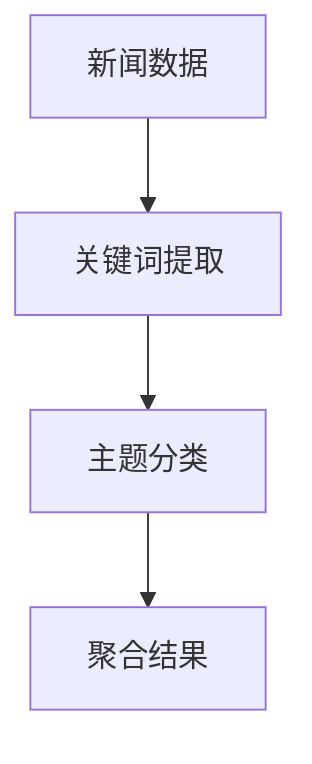
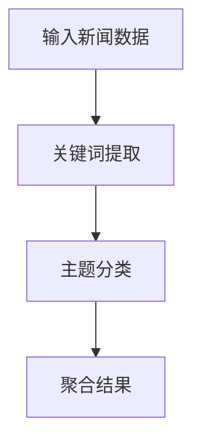
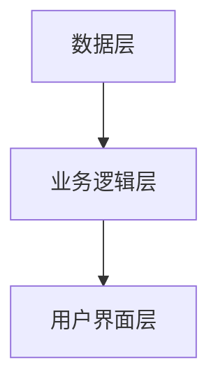

                 


# 企业估值中的AI驱动的自动化新闻聚合平台评估

> 关键词：AI驱动，新闻聚合，企业估值，自动化评估，自然语言处理，主题模型，时间序列分析

> 摘要：本文探讨了AI驱动的自动化新闻聚合平台在企业估值中的应用，详细分析了新闻聚合的核心概念、算法原理、系统架构，并通过实际案例展示了如何利用这些技术进行企业估值的自动化评估。

---

## 第一部分：背景介绍

### 第1章：问题背景与核心概念

#### 1.1 问题背景

企业估值是金融领域中的核心任务之一，传统的估值方法依赖于财务报表分析、市场研究和专家判断。然而，随着信息时代的到来，新闻、社交媒体等非结构化数据对企业估值的影响日益显著。如何高效地聚合和分析这些海量信息，成为企业估值中的重要挑战。

#### 1.2 核心概念

- **AI驱动的新闻聚合平台**：通过自然语言处理（NLP）技术，自动化地从新闻网站、社交媒体等多源数据中提取、分类和聚合相关信息。
- **企业估值模型**：基于聚合的新闻数据，结合其他结构化数据，构建多维度的企业估值模型，提供实时、动态的估值结果。

#### 1.3 问题描述

传统的企业估值方法存在以下痛点：
- 数据来源单一，难以覆盖多维度信息。
- 数据处理耗时，人工分析效率低下。
- 信息更新滞后，难以捕捉实时市场动态。

#### 1.4 问题解决

通过AI驱动的新闻聚合平台，可以实现：
- 自动化聚合多源新闻数据。
- 实时更新企业相关信息。
- 提供基于最新市场动态的企业估值。

#### 1.5 边界与外延

- **边界**：仅关注新闻聚合和企业估值，不涉及企业内部数据。
- **外延**：未来可以扩展到社交媒体、行业报告等更多数据源。

#### 1.6 核心要素组成

| 核心要素 | 描述 |
|----------|------|
| 数据源   | 新闻网站、社交媒体、行业报告 |
| 聚合方式 | 基于关键词、主题模型、情感分析 |
| 估值维度 | 市场情绪、行业趋势、企业声誉 |

---

## 第二部分：核心概念与联系

### 第2章：AI驱动的新闻聚合平台

#### 2.1 核心概念原理

- **自然语言处理（NLP）**：用于文本的理解和分析，包括关键词提取、实体识别和主题分类。
- **信息抽取与实体识别**：从新闻文本中提取公司名称、行业关键词等实体信息。
- **主题模型**：使用LDA（Latent Dirichlet Allocation）等算法对新闻进行主题分类，提取与企业相关的主题。

#### 2.2 核心概念属性特征对比表

| 特征       | 描述 |
|------------|------|
| 数据源     | 新闻网站、社交媒体、行业报告 |
| 聚合方式   | 基于关键词、主题模型、情感分析 |
| 精度       | 聚合结果的准确性 |

#### 2.3 ER实体关系图（Mermaid）



---

## 第三部分：算法原理讲解

### 第3章：新闻聚合算法

#### 3.1 算法原理

- **基于主题模型的新闻聚类**：使用LDA算法对新闻进行主题建模，提取与企业相关的主题。
- **基于关键词匹配的新闻聚类**：通过关键词匹配算法（如BM25）对新闻进行相似性计算。

#### 3.2 算法流程图（Mermaid）



#### 3.3 数学公式

- **LDA主题建模**：
  - 文档-主题概率矩阵：$$p(\text{topic}_j|\text{doc}_i)$$
  - 主题-词汇概率矩阵：$$p(\text{word}_k|\text{topic}_j)$$

- **BM25关键词提取**：
  - 计算关键词权重：$$\text{score}(word) = \frac{\text{freq}(word)}{\text{idf}(word)}$$

---

## 第四部分：系统分析与架构设计

### 第4章：系统架构设计

#### 4.1 系统功能设计

- **领域模型**：使用Mermaid类图展示系统中的实体和关系。
- **系统架构**：采用分层架构，包括数据层、业务逻辑层和用户界面层。

#### 4.2 系统架构图（Mermaid）



#### 4.3 接口设计

- **API接口**：提供RESTful API，供其他系统调用聚合数据。
- **交互流程**：用户通过API提交查询请求，系统返回聚合结果。

---

## 第五部分：项目实战

### 第5章：项目实战

#### 5.1 环境安装

- **Python环境**：安装Python 3.8及以上版本。
- **依赖库**：安装NLP相关库，如spaCy、Gensim、scikit-learn等。

#### 5.2 核心代码实现

```python
import spacy
nlp = spacy.load("en_core_web_sm")
doc = nlp("Apple signs a new deal in China.")
for token in doc:
    print(token.text, token.pos_)
```

#### 5.3 实际案例分析

- **案例背景**：假设一家科技公司近期发布了新产品，新闻聚合平台需要实时聚合相关新闻并更新企业估值。
- **分析过程**：从新闻数据中提取关键词，分类主题，计算市场情绪，最终更新企业估值。

---

## 第六部分：最佳实践

### 第6章：最佳实践

#### 6.1 小结

- AI驱动的新闻聚合平台在企业估值中的应用具有重要意义。
- 通过自然语言处理和主题建模等技术，可以实现高效的信息聚合和分析。

#### 6.2 注意事项

- 数据质量和多样性是影响聚合效果的关键因素。
- 模型的实时性和可解释性是实际应用中的重要考量。

#### 6.3 拓展阅读

- 建议阅读《自然语言处理实战》和《机器学习实战》等书籍，深入了解相关技术。

---

## 作者信息

作者：AI天才研究院/AI Genius Institute & 禅与计算机程序设计艺术/Zen And The Art of Computer Programming

---

# 结语

通过本文的详细讲解，读者可以全面了解AI驱动的自动化新闻聚合平台在企业估值中的应用。从核心概念到算法原理，再到系统设计和项目实战，每一步都进行了深入的探讨。希望本文能为相关领域的研究和实践提供有价值的参考。

