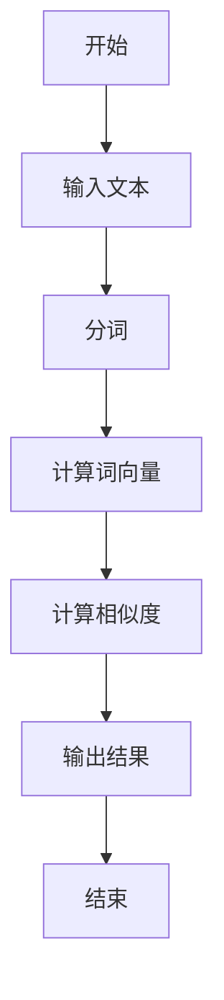
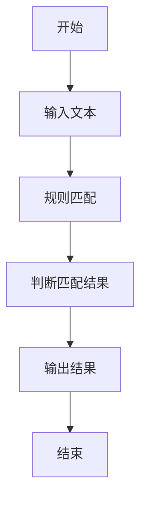
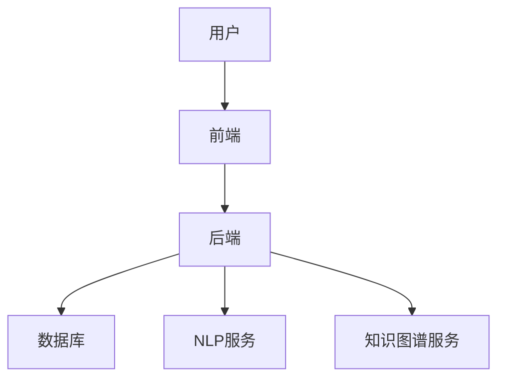

                 


# 企业估值中的AI驱动的自动化法律咨询平台评估

---

## 关键词：
企业估值，人工智能，法律咨询，自动化法律咨询平台，AI算法，法律知识图谱，自然语言处理，文本相似度，法律规则匹配

---

## 摘要：
随着企业估值的重要性日益凸显，传统的法律咨询方式在效率和准确性方面逐渐显现出局限性。AI驱动的自动化法律咨询平台以其高效、精准的特点，成为企业估值中的重要工具。本文将深入探讨如何利用AI技术构建自动化法律咨询平台，分析其在企业估值中的应用价值，从算法原理、系统架构到项目实战，全面解析其技术实现和实际应用。

---

## 第一部分：背景与核心概念

### 第1章：企业估值的背景与挑战

#### 1.1 企业估值的背景与重要性
企业估值是企业价值评估的重要环节，广泛应用于并购、融资、上市等场景。传统估值方法依赖人工分析，存在耗时长、成本高等问题。

#### 1.2 传统法律咨询的局限性
传统法律咨询依赖律师的经验，存在效率低、成本高、难以标准化的问题，难以满足企业估值的快速需求。

#### 1.3 AI驱动法律咨询平台的出现
AI技术的快速发展为法律咨询的自动化提供了可能。通过自然语言处理和机器学习，AI可以快速分析法律文本，提供标准化的法律建议。

---

### 第2章：AI驱动法律咨询平台的核心概念

#### 2.1 自动化法律咨询平台的定义与特点
- **定义**：基于AI技术的自动化法律咨询系统，能够自动解析法律文本，提供法律建议。
- **特点**：高效、精准、低成本、24/7可用。

#### 2.2 核心概念术语对比
| 概念         | 描述                                                                 |
|--------------|----------------------------------------------------------------------|
| 自然语言处理 | 通过算法分析文本，理解语言含义的技术。                              |
| 法律知识图谱  | 将法律知识结构化为图数据，便于计算机理解和推理。                   |
| 文本相似度   | 衡量两段文本在语义上的相似程度。                                     |

#### 2.3 核心概念的ER图
```mermaid
erDiagram
    法律咨询平台 : {
        平台ID,
        用户ID,
        咨询记录,
        法律条款ID
    }
    用户 : {
        用户ID,
        用户名称,
        联系方式
    }
    法律条款 : {
        法律条款ID,
        条款内容,
        条款类型
    }
    平台关联 用户-法律条款
```

---

## 第二部分：技术基础与算法原理

### 第3章：自然语言处理在法律咨询中的应用

#### 3.1 NLP的基本原理
- **分词**：将文本分割成词语或短语。
- **实体识别**：识别文本中的关键实体（如人名、地名、公司名）。
- **情感分析**：判断文本中的情感倾向。

#### 3.2 法律文本的特征分析
- **法律术语**：特定领域术语，如“违约责任”、“知识产权”。
- **法律结构**：法律文本通常具有明确的结构，如条、款、项。

#### 3.3 NLP在法律咨询中的应用场景
- **自动摘要**：提取法律文本的关键信息。
- **术语识别**：识别法律文本中的关键术语。
- **问答系统**：根据用户的问题，快速找到相关法律条款。

---

### 第4章：法律知识图谱的构建

#### 4.1 知识图谱的基本概念
- **节点**：代表实体或概念（如“合同”、“知识产权”）。
- **边**：代表节点之间的关系（如“属于”、“包含”）。

#### 4.2 法律知识图谱的构建步骤
1. 数据收集：收集法律文本和案例。
2. 数据清洗：去除冗余和噪声数据。
3. 知识抽取：从文本中提取实体和关系。
4. 知识关联：建立实体之间的关系。
5. 图谱存储：存储图谱数据，便于查询。

#### 4.3 法律知识图谱的应用
- **快速查询**：根据关键词快速找到相关法律条款。
- **关联分析**：分析法律条款之间的关系，提供综合建议。

---

## 第三部分：算法实现与系统架构

### 第5章：基于文本相似度的法律条款匹配

#### 5.1 文本相似度的计算方法
- **余弦相似度**：衡量两段文本在词向量空间中的夹角。
- **Jaccard相似度**：基于集合论的相似度计算。

#### 5.2 基于Word2Vec的文本表示
- **Word2Vec模型**：将词语映射到低维向量空间。
- **句子向量计算**：通过词语向量的加权平均得到句子向量。

#### 5.3 算法实现
```python
from sklearn.feature_extraction.text import TfidfVectorizer
from sklearn.metrics.pairwise import cosine_similarity

# 示例文本
text1 = "违约责任是指一方未履行合同义务所应承担的责任。"
text2 = "知识产权的保护是指对创新成果的法律保护。"

# 计算TF-IDF向量
vectorizer = TfidfVectorizer()
tfidf_matrix = vectorizer.fit_transform([text1, text2])

# 计算余弦相似度
similarity = cosine_similarity(tfidf_matrix[0:1], tfidf_matrix[1:2])
print(similarity[0][0])  # 输出相似度
```

#### 5.4 算法流程图


---

### 第6章：基于规则的法律条款匹配

#### 6.1 法律规则的提取
- **规则提取**：从法律文本中提取关键词和规则。
- **规则匹配**：将用户问题与预设规则进行匹配。

#### 6.2 基于正则表达式的匹配
```python
import re

# 示例规则：匹配“违约责任”相关问题
pattern = r"违约责任|违约条款"

text = "请问在合同中，违约责任是如何规定的？"
if re.search(pattern, text):
    print("匹配成功")
else:
    print("匹配失败")
```

#### 6.3 基于规则的匹配流程图


---

## 第四部分：系统架构与实现

### 第7章：法律咨询平台的系统架构

#### 7.1 系统功能模块
- **前端**：用户界面，包括文本输入、结果展示。
- **后端**：处理用户请求，调用NLP和知识图谱服务。
- **数据库**：存储法律文本和用户咨询记录。
- **API接口**：与其他系统对接。

#### 7.2 系统架构图


#### 7.3 系统交互流程
1. 用户输入问题。
2. 前端将请求发送到后端。
3. 后端调用NLP和知识图谱服务进行处理。
4. 返回结果到前端，展示给用户。

---

### 第8章：系统实现细节

#### 8.1 环境搭建
- **Python**：安装必要的库（如scikit-learn、spaCy）。
- **数据库**：选择合适的数据库（如MongoDB）存储法律文本。
- **NLP工具**：使用spaCy或Gensim进行文本处理。

#### 8.2 核心代码实现
```python
import spacy

nlp = spacy.load("en_core_web_sm")

def analyze_text(text):
    doc = nlp(text)
    entities = [ent.text for ent in doc.ents]
    return entities

text = "The company has a contract with a client in the United States."
print(analyze_text(text))
```

#### 8.3 代码功能解读
- **文本分析**：使用spaCy进行分词和实体识别。
- **结果展示**：提取并返回实体信息。

---

## 第五部分：案例分析与实际应用

### 第9章：项目实战：法律咨询平台开发

#### 9.1 项目目标
开发一个基于AI的法律咨询平台，能够自动解析法律文本，提供法律建议。

#### 9.2 实际案例分析
以某企业并购案例为例，展示平台如何快速分析相关法律条款，提供并购中的法律风险评估。

---

### 第10章：法律与伦理问题

#### 10.1 数据隐私
- **数据泄露风险**：如何保护用户的隐私数据。
- **数据加密**：使用加密技术保护数据。

#### 10.2 责任归属
- **错误决策的责任**：当AI决策错误时，责任由谁承担？
- **法律合规性**：确保AI决策符合法律法规。

---

## 第六部分：总结与展望

### 第11章：总结与展望

#### 11.1 总结
本文详细介绍了AI驱动的法律咨询平台在企业估值中的应用，从技术基础到系统架构，再到实际案例，全面解析了其实现和应用过程。

#### 11.2 未来展望
- **多模态模型**：结合图像、语音等多种数据源。
- **智能合约**：将法律条款转化为智能合约，实现自动执行。

---

## 作者：AI天才研究院 & 禅与计算机程序设计艺术

