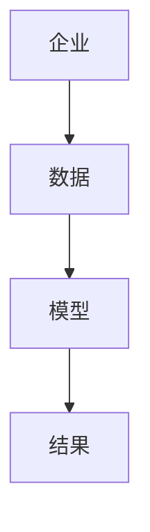
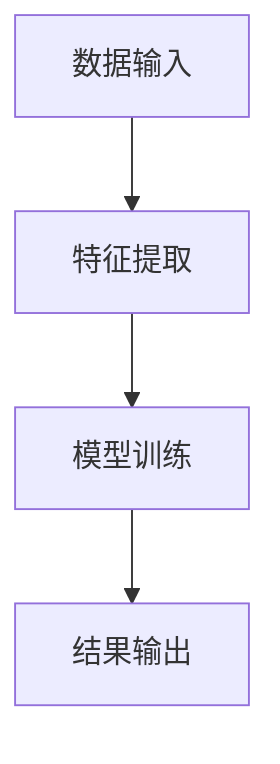
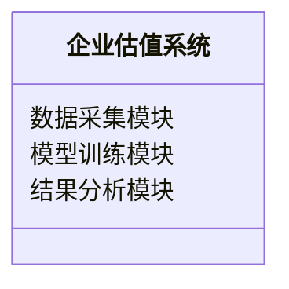
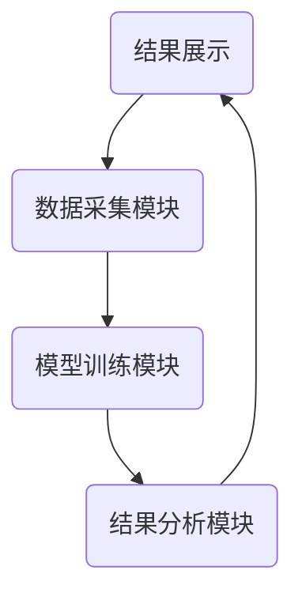

                 


# 企业估值中的AI驱动的自动化科学发现平台评估

## 关键词：
- 企业估值、AI驱动、自动化科学发现平台、机器学习、数据驱动

## 摘要：
本文探讨了AI驱动的自动化科学发现平台在企业估值中的应用。通过分析传统估值方法的局限性，介绍了AI如何优化这一过程，详细讲解了平台的核心概念、算法原理、系统架构，并通过案例展示了其实现与应用。文章还提供了最佳实践和未来展望，帮助读者系统理解并应用这一技术。

---

## 第一部分：背景介绍

### 第1章：企业估值与AI驱动的科学发现平台概述

#### 1.1 问题背景
企业估值是评估企业价值的关键过程，传统方法依赖财务数据和人工分析，存在效率低、主观性强等问题。AI驱动的自动化科学发现平台通过数据分析和机器学习优化估值过程，提高准确性和效率。

#### 1.2 问题描述
企业估值涉及多个复杂因素，传统方法难以捕捉动态变化。AI平台利用大数据和模型分析，自动提取关键特征，优化估值模型。

#### 1.3 问题解决
AI平台通过自动化数据处理和模型训练，提供实时、精准的估值结果，降低人为误差，提升决策效率。

#### 1.4 核心概念与组成
企业估值的关键因素包括财务数据、市场表现和行业趋势。AI平台由数据采集、模型训练和结果分析模块组成，实现自动化评估。

---

## 第二部分：核心概念与联系

### 第2章：AI驱动的科学发现平台原理

#### 2.1 核心概念解析
数据驱动依赖历史数据，模型驱动基于算法预测，自动化科学发现结合两者，通过AI自动识别数据模式。

#### 2.2 核心概念对比表
| 对比维度 | 数据驱动 | 模型驱动 |
|----------|----------|----------|
| 依赖基础 | 历史数据 | 预测模型 |
| 优势 | 精准 | 灵活性 | 
| 劣势 | 缺乏预测性 | 黑箱问题 |

#### 2.3 ER实体关系图


---

## 第三部分：算法原理讲解

### 第3章：基于AI的科学发现算法

#### 3.1 算法流程


#### 3.2 算法实现
```python
import pandas as pd
from sklearn.model import Model

data = pd.read_csv('data.csv')
features = data[['revenue', 'profit', 'growth']]
target = data['valuation']

model = Model()
model.fit(features, target)
predictions = model.predict(features)
```

#### 3.3 数学模型
回归分析公式：
$$ \hat{y} = \beta_0 + \beta_1x_1 + \beta_2x_2 + \dots + \beta_nx_n $$

聚类分析用于分类企业类型，提升模型准确性。

---

## 第四部分：系统分析与架构设计

### 第4章：系统架构与实现

#### 4.1 系统功能设计


#### 4.2 系统架构图


---

## 第五部分：项目实战

### 第5章：企业估值平台实现

#### 5.1 环境安装
```bash
pip install pandas scikit-learn
```

#### 5.2 核心代码
```python
import pandas as pd
from sklearn.linear_model import LinearRegression

data = pd.read_csv('valuation_data.csv')
X = data[['revenue', 'profit']]
y = data['valuation']

model = LinearRegression()
model.fit(X, y)
print(model.predict(X))
```

#### 5.3 案例分析
使用实际企业数据，训练模型并进行预测，展示如何优化企业估值。

---

## 第六部分：最佳实践与总结

### 第6章：总结与展望

#### 6.1 最佳实践
数据预处理和模型调优是关键，选择合适模型提升准确性。

#### 6.2 小结
AI驱动的平台显著提升企业估值的效率和准确性，未来将结合更多数据源和模型优化。

#### 6.3 注意事项
确保数据质量和模型解释性，定期更新模型适应市场变化。

#### 6.4 拓展阅读
推荐学习机器学习和数据分析相关书籍，深入理解AI在金融中的应用。

---

## 作者：
AI天才研究院/AI Genius Institute  
禅与计算机程序设计艺术/Zen And The Art of Computer Programming

---

**总结**：本文详细介绍了AI驱动的自动化科学发现平台在企业估值中的应用，从背景到实现，为读者提供了全面的知识和指导，帮助他们在实际应用中优化企业估值流程。

