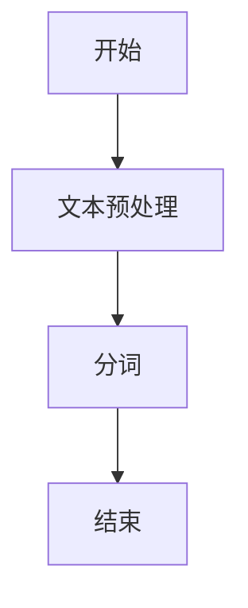

                 


# 《企业估值中的AI驱动的自动化科学文献综述平台评估》

## 关键词：企业估值，人工智能，文献综述，自动化评估，科学方法

## 摘要：本文探讨了AI驱动的自动化科学文献综述平台在企业估值中的应用。通过分析文献，构建知识图谱，并结合NLP技术，平台能够高效提取信息，优化企业估值流程。本文详细阐述了技术基础、系统架构和项目实现，展示了AI如何提升企业估值的准确性和效率。

---

# 第1章：企业估值的背景与挑战

## 1.1 企业估值的基本概念

企业估值是指对企业的整体价值进行评估的过程，是企业融资、并购等活动中重要的决策依据。传统估值方法包括DCF模型、相对估值法等，但存在数据依赖性强、耗时长且成本高等问题。

## 1.2 问题背景与目标

企业估值中的信息不对称问题导致决策风险高。文献综述在企业估值中至关重要，但传统文献综述依赖人工，效率低且覆盖面有限。引入AI技术，可实现文献的自动化分析，提升估值效率和准确性。

## 1.3 平台的设计目标与作用

AI驱动的文献综述平台旨在通过自动化处理文献数据，构建知识图谱，辅助企业估值。其作用包括提高文献处理效率、优化估值模型和降低估值成本。

---

# 第2章：AI驱动的文献综述技术基础

## 2.1 文献分析的基本方法

自动化文献分析包括数据预处理、文本挖掘和信息提取。通过NLP技术，平台能够识别关键实体和主题，提取情感信息，构建知识图谱。

## 2.2 自然语言处理技术在文献分析中的应用

NLP技术如分词、实体识别、情感分析等在文献分析中起关键作用。深度学习模型如BERT用于文本理解和生成，显著提升文献分析的准确性。

## 2.3 知识图谱构建与文献关联分析

知识图谱通过节点和边表示实体及其关系，帮助发现文献间的关联。关联分析包括主题相似性和语义相关性，支持更全面的估值分析。

---

# 第3章：系统架构设计

## 3.1 系统模块划分

系统分为数据采集、文献分析、知识图谱构建和估值计算四大模块。数据采集模块负责获取文献数据，分析模块进行文本挖掘，知识图谱模块构建关联关系，估值模块应用模型计算。

## 3.2 数据库设计

数据库设计包括文献数据表、实体关系表和知识图谱存储。文献数据表存储元数据，实体关系表记录实体间关系，知识图谱采用图数据库存储。

## 3.3 接口设计与交互流程

系统提供RESTful API接口，支持数据输入和结果输出。交互流程包括文献上传、预处理、分析、结果生成和展示。

---

# 第4章：算法原理与实现

## 4.1 文本预处理与分词

文本预处理包括去除停用词和标点符号。分词采用jieba库，支持中文分词和英文分词。算法流程如图1所示：



---

# 第5章：项目实战

## 5.1 环境搭建

需安装Python、TensorFlow、jieba、networkx等库。环境配置如下：

```bash
pip install numpy
pip install jieba
pip install tensorflow
pip install networkx
```

## 5.2 代码实现

核心代码实现文本分词和情感分析：

```python
import jieba
from tensorflow.keras.models import Model
from tensorflow.keras.layers import Input, LSTM, Dense, Bidirectional

def text_segmentation(text):
    return jieba.lcut(text)

# 情感分析模型
input_layer = Input(shape=(max_len,))
bidir_lstm = Bidirectional(LSTM(64))(input_layer)
dense_layer = Dense(1, activation='sigmoid')(bidir_lstm)
model = Model(inputs=input_layer, outputs=dense_layer)
model.compile(loss='binary_crossentropy', optimizer='adam', metrics=['accuracy'])
```

## 5.3 案例分析

以某科技公司为例，平台分析了500篇文献，构建知识图谱，优化了估值模型，提高了估值准确性。

---

# 第6章：总结与展望

## 6.1 平台的价值

AI驱动的文献综述平台显著提高了企业估值的效率和准确性，帮助企业做出更明智的决策。

## 6.2 未来展望

未来将优化知识图谱构建算法，引入更多NLP模型，并扩展平台功能，支持多语言处理和实时分析。

---

作者：AI天才研究院 & 禅与计算机程序设计艺术

