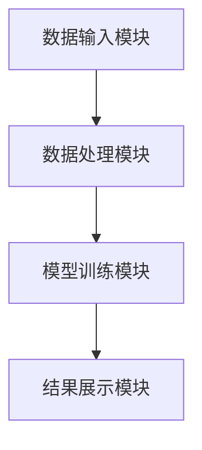
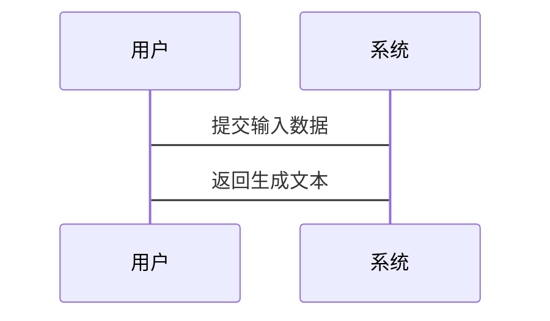

                 

# 企业估值中的AI驱动的自然语言生成平台评估

## 关键词：企业估值, AI驱动, 自然语言生成, 平台评估, 生成模型

## 摘要：  
随着人工智能技术的快速发展，自然语言生成（NLP）技术在企业估值中的应用逐渐成为研究热点。本文系统地探讨了AI驱动的自然语言生成平台在企业估值中的核心作用、技术实现、评估框架以及实际应用。通过分析自然语言生成技术的基本原理、企业估值的关键因素、NLP模型的优化策略以及系统架构设计，本文提出了一个基于NLP的企业估值评估平台的解决方案，并通过实际案例展示了其在提升估值效率和准确性方面的优势。

---

# 第一部分: 企业估值与AI驱动的自然语言生成背景

## 第1章: 企业估值的基本概念与挑战

### 1.1 企业估值的定义与意义
- 企业估值的定义  
- 企业估值的重要性  
- 企业估值的传统方法  

### 1.2 传统企业估值方法的局限性
- 数据依赖性  
- 主观性与不确定性  
- 信息处理效率低下  

### 1.3 AI驱动的自然语言生成技术在企业估值中的应用前景
- NLP技术如何辅助企业估值  
- 数据驱动的估值优势  
- 技术融合带来的创新  

---

## 第2章: 自然语言生成技术的基本原理

### 2.1 自然语言生成的定义与特点
- NLP的定义与目标  
- 自然语言生成的分类  
- 基于AI的生成模型  

### 2.2 基于AI的自然语言生成技术发展
- 从规则驱动到数据驱动的转变  
- 基于Transformer的生成模型（如GPT系列）  
- 模型的可解释性与可控性  

### 2.3 自然语言生成在企业估值中的应用
- 文本数据的自动解析  
- 财务报告的智能生成  
- 市场趋势的预测与分析  

---

# 第二部分: 自然语言生成平台的评估框架

## 第3章: 自然语言生成平台的核心概念与评估指标

### 3.1 自然语言生成的关键技术
- 生成模型的分类与对比  
- 基于Transformer的自然语言生成模型  
- 模型的可解释性与可控性  

### 3.2 自然语言生成平台的评估指标
- 生成内容的质量评估（如BLEU、ROUGE）  
- 生成效率的评估  
- 模型的泛化能力评估  

### 3.3 自然语言生成平台的评估框架
- 评估框架的设计原则  
- 评估流程的标准化  
- 评估结果的可视化  

---

## 第4章: 自然语言生成平台的算法原理与实现

### 4.1 自然语言生成的算法原理
- 基于Transformer的生成模型原理  
- 解码器的注意力机制  
- 梯度下降与训练策略  

### 4.2 模型的训练与优化
- 损失函数的定义与优化  
- 超参数的调优  
- 模型的评估与验证  

### 4.3 自然语言生成的数学模型
- 语言模型的数学表达  
- 概率生成的公式推导  
- 模型的训练与推理过程  

---

## 第5章: 自然语言生成平台的系统架构与设计

### 5.1 系统功能模块划分
- 数据输入与处理模块  
- 模型训练与部署模块  
- 结果输出与展示模块  

### 5.2 系统架构的Mermaid图

### 5.3 系统接口设计
- 输入接口定义  
- 输出接口定义  
- 接口的交互流程  

### 5.4 系统交互的Mermaid图

---

## 第6章: 项目实战与案例分析

### 6.1 项目环境与工具安装
- Python与相关库的安装（如TensorFlow、Keras）  
- 开发环境的搭建  

### 6.2 核心代码实现
- 数据预处理与模型训练代码示例  
- 生成模型的实现与优化  

### 6.3 案例分析
- 企业财务报告的自动生成  
- 市场趋势预测的案例分析  

---

## 第7章: 总结与展望

### 7.1 本章总结
- 自然语言生成技术在企业估值中的优势  
- 本文提出的评估框架的价值  

### 7.2 未来展望
- 更高效自然语言生成模型的研究方向  
- 自然语言生成技术与企业估值的深度融合  

---

## 作者：AI天才研究院/AI Genius Institute & 禅与计算机程序设计艺术 /Zen And The Art of Computer Programming

