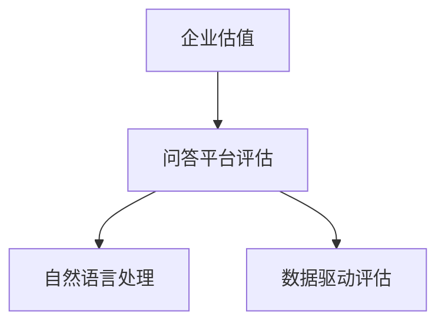
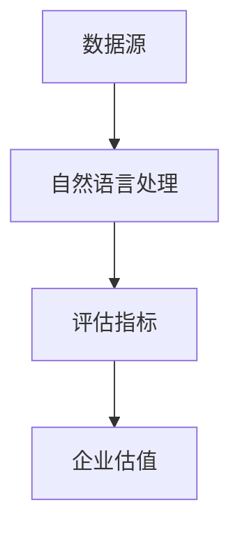
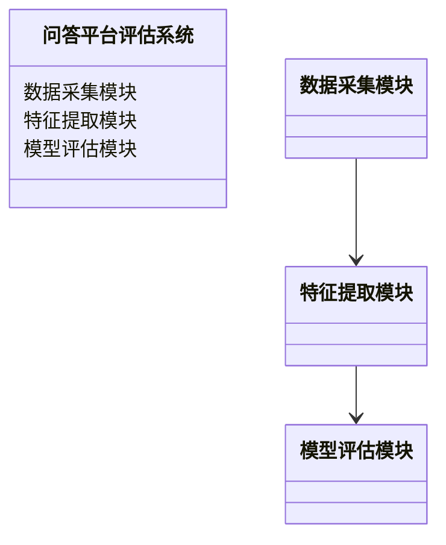

                 


# 企业估值中的AI驱动的自然语言问答平台评估

> 关键词：企业估值，自然语言处理，问答平台，AI驱动，评估方法

> 摘要：本文深入探讨了AI技术在企业估值中的问答平台评估中的应用，分析了自然语言处理技术如何帮助企业进行高效、准确的问答平台评估，提出了基于大模型的问答系统和多维度评估指标的创新方法。

---

## 第一部分：企业估值中的AI驱动的自然语言问答平台评估基础

### 第1章：企业估值与问答平台评估的背景介绍

#### 1.1 问题背景

##### 1.1.1 企业估值的核心挑战
企业估值是一个复杂的系统工程，涉及财务数据、市场表现、团队能力、技术优势等多个维度。然而，如何有效评估企业内部的问答平台，以获取有价值的信息，成为企业估值中的一个重要挑战。

##### 1.1.2 自然语言问答平台在企业中的作用
问答平台是企业内部知识共享和问题解决的重要工具。通过自然语言处理技术，可以自动化地分析问答内容，提取关键信息，帮助评估企业的知识管理水平和员工协作能力。

##### 1.1.3 AI驱动问答平台评估的必要性
传统的人工评估方法效率低下且容易出错。通过AI技术，可以快速处理大量问答数据，发现潜在问题，并提供数据支持的评估结果，从而提升企业估值的准确性和效率。

#### 1.2 问题描述

##### 1.2.1 问答平台评估的基本概念
问答平台评估是指对问答平台的功能、性能、用户满意度等方面进行综合评价，以判断其是否满足企业的需求。

##### 1.2.2 企业估值中的问答平台评估需求
在企业估值过程中，问答平台评估可以帮助识别企业内部的知识管理能力、团队协作效率，以及潜在的风险和机会。

##### 1.2.3 传统评估方法的局限性
传统评估方法依赖人工分析，存在主观性强、效率低、覆盖面窄等问题，难以应对大数据环境下的复杂需求。

#### 1.3 问题解决

##### 1.3.1 AI技术在问答平台评估中的应用
AI技术可以通过自然语言处理技术自动分析问答内容，提取关键词、主题和情感倾向，从而辅助评估。

##### 1.3.2 自然语言处理技术的核心作用
自然语言处理技术能够理解人类语言，提取语义信息，帮助评估人员快速获取关键信息。

##### 1.3.3 数据驱动的评估方法
通过收集和分析问答数据，利用数据挖掘和机器学习技术，构建评估模型，实现客观、全面的评估。

#### 1.4 边界与外延

##### 1.4.1 问答平台评估的边界条件
评估范围应限定在企业内部的问答平台，不涉及外部数据和市场信息。

##### 1.4.2 企业估值的外延范围
企业估值不仅包括财务数据，还包括市场表现、团队能力和技术创新等多方面。

##### 1.4.3 相关领域的交叉与融合
问答平台评估与企业估值在数据挖掘、自然语言处理和知识管理等领域存在交叉与融合。

#### 1.5 概念结构与核心要素组成

##### 1.5.1 概念结构图


##### 1.5.2 核心要素分析
- **数据源**：问答平台中的文本数据
- **技术工具**：自然语言处理算法
- **评估指标**：内容质量、用户活跃度、问题解决效率

##### 1.5.3 要素之间的关系


#### 1.6 本章小结
本章介绍了企业估值中的问答平台评估的背景、问题描述和解决方案，明确了AI技术在其中的核心作用。

---

### 第2章：自然语言处理基础

#### 2.1 自然语言处理技术发展

##### 2.1.1 NLP技术的演进历程
从简单的词袋模型到深度学习驱动的Transformer模型，NLP技术经历了多次重大变革。

##### 2.1.2 当前主流技术的特点
当前主流的NLP技术包括BERT、GPT等预训练模型，具有强大的语义理解和生成能力。

##### 2.1.3 未来发展趋势
未来NLP技术将更加注重多模态、实时性和可解释性。

#### 2.2 自然语言处理的核心任务

##### 2.2.1 词法分析
将文本分解成单词或符号，并进行词性标注。

##### 2.2.2 句法分析
分析句子的语法结构，识别主谓宾关系。

##### 2.2.3 语义理解
理解文本的深层含义，提取实体和关系。

#### 2.3 大模型在自然语言处理中的应用

##### 2.3.1 GPT系列模型
GPT模型擅长生成文本，可用于问答系统的回复生成。

##### 2.3.2 BERT及其变体
BERT模型擅长文本理解，可用于问答系统的答案提取。

##### 2.3.3 其他大模型介绍
如RoBERTa、T5等模型，各有特点和应用场景。

#### 2.4 问答系统的核心原理

##### 2.4.1 问答系统的定义
问答系统是一种能够理解用户问题并生成相应回答的人工智能系统。

##### 2.4.2 基于规则的问答系统
通过预定义规则匹配问题，生成答案。

##### 2.4.3 基于检索的问答系统
从预存的知识库中检索最相关的答案。

##### 2.4.4 基于生成的问答系统
利用生成模型直接生成回答，灵活性高。

#### 2.5 本章小结
本章介绍了自然语言处理技术的发展、核心任务以及在问答系统中的应用。

---

### 第3章：企业估值中的问答平台评估

#### 3.1 问答平台评估的核心要素

##### 3.1.1 内容质量评估
分析问答内容的准确性、相关性和深度。

##### 3.1.2 用户行为分析
研究用户的提问频率、问题类型和参与度。

##### 3.1.3 平台运营效率
评估平台的响应速度、问题解决效率和用户满意度。

#### 3.2 企业估值中的问答平台评估特点

##### 3.2.1 数据驱动的评估方法
通过分析问答数据，发现企业内部的知识管理问题。

##### 3.2.2 多维度指标体系
构建包括内容质量、用户活跃度、问题解决效率等多个维度的评估指标。

##### 3.2.3 实时性与动态性
企业估值是一个动态过程，问答平台评估需要实时更新和调整。

#### 3.3 问答平台评估的挑战与解决方案

##### 3.3.1 数据质量与完整性
确保数据的准确性和完整性，避免评估偏差。

##### 3.3.2 模型泛化能力
设计通用性强的评估模型，适用于不同企业场景。

##### 3.3.3 评估结果的可解释性
提供清晰的解释，帮助评估人员理解结果。

#### 3.4 本章小结
本章分析了企业估值中的问答平台评估的核心要素和挑战，提出了多维度数据驱动的评估方法。

---

## 第二部分：AI驱动的问答平台评估方法

### 第4章：AI驱动的问答平台评估方法

#### 4.1 问答平台评估的特征提取

##### 4.1.1 文本特征提取
提取关键词、主题和情感倾向。

##### 4.1.2 用户特征提取
分析用户行为模式和活跃度。

##### 4.1.3 平台特征提取
评估平台的响应速度和问题解决效率。

#### 4.2 评估模型的选择与构建

##### 4.2.1 传统机器学习模型
如逻辑回归、支持向量机等。

##### 4.2.2 深度学习模型
如BERT、GPT等大模型。

##### 4.2.3 混合模型
结合传统模型和深度学习模型的优势。

#### 4.3 评估流程的设计

##### 4.3.1 数据预处理
清洗数据、分词、去停用词。

##### 4.3.2 模型训练
利用标注数据训练评估模型。

##### 4.3.3 模型评估
通过交叉验证评估模型性能。

#### 4.4 本章小结
本章介绍了AI驱动的问答平台评估方法，包括特征提取、模型选择和评估流程。

---

### 第5章：问答平台评估系统的架构设计

#### 5.1 问题场景介绍

##### 5.1.1 企业内部问答平台的应用场景
如技术支持、知识共享、问题反馈等。

##### 5.1.2 评估系统的功能需求
如数据采集、特征提取、模型评估等。

#### 5.2 系统功能设计

##### 5.2.1 领域模型设计


##### 5.2.2 系统架构设计


##### 5.2.3 接口设计
定义数据接口、模型接口和用户接口的标准格式。

##### 5.2.4 交互流程设计
```mermaid
sequence
    用户 --> 数据采集模块: 提交问题
    数据采集模块 --> 特征提取模块: 提取特征
    特征提取模块 --> 模型评估模块: 生成评估结果
    模型评估模块 --> 用户: 返回评估结果
```

#### 5.3 本章小结
本章详细设计了问答平台评估系统的架构，包括功能模块、系统架构和交互流程。

---

### 第6章：问答平台评估系统的实现

#### 6.1 项目实战

##### 6.1.1 环境安装
安装Python、TensorFlow、PyTorch等开发环境。

##### 6.1.2 核心代码实现
实现问答内容的特征提取和模型评估。

##### 6.1.3 案例分析
通过具体案例展示系统的实现过程和评估结果。

##### 6.1.4 项目小结
总结项目实现的经验和教训。

#### 6.2 本章小结
本章通过项目实战，展示了问答平台评估系统的具体实现过程。

---

## 第三部分：最佳实践与总结

### 第7章：问答平台评估的总结与展望

#### 7.1 本章小结
总结全文的主要内容和核心观点。

#### 7.2 最佳实践 tips
- 数据预处理是关键
- 选择合适的模型和工具
- 注重评估结果的解释性

#### 7.3 展望与未来方向
未来将重点研究多模态问答系统和动态评估模型。

#### 7.4 本章小结
本章总结了全文内容，并提出了未来的研究方向。

---

## 作者：AI天才研究院/AI Genius Institute & 禅与计算机程序设计艺术 /Zen And The Art of Computer Programming

