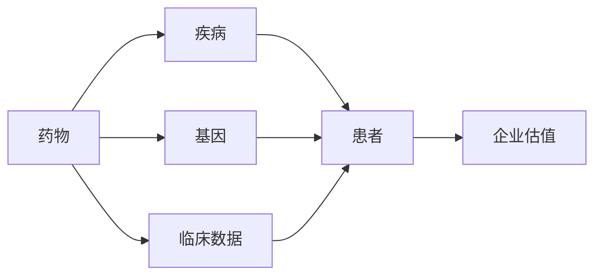
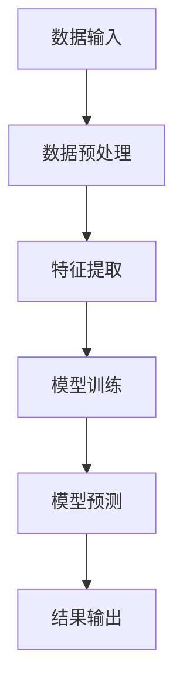
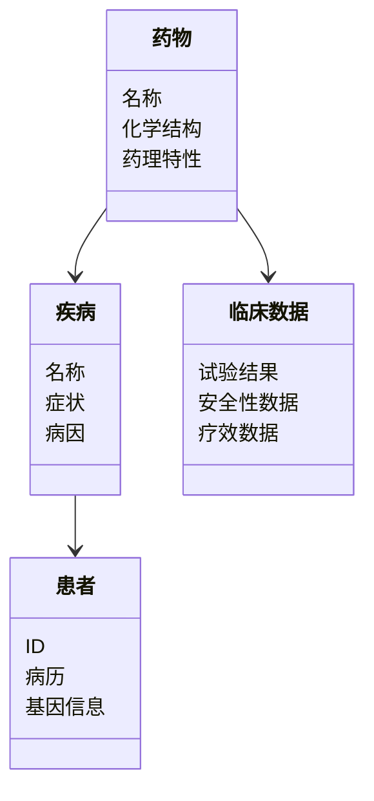
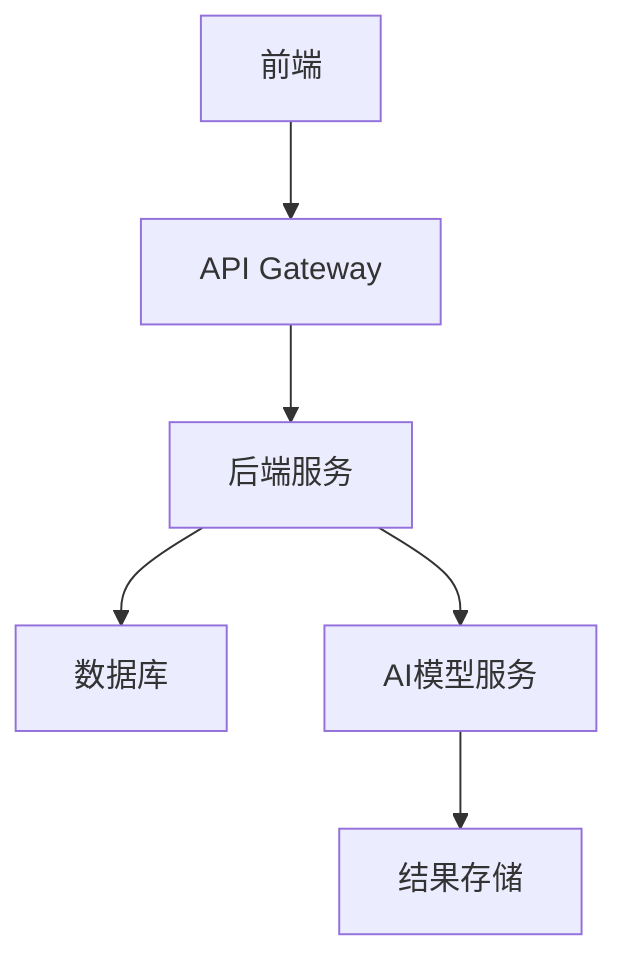
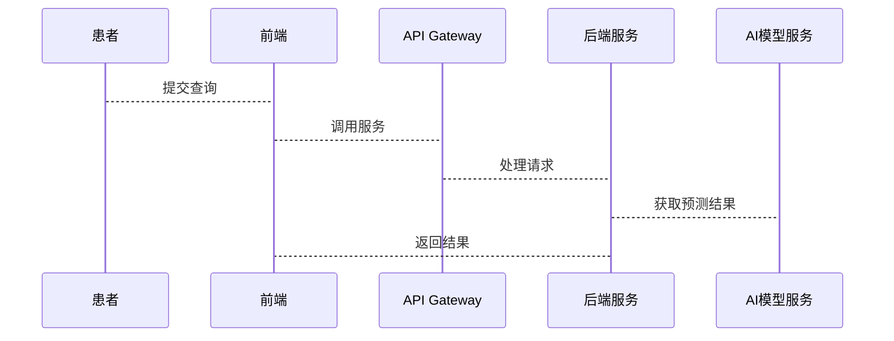

                 


# 《企业估值中的AI驱动的药物再利用平台评估》

> 关键词：企业估值，AI驱动，药物再利用，平台评估，技术博客

> 摘要：本文深入探讨了AI技术在药物再利用平台评估中的应用，分析了药物再利用的背景、核心概念、算法原理、系统架构以及实际案例。文章从理论到实践，结合技术细节和实际应用，为企业估值中的AI驱动药物再利用平台提供了全面的分析和见解。

---

# 第一部分: 企业估值中的AI驱动的药物再利用平台评估基础

## 第1章: 药物再利用平台的背景与挑战

### 1.1 药物再利用的背景与意义

#### 1.1.1 药物再利用的定义与内涵
药物再利用是指将已批准的药物用于治疗新的疾病或适应症。这种模式能够显著缩短药物研发周期、降低研发成本，并提高药物的可用性。在企业估值中，药物再利用的潜力直接影响企业的市场价值和投资吸引力。

#### 1.1.2 药物再利用的科学基础与技术挑战
现代生物医学研究的进步为药物再利用提供了科学基础，但同时也带来了技术挑战。例如，如何从海量的生物医学数据中提取有用信息，并利用这些信息发现新的药物适应症。

#### 1.1.3 药物再利用在企业估值中的价值
通过AI驱动的药物再利用平台，企业可以快速评估现有药物的潜在新用途，从而提升企业的研发效率和市场竞争力。这不仅降低了企业的估值风险，还为企业提供了额外的市场机会。

### 1.2 AI在药物再利用中的应用背景

#### 1.2.1 AI技术在生物医学领域的应用现状
AI技术在生物医学领域的应用日益广泛，从基因组学数据解析到疾病预测，再到药物研发，AI正在改变传统的医疗研发模式。

#### 1.2.2 药物再利用平台的智能化需求
为了提高药物再利用的效率和准确性，企业需要智能化的药物再利用平台，这些平台能够整合多源数据，利用AI算法进行分析和预测。

#### 1.2.3 企业估值中的数据驱动决策
通过AI驱动的药物再利用平台，企业可以基于数据进行更科学的决策，从而提升企业的估值。

### 1.3 药物再利用平台的核心问题与边界

#### 1.3.1 药物再利用的主要问题与挑战
- 数据多样性与异质性问题
- 数据隐私与安全问题
- 算法的可解释性问题
- 计算资源需求问题

#### 1.3.2 平台评估的边界与外延
药物再利用平台的评估需要考虑技术、数据、法律等多个方面的边界，例如数据来源的合法性、模型的可扩展性等。

#### 1.3.3 核心概念与关键要素的组成
- 数据来源：包括临床数据、基因组数据、蛋白质组数据等
- AI算法：包括机器学习、深度学习等
- 平台功能：包括数据处理、模型训练、结果分析等

## 第2章: AI驱动的药物再利用平台核心概念与联系

### 2.1 核心概念原理

#### 2.1.1 药物再利用的多模态数据整合
AI驱动的药物再利用平台需要整合多源异构数据，包括结构化数据和非结构化数据，通过数据融合技术提高模型的准确性。

#### 2.1.2 AI模型在药物重定位中的作用
AI模型可以基于药物的化学结构、药理特性等信息，预测药物的潜在适应症。

#### 2.1.3 平台评估的多维度指标体系
平台的评估需要考虑准确性、效率、可解释性等多个维度。

### 2.2 核心概念属性对比

#### 2.2.1 传统药物研发与AI驱动药物再利用的对比
| 对比维度 | 传统药物研发 | AI驱动药物再利用 |
|----------|----------------|-------------------|
| 时间成本 | 长 | 短 |
| 成本 | 高 | 中 |
| 效率 | 低 | 高 |

#### 2.2.2 不同AI模型在药物再利用中的性能对比
| 模型类型 | 精准度 | 效率 | 可解释性 |
|----------|---------|------|----------|
| 传统机器学习 | 中 | 高 | 高 |
| 深度学习 | 高 | 中 | 低 |

#### 2.2.3 数据来源与模型性能的关系
数据的多样性和质量直接影响模型的性能。高质量的多模态数据可以显著提高模型的预测准确性。

### 2.3 实体关系图



---

## 第3章: AI驱动的药物再利用平台算法原理

### 3.1 算法原理概述

#### 3.1.1 基于机器学习的药物相似性计算
药物相似性计算是基于机器学习的特征提取和相似性度量，例如余弦相似性。

#### 3.1.2 基于深度学习的药物特征提取
深度学习模型（如CNN、RNN）可以自动提取药物的高层次特征。

#### 3.1.3 多模态数据融合的药物重定位模型
多模态数据融合模型可以同时处理多种类型的数据，提高模型的预测能力。

### 3.2 算法流程图



### 3.3 算法实现代码

```python
import numpy as np
from sklearn.metrics.pairwise import cosine_similarity

def compute_similarity(drug_features):
    # 药物特征矩阵：假设drug_features是一个二维数组
    # 每行代表一个药物的特征向量
    # 返回一个相似性矩阵
    similarity_matrix = cosine_similarity(drug_features)
    return similarity_matrix

# 示例数据
drug_features = np.array([[0.1, 0.2, 0.3],
                          [0.4, 0.5, 0.6],
                          [0.7, 0.8, 0.9]])

# 计算相似性矩阵
similarity_matrix = compute_similarity(drug_features)

# 输出结果
print("相似性矩阵:")
print(similarity_matrix)
```

### 3.4 数学模型和公式

#### 3.4.1 余弦相似性的计算公式
$$ \text{相似性} = \frac{\vec{A} \cdot \vec{B}}{\|\vec{A}\| \|\vec{B}\|} $$

#### 3.4.2 分类模型的损失函数
$$ \text{损失函数} = -\sum_{i=1}^{n} y_i \log(p_i) + (1 - y_i)\log(1 - p_i) $$

---

## 第4章: 系统分析与架构设计方案

### 4.1 问题场景介绍

#### 4.1.1 问题描述
如何构建一个高效、准确的AI驱动的药物再利用平台，以支持企业估值。

#### 4.1.2 项目介绍
本项目旨在构建一个基于AI的药物再利用平台，通过整合多源数据，利用机器学习和深度学习技术，评估药物的潜在适应症。

### 4.2 系统功能设计

#### 4.2.1 领域模型类图



#### 4.2.2 系统架构设计



#### 4.2.3 系统接口设计
- 前端接口：RESTful API
- 后端接口：与AI模型服务交互

#### 4.2.4 系统交互流程图



---

## 第5章: 项目实战

### 5.1 环境安装

#### 5.1.1 安装Python和相关库
```bash
pip install numpy
pip install scikit-learn
pip install tensorflow
```

### 5.2 系统核心实现源代码

#### 5.2.1 数据预处理代码

```python
import pandas as pd
from sklearn.preprocessing import StandardScaler

# 读取数据
data = pd.read_csv('drug_data.csv')

# 标准化处理
scaler = StandardScaler()
scaled_data = scaler.fit_transform(data)
```

#### 5.2.2 模型训练代码

```python
from sklearn.model import LogisticRegression

# 初始化模型
model = LogisticRegression()

# 训练模型
model.fit(scaled_data, labels)
```

#### 5.2.3 模型预测代码

```python
# 进行预测
predictions = model.predict(new_data)
```

### 5.3 代码应用解读与分析

#### 5.3.1 数据预处理
数据预处理是确保模型准确性的关键步骤，包括数据清洗和特征工程。

#### 5.3.2 模型训练
使用机器学习模型进行训练，得到一个能够预测药物适应症的模型。

#### 5.3.3 模型预测
利用训练好的模型，对新的药物进行预测，得到其潜在的适应症。

### 5.4 实际案例分析和详细讲解剖析

#### 5.4.1 案例背景
某药企希望通过AI驱动的药物再利用平台，评估现有药物的潜在新用途。

#### 5.4.2 数据准备
整合临床数据、基因组数据和蛋白质组数据，构建多模态数据集。

#### 5.4.3 模型构建与训练
选择合适的机器学习模型，进行训练和优化。

#### 5.4.4 结果分析
根据模型预测结果，评估药物的潜在适应症，并生成报告。

### 5.5 项目小结

通过本项目，我们展示了如何利用AI技术构建一个高效的药物再利用平台，帮助企业快速评估药物的潜在价值，提升企业估值。

---

## 第6章: 最佳实践 tips、小结、注意事项、拓展阅读

### 6.1 最佳实践 tips

#### 6.1.1 数据质量的重要性
确保数据的准确性和完整性，是模型性能的关键。

#### 6.1.2 模型可解释性的重要性
选择具有可解释性的模型，有助于更好地理解药物的潜在适应症。

#### 6.1.3 数据隐私与安全
在处理敏感数据时，必须遵守相关法律法规，确保数据安全。

### 6.2 小结

本文详细探讨了AI驱动的药物再利用平台的评估方法，从理论到实践，为企业估值提供了有力支持。

### 6.3 注意事项

- 数据隐私与安全问题需要特别注意
- 模型的可扩展性需要在设计阶段充分考虑
- 系统的实时性和稳定性需要在实际应用中不断优化

### 6.4 拓展阅读

- 《Deep Learning for Drug Discovery》
- 《Artificial Intelligence in Healthcare》
- 《Drug Repositioning: From Data to Therapy》

---

# 结语

AI驱动的药物再利用平台评估为企业估值提供了新的思路和方法。通过整合多源数据，利用先进的AI技术，企业可以更高效地评估药物的潜在价值，降低研发风险，提升市场竞争力。

---

作者：AI天才研究院/AI Genius Institute & 禅与计算机程序设计艺术 /Zen And The Art of Computer Programming

