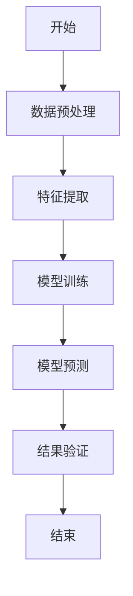
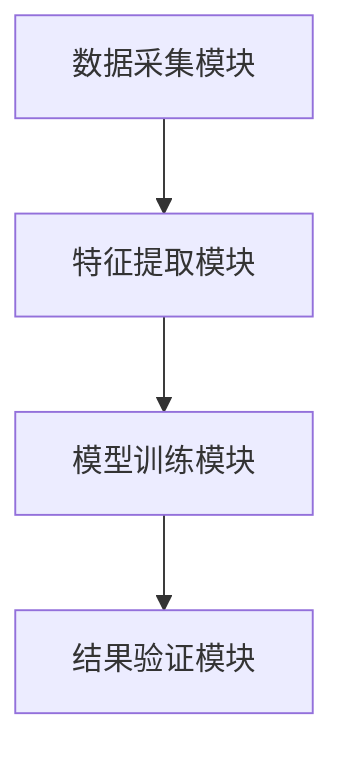
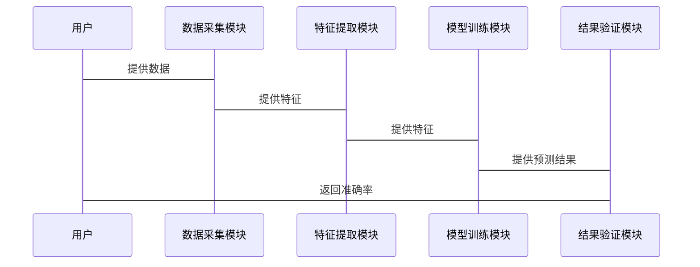

                 


# 企业估值中的AI驱动的药物重新定位平台评估

## 关键词：
- 企业估值
- AI驱动
- 药物重新定位
- 平台评估
- 算法原理
- 系统架构

## 摘要：
本文将详细探讨AI驱动的药物重新定位平台在企业估值中的应用。通过分析药物重新定位的基本概念、AI技术在其中的核心作用，以及平台的评估框架和方法，我们揭示了如何利用AI技术提升药物研发的效率和准确性，从而为企业估值提供更可靠的依据。文章从背景介绍、核心概念、算法原理、系统架构设计、项目实战到最佳实践，全面解析了AI驱动的药物重新定位平台的评估过程，为企业在药物研发和估值中的应用提供了理论支持和实践指导。

---

## 第1章: 药物重新定位与AI驱动平台的背景介绍

### 1.1 药物重新定位的基本概念
#### 1.1.1 药物重新定位的定义
药物重新定位（Drug Repositioning）是指将已知疗效的药物用于治疗新的疾病或适应症的过程。这一过程通过挖掘现有药物的潜力，降低研发成本和时间，具有重要的经济和医疗价值。

#### 1.1.2 药物重新定位的应用场景
- **孤儿病**：针对罕见病的药物研发成本高、周期长，重新定位现有药物可以有效降低研发成本。
- **药物耐药性**：通过重新定位药物，探索新的用药方案，应对药物耐药性问题。
- **市场竞争力**：企业可以通过药物重新定位，快速推出新产品，提升市场竞争力。

#### 1.1.3 药物重新定位的背景与意义
随着医疗技术的进步和数据科学的发展，药物重新定位成为药物研发的重要策略。通过AI技术的应用，可以更高效地挖掘现有药物的潜力，提升药物研发的效率和成功率。

### 1.2 AI驱动的药物重新定位平台
#### 1.2.1 AI在药物重新定位中的作用
AI技术通过分析海量的生物医学数据，识别潜在的药物-疾病关联，辅助研究人员快速发现新适应症。

#### 1.2.2 AI驱动平台的核心优势
- **数据处理能力**：AI能够快速处理和分析大量的生物医学数据，发现潜在的药物关联。
- **预测准确性**：通过机器学习算法，提高药物重新定位的预测准确性。
- **效率提升**：AI技术可以显著缩短药物重新定位的周期，降低研发成本。

#### 1.2.3 平台的边界与外延
AI驱动的药物重新定位平台不仅包括数据分析和预测功能，还涉及数据采集、清洗、建模和结果验证等环节。其外延涵盖从实验室研究到临床应用的整个药物研发过程。

### 1.3 药物重新定位平台的评估框架
#### 1.3.1 评估框架的构成
- **数据质量**：数据的完整性和准确性直接影响评估结果。
- **算法性能**：算法的准确性和效率是评估的重要指标。
- **结果验证**：通过实验或临床数据验证平台的预测结果。

#### 1.3.2 评估指标的定义
- **准确率**：预测正确的比例。
- **召回率**：预测为阳性且实际为阳性的情况占所有阳性情况的比例。
- **F1分数**：准确率和召回率的调和平均数。

#### 1.3.3 评估方法的选择
- **交叉验证**：通过多次训练和测试，评估模型的稳定性。
- **对照实验**：与传统方法进行对比，验证AI平台的优势。

---

## 第2章: AI驱动的药物重新定位平台的核心概念与联系

### 2.1 核心概念原理
#### 2.1.1 药物重新定位的原理
通过分析药物的化学结构、药理学特性和疾病靶点，识别潜在的药物-疾病关联。

#### 2.1.2 AI技术在药物重新定位中的应用
- **特征提取**：利用自然语言处理技术提取药物和疾病的相关特征。
- **关联预测**：通过机器学习模型预测药物与疾病之间的关联。

#### 2.1.3 平台的整体架构
AI驱动的药物重新定位平台通常包括数据采集、特征提取、模型训练和结果验证四个主要环节。

### 2.2 核心概念属性特征对比
#### 2.2.1 药物重新定位与传统药物研发的对比
| **对比维度** | **传统药物研发** | **药物重新定位** |
|---------------|-------------------|------------------|
| 研发周期       | 较长              | 较短             |
| 成本           | 较高              | 较低             |
| 成功率         | 较低              | 较高             |

#### 2.2.2 AI驱动平台与传统平台的对比
| **对比维度** | **传统平台** | **AI驱动平台** |
|---------------|---------------|-----------------|
| 数据处理能力 | 有限           | 强大             |
| 研发效率       | 低             | 高               |
| 成本           | 高             | 低               |

#### 2.2.3 平台性能的对比分析
通过对比分析可以发现，AI驱动的药物重新定位平台在数据处理能力、研发效率和成本控制方面具有显著优势。

### 2.3 ER实体关系图架构
```mermaid
erDiagram
    药物分子表 {
        <属性> 分子结构
        <属性> 药理特性
    }
    疾病靶点表 {
        <属性> 靶点名称
        <属性> 疾病类型
    }
    实验数据表 {
        <属性> 实验结果
        <属性> 数据来源
    }
    药物分子表 --> 实验数据表
    疾病靶点表 --> 实验数据表
```

---

## 第3章: AI驱动的药物重新定位平台的算法原理

### 3.1 算法原理概述
#### 3.1.1 算法的核心思想
通过机器学习模型，利用药物的化学特征和疾病靶点的生物特征，预测药物与疾病之间的关联。

#### 3.1.2 算法的主要步骤
1. 数据预处理：清洗和标准化数据。
2. 特征提取：提取药物和疾病的相关特征。
3. 模型训练：训练分类器，预测药物与疾病之间的关联。
4. 结果验证：通过实验或临床数据验证模型的准确性。

#### 3.1.3 算法的优缺点
- **优点**：高效、准确。
- **缺点**：依赖数据质量和模型选择。

### 3.2 算法流程图


### 3.3 算法实现
#### 3.3.1 代码实现
```python
from sklearn.svm import SVC
from sklearn.model_selection import train_test_split
from sklearn.metrics import accuracy_score

# 数据预处理
X_train, X_test, y_train, y_test = train_test_split(X, y, test_size=0.2)

# 模型训练
model = SVC()
model.fit(X_train, y_train)

# 模型预测
y_pred = model.predict(X_test)

# 结果验证
accuracy = accuracy_score(y_test, y_pred)
print(f"准确率：{accuracy}")
```

#### 3.3.2 数学模型和公式
支持向量机（SVM）是一种常用的分类算法，其目标函数为：
$$ \min_{w,b} \frac{1}{2}||w||^2 + C \sum_{i=1}^{n} \xi_i $$
其中，$w$ 是权重向量，$b$ 是偏置，$C$ 是惩罚参数，$\xi_i$ 是松弛变量。

---

## 第4章: 系统分析与架构设计方案

### 4.1 问题场景介绍
药物重新定位平台需要处理大量的生物医学数据，包括药物分子数据、疾病靶点数据和实验数据等。

### 4.2 系统功能设计
#### 4.2.1 功能模块
- 数据采集模块：采集药物分子数据、疾病靶点数据和实验数据。
- 特征提取模块：提取药物和疾病的相关特征。
- 模型训练模块：训练机器学习模型，预测药物与疾病之间的关联。
- 结果验证模块：验证模型的准确性和可靠性。

#### 4.2.2 系统架构图


### 4.3 系统架构设计
#### 4.3.1 系统架构
- **前端**：用户界面，展示数据和结果。
- **后端**：处理数据和模型训练。
- **数据库**：存储药物分子数据、疾病靶点数据和实验数据。

#### 4.3.2 系统交互序列图


---

## 第5章: 项目实战

### 5.1 环境安装
- **Python**：安装Python 3.8及以上版本。
- **机器学习库**：安装scikit-learn、pandas、numpy等库。
- **可视化工具**：安装Matplotlib、Seaborn等库。

### 5.2 核心代码实现
#### 5.2.1 数据预处理
```python
import pandas as pd
import numpy as np

# 读取数据
data = pd.read_csv('drug_repositioning.csv')

# 数据清洗
data = data.dropna()
```

#### 5.2.2 特征提取
```python
from sklearn.preprocessing import StandardScaler

# 标准化数据
scaler = StandardScaler()
X = scaler.fit_transform(data.drop('label', axis=1))
y = data['label']
```

#### 5.2.3 模型训练
```python
from sklearn.svm import SVC

# 训练模型
model = SVC()
model.fit(X_train, y_train)
```

#### 5.2.4 结果验证
```python
from sklearn.metrics import confusion_matrix, classification_report

# 验证结果
y_pred = model.predict(X_test)
print(classification_report(y_test, y_pred))
```

### 5.3 实际案例分析
假设我们有一个包含1000种药物和10种疾病的数据库，通过AI驱动的药物重新定位平台，我们可以快速预测每种药物可能的疾病适应症。

### 5.4 项目小结
通过实际案例分析，我们可以看到AI驱动的药物重新定位平台在企业估值中的巨大潜力。利用AI技术，企业可以更高效地发现新适应症，提升药物研发的效率和成功率。

---

## 第6章: 最佳实践 tips、小结、注意事项、拓展阅读

### 6.1 小结
AI驱动的药物重新定位平台为企业估值提供了强有力的技术支持。通过高效的数据处理能力和精准的预测模型，企业可以更快地发现新适应症，降低研发成本，提升市场竞争力。

### 6.2 注意事项
- 数据质量直接影响模型的准确性，需确保数据的完整性和准确性。
- 模型的选择需结合实际应用场景，选择合适的算法。
- 结果验证是关键步骤，需通过实验或临床数据验证模型的准确性。

### 6.3 拓展阅读
- 《机器学习在药物研发中的应用》
- 《AI驱动的药物发现与开发》
- 《药物重新定位的理论与实践》

---

## 作者：AI天才研究院/AI Genius Institute & 禅与计算机程序设计艺术 /Zen And The Art of Computer Programming

