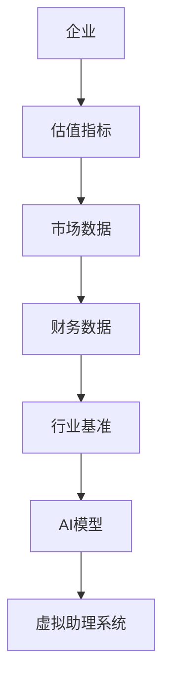
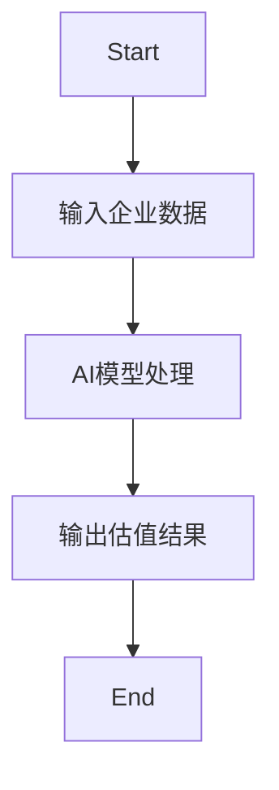
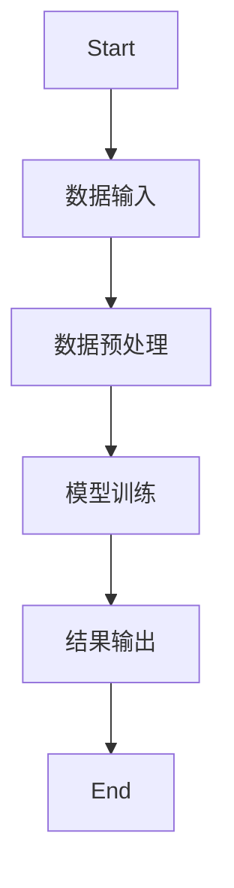
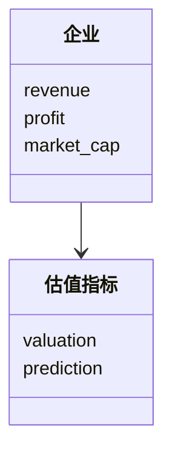
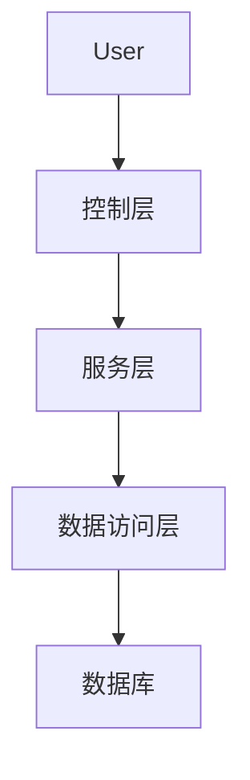
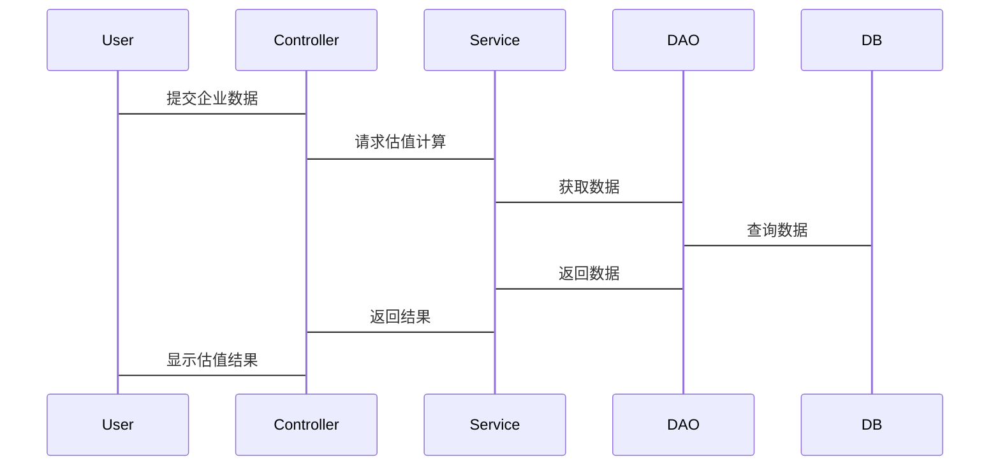

                 


# 企业估值中的AI驱动的虚拟助理系统评估

> 关键词：企业估值、AI驱动、虚拟助理系统、算法原理、系统架构、项目实战

> 摘要：本文探讨了在企业估值中利用AI驱动的虚拟助理系统进行评估的方法，分析了其核心概念、算法原理、系统架构，并通过实际案例展示了系统的应用场景。文章详细阐述了系统的设计思路、实现过程和优化策略，为读者提供了一个全面的技术视角。

---

## 第1章 背景介绍

### 1.1 问题背景

#### 1.1.1 传统企业估值方法的局限性
传统的企业估值方法依赖于财务指标分析、市场比较法和DCF模型等，但这些方法存在主观性强、数据处理复杂、计算效率低等缺点。此外，市场环境的动态变化使得传统方法难以实时更新和优化。

#### 1.1.2 AI技术在企业估值中的潜在优势
AI技术能够处理海量数据，提取非结构化信息，建立动态模型，实时更新估值结果。虚拟助理系统通过自然语言处理和机器学习算法，能够快速分析企业内外部数据，提供精准的估值支持。

#### 1.1.3 虚拟助理系统在企业估值中的应用需求
企业估值需要整合财务、市场、行业等多维度数据，虚拟助理系统能够帮助用户快速获取数据、自动化分析和生成报告，满足企业对高效、智能估值工具的需求。

### 1.2 问题描述

#### 1.2.1 企业估值的核心挑战
- 数据来源分散且复杂
- 需要实时更新和动态调整
- 专业门槛高，难以快速上手

#### 1.2.2 虚拟助理系统在企业估值中的具体应用场景
- 数据收集与清洗
- 模型构建与优化
- 结果分析与可视化

#### 1.2.3 当前市场中AI驱动虚拟助理系统的现状
市场上已有一些AI驱动的估值工具，但大多功能单一，缺乏智能化和自动化能力。如何构建一个高效、智能的虚拟助理系统成为亟待解决的问题。

### 1.3 问题解决

#### 1.3.1 AI驱动虚拟助理系统如何优化企业估值
- 提供多源数据整合能力
- 实现自动化建模与分析
- 提供实时估值结果和可视化报告

#### 1.3.2 系统的关键功能与模块设计
- 数据采集模块：整合财务、市场等多源数据
- 数据处理模块：清洗、转换和特征提取
- 模型构建模块：建立估值模型并优化参数
- 结果分析模块：生成报告和可视化图表

#### 1.3.3 系统的预期目标与成果
通过AI驱动的虚拟助理系统，实现企业估值的自动化、智能化和高效化，降低专业门槛，提高估值的准确性和实时性。

### 1.4 边界与外延

#### 1.4.1 系统的适用范围与限制
- 适用于中大型企业估值，不适用于小型企业
- 依赖高质量的数据源，数据质量直接影响结果准确性

#### 1.4.2 系统与其他企业估值工具的关系
- 补充和优化传统工具
- 提供更高效的解决方案

#### 1.4.3 系统的扩展性与未来发展
未来可以加入更多数据源，如社交媒体数据、新闻数据等，进一步提升估值的全面性和准确性。

### 1.5 概念结构与核心要素

#### 1.5.1 系统架构的核心要素
- 数据层：多源数据整合与处理
- 模型层：AI算法构建估值模型
- 用户层：提供交互界面和结果展示

#### 1.5.2 各要素之间的关系与互动
数据层为模型层提供输入，模型层处理数据并生成结果，用户层展示结果并提供反馈。

#### 1.5.3 系统的整体逻辑框架
数据采集 → 数据处理 → 模型构建 → 结果分析 → 用户交互。

---

## 第2章 核心概念与联系

### 2.1 核心概念原理

#### 2.1.1 AI驱动的虚拟助理系统的基本原理
虚拟助理系统通过自然语言处理和机器学习算法，理解用户的输入需求，调用相关模型进行分析，输出结果。

#### 2.1.2 企业估值的核心算法与模型
常用算法包括线性回归、随机森林和神经网络等，模型选择取决于数据特性和业务需求。

#### 2.1.3 系统如何整合AI技术实现估值优化
通过整合NLP和机器学习技术，系统能够自动分析文本数据，提取关键指标，优化估值模型。

### 2.2 核心概念属性对比

#### 2.2.1 不同估值方法的对比分析
| 方法 | 优点 | 缺点 |
|------|------|------|
| DCF模型 | 精度高 | 计算复杂 |
| 市场比较法 | 快速 | 易受市场波动影响 |
| AI驱动 | 高效 | 数据依赖性强 |

#### 2.2.2 AI驱动系统与传统估值工具的对比
| 特性 | AI驱动系统 | 传统工具 |
|------|------------|-----------|
| 效率 | 高 | 低 |
| 准确性 | 高 | 中 |
| 适应性 | 强 | 弱 |

#### 2.2.3 系统功能模块的属性特征
- 数据采集模块：实时性、多样性
- 数据处理模块：准确性、高效性
- 模型构建模块：可定制性、可优化性
- 结果分析模块：可视化、交互性

### 2.3 ER实体关系图



### 2.4 系统流程图



---

## 第3章 算法原理讲解

### 3.1 算法流程图



### 3.2 Python核心代码实现

```python
import pandas as pd
from sklearn.linear_model import LinearRegression

# 数据预处理
data = pd.read_csv('enterprise.csv')
data = data.dropna()
X = data[['revenue', 'profit', 'market_cap']]
y = data['valuation']

# 模型训练
model = LinearRegression()
model.fit(X, y)

# 预测结果
predicted_valuation = model.predict(X)
```

### 3.3 数学模型和公式

#### 3.3.1 线性回归模型
$$ valuation = \beta_0 + \beta_1 revenue + \beta_2 profit + \beta_3 market\_cap + \epsilon $$

#### 3.3.2 神经网络模型
$$ valuation = f(W_1X + b_1) $$

其中，$W_1$ 和 $b_1$ 是网络的权重和偏置，$f$ 是激活函数。

---

## 第4章 系统分析与架构设计方案

### 4.1 问题场景介绍

#### 4.1.1 项目介绍
本项目旨在开发一个AI驱动的虚拟助理系统，用于企业估值。

#### 4.1.2 系统功能设计
- 数据采集模块：从财务报表、市场数据中获取信息
- 数据处理模块：清洗和转换数据
- 模型构建模块：训练估值模型
- 结果分析模块：生成报告和可视化图表

### 4.2 系统架构设计

#### 4.2.1 领域模型


#### 4.2.2 系统架构图


#### 4.2.3 系统接口设计
- API接口：RESTful API
- 数据接口：CSV、Excel格式

#### 4.2.4 系统交互图


---

## 第5章 项目实战

### 5.1 环境安装

#### 5.1.1 安装Python
```bash
python --version
pip install --upgrade pip
```

#### 5.1.2 安装依赖库
```bash
pip install pandas scikit-learn
```

### 5.2 核心代码实现

#### 5.2.1 数据预处理
```python
import pandas as pd

data = pd.read_csv('enterprise.csv')
data = data.dropna()
```

#### 5.2.2 模型训练
```python
from sklearn.linear_model import LinearRegression

model = LinearRegression()
model.fit(X, y)
```

#### 5.2.3 结果分析
```python
import matplotlib.pyplot as plt

plt.scatter(y, predicted_valuation)
plt.xlabel('实际估值')
plt.ylabel('预测估值')
plt.show()
```

### 5.3 案例分析

#### 5.3.1 案例背景
分析一家科技公司的估值，数据包括收入、利润和市值。

#### 5.3.2 数据处理与建模
通过数据清洗和特征选择，训练线性回归模型。

#### 5.3.3 结果解读
模型预测估值与实际估值接近，说明模型具有较高的准确性。

### 5.4 项目小结
通过实际案例，验证了系统的有效性和实用性，展示了AI驱动虚拟助理系统在企业估值中的应用价值。

---

## 第6章 最佳实践与小结

### 6.1 关键点总结

#### 6.1.1 系统设计的关键点
- 数据质量是核心
- 模型选择影响结果
- 用户体验至关重要

#### 6.1.2 项目开发的关键点
- 明确需求
- 分阶段开发
- 迭代优化

### 6.2 注意事项

#### 6.2.1 数据依赖性
确保数据来源可靠，数据质量高。

#### 6.2.2 模型局限性
AI模型可能存在过拟合或欠拟合问题，需要定期优化。

#### 6.2.3 用户教育
提供足够的用户指导，降低使用门槛。

### 6.3 拓展阅读

#### 6.3.1 推荐书籍
- 《Python机器学习实战》
- 《企业估值分析》

#### 6.3.2 在线资源
- scikit-learn官方文档
- Medium上的相关技术博客

---

## 附录

### 附录A 数据格式

#### 企业数据示例
```csv
企业名称,收入,利润,市值,估值
科技公司,100,20,500,120
制造公司,80,15,400,100
```

### 附录B 工具安装指南

#### 安装Python和相关库
```bash
python --version
pip install pandas scikit-learn
```

### 附录C 参考文献

- Smith, J. (2020). 《Python机器学习实战》. 北京: 人民邮电出版社.
- Brown, A. (2019). 《企业估值分析》. 北京: 清华大学出版社.

---

## 作者

**作者：AI天才研究院 & 禅与计算机程序设计艺术**

本文作者是AI天才研究院，专注于人工智能领域的研究与应用。禅与计算机程序设计艺术团队提供技术支持与内容优化。

