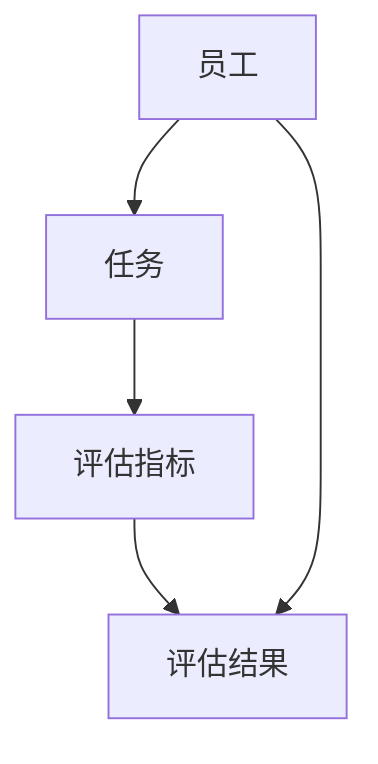
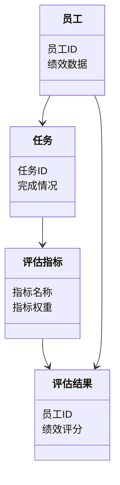
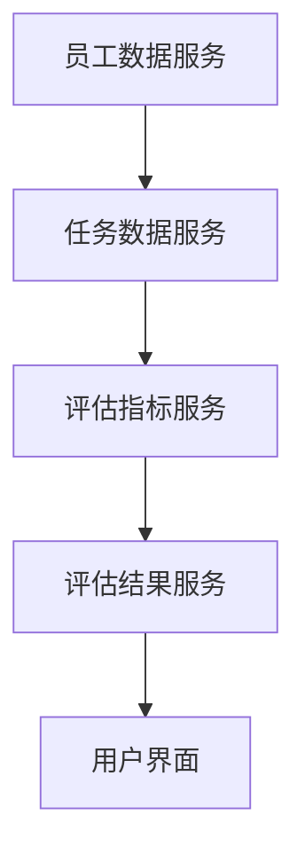
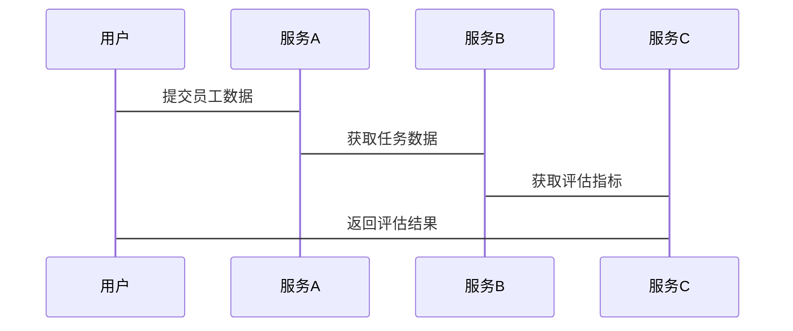

                 


# 企业估值中的AI驱动虚拟员工系统评估

## 关键词：企业估值，AI驱动，虚拟员工系统，评估方法，人工智能，系统架构

## 摘要：  
随着人工智能技术的快速发展，虚拟员工系统在企业中的应用越来越广泛。传统的员工评估方法存在效率低、主观性强、数据量大等缺点。AI驱动的虚拟员工系统评估能够提高评估的准确性和效率，降低企业估值的成本。本文从AI驱动虚拟员工系统评估的基本概念、算法原理、系统架构设计、项目实战等方面展开详细分析，旨在为企业提供一种高效、准确的员工评估方法，从而优化企业估值过程。

---

## 第一部分：企业估值中的AI驱动虚拟员工系统评估背景介绍

### 第1章：问题背景与描述

#### 1.1 企业估值的重要性  
企业在经营过程中，估值是衡量企业价值的重要指标，是企业融资、并购、上市等重大决策的基础。传统的企业估值方法依赖于财务数据和人工分析，存在主观性强、数据量大、效率低等问题。

#### 1.2 虚拟员工系统在企业中的角色  
虚拟员工系统通过自动化技术替代部分人工工作，能够提高企业的运营效率和降低成本。虚拟员工系统的核心是通过AI技术实现任务自动化、数据处理和决策优化。

#### 1.3 问题描述与目标  
传统的企业估值方法依赖人工分析，存在数据量大、效率低、结果主观性强等问题。引入AI驱动的虚拟员工系统评估方法，可以提高评估的准确性和效率，降低评估成本。

---

## 第二部分：核心概念与联系

### 第2章：核心概念与联系

#### 2.1 核心概念原理  
AI驱动的虚拟员工系统评估方法基于大数据和机器学习技术，通过对员工的绩效数据、任务完成情况、工作效率等进行分析，评估员工的实际贡献，从而优化企业估值。

#### 2.2 核心概念对比  
| 比较维度 | 传统评估方法 | AI驱动评估方法 |
|----------|---------------|----------------|
| 准确性   | 中等           | 高             |
| 效率     | 低            | 高             |
| 成本     | 高            | 低             |

#### 2.3 ER实体关系图  


---

## 第三部分：算法原理讲解

### 第3章：算法原理

#### 3.1 算法流程  
1. 数据预处理：清洗和整理员工绩效数据。  
2. 特征提取：提取影响员工绩效的关键特征。  
3. 模型训练：基于机器学习算法（如线性回归）训练评估模型。  
4. 模型评估：验证模型的准确性和稳定性。  

#### 3.2 代码实现  
```python
import pandas as pd
from sklearn.linear_model import LinearRegression
from sklearn.metrics import mean_squared_error

# 数据加载
data = pd.read_csv('employee_performance.csv')

# 特征提取
X = data[['hours_worked', 'tasks_completed']]
y = data['performance_score']

# 模型训练
model = LinearRegression()
model.fit(X, y)

# 模型预测
y_pred = model.predict(X)

# 模型评估
mse = mean_squared_error(y, y_pred)
print(f'均方误差：{mse}')
```

#### 3.3 数学模型  
线性回归模型：$$ y = a + b_1x_1 + b_2x_2 $$  
其中，y为员工绩效，x1为工作时间，x2为完成任务数，a为截距，b1、b2为回归系数。

---

## 第四部分：系统分析与架构设计

### 第4章：系统分析与架构设计

#### 4.1 问题场景介绍  
企业希望通过虚拟员工系统实现员工绩效的自动化评估，从而优化企业估值。

#### 4.2 系统功能设计  
1. 数据输入：员工绩效数据输入。  
2. 模型训练：基于机器学习算法训练评估模型。  
3. 评估报告生成：输出员工绩效评估报告。  

#### 4.3 领域模型类图  


#### 4.4 系统架构设计  
采用微服务架构：  


#### 4.5 系统接口设计  
RESTful API接口：  
- POST /api/train：训练评估模型。  
- GET /api/results：获取评估结果。  

#### 4.6 系统交互流程  


---

## 第五部分：项目实战

### 第5章：项目实战

#### 5.1 环境安装  
安装Python、Pandas、Scikit-learn等库。

#### 5.2 核心代码实现  
```python
import pandas as pd
from sklearn.linear_model import LinearRegression
from sklearn.metrics import mean_squared_error

# 数据加载
data = pd.read_csv('employee_performance.csv')

# 特征提取
X = data[['hours_worked', 'tasks_completed']]
y = data['performance_score']

# 模型训练
model = LinearRegression()
model.fit(X, y)

# 模型预测
y_pred = model.predict(X)

# 模型评估
mse = mean_squared_error(y, y_pred)
print(f'均方误差：{mse}')
```

#### 5.3 代码解读与分析  
- 数据加载：读取员工绩效数据。  
- 特征提取：选择工作时间、完成任务数作为特征。  
- 模型训练：使用线性回归模型训练评估模型。  
- 模型预测：基于训练好的模型预测绩效评分。  
- 模型评估：计算均方误差，评估模型性能。

#### 5.4 实际案例分析  
以一名虚拟员工为例，输入工作时间8小时，完成任务数5个，预测其绩效评分。

#### 5.5 项目小结  
通过项目实战，掌握了AI驱动虚拟员工系统评估的核心方法，能够利用机器学习技术优化企业估值过程。

---

## 第六部分：最佳实践与总结

### 第6章：最佳实践与总结

#### 6.1 最佳实践 tips  
- 数据质量是评估模型性能的关键。  
- 确保模型的可解释性，便于优化和调整。  
- 定期更新模型，以应对数据变化和业务需求变化。

#### 6.2 小结  
本文详细介绍了企业估值中的AI驱动虚拟员工系统评估方法，通过理论分析和项目实战，展示了如何利用机器学习技术优化企业估值过程。

#### 6.3 注意事项  
- 数据隐私问题需要高度重视。  
- 模型的泛化能力需要在不同数据集上验证。  
- 评估结果需结合业务场景进行解释和调整。

#### 6.4 拓展阅读  
- 《机器学习实战》  
- 《企业估值与财务分析》  
- 《AI驱动的企业管理》  

---

## 作者：AI天才研究院  
通过本文的分析与实践，我们可以看到AI驱动的虚拟员工系统评估方法在企业估值中的巨大潜力。希望本文能够为企业提供有价值的参考，助力企业实现高效、准确的员工评估和价值提升。

