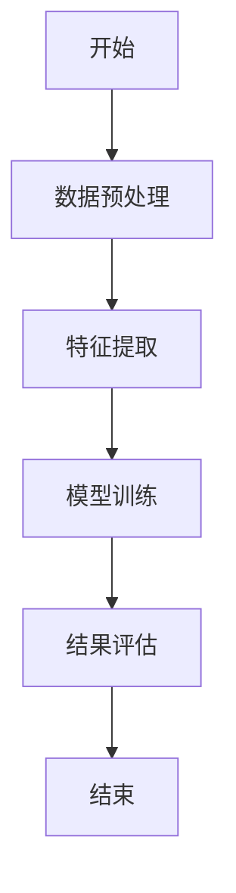
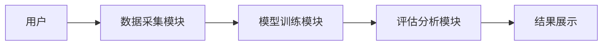
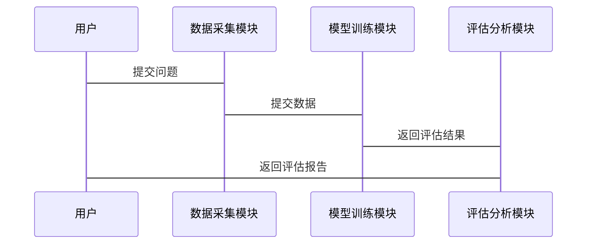

                 


# 企业估值中的AI驱动的虚拟客服系统评估

## 关键词：
- 企业估值
- AI驱动
- 虚拟客服系统
- 算法原理
- 系统架构

## 摘要：
本文深入探讨了AI驱动的虚拟客服系统在企业估值中的应用，分析了其核心概念、算法原理、系统架构，并通过实际案例展示了如何利用这些技术提升企业估值。文章从背景介绍到项目实战，全面解析了AI在虚拟客服系统评估中的作用，为企业和技术人员提供了实用的参考。

---

## 第一部分: 企业估值与AI驱动的虚拟客服系统概述

### 第1章: 背景与问题背景

#### 1.1 企业估值的现状与挑战
企业估值是企业战略决策中的核心问题之一，传统的估值方法依赖于财务指标和市场分析，但随着市场竞争的加剧和客户需求的多样化，企业需要更精准的评估方法。虚拟客服系统作为企业与客户互动的重要工具，其表现直接影响客户满意度和企业形象，进而影响企业估值。

#### 1.2 虚拟客服系统在企业中的作用
虚拟客服系统通过自动化方式处理客户咨询、问题解决和订单跟踪，显著提高了客户服务效率。然而，如何量化虚拟客服系统对企业估值的影响，是当前企业面临的重要挑战。

#### 1.3 AI技术对企业估值的影响
AI技术的应用使得虚拟客服系统能够更智能地处理客户需求，通过分析客户行为数据，帮助企业更准确地评估客户价值和市场潜力。

---

### 第2章: AI驱动的虚拟客服系统评估的核心概念

#### 2.1 核心概念与原理
AI驱动的虚拟客服系统评估基于自然语言处理（NLP）和机器学习技术，通过分析客户对话数据，评估系统的响应速度、准确性和客户满意度。

#### 2.2 系统评估的关键指标
- 响应时间：系统对客户问题的平均响应时间。
- 准确率：系统正确理解客户问题的能力。
- 客户满意度：客户对系统服务的满意度评分。

#### 2.3 企业估值与客服系统的关系
企业的估值不仅取决于财务表现，还与其客户服务质量密切相关。通过优化虚拟客服系统，企业可以提高客户满意度，进而提升品牌价值和市场竞争力。

---

## 第二部分: AI驱动的虚拟客服系统评估的算法原理

### 第3章: 算法原理概述

#### 3.1 自然语言处理模型
自然语言处理（NLP）技术用于分析客户的文本输入，提取关键词和意图。常用的模型包括词袋模型（Bag-of-Words）和词嵌入模型（如Word2Vec）。

#### 3.2 机器学习算法
机器学习算法用于训练分类模型，识别客户问题的类别和优先级。常用的算法包括支持向量机（SVM）和随机森林（Random Forest）。

#### 3.3 深度学习模型
深度学习模型如循环神经网络（RNN）和长短期记忆网络（LSTM）用于处理长文本序列，提高对话理解的准确性。

---

### 第4章: 算法流程图



---

### 第5章: 核心算法的数学模型

#### 5.1 词嵌入模型（Word2Vec）
词嵌入模型通过将词语映射到低维向量空间，捕捉词语之间的语义关系。其目标函数如下：
$$
\text{目标函数} = -\log(p(w_i|w_{i-1})) + \sum_{k=1}^n \log(p(w_k))
$$

#### 5.2 循环神经网络（RNN）
循环神经网络用于处理序列数据，其前向传播公式为：
$$
h_t = \tanh(W_{hh}h_{t-1} + W_{xh}x_t + b_h)
$$

#### 5.3 长短期记忆网络（LSTM）
长短期记忆网络通过记忆单元（Cell）和门控机制处理长序列数据，其结构如下：
$$
i_t = \sigma(W_{xi}x_t + W_{hi}h_{t-1} + b_i)
$$
$$
f_t = \sigma(W_{xf}x_t + W_{hf}h_{t-1} + b_f)
$$
$$
o_t = \sigma(W_{xo}x_t + W_{ho}h_{t-1} + b_o)
$$
$$
c_t = f_t \cdot c_{t-1} + i_t \cdot tanh(W_{xc}x_t + W_{hc}h_{t-1} + b_c)
$$
$$
h_t = o_t \cdot tanh(c_t)
$$

---

## 第三部分: 系统分析与架构设计

### 第6章: 系统分析

#### 6.1 问题场景介绍
本文设计了一个基于AI的虚拟客服系统评估平台，用于分析系统的响应时间、准确率和客户满意度，并将其与企业估值相关联。

#### 6.2 系统功能设计
系统功能包括数据采集、模型训练、评估分析和结果展示。

#### 6.3 系统架构图


---

### 第7章: 系统架构设计

#### 7.1 系统功能模块
- 数据采集模块：收集客户对话数据和系统日志。
- 模型训练模块：训练NLP和机器学习模型。
- 评估分析模块：分析系统性能并生成评估报告。

#### 7.2 系统架构图


---

### 第8章: 系统接口设计

#### 8.1 系统接口设计
系统提供API接口，供其他系统调用评估结果。

#### 8.2 系统交互流程


---

## 第四部分: 项目实战与案例分析

### 第9章: 项目实战

#### 9.1 环境安装
安装Python、TensorFlow和Keras库：
```bash
pip install numpy pandas tensorflow keras
```

#### 9.2 核心代码实现
以下是实现虚拟客服系统评估的核心代码示例：
```python
import numpy as np
from tensorflow.keras import layers

# 数据预处理
def preprocess(data):
    # 对文本数据进行分词和向量化处理
    pass

# 模型训练
def train_model(data):
    model = keras.Sequential()
    model.add(layers.Embedding(input_dim= vocabulary_size, output_dim= embedding_dim))
    model.add(layers.LSTM(units= lstm_units))
    model.add(layers.Dense(units=1, activation='sigmoid'))
    model.compile(optimizer='adam', loss='binary_crossentropy', metrics=['accuracy'])
    model.fit(data, labels, epochs=10, batch_size=32)
    return model

# 结果评估
def evaluate_model(model, test_data):
    loss, accuracy = model.evaluate(test_data, test_labels)
    print(f"Loss: {loss}, Accuracy: {accuracy}")
```

---

### 第10章: 案例分析

#### 10.1 案例背景
某电商平台希望通过优化虚拟客服系统，提高客户满意度并提升企业估值。

#### 10.2 实施步骤
1. 数据采集：收集过去6个月的客户对话数据。
2. 数据预处理：清洗和标注数据。
3. 模型训练：训练NLP模型，识别客户问题类别。
4. 系统评估：分析系统准确率和客户满意度。

---

## 第五部分: 总结与展望

### 第11章: 总结与展望

#### 11.1 研究成果总结
本文通过分析AI驱动的虚拟客服系统评估方法，提出了基于NLP和机器学习的解决方案，并通过实际案例验证了其有效性。

#### 11.2 未来研究方向
未来可以进一步优化模型，引入强化学习技术，提高系统的智能性。同时，需要关注数据隐私保护和模型可解释性问题。

---

## 作者：
AI天才研究院/AI Genius Institute  
禅与计算机程序设计艺术 /Zen And The Art of Computer Programming

