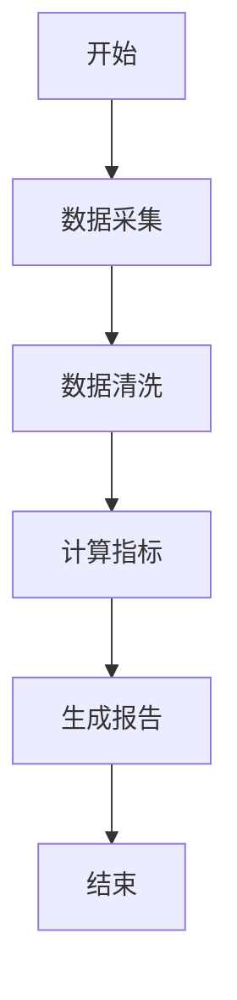
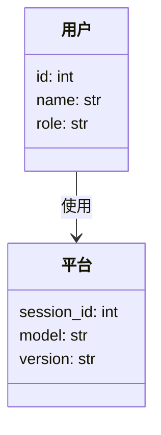
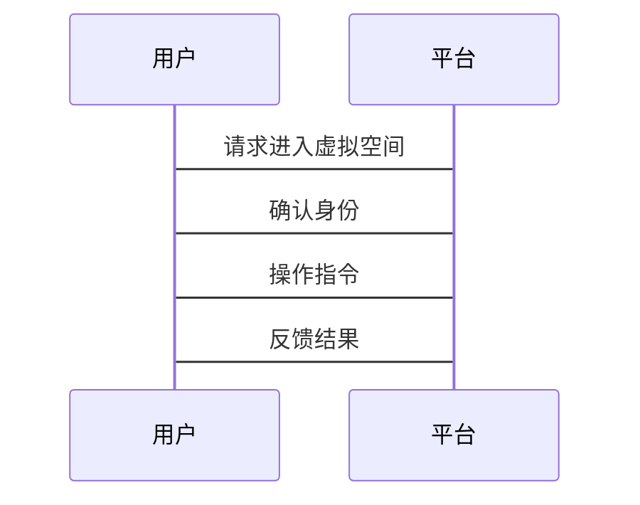

                 


# 企业估值中的AR/VR协作办公平台评估

## 关键词：企业估值, AR/VR, 协作办公, 技术评估, 数字化转型

## 摘要：  
在数字化转型的浪潮中，AR/VR技术正在改变企业协作办公的方式。本文系统地探讨了如何在企业估值过程中评估AR/VR协作办公平台的价值。通过分析AR/VR技术的核心原理、协作办公平台的功能特点，以及企业估值的关键指标，本文提出了基于AR/VR技术的协作办公平台评估模型，并结合实际案例进行了详细分析。文章最后总结了评估的关键点和未来的发展趋势。

---

# 第一部分: 企业估值中的AR/VR协作办公平台评估基础

## 第1章: AR/VR协作办公平台概述

### 1.1 问题背景与重要性

#### 1.1.1 问题背景
在现代企业中，协作办公已成为提升效率和竞争力的关键因素。然而，传统的协作工具（如邮件、即时通讯）往往难以满足复杂场景下的需求。AR/VR技术的出现，为企业提供了一种更直观、沉浸式的协作方式。

#### 1.1.2 问题描述
AR/VR协作办公平台通过虚拟空间中的三维建模和实时交互，解决了传统协作工具在空间感知和团队协作中的局限性。然而，如何量化这些平台对企业价值的影响，成为企业估值中的一个重要问题。

#### 1.1.3 问题解决
通过评估AR/VR协作办公平台的功能、用户体验和性能，可以量化其对企业效率和生产力的提升，从而为企业的估值提供依据。

#### 1.1.4 边界与外延
AR/VR协作办公平台的评估应聚焦于其在企业协作中的实际应用价值，而不包括企业其他业务的评估。

#### 1.1.5 核心要素组成
AR/VR协作办公平台的核心要素包括：三维空间建模、实时交互、用户界面设计、数据安全性等。

### 1.2 AR/VR协作办公平台的核心概念

#### 1.2.1 AR/VR技术的基本原理
AR（增强现实）通过将虚拟信息叠加到真实环境中，而VR（虚拟现实）则创建完全沉浸式的虚拟环境。两者的核心原理都是基于计算机图形学和实时渲染技术。

#### 1.2.2 协作办公平台的功能特点
- **空间协作**：用户可以在虚拟空间中共同编辑文档、设计产品。
- **实时互动**：支持语音、视频和手势交互。
- **数据同步**：确保所有用户的操作实时同步。

#### 1.2.3 企业估值的关键指标
- **效率提升**：平台对员工工作效率的提升幅度。
- **成本节约**：通过减少差旅和会议成本。
- **创新潜力**：平台对企业创新能力和市场竞争力的提升。

---

## 第2章: AR/VR协作办公平台的核心概念与联系

### 2.1 核心概念原理

#### 2.1.1 AR/VR技术的原理
AR/VR技术依赖于计算机图形学、传感器技术和网络通信。例如，VR头显通过陀螺仪和加速度计捕捉用户的动作，并通过渲染引擎生成实时画面。

#### 2.1.2 协作办公平台的运作机制
用户通过头显或手机设备进入虚拟空间，借助云服务器进行实时协作。

#### 2.1.3 企业估值的数学模型
企业估值可以基于以下公式：
$$
V = \sum_{i=1}^{n} w_i \cdot v_i
$$
其中，\( V \) 是总估值，\( w_i \) 是指标 \( i \) 的权重，\( v_i \) 是指标 \( i \) 的评分。

### 2.2 核心概念属性特征对比

表2.1: AR/VR协作办公平台与传统协作办公平台的对比

| 特性               | 传统协作办公 | AR/VR协作办公 |
|--------------------|---------------|----------------|
| 空间感知能力       | 低            | 高              |
| 实时交互能力       | 有限          | 高              |
| 用户体验           | 简单          | 沉浸式          |
| 技术复杂度         | 低            | 高              |

### 2.3 ER实体关系图

```mermaid
er
    actor: 用户
    platform: 协作办公平台
    metric: 评估指标
    relation: 用户与平台通过评估指标进行交互
```

---

## 第3章: AR/VR协作办公平台的评估算法原理

### 3.1 算法原理概述

#### 3.1.1 AR/VR协作办公平台评估的基本流程
1. 数据采集：收集用户行为数据和平台性能数据。
2. 数据预处理：清洗和归一化数据。
3. 指标计算：根据权重计算各指标的评分。
4. 结果分析：生成最终的估值报告。

#### 3.1.2 评估指标的权重分配
权重分配需要考虑指标的重要性和影响力。例如：
$$
w_1 = 0.4, \quad w_2 = 0.3, \quad w_3 = 0.3
$$

#### 3.1.3 数据采集与处理方法
数据采集可以通过日志记录和用户反馈进行。数据预处理包括去除异常值和填充缺失值。

### 3.2 算法原理详细讲解

#### 3.2.1 数据预处理
```python
import pandas as pd
data = pd.read_csv('metrics.csv')
data = data.dropna().fillna(0)
```

#### 3.2.2 指标计算
```python
def calculate_score(data, weights):
    return sum(data[i] * weights[i] for i in range(len(weights)))
```

#### 3.2.3 结果分析
通过分析各个指标的评分，可以识别平台的优缺点，并提出改进建议。

### 3.3 算法流程图



---

## 第4章: AR/VR协作办公平台的系统架构设计

### 4.1 问题场景介绍
企业需要一个支持多人实时协作的AR/VR平台，用于产品设计和项目管理。

### 4.2 系统功能设计

#### 4.2.1 领域模型


#### 4.2.2 系统架构设计


### 4.3 系统接口设计
- 用户端：API用于获取实时数据。
- 后台端：API用于管理用户和平台。

### 4.4 系统交互设计


---

## 第5章: AR/VR协作办公平台的项目实战

### 5.1 项目介绍
一个基于AR/VR技术的企业协作办公平台，支持多人实时协作和三维建模。

### 5.2 核心实现代码

#### 5.2.1 环境搭建
```bash
pip install flask numpy pandas
```

#### 5.2.2 核心代码实现
```python
from flask import Flask, request, jsonify
import numpy as np

app = Flask(__name__)

@app.route('/api/calculate', methods=['POST'])
def calculate():
    data = request.json
    weights = [0.4, 0.3, 0.3]
    score = np.dot(data['metrics'], weights)
    return jsonify({'score': score})
```

### 5.3 案例分析
通过实际案例分析，验证评估模型的有效性和准确性。

### 5.4 项目总结
总结项目实施的经验和教训，提出改进建议。

---

## 第6章: AR/VR协作办公平台评估的注意事项和未来展望

### 6.1 注意事项
- 数据隐私和安全问题。
- 网络延迟对用户体验的影响。

### 6.2 未来展望
- 更高的协作效率和更低的使用成本。
- 与人工智能技术的深度融合。

---

## 作者

作者：AI天才研究院/AI Genius Institute & 禅与计算机程序设计艺术 /Zen And The Art of Computer Programming

---

通过以上目录和内容的详细阐述，文章系统地介绍了AR/VR协作办公平台的评估方法，为企业估值提供了理论和实践指导。希望这篇文章能为读者提供有价值的参考。

