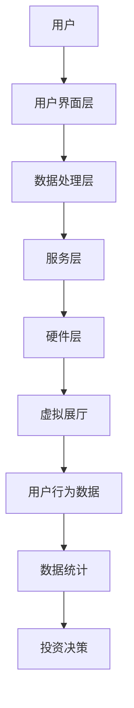
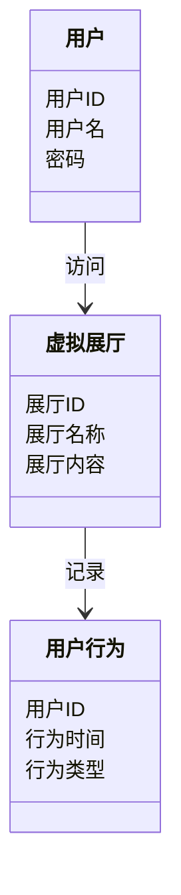

                 


# 企业估值中的AR/VR虚拟展览平台评估

## 关键词：企业估值、AR/VR、虚拟展览、技术评估、系统架构

## 摘要：  
随着AR/VR技术的快速发展，虚拟展览平台在企业估值中的应用越来越广泛。本文将从技术原理、系统架构、用户行为分析等多个角度，详细探讨AR/VR虚拟展览平台在企业估值中的评估方法与应用价值。通过理论分析与实际案例结合，本文旨在为企业提供一种基于AR/VR技术的新型估值工具，并展望其未来发展趋势。

---

## 第1章: AR/VR技术与虚拟展览平台概述

### 1.1 AR/VR技术的基本概念

#### 1.1.1 增强现实（AR）与虚拟现实（VR）的定义
- **增强现实（AR）**：通过计算机生成的图像、视频或信息叠加在真实环境中，以增强用户体验。例如，AR可以在企业展示中将虚拟产品叠加在真实场景中，帮助用户直观理解产品功能。
- **虚拟现实（VR）**：通过模拟一个完全虚拟的环境，让用户沉浸其中。例如，VR可以用于企业虚拟展厅，让用户身临其境地参观企业产品和设施。

#### 1.1.2 AR/VR技术的核心特征
- **沉浸式体验**：通过高度还原的虚拟环境，让用户感受到身临其境的体验。
- **交互性**：用户可以通过手势、语音或肢体动作与虚拟环境进行互动。
- **实时性**：AR/VR技术能够实时捕捉用户行为并反馈到虚拟环境中。
- **可定制性**：可以根据企业需求进行个性化设计，例如展示不同的产品或场景。

#### 1.1.3 AR/VR在企业估值中的应用前景
- AR/VR技术能够提升企业展示的直观性和互动性，帮助投资者更准确地评估企业的潜力。
- 通过虚拟展览平台，企业可以更高效地展示其产品、服务和技术，降低展示成本并扩大受众范围。

---

### 1.2 虚拟展览平台的定义与分类

#### 1.2.1 虚拟展览平台的定义
- 虚拟展览平台是一种基于AR/VR技术的在线展示工具，用户可以通过PC、手机或VR设备访问虚拟展厅，进行产品展示、互动交流和信息获取。

#### 1.2.2 虚拟展览平台的主要分类
1. **按应用场景分类**：
   - **企业展厅**：用于展示企业品牌形象、产品信息和技术实力。
   - **虚拟发布会**：用于在线产品发布会或新闻发布会。
   - **虚拟展览馆**：用于文化展览、艺术展示等场景。
2. **按技术实现分类**：
   - **基于Web的虚拟展厅**：用户通过网页访问虚拟展厅，无需额外设备。
   - **基于VR设备的展厅**：用户需要佩戴VR设备进入虚拟环境。
   - **混合现实展厅**：结合AR和VR技术，实现虚实结合的展示效果。

#### 1.2.3 虚拟展览平台与传统展示方式的对比分析
| 对比维度 | 传统展示方式 | 虚拟展览平台 |
|----------|--------------|--------------|
| 成本 | 高 | 低 |
| 空间限制 | 有 | 无 |
| 互动性 | 低 | 高 |
| 展示效果 | 单一 | 多样 |

---

### 1.3 企业估值中的AR/VR虚拟展览平台评估背景

#### 1.3.1 企业估值的基本概念
- 企业估值是通过对企业资产、收入、利润等多方面的分析，确定企业市场价值的过程。
- 传统估值方法包括DCF模型、市盈率法等，但难以全面展示企业的潜力和创新能力。

#### 1.3.2 AR/VR技术在企业估值中的应用价值
- **直观展示企业实力**：通过虚拟展览平台，企业可以展示其产品、技术和服务的细节，帮助投资者更全面地了解企业。
- **降低展示成本**：无需租赁场地、搭建展台，节省时间和资金。
- **提升互动体验**：通过AR/VR技术，投资者可以更深入地了解企业，提升投资兴趣。

#### 1.3.3 虚拟展览平台评估的必要性与意义
- 传统估值方法难以体现企业的创新能力和市场潜力。
- 虚拟展览平台可以提供更直观、更全面的企业展示，帮助投资者做出更准确的估值。

---

## 第2章: AR/VR虚拟展览平台的核心概念与联系

### 2.1 AR/VR技术的核心原理

#### 2.1.1 AR/VR的定位与追踪技术
- **定位技术**：通过摄像头、传感器等设备，捕捉用户的位置和动作。
- **追踪技术**：实时跟踪用户的头显、手柄或身体位置，实现沉浸式体验。

#### 2.1.2 AR/VR的交互设计原理
- **手势交互**：用户可以通过手势操作虚拟物体，例如旋转、缩放或拖拽。
- **语音交互**：通过语音指令与虚拟环境互动，例如搜索信息或控制场景。

#### 2.1.3 AR/VR的渲染优化技术
- **光线追踪**：通过模拟真实光线的反射和折射，提升虚拟场景的视觉效果。
- **网格化渲染**：将场景划分为多个网格，仅渲染用户视野内的部分，节省计算资源。

#### 2.1.4 AR/VR技术的数学模型与公式
- **三维空间变换**：通过齐次坐标和矩阵变换，实现虚拟场景的几何变换。
- **投影变换**：将三维物体投影到二维屏幕上，公式如下：
  $$ 
  x' = x \cdot \frac{w}{z} 
  $$
  $$
  y' = y \cdot \frac{w}{z}
  $$
  其中，$w$ 是视角宽度，$z$ 是物体到摄像头的距离。

---

### 2.2 虚拟展览平台的系统架构

#### 2.2.1 平台的组成模块
1. **用户界面层**：包括虚拟展厅的展示界面和用户操作界面。
2. **数据处理层**：负责处理用户行为数据和虚拟场景数据。
3. **服务层**：包括用户认证、内容管理、数据分析等服务。
4. **硬件层**：包括VR设备、摄像头、传感器等硬件设备。

#### 2.2.2 平台的用户角色分析
- **用户**：包括投资者、客户和普通用户。
- **内容创作者**：负责创建虚拟展厅的内容，例如模型、动画和交互逻辑。
- **管理员**：负责平台的维护和管理，例如用户权限和内容审核。

#### 2.2.3 平台的核心功能模块
1. **用户管理**：包括用户注册、登录和权限管理。
2. **内容管理**：包括虚拟展厅的创建、编辑和发布。
3. **数据统计**：包括用户行为分析、展厅访问量统计等。

#### 2.2.4 系统架构图（Mermaid）


---

### 2.3 AR/VR技术与企业估值的关联性

#### 2.3.1 AR/VR技术对企业估值的影响
- 提升企业的展示效果，增强投资者对企业潜力的信心。
- 通过虚拟展览平台，投资者可以更全面地了解企业的实力，从而做出更准确的估值。

#### 2.3.2 虚拟展览平台在企业估值中的具体应用
- **产品展示**：通过虚拟展厅展示企业产品，帮助投资者了解产品的功能和优势。
- **技术演示**：通过AR/VR技术，直观展示企业的技术实力和创新能力。
- **互动交流**：通过虚拟展厅的互动功能，投资者可以与企业代表进行实时交流，深入了解企业运营情况。

#### 2.3.3 AR/VR技术与企业估值的未来发展趋势
- **智能化展示**：通过人工智能技术，实现虚拟展厅的智能化管理和个性化推荐。
- **多模态交互**：结合语音、手势和表情等多种交互方式，提升用户体验。
- **跨平台支持**：实现虚拟展厅在PC、手机和VR设备上的无缝接入，扩大展示范围。

---

## 第3章: AR/VR虚拟展览平台的用户行为分析

### 3.1 用户行为分析的基本方法

#### 3.1.1 用户行为分析的定义
- 用户行为分析是通过收集和分析用户在虚拟展厅中的行为数据，了解用户的兴趣和需求。

#### 3.1.2 用户行为分析的主要方法
- **日志分析**：通过分析用户的操作日志，了解用户的访问路径和停留时间。
- **热力图分析**：通过热力图展示用户在虚拟展厅中的注意力分布。
- **问卷调查**：通过问卷调查收集用户对虚拟展厅的反馈和建议。

---

### 3.2 虚拟展览平台的用户需求分析

#### 3.2.1 用户需求的分类
- **功能性需求**：用户希望虚拟展厅能够展示产品信息、提供互动功能等。
- **体验性需求**：用户希望虚拟展厅能够提供沉浸式体验，提升互动性和趣味性。
- **安全性需求**：用户希望虚拟展厅能够保护其隐私和数据安全。

---

### 3.3 用户行为数据的采集与处理

#### 3.3.1 数据采集的主要方法
- **日志采集**：通过记录用户的操作日志，获取用户的访问路径和行为数据。
- **传感器采集**：通过VR设备的传感器，获取用户的头显位置和手势数据。
- **问卷采集**：通过问卷调查，获取用户的主观反馈和建议。

#### 3.3.2 数据处理的流程与技术
1. **数据清洗**：去除无效数据，确保数据的准确性和完整性。
2. **数据存储**：将用户行为数据存储在数据库中，方便后续分析。
3. **数据分析**：通过数据挖掘和机器学习技术，分析用户的兴趣和需求。

---

## 第4章: AR/VR虚拟展览平台的系统分析与架构设计

### 4.1 系统分析与需求定义

#### 4.1.1 问题场景介绍
- 在企业估值中，传统的展示方式难以全面展示企业的潜力和创新能力。
- 投资者需要一种更直观、更高效的展示工具，以做出更准确的估值。

#### 4.1.2 项目介绍与目标
- 项目目标：开发一个基于AR/VR技术的虚拟展览平台，帮助企业更好地展示其产品和服务，提升投资者的估值信心。
- 项目范围：包括平台的设计、开发和测试，以及用户的培训和支持。

---

### 4.2 系统功能设计

#### 4.2.1 领域模型设计（Mermaid）


---

### 4.3 系统架构设计

#### 4.3.1 系统架构图（Mermaid）


---

## 第5章: 项目实战与最佳实践

### 5.1 项目实战

#### 5.1.1 环境搭建
- **开发工具**：选择合适的AR/VR开发工具，例如Unity、Unreal Engine等。
- **依赖项安装**：安装必要的库和插件，例如OpenCV、WebGL等。

#### 5.1.2 系统核心实现
```python
# 示例代码：虚拟展厅的核心逻辑
class VirtualExhibition:
    def __init__(self):
        self.scenes = {}  # 存储虚拟场景
        self.users = {}   # 存储用户信息

    def create_scene(self, scene_id, scene_data):
        self.scenes[scene_id] = scene_data

    def delete_scene(self, scene_id):
        del self.scenes[scene_id]

    def update_scene(self, scene_id, scene_data):
        self.scenes[scene_id] = scene_data

    def get_user(self, user_id):
        return self.users.get(user_id, None)
```

#### 5.1.3 案例分析与解读
- **案例1**：某企业通过虚拟展厅展示其新产品，投资者通过VR设备参观展厅，了解产品的功能和优势，最终做出更准确的估值决策。
- **案例2**：某科技公司通过虚拟展厅展示其技术成果，投资者通过AR设备查看产品的三维模型，深入了解技术细节，提升投资信心。

---

### 5.2 最佳实践与注意事项

#### 5.2.1 最佳实践
- **用户体验优化**：确保虚拟展厅的交互设计直观易用，提升用户的沉浸式体验。
- **数据安全保护**：加强对用户数据的保护，防止数据泄露和滥用。
- **系统性能优化**：通过渲染优化和算法优化，提升虚拟展厅的运行效率。

#### 5.2.2 小结
- 通过AR/VR技术，企业可以更高效地展示其产品和服务，帮助投资者做出更准确的估值决策。
- 虚拟展览平台的应用前景广阔，未来可以通过人工智能和大数据技术进一步提升其功能和效果。

---

## 结语

随着AR/VR技术的不断进步，虚拟展览平台在企业估值中的应用将越来越广泛。本文通过详细分析AR/VR技术的核心原理、系统架构和用户行为，为企业提供了一种基于AR/VR技术的新型估值工具。未来，随着技术的进一步发展，虚拟展览平台将为企业估值带来更多可能性。

---

## 作者：AI天才研究院/AI Genius Institute & 禅与计算机程序设计艺术 /Zen And The Art of Computer Programming

