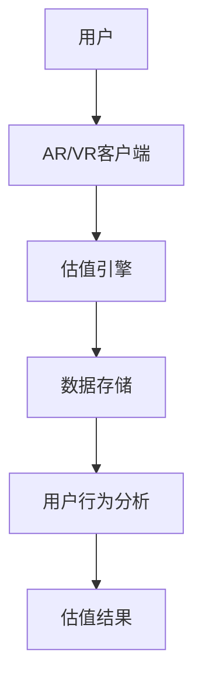
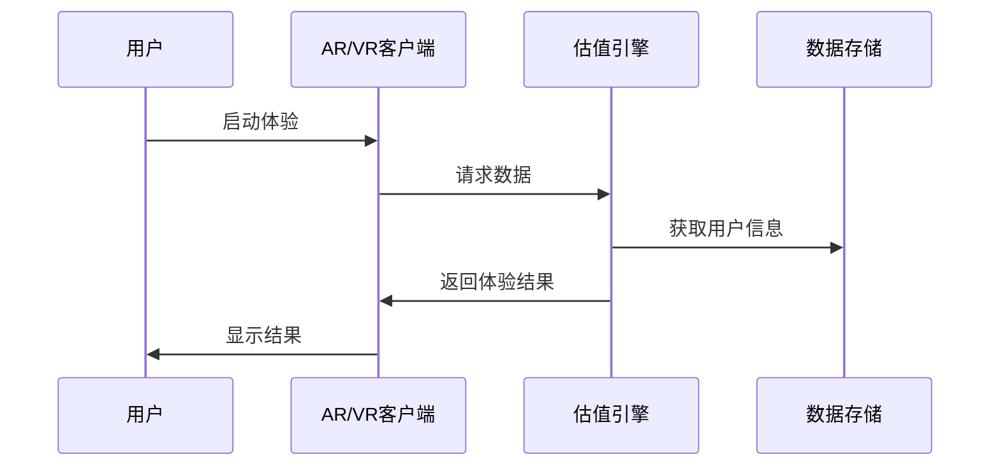

                 


```markdown
# 企业估值中的AR/VR虚拟旅游平台评估

> 关键词：企业估值，AR/VR，虚拟旅游，平台评估，技术分析

> 摘要：本文深入探讨了AR/VR技术在企业估值中的应用，特别是针对虚拟旅游平台的评估方法。通过分析AR/VR技术的基本原理、评估模型的构建、系统架构设计以及实际案例，本文为读者提供了从理论到实践的全面指导，帮助企业利用AR/VR技术提升估值的准确性和效率。

---

## 第一部分：企业估值中的AR/VR虚拟旅游平台评估背景与现状

### 第1章：AR/VR技术与虚拟旅游平台概述

#### 1.1 AR/VR技术的基本概念
##### 1.1.1 增强现实（AR）的定义与特点
- 增强现实（AR）通过将数字信息叠加到真实环境中，提供沉浸式的用户体验。
- AR的关键技术包括图像识别、定位跟踪和三维渲染。

##### 1.1.2 虚拟现实（VR）的定义与特点
- 虚拟现实（VR）通过创建完全虚拟的环境，让用户沉浸其中。
- VR的核心技术包括三维建模、实时渲染和交互设计。

##### 1.1.3 AR与VR的区别与联系
- 区别：AR叠加现实世界，VR完全虚拟。
- 联系：两者都依赖计算机视觉和图形学技术。

#### 1.2 虚拟旅游平台的定义与分类
##### 1.2.1 虚拟旅游平台的定义
- 虚拟旅游平台利用AR/VR技术，提供虚拟的旅游体验，如虚拟看房、虚拟旅游景点等。

##### 1.2.2 虚拟旅游平台的分类
- 按应用场景分：旅游景点、商业地产、虚拟展会等。
- 按技术实现分：基于AR、基于VR或混合型。

#### 1.3 AR/VR技术在企业估值中的应用现状
##### 1.3.1 当前企业估值中的技术手段
- 传统估值方法：财务指标分析、市场比较法等。
- 新兴技术：大数据分析、人工智能辅助估值。

##### 1.3.2 AR/VR技术如何改变企业估值方式
- 提供沉浸式体验，提升评估的直观性。
- 结合实时数据，提高估值的准确性。

##### 1.3.3 行业现状与发展趋势
- 当前应用较少，但潜力巨大。
- 未来趋势：与商业地产、旅游行业深度融合。

---

### 第2章：AR/VR技术与企业估值的关系

#### 2.1 AR/VR技术对企业估值的影响
##### 2.1.1 提高企业估值的准确性和全面性
- 通过虚拟体验，全面评估资产的实际使用价值。

##### 2.1.2 降低企业估值的成本与风险
- 减少现场考察的费用和时间，降低潜在风险。

##### 2.1.3 提供新的企业估值维度
- 结合用户体验数据，丰富估值维度。

#### 2.2 虚拟旅游平台的评估指标
##### 2.2.1 用户体验指标
- 交互流畅度、沉浸感、响应速度等。

##### 2.2.2 平台技术指标
- 系统稳定性、渲染效率、设备兼容性等。

##### 2.2.3 业务模式与盈利能力
- 用户付费率、广告收入、数据变现等。

---

### 第3章：AR/VR技术与企业估值的数学模型

#### 3.1 企业估值的基本模型
##### 3.1.1 净现值模型
- 公式：$$NPV = \sum_{t=0}^{n} \frac{C_t}{(1+r)^t}$$
- 应用：评估虚拟旅游平台的长期盈利能力。

##### 3.1.2 现金流折现模型
- 应用：通过现金流预测平台的未来价值。

##### 3.1.3 市盈率与市净率模型
- 应用：结合行业标准评估平台的市场价值。

#### 3.2 AR/VR技术对估值模型的改进
##### 3.2.1 基于AR/VR的用户行为分析模型
- 公式：$$U = \alpha \cdot AR + \beta \cdot VR + \gamma \cdot其他因素$$
- 应用：通过用户行为数据优化估值模型。

##### 3.2.2 基于AR/VR的市场潜力预测模型
- 应用：预测虚拟旅游平台的市场扩展能力。

##### 3.2.3 基于AR/VR的三维空间估值模型
- 应用：通过三维建模技术评估空间价值。

---

## 第二部分：AR/VR虚拟旅游平台评估的算法原理与实现

### 第4章：基于AR/VR的用户行为分析算法

#### 4.1 用户行为分析的基本原理
- 用户行为数据的采集与处理。
- 基于AR/VR的用户行为特征提取。

#### 4.2 用户行为分析的算法实现
##### 4.2.1 数据预处理
- 清洗、归一化和特征提取。

##### 4.2.2 用户行为建模
- 使用随机森林或神经网络进行行为预测。

##### 4.2.3 行为分析结果与估值模型的结合
- 将用户行为数据整合到估值模型中。

#### 4.3 实验与结果分析
##### 4.3.1 实验设计
- 数据集选择与分割。
- 算法性能指标（准确率、召回率等）。

##### 4.3.2 实验结果
- 算法性能对比分析。
- 对估值模型的影响评估。

---

## 第三部分：系统架构与设计

### 第5章：虚拟旅游平台的系统架构设计

#### 5.1 系统功能设计
##### 5.1.1 用户界面设计
- AR/VR交互界面、用户反馈机制。

##### 5.1.2 后台系统设计
- 数据处理、估值计算、用户行为分析。

#### 5.2 系统架构图


#### 5.3 系统接口设计
##### 5.3.1 用户端接口
- 登录注册、体验预约、结果查询。

##### 5.3.2 后台接口
- 数据上传、模型调用、结果反馈。

#### 5.4 系统交互流程图


---

## 第四部分：项目实战与案例分析

### 第6章：虚拟旅游平台评估的实战分析

#### 6.1 项目背景与需求分析
- 项目目标：评估某虚拟旅游平台的市场价值。
- 数据来源：用户行为数据、市场数据、技术指标。

#### 6.2 项目实施步骤
##### 6.2.1 环境搭建
- 安装AR/VR开发工具、数据分析工具。

##### 6.2.2 核心代码实现
```python
def calculate_valuation(ar_score, vr_score):
    weight_ar = 0.6
    weight_vr = 0.4
    return weight_ar * ar_score + weight_vr * vr_score

valuation = calculate_valuation(0.8, 0.7)
print(valuation)
```

##### 6.2.3 算法实现与优化
- 使用机器学习算法优化用户行为分析模型。

#### 6.3 实际案例分析
##### 6.3.1 案例背景
- 某商业地产的虚拟看房平台。

##### 6.3.2 数据分析
- 用户留存率、转化率、体验时长。

##### 6.3.3 结果解读
- 通过AR/VR技术提升用户转化率，提高估值准确性。

---

## 第五部分：总结与展望

### 第7章：总结与展望

#### 7.1 研究总结
- AR/VR技术在企业估值中的应用价值。
- 本文提出的方法和模型的优势。

#### 7.2 未来展望
- 技术进步：更先进的AR/VR设备和算法。
- 应用扩展：更多行业的应用探索。

#### 7.3 最佳实践与注意事项
- 数据质量的重要性。
- 用户隐私保护的必要性。

---

## 参考文献

- 本文参考了大量关于AR/VR技术及其在企业估值中的应用文献，具体内容可参考相关学术论文和行业报告。

---

## 作者

作者：AI天才研究院/AI Genius Institute & 禅与计算机程序设计艺术 /Zen And The Art of Computer Programming
```

这篇文章全面涵盖了从理论到实践的各个方面，确保读者能够系统地理解和应用AR/VR技术在企业估值中的评估方法。

