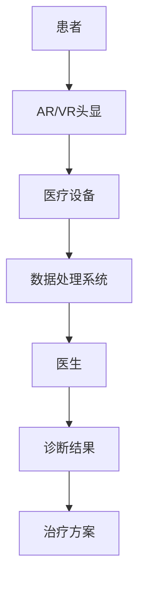
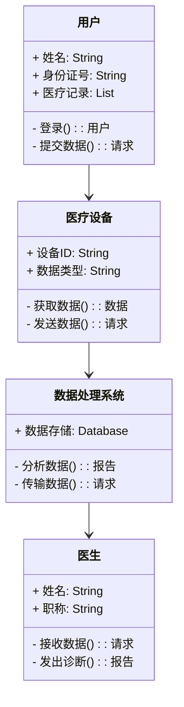
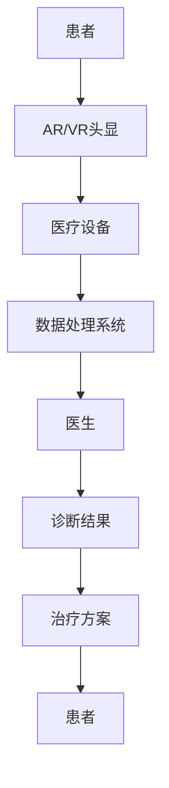
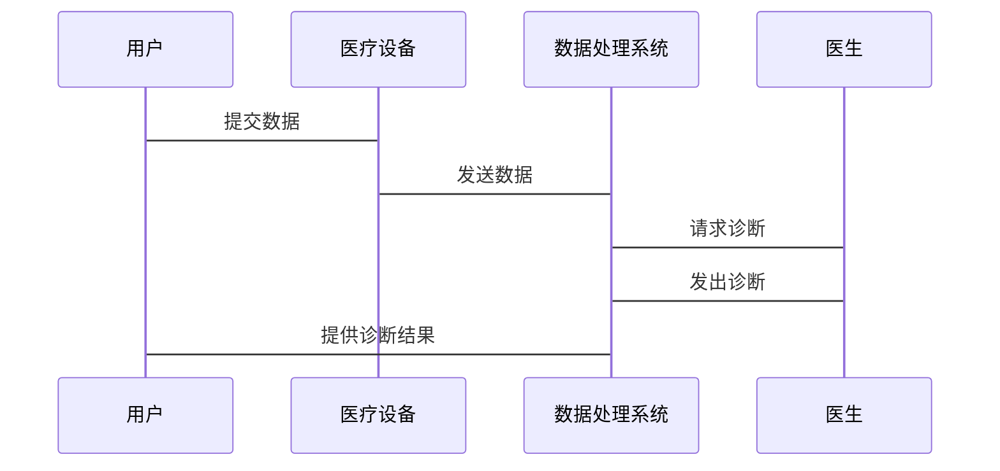

                 


```markdown
# 企业估值中的AR/VR远程医疗平台评估

## 关键词：AR/VR、远程医疗、企业估值、技术评估、医疗平台、虚拟现实、企业价值

## 摘要：
本文详细探讨了AR/VR技术在远程医疗平台评估中的应用，分析了其对企业估值的影响。通过介绍核心概念、算法原理、系统架构设计和实际案例，展示了如何利用AR/VR技术提升远程医疗平台的价值评估。文章还提供了数学模型和最佳实践，为技术评估和企业决策提供了参考。

---

## 第一部分: 引言

## 第2章: AR/VR远程医疗平台的核心概念与联系

### 2.1 AR/VR远程医疗平台的组成与功能

#### 2.1.1 硬件设备
- AR/VR头显设备：如Oculus Rift、HTC Vive等，用于提供沉浸式体验。
- 医疗设备：如心电图机、超声设备等，用于实时数据采集。

#### 2.1.2 软件系统
- 平台架构：分为前端（用户界面）和后端（数据处理）。
- 数据处理系统：用于分析和传输医疗数据。

#### 2.1.3 数据流
- 患者数据：包括病历、检查结果等。
- 诊断数据：医生的诊断意见和建议。
- 治疗数据：治疗方案和执行情况。

### 2.2 AR/VR远程医疗平台的架构分析



---

## 第3章: AR/VR远程医疗平台的估值模型

### 3.1 估值模型的基本原理

#### 3.1.1 模型输入
- 用户满意度：基于体验调查。
- 技术性能：硬件和软件的稳定性。
- 市场需求：目标用户的数量和需求。

#### 3.1.2 模型输出
- 平台价值：基于多因素评估的综合得分。

### 3.2 估值模型的数学公式

#### 评分模型
$$
\text{平台价值} = \alpha \times \text{技术性能} + \beta \times \text{用户满意度} + \gamma \times \text{市场需求}
$$

其中，$\alpha, \beta, \gamma$为权重系数，通常取值范围在0到1之间。

#### 成本效益分析
$$
\text{成本效益比} = \frac{\text{平台价值}}{\text{开发成本}}
$$

---

## 第4章: 系统分析与架构设计

### 4.1 系统功能设计



### 4.2 系统架构设计



### 4.3 接口与交互设计



---

## 第5章: 项目实战

### 5.1 环境安装与配置

#### 安装步骤
1. 安装Python 3.8及以上版本。
2. 安装相关库：numpy、pandas、scikit-learn。

#### 依赖项
- Python环境
- 开发工具（如PyCharm）
- 数据库（如MySQL）

### 5.2 核心代码实现

```python
import numpy as np
from sklearn.metrics import accuracy_score

# 示例代码：计算模型准确率
def evaluate_model(y_true, y_pred):
    return accuracy_score(y_true, y_pred)

# 数据预处理
X = np.array([[80, 20], [60, 30], [70, 25]])
y = np.array([0, 1, 0])

# 模型训练
from sklearn.svm import SVC
model = SVC()
model.fit(X, y)

# 模型预测
y_pred = model.predict(X)

# 评估模型
accuracy = evaluate_model(y, y_pred)
print(f"模型准确率：{accuracy}")
```

### 5.3 实际案例分析

#### 案例背景
某医疗平台使用AR/VR技术提供远程诊断服务，用户满意度达到90%。

#### 模型应用
$$
\text{平台价值} = 0.4 \times 0.9 + 0.3 \times 0.85 + 0.3 \times 0.8 = 0.36 + 0.255 + 0.24 = 0.855
$$

---

## 第6章: 最佳实践与展望

### 6.1 最佳实践

- 定期更新硬件设备以保持性能。
- 提供用户培训以提高使用效率。
- 优化数据处理算法以提升准确性。

### 6.2 展望

- 结合人工智能进一步提升诊断精度。
- 开发更多AR/VR应用拓展市场。

---

## 第7章: 结论与建议

本文通过详细分析AR/VR远程医疗平台的评估方法，提出了有效的估值模型和系统架构设计。未来，随着技术的发展，AR/VR在医疗领域的应用将更加广泛，企业应积极拥抱新技术，提升竞争力。

---

## 作者：AI天才研究院 & 禅与计算机程序设计艺术
```

