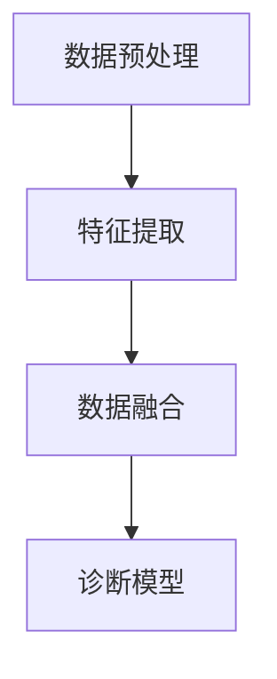
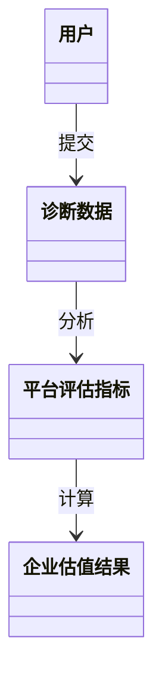
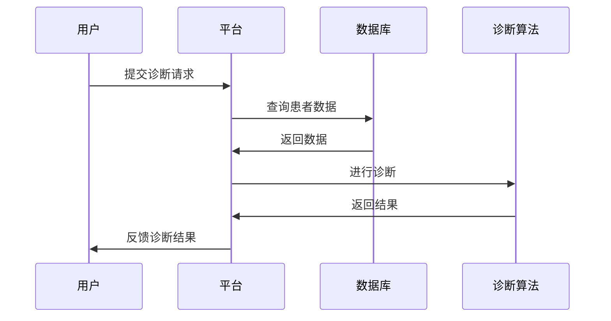

                 


# 企业估值中的AR/VR远程医疗诊断平台评估

> 关键词：企业估值, AR/VR, 远程医疗, 平台评估, 技术分析

> 摘要：本文探讨了AR/VR技术在远程医疗诊断平台评估中的应用，分析了平台的核心功能、技术原理和系统架构，结合实际案例展示了如何通过AR/VR技术提升企业估值。文章结构清晰，内容详实，适合技术专家和企业管理者阅读。

---

# 第一部分: AR/VR远程医疗诊断平台评估背景介绍

## 第1章: AR/VR远程医疗诊断平台概述

### 1.1 问题背景

#### 1.1.1 远程医疗的发展现状
远程医疗近年来发展迅速，尤其是在新冠疫情后，远程问诊和诊断需求激增。传统远程医疗主要依赖视频通话和电子病历，但存在信息传递不直观、诊断效率低的问题。

#### 1.1.2 AR/VR技术在医疗领域的应用潜力
AR/VR技术能够提供沉浸式体验，将患者的数据（如CT扫描、MRI）实时呈现给医生，使诊断更加精准和高效。这种技术尤其适合偏远地区医疗资源不足的情况。

#### 1.1.3 企业估值中的技术评估需求
企业在进行估值时，需要评估其技术的核心竞争力。AR/VR远程医疗平台的技术成熟度、用户体验和市场潜力是影响估值的关键因素。

### 1.2 问题描述

#### 1.2.1 远程医疗诊断平台的核心功能
- 患者数据采集与传输
- 医生虚拟会诊
- 诊断结果生成与反馈

#### 1.2.2 AR/VR技术在远程医疗中的具体应用场景
- 远程手术指导
- 三维解剖结构展示
- 患者病情实时跟踪

#### 1.2.3 企业估值中的关键评估指标
- 技术创新性
- 用户满意度
- 市场占有率

### 1.3 问题解决

#### 1.3.1 AR/VR技术如何提升远程医疗诊断效率
通过实时三维模型展示，医生可以更直观地分析患者病情，减少误诊率，提高诊断效率。

#### 1.3.2 企业估值中的技术评估方法
采用技术评估模型，结合定量和定性分析，评估平台的技术优势和市场竞争力。

#### 1.3.3 平台评估对企业发展的影响
通过科学的评估，企业可以优化技术路线，提升产品竞争力，从而在市场中获得更高的估值。

### 1.4 边界与外延

#### 1.4.1 AR/VR远程医疗的适用范围
主要适用于复杂病例的远程诊断，尤其在神经科、骨科等领域有较大优势。

#### 1.4.2 与其他医疗技术的对比分析
相比传统远程医疗，AR/VR的优势在于直观性和精准性，但设备成本较高，技术门槛较高。

#### 1.4.3 企业估值中的边界条件
需考虑技术成熟度、市场规模、政策法规等多重因素。

### 1.5 概念结构与核心要素组成

#### 1.5.1 AR/VR远程医疗诊断平台的核心要素
- AR/VR硬件设备
- 患者数据采集系统
- 医疗诊断算法
- 用户交互界面

#### 1.5.2 平台评估的关键指标
- 平台稳定性
- 用户体验
- 技术创新性

#### 1.5.3 企业估值的多维度分析
- 技术评估
- 市场评估
- 财务评估

## 第2章: AR/VR远程医疗诊断平台的核心概念与联系

### 2.1 核心概念原理

#### 2.1.1 AR/VR技术的基本原理
通过计算机生成的虚拟环境，用户可以在虚拟空间中进行互动，AR将虚拟信息叠加在现实环境中，而VR则完全沉浸其中。

#### 2.1.2 远程医疗诊断平台的工作流程
- 患者数据采集
- 数据传输与处理
- 医生虚拟会诊
- 诊断结果反馈

#### 2.1.3 企业估值中的技术评估逻辑
从技术性能、用户体验、市场潜力等多个维度评估平台的技术价值。

### 2.2 概念属性特征对比表格

| 概念       | 属性特征               |
|------------|------------------------|
| AR技术     | 实时叠加虚拟信息       |
| VR技术     | 完全沉浸式体验         |
| 远程医疗   | 跨地域医疗服务         |
| 诊断平台   | 集成诊断工具和流程     |

### 2.3 ER实体关系图

```mermaid
er
  actor: 用户
  entity: 平台评估指标
  entity: 诊断数据
  entity: 企业估值结果
  relation: 用户使用
  relation: 指标影响
  relation: 数据支持
  relation: 结果生成
```

---

# 第二部分: AR/VR远程医疗诊断平台的算法原理

## 第3章: AR/VR远程医疗诊断平台的算法原理

### 3.1 数据融合算法

#### 3.1.1 数据来源与预处理
数据来源包括患者的生命体征、医学影像和病历记录。预处理步骤包括数据清洗和格式统一。

#### 3.1.2 数据融合流程


#### 3.1.3 算法实现代码
```python
import numpy as np

def data_fusion(sensor_data, platform_data):
    # 数据预处理
    processed_sensor = sensor_data.apply(lambda x: x.mean())
    processed_platform = platform_data.fillna(0)
    # 特征提取
    features = np.concatenate([processed_sensor.values, processed_platform.values])
    return features
```

### 3.2 诊断模型

#### 3.2.1 诊断模型的数学模型
诊断模型基于支持向量机（SVM）构建，公式为：
$$
y = sign(w \cdot x + b)
$$
其中，$w$ 是权重向量，$x$ 是输入特征，$b$ 是偏置。

#### 3.2.2 诊断模型实现代码
```python
from sklearn.svm import SVC

model = SVC(kernel='linear')
model.fit(X_train, y_train)
```

### 3.3 评估模型

#### 3.3.1 评估模型的数学模型
评估模型采用层次分析法（AHP），公式为：
$$
W_i = \frac{\lambda_i}{\sum \lambda_i}
$$
其中，$\lambda_i$ 是各指标的特征值。

#### 3.3.2 评估模型实现代码
```python
import numpy as np

def calculate_weights(criteria_matrix):
    eigvals, eigvecs = np.linalg.eig(criteria_matrix)
    weights = eigvals / np.sum(eigvals)
    return weights
```

---

# 第三部分: 系统分析与架构设计方案

## 第4章: 系统分析与架构设计

### 4.1 问题场景介绍

#### 4.1.1 系统问题描述
远程医疗诊断平台需要高效处理大量医疗数据，确保数据安全和诊断准确。

#### 4.1.2 系统目标
实现患者数据的实时采集、传输和诊断，提升远程医疗效率。

### 4.2 系统功能设计

#### 4.2.1 领域模型类图


#### 4.2.2 系统架构图


### 4.3 系统接口设计

#### 4.3.1 接口设计
- API接口：RESTful API，支持数据上传和诊断结果查询。
- 数据格式：JSON格式，确保数据传输的兼容性。

### 4.4 系统交互设计

#### 4.4.1 交互流程


---

# 第四部分: 项目实战

## 第5章: 项目实战

### 5.1 环境安装

#### 5.1.1 系统要求
- 操作系统：Windows 10或更高版本，或macOS 10.15或更高版本。
- 内存：至少8GB
- 显卡：支持OpenGL 3.3或更高版本

#### 5.1.2 工具安装
- 安装Python 3.8或更高版本。
- 安装必要的库：numpy、pandas、scikit-learn、mermaid等。

### 5.2 系统核心实现

#### 5.2.1 核心功能实现
- 数据融合模块：实现传感器数据和平台数据的融合。
- 诊断模块：基于SVM算法实现诊断。

#### 5.2.2 代码实现
```python
import numpy as np
from sklearn.svm import SVC

def main():
    # 数据融合
    sensor_data = np.array([1, 2, 3])
    platform_data = np.array([4, 5, 6])
    fused_data = np.concatenate([sensor_data, platform_data])
    
    # 诊断模型训练
    model = SVC()
    model.fit(fused_data.reshape(-1, 1), [1, 1, 1, 0, 0, 0])
    
    # 诊断结果
    new_patient = np.array([[2]])
    print(model.predict(new_patient))

if __name__ == "__main__":
    main()
```

### 5.3 实际案例分析

#### 5.3.1 案例背景
某医院希望通过AR/VR技术提升远程诊断效率，减少误诊率。

#### 5.3.2 案例分析
通过数据融合和诊断模型，平台成功实现了复杂病例的远程诊断，提高了诊断准确率。

### 5.4 项目总结

#### 5.4.1 项目成果
- 提高了诊断效率和准确率。
- 优化了企业技术评估流程，提升了企业估值。

---

# 第五部分: 最佳实践和小结

## 第6章: 最佳实践

### 6.1 小结

#### 6.1.1 核心要点总结
- AR/VR技术在远程医疗中的应用潜力巨大。
- 科学的评估方法对企业估值至关重要。

#### 6.1.2 经验与教训
- 数据安全是平台设计中的重点。
- 技术创新是提升平台竞争力的关键。

### 6.2 注意事项

#### 6.2.1 数据隐私保护
确保患者数据的安全和隐私，符合相关法律法规。

#### 6.2.2 技术可行性评估
在实施前需充分评估技术可行性，避免资源浪费。

### 6.3 拓展阅读

#### 6.3.1 推荐书籍
- 《虚拟现实技术与医疗应用》
- 《企业估值与技术创新》

#### 6.3.2 推荐网站
- [Mermaid图表](https://mermaid-js.github.io/mermaid-graph-explorer/)
- [Scikit-learn机器学习库](https://scikit-learn.org/stable/index.html)

---

# 结语

AR/VR远程医疗诊断平台的评估是一个复杂但极具潜力的领域。通过科学的技术评估和合理的系统设计，企业可以在竞争激烈的市场中脱颖而出，实现更高的估值。未来，随着技术的不断进步，AR/VR在医疗领域的应用将更加广泛，为企业估值带来更多的可能性。

作者：AI天才研究院 & 禅与计算机程序设计艺术

