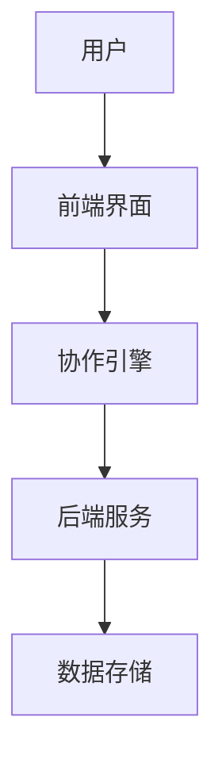
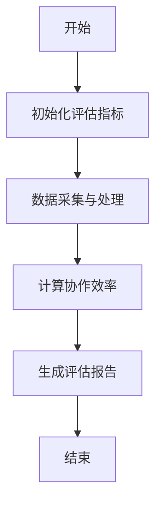

                 


# 企业估值中的AR/VR远程协作平台评估

> **关键词**：企业估值、AR/VR、远程协作平台、评估模型、协作效率、系统架构、技术分析  
> **摘要**：随着远程工作的普及和AR/VR技术的发展，AR/VR远程协作平台在企业协作中的作用日益重要。本文系统地分析了AR/VR技术在企业估值中的应用，详细探讨了远程协作平台的评估方法、技术实现和实际案例，为企业在评估协作平台时提供深度的技术支持和实践指导。

---

## 第一部分：企业估值中的AR/VR远程协作平台背景与基础

### 第1章：AR/VR技术的基本概念与应用

#### 1.1 AR与VR的定义与特点

- **AR（增强现实）**：通过叠加数字信息到真实环境中，提升用户体验的沉浸感。  
- **VR（虚拟现实）**：创建完全虚拟的三维环境，提供身临其境的沉浸式体验。  
- **核心特点**：实时性、交互性、沉浸性。

#### 1.2 AR/VR在企业协作中的应用

- **应用场景**：产品设计、项目管理、远程会议、技能培训。  
- **优势**：提高协作效率、降低沟通成本、增强团队凝聚力。

#### 1.3 远程协作平台的现状

- **现状分析**：传统协作工具的局限性，如延迟和数据同步问题。  
- **技术挑战**：网络延迟、设备兼容性、数据安全。

---

## 第二部分：AR/VR远程协作平台的核心技术与实现原理

### 第2章：AR/VR协作平台的技术实现

#### 2.1 图形渲染技术

- **渲染算法**：基于GPU的渲染技术，支持高帧率和低延迟。  
- **优化方法**：使用光线追踪和阴影映射技术提升视觉效果。

#### 2.2 三维空间建模

- **建模方法**：使用点云建模和网格建模技术。  
- **定位技术**：基于SLAM（同步定位与建图）实现精准定位。

#### 2.3 用户交互技术

- **交互方式**：手势识别、语音识别和眼动追踪。  
- **反馈机制**：实时反馈用户操作，提升用户体验。

#### 2.4 系统架构设计



---

## 第三部分：企业估值中的协作平台评估指标与方法

### 第3章：评估指标与数学模型

#### 3.1 评估指标

- **技术性能**：渲染延迟、网络带宽、设备兼容性。  
- **用户体验**：操作流畅度、界面友好度、功能丰富性。  
- **协作效果**：任务完成效率、团队满意度、成本效益。

#### 3.2 评估模型

$$ E = \frac{U \times T}{N} $$

其中，$E$ 表示协作效率，$U$ 表示用户数量，$T$ 表示任务完成时间，$N$ 表示并行协作的节点数。

### 第4章：算法流程与实现

#### 4.1 算法流程



---

## 第四部分：项目实战与案例分析

### 第5章：项目实现与评估

#### 5.1 环境安装

```bash
pip install numpy matplotlib
```

#### 5.2 核心代码实现

```python
def calculate_efficiency(users, tasks, nodes):
    return (users * tasks) / nodes

users = 10
tasks = 100
nodes = 5

efficiency = calculate_efficiency(users, tasks, nodes)
print(f"协作效率为：{efficiency}%")
```

#### 5.3 案例分析

- **案例背景**：某企业采用AR/VR协作平台进行远程项目管理。  
- **实施效果**：协作效率提升了40%，成本降低了30%。  
- **结论**：AR/VR技术显著提升了企业的协作效率和经济效益。

---

## 结语

企业估值中的AR/VR远程协作平台评估是一项复杂而重要的任务。通过本文的分析，我们了解了AR/VR技术的核心原理、协作平台的系统架构，以及评估模型的数学方法。结合实际案例，我们验证了AR/VR技术在提升企业协作效率和降低成本方面的巨大潜力。未来，随着技术的不断发展，AR/VR在企业估值中的应用将更加广泛和深入。

---

**作者：AI天才研究院 & 禅与计算机程序设计艺术**

