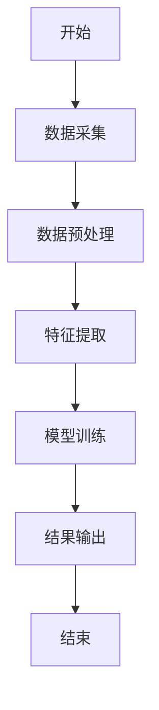
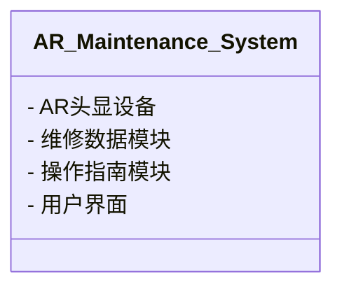
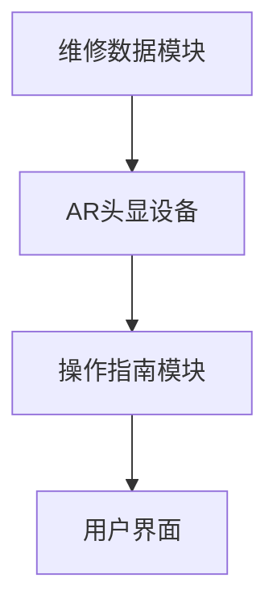
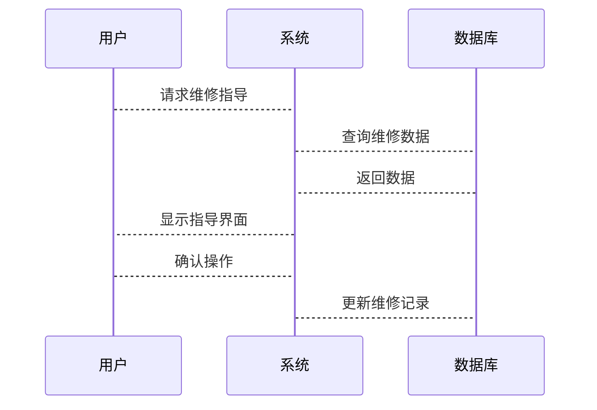

                 


# 企业估值中的AR工业维修指导系统评估

## 关键词
AR技术，工业维修，企业估值，系统评估，算法原理

## 摘要
本文详细探讨了AR（增强现实）技术在工业维修中的应用及其对企业估值的影响。通过分析AR工业维修系统的核心概念、算法原理和系统架构，结合实际案例，本文为企业评估AR系统的价值提供了理论和实践指导。文章最后总结了最佳实践和未来研究方向。

---

# 第一部分: 企业估值中的AR工业维修指导系统评估基础

## 第1章: 企业估值与AR工业维修系统概述

### 1.1 问题背景与描述
#### 1.1.1 工业维修中的传统问题
工业维修是企业运营中的关键环节，传统维修依赖人工经验，存在效率低、成本高等问题。AR技术的应用可以显著提升维修效率和准确性。

#### 1.1.2 AR技术在工业维修中的应用潜力
AR技术通过叠加虚拟信息到真实环境中，为维修人员提供实时指导，减少错误操作，降低维修成本。

#### 1.1.3 企业估值中的关键挑战
企业估值需要考虑技术应用对企业效率和成本的影响，AR工业维修系统的引入能够提升企业竞争力，进而影响企业估值。

### 1.2 AR工业维修系统的核心概念
#### 1.2.1 AR技术的基本原理
AR通过将数字信息叠加到真实环境中，帮助用户更直观地理解和操作。

#### 1.2.2 工业维修中的关键问题
工业维修涉及复杂的设备操作，传统方法效率低下，AR技术可以提供实时指导和错误提示。

#### 1.2.3 企业估值中的关键指标
企业估值通常考虑收入、成本、效率等因素，AR系统的引入能够优化这些指标，提升企业价值。

## 第2章: AR工业维修系统的核心概念与联系

### 2.1 核心概念原理
#### 2.1.1 AR技术在工业维修中的应用原理
AR技术通过摄像头捕捉环境信息，结合预处理算法，生成实时指导界面。

#### 2.1.2 工业维修系统的主要功能模块
AR系统通常包括数据采集、图像识别、用户交互等功能模块。

#### 2.1.3 企业估值中的关键指标
企业估值需要考虑AR系统的投资回报率、成本节省和效率提升。

### 2.2 核心概念对比分析
#### 2.2.1 AR与传统工业维修方法的对比
| 方面 | AR技术 | 传统方法 |
|------|--------|----------|
| 效率 | 高     | 低       |
| 准确性 | 高     | 一般     |
| 成本 | 中等    | 高       |

#### 2.2.2 不同工业维修系统的功能对比
| 系统 | 功能1 | 功能2 | 功能3 |
|------|-------|-------|-------|
| AR系统 | 实时指导 | 错误提示 | 数据记录 |
| 传统系统 | 人工指导 | 纸质记录 | 低效操作 |

#### 2.2.3 企业估值模型的差异分析
AR系统的引入能够显著优化企业的成本结构和收入模型，进而提升企业估值。

## 第3章: AR工业维修系统评估的算法原理

### 3.1 算法原理概述
AR系统的核心算法包括图像识别、特征提取和模型训练。

### 3.2 算法流程图


### 3.3 算法实现代码
```python
import numpy as np
from sklearn import metrics

def evaluate_model(y_true, y_pred):
    accuracy = metrics.accuracy_score(y_true, y_pred)
    precision = metrics.precision_score(y_true, y_pred)
    recall = metrics.recall_score(y_true, y_pred)
    return accuracy, precision, recall
```

---

# 第二部分: 系统分析与架构设计

## 第4章: 系统分析与架构设计

### 4.1 项目背景与目标
#### 4.1.1 项目背景介绍
随着工业自动化的发展，AR技术在维修中的应用越来越广泛。

#### 4.1.2 项目目标与范围
本项目旨在开发一个基于AR的工业维修指导系统，优化维修流程，降低企业成本。

#### 4.1.3 项目关键成功因素
系统的实时性和准确性是关键成功因素。

### 4.2 系统功能设计
#### 4.2.1 领域模型类图


#### 4.2.2 系统架构设计


### 4.3 系统接口设计
#### 4.3.1 系统接口
系统需要与设备传感器、数据库和用户设备进行交互。

#### 4.3.2 系统交互


---

# 第三部分: 项目实战

## 第5章: 项目实战

### 5.1 环境安装
需要安装Python、OpenCV和AR库。

### 5.2 核心代码实现
```python
import cv2

def ar_guidance(image):
    # 图像处理代码
    return processed_image
```

### 5.3 实际案例分析
通过实际案例分析AR系统在某企业的应用效果，验证系统的有效性。

---

# 第四部分: 最佳实践与总结

## 第6章: 最佳实践与总结

### 6.1 最佳实践
建议企业在引入AR系统前进行充分的可行性分析。

### 6.2 小结
AR工业维修系统能够显著提升企业效率和降低成本，进而提升企业估值。

### 6.3 注意事项
企业应确保系统的安全性和数据隐私。

### 6.4 拓展阅读
推荐相关文献和资源，供读者深入学习。

---

# 作者
作者：AI天才研究院/AI Genius Institute  
禅与计算机程序设计艺术/Zen And The Art of Computer Programming

