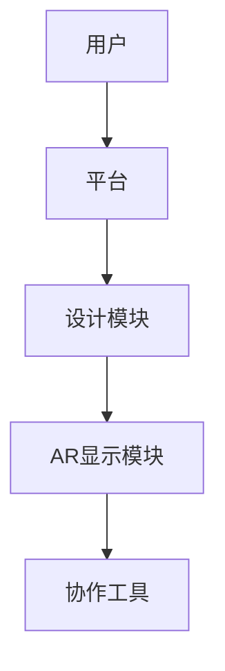
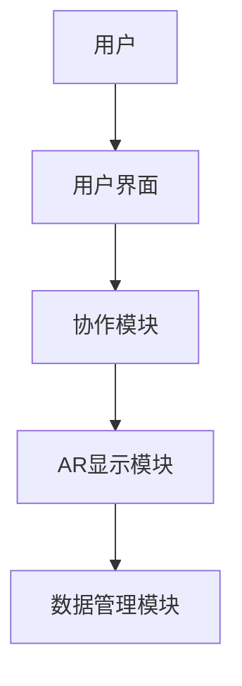
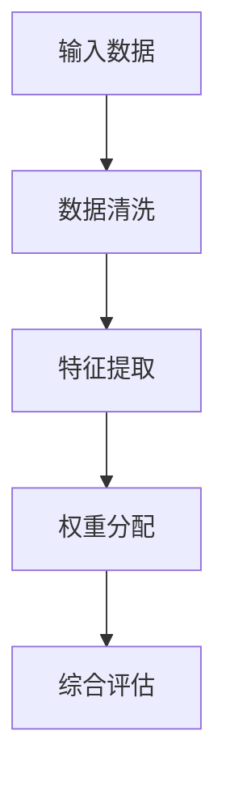
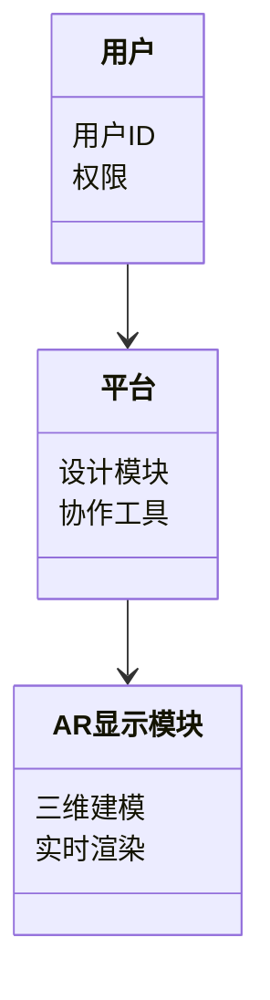
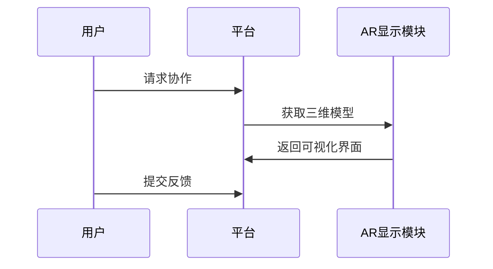

                 


# 企业估值中的AR工业设计协作平台评估

> 关键词：企业估值、AR工业设计、协作平台、技术评估、增强现实

> 摘要：本文详细探讨了在企业估值过程中，如何通过评估AR工业设计协作平台的性能和效果，优化企业的设计协作效率和决策能力。文章从背景介绍、核心概念、算法原理、系统架构、项目实战等多个维度进行深入分析，为企业在数字化转型中的技术评估提供了理论支持和实践指导。

---

# 第一部分: 背景与概念

# 第1章: 企业估值与AR工业设计协作平台概述

## 1.1 问题背景与描述

### 1.1.1 工业设计协作平台的现状与挑战
工业设计协作平台是现代企业实现高效设计和生产的关键工具。然而，传统协作平台在实时性、可视化和用户交互方面存在诸多局限性，难以满足复杂工业设计的需求。

### 1.1.2 增强现实技术在工业设计中的应用潜力
增强现实（AR）技术通过将数字信息叠加到物理世界中，为工业设计协作提供了全新的可能性。AR能够实现三维模型的实时可视化、虚拟协作和精准测量，显著提升了设计效率和质量。

### 1.1.3 企业估值与工业设计协作平台的关系
工业设计协作平台的性能和效果直接影响企业的设计效率、成本控制和产品质量，进而影响企业的市场竞争力和估值。因此，评估AR工业设计协作平台的性能是企业估值的重要环节。

## 1.2 问题解决与边界

### 1.2.1 AR技术如何优化工业设计协作
AR技术通过提供实时三维可视化、虚拟协作和精准测量功能，优化了传统设计协作中的信息不对称和沟通效率问题。

### 1.2.2 企业估值中的关键评估指标
企业估值的关键指标包括平台的性能、用户体验、协作效率和实际应用效果。这些指标需要通过量化评估来衡量。

### 1.2.3 平台评估的边界与外延
平台评估的边界包括技术性能、用户体验和实际应用效果。外延则涉及企业的整体数字化能力和市场竞争能力。

## 1.3 核心概念与组成要素

### 1.3.1 工业设计协作平台的构成
工业设计协作平台通常包括三维建模模块、协作工具、数据管理模块和用户界面。

### 1.3.2 AR技术在协作中的作用
AR技术通过提供实时三维可视化、虚拟协作和精准测量功能，显著提升了设计协作的效率和准确性。

### 1.3.3 企业估值的核心要素
企业估值的核心要素包括设计效率、成本控制、产品质量和市场竞争力。

## 1.4 本章小结

---

# 第二部分: 核心概念与联系

# 第2章: 核心概念与原理

## 2.1 AR技术的原理与特点

### 2.1.1 增强现实的基本原理
AR技术通过将数字信息叠加到物理世界中，实现虚拟与现实的无缝融合。

### 2.1.2 AR技术的核心特征对比
| 特性 | AR | VR |
|------|----|----|
| 场景 | 现实叠加虚拟 | 完全虚拟场景 |
| 输入 | 支持物理输入 | 仅支持虚拟输入 |
| 应用 | 工业设计、教育 | 游戏、虚拟仿真 |

### 2.1.3 AR在工业设计中的应用优势
AR技术在工业设计中的优势包括实时可视化、虚拟协作和精准测量。

## 2.2 工业设计协作平台的架构

### 2.2.1 平台的功能模块划分
工业设计协作平台通常包括三维建模模块、协作工具、数据管理模块和用户界面。

### 2.2.2 平台的用户角色与权限
平台用户包括设计师、项目经理和普通用户，每个角色有不同的权限和功能。

### 2.2.3 平台的协作流程分析
协作流程包括需求分析、设计建模、协作评审和优化改进。

## 2.3 实体关系与系统架构

### 2.3.1 实体关系图


### 2.3.2 系统架构图


## 2.4 本章小结

---

# 第三部分: 平台评估的算法原理与数学模型

# 第3章: 评估算法与数学模型

## 3.1 评估模型的构建

### 3.1.1 数据采集与预处理
数据采集包括性能指标、用户体验和应用效果。预处理包括数据清洗和特征提取。

### 3.1.2 指标权重的确定
指标权重可以通过层次分析法（AHP）或熵值法确定。

### 3.1.3 综合评估模型的建立
综合评估模型可以采用加权平均模型或模糊综合评价模型。

## 3.2 算法流程与实现

### 3.2.1 算法流程图


### 3.2.2 算法实现代码
```python
def calculate_weight(data):
    # 计算指标权重
    n = len(data)
    sum_ = sum(data)
    weights = [x / sum_ for x in data]
    return weights

def evaluate_platform(weights, platform_performance):
    # 综合评估
    score = sum(w * p for w, p in zip(weights, platform_performance))
    return score
```

## 3.3 数学模型与公式

### 3.3.1 指标权重计算公式
$$ w_i = \frac{f_i}{\sum_{j=1}^{n} f_j} $$

### 3.3.2 综合评估公式
$$ S = \sum_{i=1}^{n} w_i \cdot x_i $$

---

# 第四部分: 系统分析与架构设计

# 第4章: 系统分析与架构设计

## 4.1 问题场景介绍

### 4.1.1 项目背景
本项目旨在通过评估AR工业设计协作平台的性能，优化企业的设计协作效率和决策能力。

### 4.1.2 项目介绍
项目目标是开发一个基于AR技术的工业设计协作平台，并对其进行性能评估。

## 4.2 系统功能设计

### 4.2.1 领域模型图


### 4.2.2 系统架构图


## 4.3 系统接口设计

### 4.3.1 系统接口
系统接口包括用户输入接口、数据接口和协作接口。

### 4.3.2 交互流程图


## 4.4 本章小结

---

# 第五部分: 项目实战

# 第5章: 项目实战

## 5.1 环境安装

### 5.1.1 系统要求
需要安装Python、AR开发工具和相关依赖库。

### 5.1.2 安装步骤
1. 安装Python和pip。
2. 安装AR开发工具。
3. 安装相关依赖库。

## 5.2 核心代码实现

### 5.2.1 评估模型实现
```python
def calculate_weight(data):
    sum_ = sum(data)
    weights = [x / sum_ for x in data]
    return weights

def evaluate_platform(weights, platform_performance):
    score = sum(w * p for w, p in zip(weights, platform_performance))
    return score
```

### 5.2.2 平台实现
```python
class ARPlatform:
    def __init__(self):
        self.modules = []
    
    def add_module(self, module):
        self.modules.append(module)
    
    def render(self):
        for module in self.modules:
            module.render()
```

## 5.3 案例分析与解读

### 5.3.1 实际案例
通过某企业的实际应用案例，分析AR工业设计协作平台的性能和效果。

### 5.3.2 解读与分析
案例分析表明，AR技术显著提升了设计协作的效率和准确性。

## 5.4 本章小结

---

# 第六部分: 总结与展望

# 第6章: 总结与展望

## 6.1 本章小结
本文详细探讨了AR工业设计协作平台的评估方法和技术实现，为企业估值提供了理论支持和实践指导。

## 6.2 最佳实践 Tips
在选择和评估AR工业设计协作平台时，需重点关注技术性能、用户体验和实际应用效果。

## 6.3 注意事项
在实际应用中，需充分考虑数据安全、系统兼容性和用户隐私保护。

## 6.4 拓展阅读
推荐相关领域的书籍和文献，供读者深入学习。

---

作者：AI天才研究院/AI Genius Institute & 禅与计算机程序设计艺术 /Zen And The Art of Computer Programming

