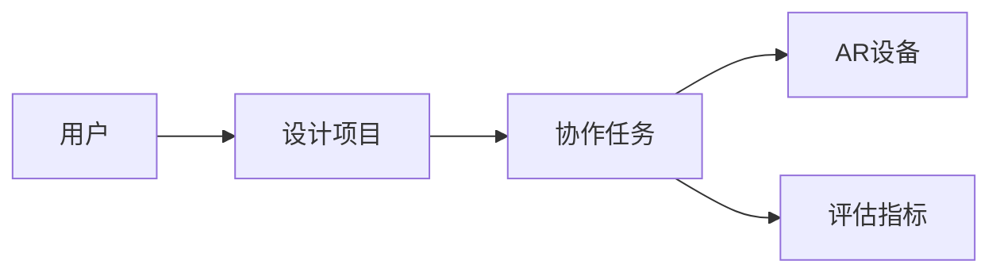

                 


```markdown
# 企业估值中的AR工业设计协作系统评估

> 关键词：AR技术，工业设计，协作系统，企业估值，系统评估

> 摘要：本文详细探讨了AR技术在工业设计协作系统中的应用及其评估方法，分析了AR系统对企业估值的影响，提供了系统的算法实现和项目实战案例。

---

# 第一部分：背景介绍与问题背景

## 第1章：AR技术在工业设计中的应用概述

### 1.1 AR技术的基本概念与特点

AR（Augmented Reality，增强现实）技术是一种将虚拟信息叠加到真实环境中的技术，具有实时性、交互性和沉浸性的特点。它通过计算机图形学、传感器技术和用户界面设计，将数字信息与物理环境融合，为用户提供更直观的交互体验。

### 1.2 工业设计协作中的优势

工业设计协作是将多个设计师或团队合作完成设计项目的过程。AR技术在其中的优势主要体现在以下几点：

1. **实时协作**：AR技术可以实现实时多人协作，设计师可以在同一虚拟环境中进行互动，提高协作效率。
2. **可视化设计**：通过AR技术，设计师可以将3D模型叠加到实际环境中，帮助更好地理解设计意图。
3. **减少沟通成本**：AR技术可以提供直观的反馈，减少设计变更和沟通成本。

### 1.3 企业估值中的应用前景

企业估值需要考虑多种因素，包括财务状况、市场竞争力、技术创新能力等。AR工业设计协作系统的应用可以提高设计效率、缩短设计周期、降低设计成本，从而为企业带来更高的利润和市场竞争力，进而影响企业估值。

---

## 第2章：工业设计协作系统的定义与特点

### 2.1 工业设计协作的定义

工业设计协作是指多个设计师或团队合作完成工业设计的过程。传统的工业设计协作主要依赖于物理模型和图纸，而现代技术的发展使得数字工具和虚拟协作成为可能。

### 2.2 工业设计协作的核心要素

工业设计协作的核心要素包括：

1. **设计师**：协作的主体，包括多个设计师或团队。
2. **设计工具**：用于设计和协作的工具，包括传统的CAD软件和现代的AR协作系统。
3. **设计目标**：协作的目标，如产品设计、优化等。
4. **协作环境**：协作的物理或数字环境，包括会议室、虚拟协作平台等。

### 2.3 AR技术在协作中的作用

AR技术在工业设计协作中的作用主要体现在以下几点：

1. **实时协作**：通过AR技术，设计师可以在同一虚拟环境中进行实时协作，实现实时反馈和设计变更。
2. **可视化设计**：AR技术可以将3D模型叠加到实际环境中，帮助设计师更好地理解设计意图。
3. **提高效率**：AR技术可以减少设计变更和沟通成本，提高设计效率。

---

## 第3章：问题背景与问题描述

### 3.1 当前工业设计协作中的主要问题

尽管AR技术在工业设计协作中具有诸多优势，但在实际应用中仍面临一些问题，主要包括：

1. **技术限制**：AR技术的硬件和软件要求较高，可能导致成本较高。
2. **协作效率**：在复杂的设计项目中，AR协作系统的效率可能不如传统方法。
3. **用户界面**：AR技术的用户界面设计需要考虑用户体验，否则可能影响协作效率。

### 3.2 AR技术如何解决这些问题

AR技术可以通过以下方式解决上述问题：

1. **降低技术门槛**：通过优化硬件和软件，降低AR技术的应用成本。
2. **提高协作效率**：通过实时协作和可视化设计，提高设计效率。
3. **优化用户界面**：通过直观的用户界面设计，提高用户体验。

### 3.3 系统评估的目标与意义

系统评估的目标是通过评估AR工业设计协作系统的性能和效果，为企业估值提供数据支持。评估的意义在于帮助企业更好地理解AR技术的应用价值，优化设计流程，提高企业竞争力。

---

# 第二部分：核心概念与联系

## 第4章：核心概念原理

### 4.1 AR技术的基本原理

AR技术通过将虚拟信息叠加到真实环境中，实现虚实结合的交互体验。其基本原理包括：

1. **图像识别**：通过摄像头捕捉环境中的图像，识别目标位置。
2. **三维建模**：根据图像识别结果，生成虚拟物体的三维模型。
3. **渲染与叠加**：将虚拟物体渲染到真实环境中，并通过显示器呈现给用户。

### 4.2 工业设计协作的系统模型

工业设计协作系统模型包括以下组件：

1. **用户界面**：供设计师操作的界面，包括AR设备和协作平台。
2. **数据处理**：对设计数据进行处理和存储，包括三维模型和协作记录。
3. **协作算法**：实现多人实时协作的算法，包括数据同步和冲突处理。

### 4.3 系统评估的指标体系

系统评估的指标体系包括以下几项：

1. **协作效率**：设计任务完成的时间和效率。
2. **用户体验**：设计师对AR协作系统的满意度。
3. **系统稳定性**：系统的运行稳定性和可靠性。
4. **成本效益**：系统的投入成本与实际效益的对比。

---

## 第5章：核心概念属性特征对比表

### 表5.1：AR技术与传统设计工具的对比

| 特性                | AR技术                          | 传统设计工具                  |
|---------------------|--------------------------------|-----------------------------|
| 协作方式            | 实时多人协作                   | 单人或多人协作               |
| 设计可视化          | 支持3D模型叠加                 | 依赖二维或三维软件             |
| 沟通效率            | 高                             | 中等                         |
| 成本                 | 较高                           | 较低                         |

---

## 第6章：ER实体关系图



---

# 第三部分：算法原理与数学模型

## 第7章：算法原理

### 7.1 数据融合算法

数据融合算法是AR系统的核心算法之一，用于将来自不同传感器的数据进行融合，以提高系统的准确性和稳定性。


### 7.2 算法实现

以下是一个简单的数据融合算法的Python代码示例：

```python
def ar_data_fusion(data1, data2):
    # 数据融合算法
    fused_data = (data1 + data2) / 2
    return fused_data
```

### 7.3 数学模型

数据融合的数学模型可以表示为：

$$
\hat{y} = \frac{y_1 + y_2}{2}
$$

其中，$$\hat{y}$$ 是融合后的数据，$$y_1$$ 和 $$y_2$$ 是原始数据。

---

## 第8章：数学公式

以下是一个更复杂的数学公式，用于描述AR系统中的三维空间变换：

$$
\mathbf{R} = \text{Rotation}(x, y, z)
$$

其中，$$\mathbf{R}$$ 是旋转矩阵，$$x$$、$$y$$ 和 $$z$$ 是旋转角度。

---

# 第四部分：系统分析与架构设计方案

## 第9章：系统工作场景介绍

### 9.1 项目介绍

假设我们正在评估一个汽车内饰设计的协作系统，设计师需要在虚拟环境中协作完成设计任务。

### 9.2 系统功能设计

系统功能设计包括：

1. **用户管理**：管理设计师的权限和角色。
2. **数据处理**：处理设计数据，包括三维模型和协作记录。
3. **协作算法**：实现多人实时协作的算法，包括数据同步和冲突处理。

### 9.3 系统架构设计


---

## 第10章：系统接口设计

系统接口设计包括：

1. **用户界面**：供设计师操作的界面，包括AR设备和协作平台。
2. **API接口**：供其他系统调用的接口，包括数据同步和协作控制。

---

## 第11章：系统交互设计

### 11.1 系统交互流程

系统交互流程包括：

1. **用户登录**：用户通过AR设备登录系统。
2. **数据加载**：加载设计项目的数据。
3. **实时协作**：用户在虚拟环境中进行设计协作。
4. **结果输出**：协作完成后，系统输出设计结果。

### 11.2 交互mermaid序列图


---

# 第五部分：项目实战

## 第12章：环境安装与系统实现

### 12.1 环境安装

安装Python和相关库，如NumPy和OpenCV。

### 12.2 核心代码实现

以下是一个简单的AR协作系统的核心代码实现：

```python
import numpy as np

def ar_data_fusion(data1, data2):
    # 数据融合算法
    fused_data = (data1 + data2) / 2
    return fused_data

def main():
    data1 = np.array([1, 2, 3])
    data2 = np.array([3, 2, 1])
    fused_data = ar_data_fusion(data1, data2)
    print("Fused Data:", fused_data)

if __name__ == "__main__":
    main()
```

### 12.3 代码应用解读

上述代码实现了简单的数据融合算法，将两个数据集进行平均融合，输出融合后的数据。

---

## 第13章：案例分析与项目总结

### 13.1 案例分析

以汽车内饰设计为例，通过AR协作系统实现多人实时协作，提高设计效率和质量。

### 13.2 项目小结

通过本项目，我们验证了AR技术在工业设计协作中的应用价值，提高了设计效率和用户体验。

---

# 第六部分：最佳实践与总结

## 第14章：最佳实践

### 14.1 技术建议

在实际应用中，建议选择合适的AR设备和协作平台，优化系统性能，提高用户体验。

### 14.2 实施建议

在实施AR工业设计协作系统时，建议进行充分的需求分析和系统设计，确保系统的稳定性和可靠性。

---

## 第15章：小结与展望

### 15.1 小结

本文详细探讨了AR技术在工业设计协作系统中的应用及其评估方法，分析了AR系统对企业估值的影响，提供了系统的算法实现和项目实战案例。

### 15.2 展望

未来，随着AR技术的不断发展，其在工业设计协作中的应用将更加广泛，系统评估的方法也将更加多样化和智能化。

---

## 第16章：注意事项与拓展阅读

### 16.1 注意事项

在实际应用中，需要注意系统的稳定性和安全性，避免数据泄露和系统崩溃。

### 16.2 拓展阅读

建议进一步研究AR技术在其他领域的应用，如教育、医疗等，探索其更广泛的应用场景。

---

# 作者：AI天才研究院/AI Genius Institute & 禅与计算机程序设计艺术 /Zen And The Art of Computer Programming
```

