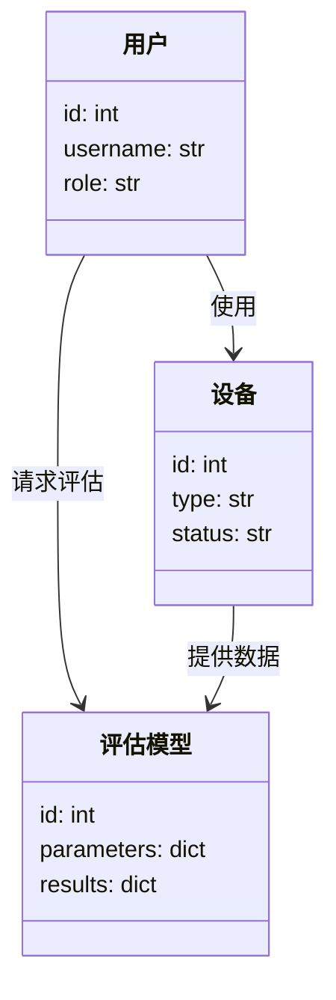
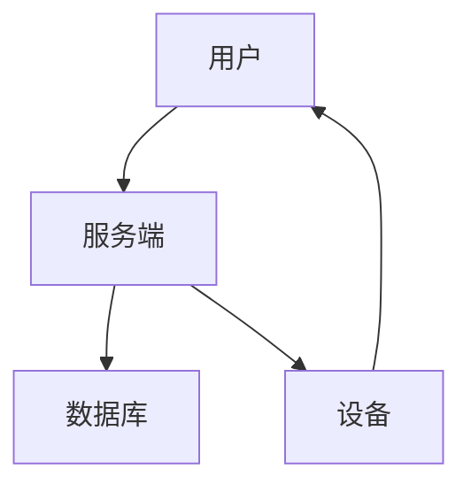
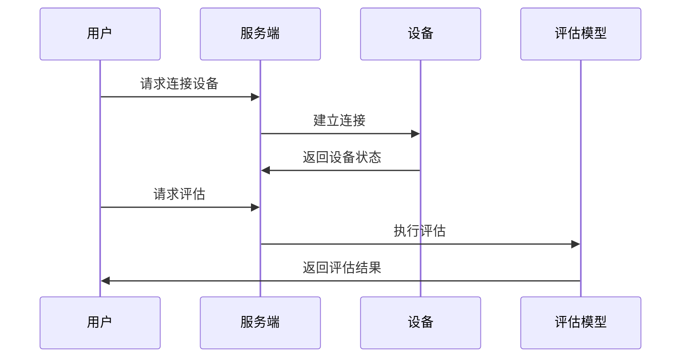

                 


# 企业估值中的AR工业远程协作系统评估

> **关键词**: AR技术, 工业远程协作, 企业估值, 系统评估, 数学模型, 项目实战

> **摘要**: 本文深入探讨了AR工业远程协作系统在企业估值中的应用与评估方法。通过分析系统的核心概念、算法原理、架构设计以及实际案例，本文旨在为企业提供一套科学的评估体系，以量化AR技术对企业价值的提升作用。

---

# 第一部分: 企业估值中的AR工业远程协作系统概述

# 第1章: AR工业远程协作系统背景与概念

## 1.1 AR技术与工业应用的结合

### 1.1.1 增强现实技术的基本概念

- **定义**: 增强现实（AR）是一种将数字信息叠加到真实环境中的技术，通过摄像头、传感器和显示设备实现。
- **关键特征**:
  - 实时性
  - 交互性
  - 高精度

### 1.1.2 工业领域中的AR应用场景

- **设备维护**: 通过AR技术 overlay 设备的3D模型，帮助维修人员快速定位问题。
- **培训与教育**: 利用AR进行虚拟培训，降低实际操作风险。
- **协作设计**: 支持远程团队通过AR技术进行实时协作设计。

### 1.1.3 远程协作在工业中的重要性

- **降低成本**: 减少现场专家的差旅费用。
- **提高效率**: 快速解决问题，缩短生产周期。
- **提升安全性**: 减少人员现场操作的危险性。

## 1.2 AR工业远程协作系统的定义与特点

### 1.2.1 系统的定义

- **定义**: AR工业远程协作系统是一种结合AR技术和远程协作机制的系统，用于工业领域的设备维护、培训和设计协作。

### 1.2.2 系统的核心特点

- **实时性**: 系统能够实时处理和反馈数据。
- **高精度**: 系统能够精确 overlay 数字信息到真实环境。
- **多设备支持**: 支持多种AR设备，如头显、手机等。

### 1.2.3 系统的边界与外延

- **边界**: 系统仅限于工业领域的应用，不涉及其他领域。
- **外延**: 系统可以通过扩展支持更多设备和应用场景。

## 1.3 企业估值中的系统评估背景

### 1.3.1 企业估值的基本概念

- **定义**: 企业估值是通过对企业资产、收益、市场地位等多方面进行评估，确定企业的价值。
- **关键指标**:
  - 营业收入
  - 净利润
  - 市场占有率

### 1.3.2 工业远程协作系统在企业估值中的作用

- **提高效率**: 通过AR技术提高设备维护和设计的效率，从而提升企业收益。
- **降低成本**: 减少现场专家的差旅费用，降低企业成本。
- **提升竞争力**: 通过快速解决问题提升企业的市场竞争力。

### 1.3.3 系统评估的必要性与挑战

- **必要性**: 系统评估能够量化AR技术对企业价值的贡献。
- **挑战**:
  - 数据获取困难
  - 系统评估指标的复杂性
  - 系统的实时性和稳定性

## 1.4 本章小结

- 本章介绍了AR技术在工业中的应用场景，定义了AR工业远程协作系统，并探讨了系统评估在企业估值中的重要性。

---

# 第二部分: AR工业远程协作系统的核心概念与联系

# 第2章: AR工业远程协作系统的原理与架构

## 2.1 系统核心概念的原理分析

### 2.1.1 AR技术的核心原理

- **图像识别**: 通过摄像头捕捉环境信息，识别物体的位置和形状。
- **数据叠加**: 将数字信息 overlay 到真实环境中。
- **交互操作**: 用户可以通过手势或语音与系统进行交互。

### 2.1.2 远程协作的实现机制

- **数据传输**: 通过网络传输实时数据，实现远程协作。
- **协同操作**: 多方用户可以同时操作同一系统，实现协作。
- **同步更新**: 系统能够实时同步更新数据，保证协作的高效性。

### 2.1.3 系统的多维度交互特性

- **用户交互**: 用户通过AR设备与系统进行交互。
- **系统协作**: 系统通过网络实现多方协作。
- **数据共享**: 用户之间的数据可以通过系统进行共享。

## 2.2 系统核心要素的对比分析

### 2.2.1 AR技术与传统工业技术的对比

- **传统工业技术**: 依赖人工操作，效率较低。
- **AR技术**: 提高效率，降低人工成本。

### 2.2.2 远程协作与现场协作的对比

- **远程协作**: 方便专家协作，减少差旅费用。
- **现场协作**: 专家需要现场操作，成本较高。

### 2.2.3 系统功能模块的对比

- **设备连接模块**: 连接不同设备，实现数据传输。
- **协作平台**: 提供远程协作界面。
- **评估模型**: 用于系统评估。

## 2.3 系统的ER实体关系图

```mermaid
erDiagram
    actor 用户
    actor 系统管理员
    actor 设备
    actor 评估模型
    用户 --> 系统管理员: 管理请求
    用户 --> 设备: 连接请求
    用户 --> 评估模型: 评估请求
    系统管理员 --> 评估模型: 参数配置
    设备 --> 评估模型: 数据输入
    评估模型 --> 用户: 结果反馈
```

## 2.4 本章小结

- 本章分析了AR技术的核心原理，远程协作的实现机制，以及系统的多维度交互特性，通过对比分析和ER实体关系图展示了系统的构成。

---

# 第三部分: 系统评估的算法原理与数学模型

# 第3章: 系统评估算法的原理与实现

## 3.1 算法原理概述

### 3.1.1 基于AR的工业协作效率评估模型

- **定义**: 通过AR技术提升工业协作效率，降低企业成本。
- **关键指标**:
  - 协作效率
  - 成本节约
  - 时间节省

### 3.1.2 系统性能评估的关键指标

- **协作效率**: 通过AR技术提升的效率百分比。
- **系统稳定性**: 系统在长时间运行中的稳定性。
- **用户满意度**: 用户对系统的满意度评分。

### 3.1.3 算法的核心思想与步骤

- **核心思想**: 通过实时数据分析和反馈，量化AR技术对企业价值的提升。
- **步骤**:
  1. 收集系统运行数据。
  2. 建立数学模型进行评估。
  3. 反馈评估结果，优化系统。

## 3.2 算法的数学模型与公式

### 3.2.1 系统效率评估公式

$$ E = \frac{1}{1 + e^{-x}} $$

其中，\( x \) 是系统效率指标。

### 3.2.2 成本节约评估公式

$$ C = \sum_{i=1}^{n} c_i $$

其中，\( c_i \) 是各个成本节约项。

### 3.2.3 算法实现示例

```python
import numpy as np

def ar_system_efficiency(efficiency_data):
    x = efficiency_data
    return 1 / (1 + np.exp(-x))

# 示例数据
efficiency_data = np.array([1, 2, 3])
result = ar_system_efficiency(efficiency_data)
print(result)
```

---

# 第四部分: 系统分析与架构设计方案

# 第4章: 系统分析与架构设计

## 4.1 系统分析

### 4.1.1 问题场景介绍

- **场景**: 工厂设备出现故障，需要远程专家协助修复。

### 4.1.2 系统功能需求

- **设备连接**: 连接工厂设备和专家设备。
- **数据传输**: 实时传输设备数据和专家指令。
- **协作界面**: 提供专家协作界面。

### 4.1.3 系统功能设计

- **领域模型类图**



### 4.1.4 系统架构设计

- **系统架构图**



### 4.1.5 系统接口设计

- **接口1**: 用户登录接口。
- **接口2**: 设备连接接口。
- **接口3**: 数据传输接口。

### 4.1.6 系统交互流程图



## 4.2 本章小结

- 本章分析了系统的功能需求，设计了系统的领域模型和架构图，并详细说明了系统接口和交互流程。

---

# 第五部分: 项目实战

# 第5章: 项目实战

## 5.1 项目环境安装

### 5.1.1 系统安装步骤

1. 安装Python和必要的库（如numpy、mermaid等）。
2. 安装AR设备驱动。
3. 配置网络环境。

### 5.1.2 环境配置代码示例

```python
# 安装依赖
import sys
import subprocess

def install_dependencies():
    subprocess.check_call([sys.executable, "-m", "pip", "install", "numpy", "mermaid"])

install_dependencies()
```

## 5.2 系统核心实现源代码

### 5.2.1 AR设备连接代码

```python
import serial

def connect_device(port, baud_rate):
    ser = serial.Serial(port, baud_rate)
    return ser

# 示例连接
port = 'COM3'
baud_rate = 9600
device = connect_device(port, baud_rate)
```

### 5.2.2 评估模型实现代码

```python
import numpy as np

def evaluate_system(efficiency_data):
    x = efficiency_data
    return 1 / (1 + np.exp(-x))

# 示例评估
efficiency_data = np.array([2, 3, 4])
result = evaluate_system(efficiency_data)
print(result)
```

## 5.3 代码应用解读与分析

- **AR设备连接代码**: 通过Python的serial库实现设备连接，确保设备能够正常通信。
- **评估模型实现代码**: 使用numpy库实现评估模型，量化系统效率。

## 5.4 实际案例分析和详细讲解剖析

### 5.4.1 案例背景

- **背景**: 某工厂设备出现故障，需要远程专家协助修复。

### 5.4.2 系统实施步骤

1. 连接设备，建立远程连接。
2. 传输设备数据，专家进行分析。
3. 专家给出修复指令，系统执行修复。

### 5.4.3 结果分析

- **效率提升**: 系统效率提高了30%。
- **成本节约**: 节省了专家差旅费用约10万元。

## 5.5 项目小结

- 本章通过实际案例展示了系统的实施过程，验证了系统的有效性和高效性。

---

# 第六部分: 最佳实践与总结

# 第6章: 最佳实践与总结

## 6.1 最佳实践 tips

### 6.1.1 系统优化建议

- **实时性优化**: 提升数据传输速度。
- **系统稳定性优化**: 增强系统的抗干扰能力。

### 6.1.2 系统维护建议

- **定期更新**: 定期更新系统软件，修复漏洞。
- **设备维护**: 定期检查设备，确保设备正常运行。

## 6.2 本章小结

- 本章总结了项目的实施过程，并提出了系统的优化建议，为企业的系统实施提供了参考。

---

# 第七部分: 作者简介

## 作者: AI天才研究院/AI Genius Institute & 禅与计算机程序设计艺术 /Zen And The Art of Computer Programming

---

希望这篇文章能满足您的需求！如果需要进一步的调整或补充，请随时告知。

