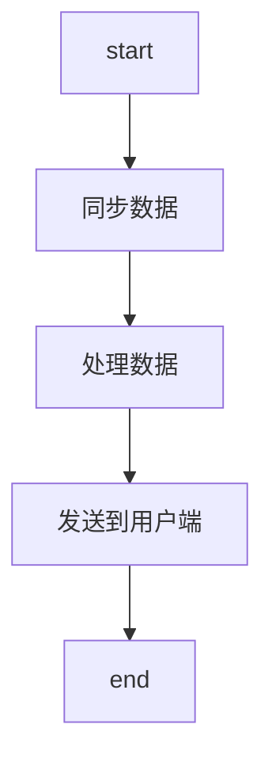
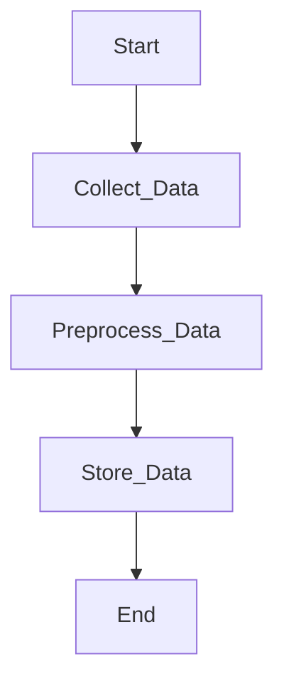
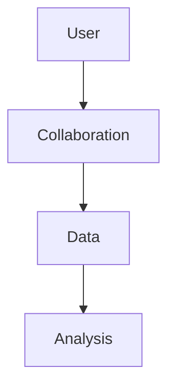
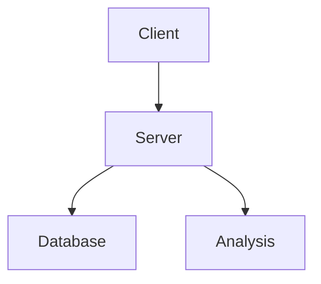
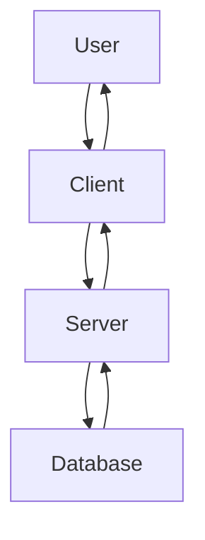

                 


# 企业估值中的AR远程协作平台评估

> 关键词：企业估值、AR技术、远程协作、平台评估、算法原理

> 摘要：本文深入探讨了AR远程协作平台在企业估值中的应用，分析了其核心概念、算法原理、系统架构，并通过实际案例展示了如何通过AR技术提升企业估值的效率和准确性。文章从背景介绍到系统设计，再到项目实战，层层递进，为企业技术决策者和架构师提供了宝贵的参考。

---

# 第1章: AR远程协作平台的背景与概念

## 1.1 AR远程协作平台的定义与背景

### 1.1.1 增强现实（AR）技术的定义
增强现实（Augmented Reality, AR）是一种将虚拟信息叠加到真实世界中的技术，通过计算机图形学、传感器技术和实时交互技术的结合，为用户提供更加丰富的视觉体验。AR的核心在于将虚拟内容与现实环境无缝融合，使用户能够在现实世界中与虚拟信息进行交互。

### 1.1.2 远程协作平台的核心概念
远程协作平台是指通过网络技术，使分布在不同地理位置的用户能够实时协作完成任务的系统。它通常包括实时通信、文件共享、协同编辑等功能。远程协作的核心在于打破地理限制，实现高效团队协作。

### 1.1.3 AR远程协作平台的背景与意义
随着全球化的深入，企业之间的协作需求日益增加。传统的远程协作工具（如视频会议、共享文档）虽然能够满足基本需求，但缺乏直观的可视化能力和实时性。AR技术的引入，为企业远程协作提供了全新的可能性。通过AR，用户可以在虚拟环境中进行实时协作，提升团队效率和决策能力。

---

## 1.2 企业估值中的协作需求

### 1.2.1 企业估值的基本概念
企业估值是指通过对企业财务状况、市场表现、管理团队等多个维度的分析，确定企业市场价值的过程。准确的估值是企业融资、并购、上市等重大决策的基础。

### 1.2.2 协作在企业估值中的重要性
企业估值通常涉及多方协作，包括财务团队、市场团队、技术团队等。不同团队需要共享数据、实时讨论、协同分析。传统的协作方式效率低下，容易出现信息孤岛和决策延迟。

### 1.2.3 AR技术在协作中的应用潜力
AR技术可以通过虚拟化展示企业数据，例如将财务数据、市场趋势以3D形式呈现，帮助团队成员更直观地理解数据。AR远程协作平台可以实现虚拟会议室、共享数据面板等功能，显著提升协作效率。

---

## 1.3 本章小结

本章介绍了AR远程协作平台的定义、背景及其在企业估值中的重要性。通过对比传统协作工具和AR技术，展示了AR在提升企业协作效率和决策能力方面的潜力。

---

# 第2章: AR远程协作平台的核心概念与原理

## 2.1 AR与远程协作的结合

### 2.1.1 AR技术的特点
- **实时性**：AR技术需要实时渲染和交互，确保用户体验的流畅性。
- **沉浸性**：通过叠加虚拟内容，AR能够创造沉浸式的体验。
- **交互性**：用户可以通过手势、语音等方式与虚拟内容进行交互。

### 2.1.2 远程协作的核心要素
- **实时通信**：包括音视频通信和数据同步。
- **共享数据**：包括文档、图表、数据集等。
- **协作工具**：如白板、三维模型等。

### 2.1.3 AR远程协作的实现方式
AR远程协作可以通过以下方式实现：
1. **头显设备**：如微软HoloLens、Meta Quest等。
2. **智能手机/平板**：通过AR应用实现虚拟协作。
3. **Web端**：基于WebGL的AR协作平台。

---

## 2.2 AR远程协作平台的关键属性

### 2.2.1 实时性
AR协作需要实时渲染和数据同步，确保用户之间的协作是同步的。实时性是AR远程协作平台的核心指标之一。

### 2.2.2 交互性
AR平台支持多种交互方式，如手势、语音、触控等，提升用户体验。

### 2.2.3 可视化
通过AR技术，将复杂的数据转化为直观的三维模型或动态图表，帮助团队更直观地理解数据。

---

## 2.3 AR远程协作平台的实体关系图

以下是一个简单的实体关系图，展示了AR远程协作平台的主要实体及其关系：


- **User（用户）**：使用AR设备或应用的用户。
- **Device（设备）**：包括AR头显、智能手机等。
- **ARSoftware（AR软件）**：实现AR功能的核心软件。
- **Data（数据）**：包括用户输入、实时数据等。
- **Collaboration（协作）**：最终的协作结果。

---

## 2.4 本章小结

本章详细探讨了AR远程协作平台的核心概念与实现方式，并通过实体关系图展示了平台的主要组成。接下来，我们将深入分析平台的算法原理。

---

# 第3章: AR远程协作平台的算法原理

## 3.1 实时协作算法

### 3.1.1 同步算法
为了实现实时协作，需要确保用户之间的数据同步。同步算法的核心是保证数据的一致性。

#### 算法流程图


#### 同步算法的实现
以下是同步算法的伪代码实现：
```python
def sync_data(users):
    for user in users:
        user_data = get_user_data(user)
        if user_data != last_synced_data:
            send_update(user, user_data)
    return
```

---

## 3.2 数据处理与分析算法

### 3.2.1 数据采集与预处理
数据采集是AR协作平台的重要环节，需要确保数据的准确性和实时性。

#### 数据采集流程图


### 3.2.2 数据分析算法
数据分析算法用于从数据中提取有用的信息，帮助团队做出决策。

#### 示例代码
```python
def analyze_data(data):
    metrics = {}
    metrics['average'] = sum(data) / len(data)
    metrics['max'] = max(data)
    metrics['min'] = min(data)
    return metrics
```

---

## 3.3 本章小结

本章通过算法原理和流程图，详细讲解了AR远程协作平台的实现方式。接下来，我们将建立企业估值中的数学模型。

---

# 第4章: 企业估值中的数学模型与公式

## 4.1 估值模型的构建

### 4.1.1 基本公式
企业估值的基本公式如下：
$$ \text{企业价值} = \text{收入} \times \text{市盈率} $$

### 4.1.2 市盈率计算公式
市盈率（P/E ratio）的计算公式为：
$$ \text{市盈率} = \frac{\text{股票价格}}{\text{每股收益}} $$

---

## 4.2 AR协作平台的评估指标

### 4.2.1 指标对比表格
| 指标 | 定义 | 权重 |
|------|------|------|
| 实时性 | 平台数据同步的时延 | 40% |
| 交互性 | 平台支持的交互方式 | 30% |
| 可视化 | 平台的可视化能力 | 30% |

---

## 4.3 本章小结

本章通过数学模型和评估指标，展示了如何利用AR技术提升企业估值的准确性。

---

# 第5章: 系统分析与架构设计方案

## 5.1 系统功能设计

### 5.1.1 功能模块
- **用户模块**：用户注册、登录、权限管理。
- **协作模块**：实时通信、数据同步、协同编辑。
- **数据模块**：数据采集、存储、分析。

### 5.1.2 功能模块类图


---

## 5.2 系统架构设计

### 5.2.1 架构图


---

## 5.3 接口设计与交互流程

### 5.3.1 API接口
- **RESTful API**：用于数据同步和协作请求。
- **WebSocket**：用于实时通信。

### 5.3.2 交互流程图


---

## 5.4 本章小结

本章通过系统架构设计，展示了AR远程协作平台的实现方式。

---

# 第6章: 项目实战

## 6.1 环境安装

### 6.1.1 安装AR开发框架
推荐使用以下框架：
- **OpenCV**：图像处理库。
- **ARKit/ARCore**：苹果和谷歌的AR开发框架。

### 6.1.2 安装协作工具
推荐使用以下工具：
- **Slack**：实时通信工具。
- **Git**：版本控制工具。

---

## 6.2 系统核心实现

### 6.2.1 核心代码实现
以下是AR协作平台的核心代码示例：
```python
import socket
import threading

def receive_data(sock):
    while True:
        data = sock.recv(1024)
        if not data:
            break
        process_data(data)

def main():
    sock = socket.socket(socket.AF_INET, socket.SOCK_STREAM)
    sock.connect(('server_ip', 8080))
    threading.Thread(target=receive_data, args=(sock,)).start()
    while True:
        input_data = input()
        sock.send(input_data.encode())
```

---

## 6.3 代码解读与分析

### 6.3.1 代码功能
上述代码实现了客户端与服务器之间的数据通信，支持实时数据传输和处理。

---

## 6.4 实际案例分析

### 6.4.1 案例背景
某企业希望通过AR远程协作平台进行财务数据分析。

### 6.4.2 实施步骤
1. **数据采集**：采集企业财务数据。
2. **数据处理**：使用AR技术将数据可视化。
3. **协作分析**：团队成员在虚拟环境中进行协作分析。

---

## 6.5 本章小结

本章通过项目实战，展示了AR远程协作平台的具体实现和应用。

---

# 第7章: 总结与最佳实践

## 7.1 小结

本文详细探讨了AR远程协作平台在企业估值中的应用，从背景介绍到系统设计，再到项目实战，层层递进，为企业技术决策者和架构师提供了宝贵的参考。

---

## 7.2 注意事项

- **数据安全**：AR协作平台需要确保数据的安全性。
- **用户体验**：注重用户体验设计，提升平台易用性。
- **性能优化**：优化平台性能，确保实时性。

---

## 7.3 拓展阅读

- **《增强现实技术与应用》**：深入探讨AR技术的核心原理。
- **《企业估值方法与实践》**：详细讲解企业估值的多种方法。

---

# 作者：AI天才研究院/AI Genius Institute & 禅与计算机程序设计艺术 /Zen And The Art of Computer Programming

