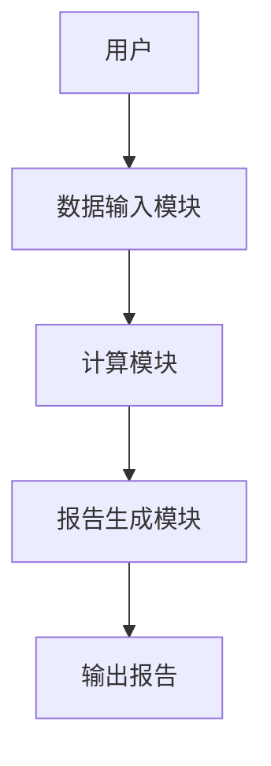
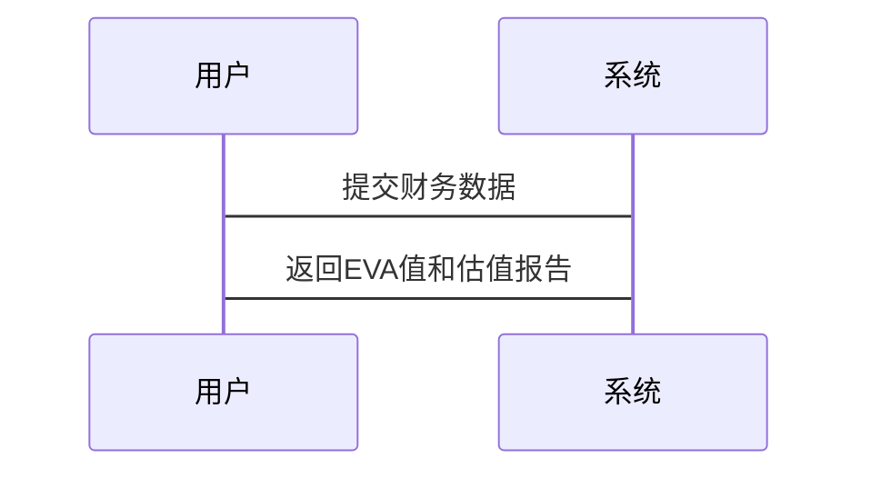

                 


# 《企业估值中的EVA分析法》

> 关键词：企业估值，EVA分析法，经济价值增加值，资本成本，企业价值

> 摘要：本文深入探讨了EVA（经济价值增加值）分析法在企业估值中的应用。通过分析EVA的定义、计算方法、实际应用案例，以及与传统估值方法的对比，揭示了EVA在评估企业真实盈利能力方面的优势。文章还结合系统架构设计和项目实战，详细阐述了EVA分析法的实现过程和最佳实践。

---

## 第1章: 企业估值与EVA分析法概述

### 1.1 企业估值的核心问题

#### 1.1.1 企业估值的基本概念
企业估值是通过对企业的财务状况、市场地位和未来盈利能力进行分析，确定其内在价值的过程。传统的企业估值方法包括市盈率、市净率和贴现现金流模型等，但这些方法存在一定的局限性，例如难以衡量企业的真实盈利能力。

#### 1.1.2 传统估值方法的局限性
传统的市盈率和市净率方法基于相对估值，容易受到市场情绪的影响，且无法准确反映企业的内在价值。贴现现金流模型虽然更为准确，但计算复杂，且依赖于对未来现金流的准确预测。

#### 1.1.3 EVA分析法的提出与背景
EVA（经济价值增加值）分析法由诺贝尔经济学奖得主费里德曼提出，旨在衡量企业创造的真实经济利润。EVA考虑了资本成本，能够更准确地反映企业在扣除所有成本后的净收益。

### 1.2 EVA分析法的定义与特点

#### 1.2.1 EVA（经济价值增加值）的定义
EVA是企业在扣除所有资本成本后的净收益，公式为：
$$ \text{EVA} = \text{净利润} - (\text{资本成本} \times \text{平均资本）} $$

#### 1.2.2 EVA与传统利润指标的区别
- **净利润**：未考虑资本成本，可能高估企业的盈利能力。
- **EVA**：考虑了资本成本，能够更准确地衡量企业的经济利润。

#### 1.2.3 EVA分析法的核心优势
- 更准确地反映企业的盈利能力。
- 考虑了资本成本，适用于不同行业的比较。
- 适用于企业内部绩效考核和外部投资者估值。

### 1.3 EVA分析法的理论基础

#### 1.3.1 经济利润理论
经济利润是指企业在扣除所有成本后的净收益，包括显性成本和隐性成本（如资本成本）。

#### 1.3.2 资本成本与企业价值的关系
资本成本是企业使用资本所付出的成本，包括债务成本和股权成本。资本成本的高低影响企业的资本结构和价值。

#### 1.3.3 EVA与企业价值创造的联系
EVA是企业价值创造的核心指标，通过持续提高EVA，企业能够实现价值的持续增长。

### 1.4 EVA分析法的应用范围

#### 1.4.1 企业估值中的应用
用于评估企业的内在价值，帮助投资者做出合理的估值决策。

#### 1.4.2 投资决策中的应用
帮助投资者判断投资项目的盈利能力，优化资本分配。

#### 1.4.3 绩效考核中的应用
用于衡量企业或部门的绩效，激励管理层提高EVA。

### 1.5 本章小结
本章介绍了EVA分析法的基本概念、定义、特点和理论基础，以及其在企业估值、投资决策和绩效考核中的应用。

---

## 第2章: EVA分析法的数学模型与计算方法

### 2.1 EVA的计算公式

#### 2.1.1 EVA的定义公式
$$ \text{EVA} = \text{净利润} - (\text{资本成本} \times \text{平均资本）} $$

#### 2.1.2 净利润的计算
净利润 = 营业收入 - 营业成本 - 期间费用 - 税费

#### 2.1.3 资本成本的计算
资本成本 = 加权平均资本成本（WACC） = (债务成本 × 债务比例) + (股权成本 × 股权比例)

#### 2.1.4 平均资本的计算
平均资本 = （年初资本 + 年末资本）/ 2

### 2.2 EVA的计算步骤

#### 2.2.1 数据收集
收集企业的财务数据，包括营业收入、成本、税费、债务和股权等。

#### 2.2.2 计算净利润
根据财务报表计算企业的净利润。

#### 2.2.3 计算资本成本
计算企业的加权平均资本成本（WACC）。

#### 2.2.4 计算EVA
将净利润减去资本成本乘以平均资本，得到EVA。

### 2.3 EVA与企业价值的关系

#### 2.3.1 EVA与企业价值的公式推导
企业价值 = EVA的现值 + 未来现金流的现值

#### 2.3.2 EVA在企业估值中的应用
通过分析EVA的趋势和变化，评估企业的盈利能力和发展潜力。

### 2.4 EVA分析法的优缺点

#### 2.4.1 优点
- 更准确地反映企业的经济利润。
- 考虑了资本成本，适用于跨行业比较。

#### 2.4.2 缺点
- 计算复杂，需要准确的财务数据。
- 依赖于对资本成本的合理估计。

### 2.5 本章小结
本章详细讲解了EVA的计算公式和步骤，分析了EVA与企业价值的关系，并讨论了EVA分析法的优缺点。

---

## 第3章: EVA分析法在企业估值中的应用

### 3.1 企业估值的基本框架

#### 3.1.1 企业估值的三要素
1. 企业未来现金流的预测
2. 现金流的贴现率
3. 企业的内在价值

#### 3.1.2 企业估值的方法体系
- 市盈率法
- 市净率法
- 贴现现金流模型
- EVA分析法

### 3.2 EVA分析法在企业估值中的应用流程

#### 3.2.1 数据收集与整理
收集企业的财务报表、行业数据和市场信息。

#### 3.2.2 EVA计算与分析
根据公式计算企业的EVA，并分析其变化趋势。

#### 3.2.3 企业价值评估与建议
结合EVA和现金流分析，评估企业的内在价值，并提出投资建议。

### 3.3 EVA分析法的实际案例

#### 3.3.1 案例背景
假设一家制造企业，年净利润为1000万元，资本成本为8%，平均资本为5000万元。

#### 3.3.2 EVA计算
$$ \text{EVA} = 1000 - (0.08 \times 5000) = 1000 - 400 = 600 \text{万元} $$

#### 3.3.3 企业价值评估
根据EVA的趋势和未来现金流预测，评估企业的内在价值。

### 3.4 本章小结
本章通过实际案例展示了EVA分析法在企业估值中的应用，对比了传统方法和EVA分析法的优缺点。

---

## 第4章: 系统架构与项目实战

### 4.1 系统架构设计

#### 4.1.1 系统功能设计
- 数据输入模块：接收企业的财务数据。
- 计算模块：计算EVA和资本成本。
- 报告生成模块：输出估值报告。

#### 4.1.2 系统架构图


### 4.2 系统接口设计

#### 4.2.1 数据接口
- 输入接口：接收企业的财务数据。
- 输出接口：输出EVA和估值报告。

#### 4.2.2 API设计
提供RESTful API，允许其他系统调用EVA计算功能。

### 4.3 系统交互流程

#### 4.3.1 交互流程图


### 4.4 项目实战

#### 4.4.1 环境安装
安装Python和相关库（如Pandas、NumPy）。

#### 4.4.2 核心实现代码
```python
def calculate_eva(net_profit, capital_cost, average_capital):
    eva = net_profit - (capital_cost * average_capital)
    return eva

net_profit = 1000  # 万元
capital_cost = 0.08
average_capital = 5000  # 万元
eva = calculate_eva(net_profit, capital_cost, average_capital)
print(f"EVA = {eva} 万元")
```

#### 4.4.3 应用解读
通过代码实现EVA的计算，验证理论部分的内容。

### 4.5 本章小结
本章通过系统架构设计和项目实战，展示了如何将EVA分析法应用于实际的企业估值中。

---

## 第5章: 总结与展望

### 5.1 本章总结
EVA分析法是一种有效的企业估值方法，它考虑了资本成本，能够更准确地衡量企业的经济利润。

### 5.2 未来展望
随着大数据和人工智能技术的发展，EVA分析法将更加智能化和精准化，为企业估值提供更有力的支持。

---

## 作者：AI天才研究院/AI Genius Institute & 禅与计算机程序设计艺术 /Zen And The Art of Computer Programming

---

### 最佳实践 Tips

1. 在使用EVA分析法时，确保财务数据的准确性和完整性。
2. 合理估计资本成本，考虑市场环境和企业具体情况。
3. 结合其他估值方法，如贴现现金流模型，进行交叉验证。

通过本文的系统讲解，读者可以全面掌握EVA分析法的核心原理和实际应用，为企业的估值和投资决策提供有力支持。

